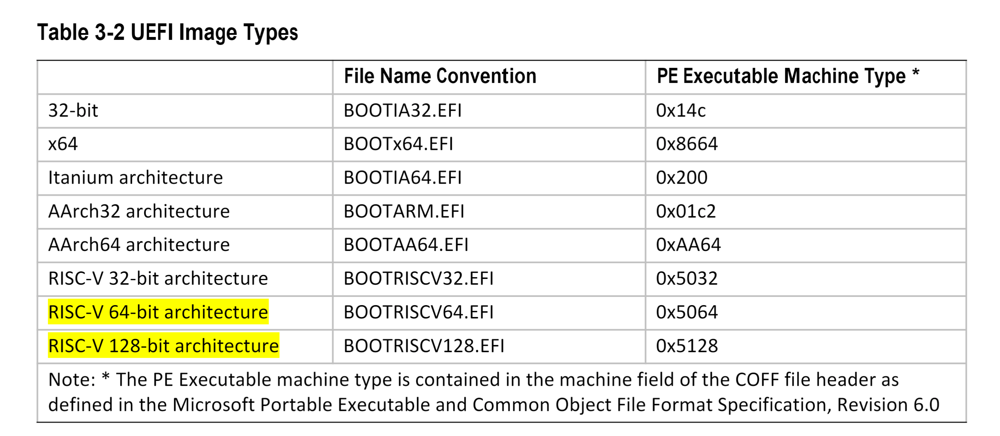

# 启动管理器

UEFI 启动管理器是一个固件策略引擎，可以通过修改架构上定义的全局 NVRAM 变量来进行配置。启动管理器将尝试按照全局 NVRAM 变量定义的顺序加载 UEFI 驱动程序和 UEFI 应用程序（包括 UEFI 操作系统启动加载器）。平台固件必须使用全局 NVRAM 变量中指定的启动顺序进行正常启动。平台固件可以添加额外的启动选项或从启动顺序列表中删除无效的启动选项。

如果在固件启动过程中发现异常情况，平台固件也可以在启动管理器中实现增值功能 (TODO)。一个增值功能 (TODO) 的例子是，如果第一次加载 UEFI 驱动程序时启动失败，则不加载该驱动程序。另一个例子是，如果在启动过程中发现关键错误，则启动到 OEM 定义的诊断环境。

UEFI 的启动顺序包括以下内容：

- 启动顺序列表是从全局定义的 NVRAM 变量中读取的。对这个变量的修改只保证在下次平台重置后生效。启动顺序列表定义了一个 NVRAM 变量的列表，其中包含了要启动的内容的信息。每个 NVRAM 变量定义了一个可以显示给用户的启动选项的名称。
- 该变量还包含一个指向硬件设备和该硬件设备上包含要加载的 UEFI 镜像的文件的指针。
- 该变量还可能包含操作系统分区和目录的路径，以及其他配置特定的目录。

NVRAM 也可以包含直接传递给 UEFI 镜像的加载选项。平台固件不知道加载选项中包含什么。当更高级别的软件写到全局 NVRAM 变量来设置平台固件的启动策略时，加载选项就被设置了。如果操作系统内核的位置与 UEFI 操作系统加载器的位置不同，该信息可以用来定义操作系统内核的位置。

## 固件启动管理器

启动管理器是符合本规范的固件中的一个组件，它决定哪些驱动程序和应用程序应该被显式加载以及何时加载。一旦符合规范的固件被初始化，它就会把控制权交给启动管理器。然后启动管理器负责决定加载什么，以及在做出这样的决定时可能需要与用户进行的任何互动。

启动管理器采取的行动取决于系统类型和系统设计者设置的策略。对于允许安装新启动变量（第 3.4 节）的系统，启动管理器必须自动或根据加载项的请求，初始化至少一个系统控制台，并执行主设备中指示的所有必需的初始化启动目标。对于此类系统，启动管理器还需要遵守在 `BootOrder` 变量中设置的优先级。

特别是，可能的实施方案可能包括任何有关启动的控制台界面，启动选择的综合平台管理，以及可能的对其他内部应用或恢复驱动的了解，这些都可能通过启动管理器集成到系统中。

### 启动管理器编程

与启动管理器的编程交互是通过全局定义的变量完成的。初始化时，启动管理器读取包含 UEFI 环境变量中所有已发布加载选项的值。通过使用 `SetVariable()` 函数，可以修改包含这些环境变量的数据。此类修改保证在下一次系统启动后生效。但是，启动管理器实现可以选择改进此保证，并让更改对所有后续访问影响启动管理器行为的变量立即生效，而无需任何形式的系统重置。

每个加载选项条目都驻留在 `Boot####`、`Driver####`、`SysPrep####`、`OsRecovery####`或 `PlatformRecovery####`变量中，其中`####`被一个唯一的选项号码所取代，该号码为可打印的十六进制表示，使用数字 0-9 和字符 A-F 的大写版本（0000-FFFF）。

`####`，必须始终是四位数，所以小数字必须使用前导零。然后，加载的选项由一个以所需顺序列出的选项号码阵列进行逻辑排序。正常启动时有两个这样的选项排序列表。第一个是 `DriverOrder`，它将 `Driver####` 的加载选项变量排序到它们的加载顺序。第二个是 `BootOrder`，它将 `Boot####` 加载的选项变量排序到它们的加载顺序中。

例如，要增加一个新的启动选项，就要增加一个新的`Boot####` 变量。然后，新的 `Boot####` 变量的选项号将被添加到 `BootOrder` 列表中，`BootOrder` 变量将被重写。要改变现有的 `Boot####` 的启动选项，只需要重写 `Boot####` 变量。类似的操作也可以用来增加、删除或修改驱动加载列表。

如果通过 `Boot####` 返回的状态是 `EFI_SUCCESS`，平台固件支持启动管理器菜单，如果固件被配置为以交互模式启动，那么启动管理器将停止处理 `BootOrder` 变量并向用户展示启动管理器菜单。如果不满足上述任何一个条件，`BootOrder` 变量中的下一个 `Boot####`，直到所有的可能性都被用完。在这种情况下，必须恢复启动选项（见 3.4 节）。

启动管理器可以对数据库变量进行自动维护。例如，它可以删除未被引用的加载选项变量或任何不能被解析的加载选项变量，它可以重写任何有序的列表，以删除任何没有相应加载选项变量的加载选项。启动管理器也可以根据自己的判断，为管理员提供调用手动维护操作的能力。例子包括选择任何或所有加载选项的顺序，激活或停用加载选项，启动操作系统定义的或平台定义的恢复等。此外，如果平台打算创建 `PlatformRecovery####`，在尝试加载和执行任何 `DriverOrder` 或 `BootOrder` 条目之前，固件必须创建任何和所有 `PlatformRecovery####`变量（见 3.4.2 节）。在正常操作下，固件不应自动删除当前由 `BootOrder` 或 `BootNext` 变量引用的任何正确形成的 `Boot####`变量。这种删除应仅限于固件由用户直接交互式操作的情况。

启动管理器可以对数据库变量进行自动维护。例如，它可以删除未被引用的加载选项变量或任何不能被解析的加载选项变量，它可以重写任何有序的列表，以删除任何没有相应加载选项变量的加载选项。启动管理器也可以根据自己的判断，为管理员提供调用手动维护操作的能力。例子包括选择任何或所有加载选项的顺序，激活或停用加载选项，启动操作系统定义的或平台定义的恢复等。此外，如果平台打算创建 `PlatformRecovery####`，在尝试加载和执行任何 `DriverOrder` 或 `BootOrder` 条目之前，固件必须创建任何和所有 `PlatformRecovery####`变量（见 3.4.2 节）。在正常操作下，固件不应自动删除当前由 `BootOrder` 或 `BootNext` 变量引用的任何正确形成的 `Boot####`变量。这种删除应限于固件由用户直接互动指导的情况。

`PlatformRecovery####` 的内容表示如果在当前启动期间启动恢复，固件将尝试的最终恢复选项，并且不需要包含反映重大硬件重新配置等突发事件的条目，或与固件的特定硬件相对应的条目目前还不知道。

当安全启动被启用时，UEFI 启动管理器的行为会受到影响，见第 32.4 节。

### 加载选项处理

启动管理器需要在启动加载选项条目之前处理驱动加载选项条目。如果 `EFI_OS_INDICATIONS_START_OS_RECOVERY` 位在 `OsIndications` 中被设置，固件应尝试操作系统定义的恢复（见 3.4.1 节）而不是正常的启动处理。如果 `EFI_OS_INDICATIONS_START_PLATFORM_RECOVERY` 位在 `OsIndications` 中被设置，固件应尝试平台定义的恢复（见 3.4.2 节），而不是正常启动处理或处理 `EFI_OS_INDICATIONS_START_OS_RECOVERY` 位。在任何一种情况下，这两个位都应该被清空。

否则，启动管理器还需要启动 `BootNext` 变量所指定的启动选项作为下一次启动的第一个启动选项，而且只在下一次启动时启动。在把控制权转移到 `BootNext` 启动选项之前，启动管理器会删除 `BootNext` 变量。在尝试了 `BootNext` 启动选项之后，会使用正常的 `BootOrder` 列表。为了防止循环，启动管理器在把控制权转移到预选的启动选项之前删除了 `BootNext`。

如果 `BootNext` 和 `BootOrder` 的所有条目都被用尽而没有成功，或者如果固件被指示尝试启动顺序恢复，那么固件必须尝试启动选项恢复（见 3.4 节）。

启动管理器必须调用 `EFI_BOOT_SERVICES.LoadImage()`，它至少支持 `EFI_SIMPLE_FILE_SYSTEM_PROTOCOL` 和 `EFI_LOAD_FILE_PROTOCOL` 来解析加载选项。如果 `LoadImage()` 成功，在调用 `EFI_BOOT_SERVICES.SetWatchdogTimer()` 启动服务之前，启动管理器必须通过使用 `EFI_BOOT_SERVICES.StartImage()` 启用看门狗计时器 5 分钟。如果一个启动选项将控制权返回给启动管理器，启动管理器必须通过额外调用 `SetWatchdogTimer()` 启动服务来禁用看门狗计时器。

如果启动镜像没有通过 `EFI_BOOT_SERVICES.LoadImage()` 加载，那么 启动管理器 需要检查一个默认的应用程序来启动。在可移动和固定的媒体类型上都会发生搜索默认的应用程序来启动。当任何启动选项中列出的启动镜像的设备路径直接指向 `EFI_SIMPLE_FILE_SYSTEM_PROTOCOL` 设备，并且没有指定要加载的确切文件时，就会发生这种搜索。文件发现方法在第 3.4 节中有解释。`EFI_SIMPLE_FILE_SYSTEM_PROTOCOL` 以外的协议的默认媒体启动情况由目标设备路径的 `EFI_LOAD_FILE_PROTOCOL` 处理，不需要由启动管理器处理。

UEFI 启动管理器必须支持从一个简短的设备路径启动，该路径的第一个元素是 `USB WWID`（见表 10-23）或 `USB Class`（见表 10-25）设备路径。对于 `USB WWID`，启动管理器必须使用设备供应商 ID、设备产品 ID 和序列号，并且必须匹配系统中任何包含这些信息的 USB 设备。如果有一个以上的设备与 `USB WWID` 设备路径相匹配，启动管理器将任意选择一个。对于 USB 类，启动管理器必须使用供应商 ID、产品 ID、设备类、设备子类和设备协议，并且必须与系统中任何包含这些信息的 USB 设备相匹配。如果任何一个 ID、产品 ID、设备类、设备子类、设备协议中包含所有的 F（0xFFFF 或 0xFF），这个元素就会被跳过，以进行匹配。如果有一个以上的设备与 USB 类设备路径相匹配，启动管理器将任意选择一个。

如果 Boot Image 没有通过 `EFI_BOOT_SERVICES.LoadImage()` 加载，那么 启动管理器 需要检查一个默认的应用程序来启动。在可移动和固定的媒体类型上都会发生搜索默认的应用程序来启动。当任何启动选项中列出的启动镜像的设备路径直接指向 `EFI_SIMPLE_FILE_SYSTEM_PROTOCOL` 设备，并且没有指定要加载的确切文件时，就会发生这种搜索。文件发现方法在第 3.4 `节中有解释。EFI_SIMPLE_FILE_SYSTEM_PROTOCOL` 以外的协议的默认媒体启动情况由目标设备路径的 `EFI_LOAD_FILE_PROTOCOL` 处理，不需要由启动管理器处理。

UEFI 启动管理器必须支持从一个简短的设备路径启动，该路径的第一个元素是 `USB WWID`（见表 10-23）或 `USB Class`（见表 10-25）设备路径。对于 `USB WWID`，启动管理器必须使用设备供应商 ID、设备产品 ID 和序列号，并且必须匹配系统中任何包含这些信息的 USB 设备。如果有一个以上的设备与 `USB WWID` 设备路径相匹配，启动管理器将任意选择一个。对于 USB 类，启动管理器必须使用供应商 ID、产品 ID、设备类、设备子类和设备协议，并且必须与系统中任何包含这些信息的 USB 设备相匹配。如果任何一个 ID、产品 ID、设备类、设备子类、设备协议中包含所有的 F（0xFFFF 或 0xFF），这个元素就会被跳过，以进行匹配。如果有一个以上的设备与 USB 类设备路径相匹配，启动管理器将任意选择一个。

启动管理器还必须支持从简短的设备路径启动，该路径的第一个元素是硬盘媒体设备路径（见表 10-49）。启动管理器必须使用硬盘设备路径中的 GUID 或签名和分区号来将其与系统中的设备相匹配。如果硬盘支持 GPT 分区方案，那么硬盘介质设备路径中的 GUID 将与 GUID 分区条目的 `UniquePartitionGuid` 字段进行比较（见表 5-6）。如果硬盘支持 PC-AT MBR 方案，则将硬盘介质设备路径中的签名与传统主启动记录中的 `UniqueMBRSignature` 进行比较（见表 5-1）。如果签名匹配，那么分区号也必须匹配。硬盘设备路径可以被附加到匹配的硬件设备路径上，然后可以使用正常的启动行为。如果有一个以上的设备与硬盘设备路径相匹配，启动管理器将任意选择一个。因此操作系统必须保证硬盘上签名的唯一性，以保证确定的启动行为。

启动管理器还必须支持从以第一个元素为硬盘驱动器媒体设备路径开始的短格式设备路径启动（参见表 10-49）。启动管理器必须使用硬盘驱动器设备路径中的 GUID 或签名和分区号，以将其与系统中的设备相匹配。如果驱动器支持 GPT 分区方案，则将硬盘驱动器媒体设备路径中的 GUID 与 GUID 分区条目的 `UniquePartitionGuid` 字段进行比较（参见表 5-6）。如果驱动器支持 PC-AT MBR 方案，则将硬盘驱动器媒体设备路径中的签名与 `Legacy Master Boot Record` 中的 `UniqueMBRSignature` 进行比较（参见表 5-1）。如果进行了签名匹配，则分区号也必须匹配。可以将硬盘驱动器设备路径附加到匹配的硬件设备路径，然后可以使用正常的启动行为。如果多个设备与硬盘驱动器设备路径匹配，则启动管理器将任意选择一个。因此，操作系统必须确保硬盘驱动器上签名的唯一性，以保证确定的启动行为。

启动管理器还必须支持从一个简短的设备路径启动，这个路径的第一个元素是文件路径媒体设备路径（见表 10-52）。当启动管理器试图启动一个短格式的文件路径媒体设备路径时，它将列举所有可移动媒体设备，然后是所有固定媒体设备，为每个设备创建启动选项。启动选项 `FilePathList[0]` 是通过将短格式的 File Path Media Device Path 附加到一个媒体的设备路径上而构建的。每组内的顺序是未定义的。这些新的启动选项不能被保存到非易失性存储中，也不能被添加到 `BootOrder` 中。然后启动管理器将尝试从每个启动选项启动。如果一个设备不支持 `EFI_SIMPLE_FILE_SYSTEM_PROTOCOL`，但是支持 `EFI_BLOCK_IO_PROTOCOL` 协议，那么 EFI Boot Service ConnectController 必须在 `DriverImageHandle` 和 `RemainingDevicePath` 设置为 `NULL`，并且递归标志设置为 `TRUE` 的情况下为这个设备调用。然后，固件将尝试使用上述算法从产生的任何子手柄启动。

启动管理器还必须支持从一个短形式的设备路径启动，该路径的第一个元素是 URI 设备路径（见表 10-40）。当启动管理器试图启动一个短形式的 URI 设备路径时，它可以尝试连接任何设备，这些设备会产生一个包括 URI 设备路径节点的设备路径协议，直到它匹配到一个设备，或者无法匹配任何设备。启动管理器将枚举所有的 `LoadFile` 协议实例，并在匹配过程中调用 `LoadFile` 协议，并将 `FilePath` 设置为短格式设备路径

### 加载选项

每个加载选项变量包含一个 `EFI_LOAD_OPTION` 描述符，它是一个由可变长度的字段组成的字节打包的缓冲区。

```C
typedef struct _EFI_LOAD_OPTION { 
UINT32                              Attributes; UINT16                              FilePathListLength;
 // CHAR16                           Description[];
 // EFI_DEVICE_PATH_PROTOCOL         FilePathList[];
 // UINT8                            OptionalData[];
} EFI_LOAD_OPTION;
```

参数

- **Attributes**：此加载选项条目的属性。所有未使用的位必须为零，并由 UEFI 规范为未来的发展保留。参见 "相关定义"。
- **FilePathListLength**：以字节为单位的 `FilePathList` 的长度。`OptionalData` 从 `EFI_LOAD_OPTION` 描述符的偏移量 `sizeof(UINT32) + sizeof(UINT16) + StrSize(Description) + FilePathListLength` 开始。
- **Description**：加载选项的用户可读描述。这个字段以一个空字符结束。
- **FilePathList**：一个 UEFI 设备路径的打包数组。数组的第一个元素是一个设备路径，描述了这个加载选项的设备和镜像的位置。`FilePathList[0]` 是特定于设备类型的。其他设备路径可以选择存在于 `FilePathList` 中，但它们的使用是 OSV 特定的。数组中的每个元素都是可变长度的，并在设备路径的末端结构处结束。因为 `Description` 的大小是任意的，这个数据结构不能保证在自然边界上对齐。这个数据结构在使用前可能要被复制到一个对齐的自然边界上。
- **OptionalData**：加载选项描述符中的剩余字节是一个二进制数据缓冲区，它被传递给加载的图像。如果该字段的长度为 0 字节，则将传递一个 NULL `指针给加载的图像。OptionalData` 中的字节数可以通过从 `EFI_LOAD_OPTION` 的总大小（字节）中减去 `OptionalData` 的起始偏移来计算。

相关定义

```C
//*******************************************************
// Attributes
//*******************************************************
#define LOAD_OPTION_ACTIVE            0x00000001
#define LOAD_OPTION_FORCE_RECONNECT   0x00000002
#define LOAD_OPTION_HIDDEN            0x00000008
#define LOAD_OPTION_CATEGORY          0x00001F00
#define LOAD_OPTION_CATEGORY_BOOT     0x00000000
#define LOAD_OPTION_CATEGORY_APP      0x00000100// All values 0x00000200-0x00001F00 are reserved
```

调用 `SetVariable()` 会创建一个加载选项。加载选项的大小与创建该变量的 `SetVariable()` 调用的 `DataSize` 参数的大小相同。当创建一个新的加载选项时，所有未定义的属性位必须写成 0。当更新一个加载选项时，所有未定义的属性位必须被保留下来。

如果一个加载选项被标记为 `LOAD_OPTION_ACTIVE`，那么启动管理器将尝试使用加载选项中的设备路径信息自动启动。这提供了一个简单的方法来禁用或启用加载选项，而不需要删除和重新添加它们。

如果任何 `Driver####`加载选项被标记为 `LOAD_OPTION_FORCE_RECONNECT`，那么系统中所有的 UEFI 驱动将被断开连接，并在最后一个 `Driver####`加载选项被处理后重新连接上。这允许用 `Driver####`加载选项加载的 UEFI 驱动覆盖在执行 UEFI 启动管理器之前加载的 UEFI 驱动。

在 `Driver####` 加载选项中，`FilePathList[0]` 指示的可执行文件必须是 `EFI_IMAGE_SUBSYSTEM_EFI_BOOT_SERVICE_DRIVER` 或 `EFI_IMAGE_SUBSYSTEM_EFI_RUNTIME_DRIVER` 类型，否则指示的可执行文件将不会被输入初始化。

在 `SysPrep###`、`Boot####`或 `OsRecovery####`加载选项中，`FilePathList[0]` 指示的可执行文件必须是 `EFI_IMAGE_SUBSYSTEM_EFI_APPLICATION` 类型，否则指示的可执行文件将不会被输入。

`LOAD_OPTION_CATEGORY` 是 `Attributes` 的一个子字段，它为 启动管理器 提供细节，描述它应该如何分组 `Boot####` 加载选项。这个字段对于 `Driver####`, `SysPrep####`,或者 `OsRecovery####`形式的变量是被忽略的。

将 `LOAD_OPTION_CATEGORY` 设置为 `LOAD_OPTION_CATEGORY_BOOT` 的 `Boot####`加载选项是正常启动处理的一部分。

将 `LOAD_OPTION_CATEGORY` 设置为 `LOAD_OPTION_CATEGORY_APP` 的 `Boot####`加载选项是可执行文件，它不是正常启动处理的一部分，但是如果提供了启动菜单，可以选择执行，或者通过热键。详见 3.1.6 节。

带有保留类别值的启动选项，将被启动管理器忽略。

如果任何 `Boot####` 的加载选项被标记为 `LOAD_OPTION_HIDDEN`，那么这个加载选项就不会出现在 启动管理器 提供的用于加载选项选择的菜单中（如果有的话）。

### 启动管理器的功能

启动管理器可以通过全局变量 `BootOptionSupport` 来报告它的能力。如果全局变量不存在，那么安装程序或应用程序必须像返回值为 0 一样行事。

```C
#define EFI_BOOT_OPTION_SUPPORT_KEY      0x00000001
#define EFI_BOOT_OPTION_SUPPORT_APP      0x00000002
#define EFI_BOOT_OPTION_SUPPORT_SYSPREP  0x00000010
#define EFI_BOOT_OPTION_SUPPORT_COUNT    0x00000300
```

如果 `EFI_BOOT_OPTION_SUPPORT_KEY` 被设置，那么启动管理器支持使用按键启动 `Boot####`加载选项。如果 `EFI_BOOT_OPTION_SUPPORT_APP` 被设置，那么启动管理器支持使用 `LOAD_OPTION_CATEGORY_APP` 启动选项。如果 `EFI_BOOT_OPTION_SUPPORT_SYSPREP` 被设置，那么引导管理器支持 `SysPrep####`形式的引导选项。

`EFI_BOOT_OPTION_SUPPORT_COUNT` 中指定的值描述了启动管理器在 `EFI_KEY_OPTION.KeyData.InputKeyCount` 中支持的最大按键数。这个值只有在 `EFI_BOOT_OPTION_SUPPORT_KEY` 被设置时才有效。指定了更多按键的按键序列会被忽略。

### 启动 Boot#### 应用程序

引导管理器可以为应用程序支持一个单独的 `Boot####` 加载选项类别。启动管理器通过在 `BootOptionSupport` 全局变量中设置 `EFI_BOOT_OPTION_SUPPORT_APP` 来表明它支持这个单独的类别。

当一个应用程序的 `Boot####` 选项被添加到 `BootOrder` 中时，安装者应该清除 `LOAD_OPTION_ACTIVE`，这样引导管理器就不会试图自动 "引导 "这个应用程序。如果启动管理器指出它支持一个单独的应用程序类别，如上所述，安装者应该设置 `LOAD_OPTION_CATEGORY_APP`。如果不是，它应该设置 `LOAD_OPTION_CATEGORY_BOOT`。

### 使用热键启动 Boot#### 加载选项

启动管理器可能支持使用一个特殊的按键来启动 `Boot####` 加载选项。如果是这样，引导管理器通过在 `BootOptionSupport` 全局变量中设置 `EFI_BOOT_OPTION_SUPPORT_KEY` 来报告这种能力。

一个支持按键启动的启动管理器从控制台读取当前的按键信息。然后，如果有一个按键被按下，它将返回的按键与零个或多个 `Key####` 全局变量进行比较。如果找到了匹配，它就会验证指定的 Boot####加载选项是否有效，如果有效，就会尝试立即启动它。`Key####` 中的`####` 是一个可打印的十六进制数字（'0'-'9'，'A'-'F'），前面是零。检查 `Key####`变量的顺序是根据具体实施情况而定的。

当指定的热键与内部引导管理器功能重叠时，引导管理器可以忽略 `Key####` 变量。建议 启动管理器 删除这些键。`Key####` 变量有以下格式。

结构体原型

```C
typedef struct _EFI_KEY_OPTION { 
  EFI_BOOT_KEY_DATA   KeyData;
  UINT32              BootOptionCrc;
  UINT16              BootOption;
// EFI_INPUT_KEY     Keys[];
} EFI_KEY_OPTION;
```

参数

- **KeyData**：指定关于如何处理钥匙的选项。`EFI_BOOT_KEY_DATA` 类型在下面 "相关定义 "中定义。
- **BootOptionCrc**：应该与 BootOption 所指的整个 `EFI_LOAD_OPTION` 的 CRC-32 匹配。如果 CRC-32 与此值不匹配，那么这个关键选项将被忽略。
- **BootOption**：`Boot####`，如果按下这个键，并且启动选项处于激活状态（`LOAD_OPTION_ACTIVE` 被设置），将被调用。
- **Keys**：与 `EFI_SIMPLE_TEXT_INPUT` 和 `EFI_SIMPLE_TEXT_INPUT_EX` 协议返回的密钥代码进行比较。键码的数量（0-3）由 `KeyOptions` 中的 `EFI_KEY_CODE_COUNT` 字段指定。

相关定义

```C
typedef union { 
struct {  
  UINT32 Revision : 8;  
  UINT32 ShiftPressed : 1;  
  UINT32 ControlPressed : 1;  
  UINT32 AltPressed : 1;  
  UINT32 LogoPressed : 1;  
  UINT32 MenuPressed : 1;  
  UINT32 SysReqPressed : 1;  
  UINT32 Reserved : 16;  
  UINT32 InputKeyCount : 2;  
  }Options; 
  UINT32 PackedValue;
} EFI_BOOT_KEY_DATA;
```

- **Revision**：表示 `EFI_KEY_OPTION` 结构的修订。这个修订级别应该是 0。
- **ShiftPressed**：必须按下左或右的 Shift 键（1）或不按下（0）。
- **ControlPressed**：左边或右边的 Control 键必须被按下（1）或不能被按下（0）。
- **AltPressed**：左边或右边的 Alt 键必须被按下（1）或不能被按下（0）。
- **LogoPressed**：左边或右边的 徽标 键必须被按下（1）或不能被按下（0）。
- **MenuPressed**：菜单键必须按下（1）或不按下（0）。
- **SysReqPressed**：SysReq 键必须被按下（1）或不被按下（0）。
- **InputKeyCount**：指定 `EFI_KEY_OPTION.Keys` 中的实际条目数，从 0-3。如果为零，那么只考虑移位状态。如果多于一个，那么只有当所有指定的键都以相同的移位状态按下时，启动选项才会被启动。
  例#1：ALT 是热键。`KeyData.PackedValue = 0x00000400`。
  例#2：CTRL-ALT-P-R。`KeyData.PackedValue = 0x80000600`。
  例#3: CTRL-F1. `KeyData.PackedValue = 0x40000200`.

### 必要的系统准备应用

`SysPrep####`形式的加载选项旨在指定一个 UEFI 应用程序，该应用程序需要执行，以便在处理任何 `Boot####`变量之前完成系统准备。`SysPrep####`应用程序的执行顺序由变量 `SysPrepOrder` 的内容决定，其方式直接类似于 `BootOrder` 对 `Boot####`选项的排序。

平台需要检查在 `SysPrepOrder` 中引用的所有 `SysPrep####` 变量。如果属性位 `LOAD_OPTION_ACTIVE` 被设置，并且`FilePathList[0]` 所引用的应用程序存在，那么由此确定的 UEFI 应用程序必须按照它们在 `SysPrepOrder` 中出现的顺序加载和启动，并且在启动任何 `Boot####`类型的加载选项之前。

当启动时，平台需要为由 `SysPrep####`加载的应用程序提供相同的服务，如控制台和网络，就像通常在启动时提供给由 `Boot####`变量引用的应用程序一样。`SysPrep####` 应用程序必须退出，不得调用 `ExitBootServices()`。对退出时返回的任何 `Error Code` 的处理是根据系统策略进行的，不一定会改变对以下启动选项的处理。任何由 `SysPrep####`启动选项支持的、需要保持驻留的功能的驱动部分都应该通过使用 `Driver####`变量加载。

`LOAD_OPTION_FORCE_RECONNECT` 属性选项对于 `SysPrep####`变量来说是被忽略的，如果这样启动的应用程序执行了一些增加可用硬件或驱动程序的操作，系统准备应用程序本身应利用对 `ConnectController()` 或 `DisconnectController()`的适当调用来修改驱动程序和硬件之间的连接。

在所有 `SysPrep####` 变量启动和退出后，平台应通知 `EFI_EVENT_GROUP_READY_TO_BOOT` 和 `EFI_EVENT_GROUP_AFTER_READY_TO_BOOT` 事件组，并开始按照 `BootOrder` 定义的顺序评估属性设置为 `LOAD_OPTION_CATEGORY_BOOT` 的 `Boot####`变量。在 `EFI_EVENT_GROUP_AFTER_READY_TO_BOOT` 事件组处理完成之前，不应评估标记为 `LOAD_OPTION_CATEGORY_BOOT` 的变量的 `FilePathList`。

## 启动管理器策略协议

### EFI_BOOT_MANAGER_POLICY_PROTOCOL

#### 摘要

这个协议被 EFI 应用程序用来请求 UEFI 启动管理器使用平台策略连接设备。

#### GUID

```C
#define EFI_BOOT_MANAGER_POLICY_PROTOCOL_GUID \ 
{ 0xFEDF8E0C, 0xE147, 0x11E3,\ 
{ 0x99, 0x03, 0xB8, 0xE8, 0x56, 0x2C, 0xBA, 0xFA } }
```

#### 协议接口结构

```C
typedef struct _EFI_BOOT_MANAGER_POLICY_PROTOCOL EFI_BOOT_MANAGER_POLICY_PROTOCOL;struct _EFI_BOOT_MANAGER_POLICY_PROTOCOL { UINT64                                       Revision; 
EFI_BOOT_MANAGER_POLICY_CONNECT_DEVICE_PATH   ConnectDevicePath; EFI_BOOT_MANAGER_POLICY_CONNECT_DEVICE_CLASS ConnectDeviceClass;
};

ConnectDevicePath Connect a Device Path following the platforms EFI Boot Manager policy. 
ConnectDeviceClassConnect a class of devices, named by EFI_GUID, following the platforms UEFI Boot Manager policy.
```

#### 描述

EFI_BOOT_MANAGER_POLICY_PROTOCOL 是由平台固件产生的，以暴露启动管理器策略和平台特定的 EFI_BOOT_SERVICES.ConnectController() 行为。

#### 相关定义

```C
#define EFI_BOOT_MANAGER_POLICY_PROTOCOL_REVISION 0x00010000
```

### EFI_BOOT_MANAGER_POLICY_PROTOCOL.ConnectDevicePath()

#### 摘要

按照平台的 EFI 启动管理器策略，连接一个设备路径。

#### 原型

```C
typedef EFI_STATUS(EFIAPI *EFI_BOOT_MANAGER_POLICY_CONNECT_DEVICE_PATH)(
     IN EFI_BOOT_MANAGER_POLICY_PROTOCOL   *This, 
     IN EFI_DEVICE_PATH                    *DevicePath, 
     IN BOOLEAN                            Recursive
);
```

#### 参数

- This：指向 EFI_BOOT_MANAGER_POLICY_PROTOCOL 实例的指针。类型为上面定义的 EFI_BOOT_MANAGER_POLICY_PROTOCOL。
- DevicePath：指向要连接的 EFI 设备路径的起点。如果 DevicePath 为 NULL，那么系统中的所有控制器都将使用平台的 EFI 启动管理器策略进行连接。
- Recursive：如果是 TRUE，那么 ConnectController() 将被递归调用，直到 DevicePath 指定的控制器下面的整个控制器树都被创建。如果是 FALSE，那么控制器树只扩展一级。如果 DevicePath 是 NULL，那么递归将被忽略。

#### 描述

ConnectDevicePath() 函数允许调用者使用与 EFI Boot Manager 相同的策略连接 DevicePath。如果递归为 true，那么 ConnectController() 将被递归调用，直到 DevicePath 指定的控制器下面的整个控制器树都被创建。如果递归为 FALSE，那么控制器树只扩展一级。如果 DevicePath 是 NULL，那么递归将被忽略。

#### 返回的状态代码

| 状态码 | 描述 |
| :----: | :----: |
| EFI_SUCCESS | 设备路径已被连接 |
| EFI_NOT_FOUND | 未找到设备路径 |
| EFI_NOT_FOUND | 没有驱动程序被连接到 DevicePath |
| EFI_SECURITY_VIOLATION | 用户没有权限启动 UEFI 设备驱动程序设备路径 |
| EFI_UNSUPPORTED | 当前的 TPL 不是 TPL_APPLICATION |

### EFI_BOOT_MANAGER_POLICY_PROTOCOL.ConnectDeviceClass()

#### 摘要

使用平台启动管理器策略连接一类设备。

#### 原型

```C
typedef EFI_STATUS(EFIAPI *EFI_BOOT_MANAGER_POLICY_CONNECT_DEVICE_CLASS)( 
    IN EFI_BOOT_MANAGER_POLICY_PROTOCOL  *This, 
    IN EFI_GUID                          *Class
 );
```

#### 参数

- This：指向 EFI_BOOT_MANAGER_POLICY_PROTOCOL 实例的一个指针。上面定义了 EFI_BOOT_MANAGER_POLICY_PROTOCOL 类型
- Class：一个指向 EFI_GUID 的指针，代表将使用 Boot Manager 的平台策略连接的设备类别

#### 描述

ConnectDeviceClass() 函数允许调用者请求引导管理器连接一个设备类别。

如果 Class 是 EFI_BOOT_MANAGER_POLICY_CONSOLE_GUID，那么 Boot Manager 将使用平台策略来
连接控制台。一些平台在尝试快速启动时可能会限制连接的控制台数量，调用 Class 值为
EFI_BOOT_MANAGER_POLICY_CONSOLE_GUID 的 ConnectDeviceClass() 必须连接遵循引导管理器
平台策略的控制台集合。并且 EFI_SIMPLE_TEXT_INPUT_PROTOCOL、
EFI_SIMPLE_TEXT_INPUT_EX_PROTOCOL 和 EFI_SIMPLE_TEXT_OUTPUT_PROTOCOL 为
在连接的手柄上产生。开机管理器可以根据平台策略限制哪些控制台可以被连接，例如，安全策略
可能要求不连接某个特定的控制台。
如果 Class 是 EFI_BOOT_MANAGER_POLICY_NETWORK_GUID，那么启动管理器将在一个或多个手
柄上连接平台支持的 UEFI 通用网络应用的协议。与 UEFI 通用网络应用相关的协议在第 2.6.2 节中定
义，列表中的第 7 项。如果有一个以上的网络控制器，平台将根据平台策略连接一个、多个或所
有的网络。连接 UEFI 网络协议，如 EFI_DHCP4_PROTOCOL，并不在网络上建立连接。调用
ConnectDeviceClass() 的 UEFI 通用网络应用程序可能需要使用发布的协议来建立网络连接。启
动管理器可以选择有一个策略来建立网络连接。
如果 Class 是 EFI_BOOT_MANAGER_POLICY_CONNECT_ALL_GUID，那么 Boot Manager 将使用 UEFI
Boot Service EFI_BOOT_SERVICES.ConnectController() 连接所有 UEFI 驱动程序。如果 Boot
Manager 有与连接所有 UEFI 驱动相关的策略，将使用这个策略

一个平台也可以定义平台特定的 Class 值，因为正确生成的 EFI_GUID 绝不会与本规范冲突。

#### 相关定义

```C
#define EFI_BOOT_MANAGER_POLICY_CONSOLE_GUID \
 { 0xCAB0E94C, 0xE15F, 0x11E3,\
 { 0x91, 0x8D, 0xB8, 0xE8, 0x56, 0x2C, 0xBA, 0xFA } }
#define EFI_BOOT_MANAGER_POLICY_NETWORK_GUID \
 { 0xD04159DC, 0xE15F, 0x11E3,\
 { 0xB2, 0x61, 0xB8, 0xE8, 0x56, 0x2C, 0xBA, 0xFA } }
#define EFI_BOOT_MANAGER_POLICY_CONNECT_ALL_GUID \
 { 0x113B2126, 0xFC8A, 0x11E3,\  
 { 0xBD, 0x6C, 0xB8, 0xE8, 0x56, 0x2C, 0xBA, 0xFA } }
```

#### 返回的状态代码

| 状态码 | 描述 |
| :----: | :----: |
| EFI_SUCCESS | 该类至少有一个设备被连接 |
| EFI_DEVICE_ERROR | 由于一个错误，设备没有被连接 |
| EFI_NOT_FOUND | 该类平台不支持 |
| EFI_UNSUPPORTED | 当前的 TPL 不是 TPL_APPLICATION |

## 全局定义的变量

本节定义了一组具有架构定义含义的变量。除了定义的数据内容外，每个这样的变量都有一个架构上定义的属性，表明当数据变量可以被访问。属性为 NV 的变量是非易失性的。这意味着它们的值在复位和电源循环中是持久的。任何没有这个属性的环境变量的值都会在系统断电后丢失，而且固件保留内存的状态也不会被保留下来。具有 BS 属性的变量仅在 `EFI_BOOT_SERVICES.ExitBootServices()` 被调用之前可用。这意味着这些环境变量只能在预启动环境中被检索或修改。它们对操作系统是不可见的。属性为 RT 的环境变量在 `ExitBootServices()` 被调用之前和之后都可用。这种类型的环境变量可以在预启动环境和操作系统中被检索和修改。属性为 AT 的变量是具有第 8.2.1 节中定义的基于时间的验证写入权限的变量。所有架构定义的变量都使用 `EFI_GLOBAL_VARIABLE`。

```c
EFI_GLOBAL_VARIABLE VendorGuid:
# define EFI_GLOBAL_VARIABLE \{0x8BE4DF61,0x93CA,0x11d2,\ {0xAA,0x0D,0x00,0xE0,0x98,0x03,0x2B,0x8C}}
```

为了防止与未来可能的全局定义的变量发生名称冲突，这里没有定义的其他内部固件数据变量必须用一个唯一的 VendorGuid 来保存，而不是 `EFI_GLOBAL_VARIABLE` 或 UEFI 规范定义的任何其他 GUID。只有当 UEFI 规范中记录了这些变量时，实施才必须允许用 UEFI 规范定义的 `VendorGuid` 创建这些变量。

| 变量名 | 属性 | 描述 |
| :----: | :----: | :----: |
| AuditMode | BS, RT | 系统是否在审核模式下运行 (1) 或 (0)。所有其他值均保留。应被视为只读，除非 DeployedMode 为 0。调用 ExitBootServices() 后始终变为只读。 |
| Boot#### | NV, BS, RT | 引导加载选项。 #### 是打印的十六进制值。十六进制值中不包含 0x 或 h |
| BootCurrent | BS, RT  | 引导加载选项。 #### 是打印的十六进制值。十六进制值中不包含 0x 或 h |
| BootNext | NV, BS, RT | 仅用于下次启动的启动选项。 |
| BootOrder | NV, BS, RT  | 有序引导选项加载列表。 |
| BootOptionSupport | BS,RT | 引导管理器支持的引导选项类型。应视为只读。 |
| ConIn | NV, BS, RT | 默认输入控制台的设备路径。 |
| ConInDev | BS, RT  | 所有可能的控制台输入设备的设备路径。 |
| ConOut | NV, BS, RT | 默认输出控制台的设备路径。 |
| ConOutDev | BS, RT  | 所有可能的控制台输出设备的设备路径。 |
| dbDefault | BS, RT | OEM 的默认安全启动签名存储。应被视为只读。 |
| dbrDefault | BS, RT  | OEM 的默认操作系统恢复签名存储。应视为只读。 |
| dbtDefault | BS, RT  | OEM 的默认安全启动时间戳签名存储。应被视为只读 |
| dbxDefault | BS, RT | OEM 的默认安全启动黑名单签名存储。应视为只读。 |
| DeployedMode | BS, RT | 系统是否在部署模式下运行 (1) 或 (0)。所有其他值均保留。当其值为 1 时应被视为只读。在调用 ExitBootServices() 后始终变为只读。 |
| Driver#### | NV, BS, RT | 驱动程序加载选项。 #### 是打印的十六进制值。 |
| DriverOrder | NV, BS, RT | bbbbbb |有序的驱动程序加载选项列表。
| ErrOut | NV, BS, RT | 默认错误输出设备的设备路径。 |
| ErrOutDev | BS, RT | 所有可能的错误输出设备的设备路径。 |
| HwErrRecSupport | NV, BS, RT | 标识平台实现的硬件错误记录持久性支持级别。此变量仅由固件修改并且对操作系统是只读的。 |
| KEK | NV, BS, RT,AT | 密钥交换密钥签名数据库。 |
| KEKDefault | BS, RT | OEM 的默认密钥交换密钥签名数据库。应被视为只读。 |
| Key#### | NV, BS, RT | 描述热键与 Boot#### 加载选项的关系。 |
| Lang | NV, BS, RT | 系统配置的语言代码。此值已弃用。 |
| LangCodes | BS, RT | 固件所支持的语言代码。此值已被废弃。 |
| OsIndications | NV, BS, RT  | 允许操作系统请求固件启用某些功能并执行某些操作。 |
| OsIndicationsSupported | BS, RT  | 允许固件向操作系统指示支持的功能和操作 |
| OsRecoveryOrder | BS,RT,NV,AT | 操作系统指定的恢复选项 |
| PK | NV, BS, RT,AT | 公共平台密钥。 |
| PKDefault | BS, RT | OEM 的默认公共平台密钥。应被视为只读 |
| PlatformLangCodes | BS, RT | 固件支持的语言代码。 |
| PlatformLang | NV, BS, RT | 系统配置的语言代码。 |
| PlatformRecovery#### | BS, RT | 平台指定的恢复选项。这些变量仅由固件修改并且对操作系统是只读的。 |
| SignatureSupport | BS, RT  | 表示平台固件支持的签名类型的 GUID 数组。应被视为只读 |
| SecureBoot | BS, RT | 平台固件是否在安全启动模式下运行 (1) 或 (0)。所有其他值均保留。应被视为只读。 |
| SetupMode | BS, RT | 系统是否应要求对安全启动策略变量的 SetVariable() 请求进行身份验证 (0) 或 (1)。应视为只读。当 SetupMode==1，AuditMode==0，DeployedMode==0 时，系统处于“设置模式” |
| SysPrep#### | NV, BS, RT | 包含 EFI_LOAD_OPTION 描述符的 System Prep 应用程序加载选项。 #### 是打印的十六进制值。 |
| SysPrepOrder | NV, BS, RT | 有序的系统准备应用程序加载选项列表。 |
| Timeout | NV, BS, RT | 在启动默认引导选择之前，固件的引导管理器超时（以秒为单位） |
| VendorKeys | BS, RT | 系统是否配置为仅使用供应商提供的密钥。应视为只读。 |

`PlatformLangCodes` 变量包含一个以 null 结尾的 ASCII 字符串，表示固件可以支持的语言代码。在初始化时，固件会计算支持的语言并创建此数据变量。由于固件在每次初始化时都会创建此值，因此其内容不会存储在非易失性存储器中。该值被认为是只读的。`PlatformLangCodes` 以 Native RFC 4646 格式指定。请参阅附录 M。`LangCodes` 已弃用，可能会提供以实现向后兼容性。

`PlatformLang` 变量包含机器已配置的以 n​​ull 结尾的 ASCII 字符串语言代码。该值可以更改为 `PlatformLangCodes` 支持的任何值。如果在预引导环境中进行此更改，则更改将立即生效。如果此更改是在操作系统运行时进行的，则更改要到下次启动时才会生效。如果语言代码设置为不受支持的值，固件将在初始化时选择受支持的默认值并将 `PlatformLang` 设置为受支持的值。`PlatformLang` 以 Native RFC 4646 数组格式指定。请参阅附录 M。`Lang` 已弃用，可能会提供以实现向后兼容性。

`Lang` 已被弃用。如果平台支持这个变量，它必须以适当的形式将 `Lang` 变量中的任何更改映射到 `PlatformLang`。

`Langcodes` 已被弃用。如果平台支持此变量，则它必须以适当的格式将 `Langcodes` 变量中的任何更改映射到 `PlatformLang`。

`Timeout` 变量包含一个二进制 `UINT16`，它提供固件在启动原始默认引导选择之前将等待的秒数。值 0 表示默认引导选择将在引导时立即启动。如果该值不存在，或包含 `0xFFFF` 的值，则固件将在引导前等待用户输入。这意味着固件不会自动启动默认启动选择。

`ConIn`、`ConOut` 和 `ErrOut` 变量分别包含一个 `EFI_DEVICE_PATH_PROTOCOL` 描述符，定义了启动时使用的默认设备。在预启动环境中对这些值的改变会立即生效。在操作系统运行时对这些值的改变要到下一次启动时才会生效。如果固件不能解决设备路径，允许它根据需要自动替换这些值，为系统提供一个控制台。如果设备路径以 USB 类设备路径开始（见表 10-25），那么任何符合设备路径的输入或输出设备都必须作为控制台使用，如果它被固件支持的话。

`ConInDev`、`ConOutDev` 和 `ErrOutDev` 变量均包含一个 `EFI_DEVICE_PATH_PROTOCOL` 描述符，该描述符定义了所有可能在引导时使用的默认设备。这些变量是易变的，并且在每次启动时动态设置。`ConIn`、`ConOut` 和 `ErrOut` 始终是 `ConInDev`、`ConOutDev` 和 `ErrOutDev` 的真子集。

每个 `Boot####` 变量都包含一个 `EFI_LOAD_OPTION`。每个 `Boot####` 变量都是名称“Boot”附加一个唯一的四位十六进制数字。例如，`Boot0001`、`Boot0002`、`Boot0A02` 等。

`OsRecoveryOrder` 变量包含一个 `EFI_GUID` 结构的数组。每个 `EFI_GUID` 结构为包含操作系统定义的恢复条目的变量指定一个命名空间（见第 3.4.1 节）。对这个变量的写访问由安全密钥数据库 dbr 控制（见第 8.2.1 节）。

`PlatformRecovery####` 变量与 `Boot####` 变量共享相同的结构。这些变量是在系统执行引导选项恢复时处理的。

`BootOrder` 变量包含一个 UINT16 的数组，构成了 `Boot####` 选项的有序列表。数组中的第一个元素是第一个逻辑启动选项的值，第二个元素是第二个逻辑启动选项的值，等等。`BootOrder` 顺序列表被固件的引导管理器作为默认的引导顺序。

`BootNext` 变量是单个 UINT16，它定义了 `Boot####` 选项，该选项将在下次启动时首先尝试。在尝试使用 `BootNext` 引导选项后，将使用正常的 `BootOrder` 列表。为防止循环，引导管理器在将控制转移到预选引导选项之前删除此变量。

`BootCurrent` 变量是一个单一的 UINT16，它定义了当前启动时选择的 `Boot####` 选项。

`BootOptionSupport` 变量是一个 UINT32，它定义了引导管理器支持的引导选项类型。

每个 `Driver####` 变量都包含一个 `EFI_LOAD_OPTION`。每个加载选项变量都附加一个唯一的编号，例如 `Driver0001`、`Driver0002` 等。

`DriverOrder` 变量包含一个 UINT16 的数组，构成了 `Driver####`变量的有序列表。数组中的第一个元素是第一个逻辑驱动加载选项的值，第二个元素是第二个逻辑驱动加载选项的值，等等。该 `DriverOrder` 列表被固件的启动管理器用作 UEFI 驱动程序的默认加载顺序，它应该明确地加载这些驱动程序。

`Key####` 变量将按键与单个引导选项相关联。每个 `Key####` 变量都是名称“Key”附加一个唯一的四位十六进制数字。例如，`Key0001`、`Key0002`、`Key00A0` 等。

`HwErrRecSupport` 变量包含一个二进制 UINT16，它提供对由平台实现的硬件错误记录持久性（请参阅第 8.2.4 节）的支持级别。如果该值不存在，则平台不实现对硬件错误记录持久性的支持。零值表示平台不支持硬件错误记录持久性。值为 1 表示平台实现了第 8.2.4 节中定义的硬件错误记录持久性。固件初始化这个变量。所有其他值保留供将来使用。

`SetupMode` 变量是一个 8 位无符号整数，它定义系统是否应该在 `SetVariable()` 请求安全引导策略变量时要求身份验证 (0) 或不需要 (1)。安全启动策略变量包括：

- 全局变量 `PK`、`KEK` 和 `OsRecoveryOrder`
- 所有 VendorGuid 下名为 `OsRecovery####` 的所有变量
- 具有 VendorGuid `EFI_IMAGE_SECURITY_DATABASE_GUID` 的所有变量。

必须使用 `EFI_VARIABLE_AUTHENTICATION_2` 结构创建安全启动策略变量。

`AuditMode` 变量是一个 8 位无符号整数，它定义系统当前是否在审计模式下运行。

`DeployedMode` 变量是一个 8 位无符号整数，定义系统当前是否在部署模式下运行。

`KEK` 变量包含当前密钥交换密钥数据库。

`PK` 变量包含当前的平台密钥。

`VendorKeys` 变量是一个 8 位无符号整数，用于定义安全引导策略变量是否已被平台供应商或供应商提供的密钥持有者以外的任何人修改。值为 0 表示平台供应商或供应商提供的密钥的持有者以外的其他人修改了安全启动策略变量，否则该值为 1。

`KEKDefault` 变量（如果存在）包含平台定义的密钥交换密钥数据库。这在运行时不使用，但提供是为了允许操作系统恢复 OEM 的默认密钥设置。此变量的内容不包括 `EFI_VARIABLE_AUTHENTICATION` 或 `EFI_VARIABLE_AUTHENTICATION2` 结构。

`PKDefault` 变量（如果存在）包含平台定义的平台密钥。这在运行时不使用，但提供是为了允许操作系统恢复 `OEM` 的默认密钥设置。此变量的内容不包括 `EFI_VARIABLE_AUTHENTICATION2` 结构。

`dbDefault` 变量（如果存在）包含平台定义的安全启动签名数据库。这在运行时不使用，但提供是为了允许操作系统恢复 OEM 的默认密钥设置。此变量的内容不包括 `EFI_VARIABLE_AUTHENTICATION2` 结构。

`dbrDefault` 变量（如果存在）包含平台定义的安全启动授权恢复签名数据库。这在运行时不使用，但提供是为了允许操作系统恢复 OEM 的默认密钥设置。此变量的内容不包括 `EFI_VARIABLE_AUTHENTICATION2` 结构。

`dbtDefault` 变量（如果存在）包含平台定义的安全启动时间戳签名数据库。这在运行时不使用，但提供是为了允许操作系统恢复 OEM 的默认密钥设置。此变量的内容不包括 `EFI_VARIABLE_AUTHENTICATION2` 结构。

## 引导选项恢复

引导选项恢复由两个独立的部分组成，操作系统定义的恢复和平台定义的恢复。操作系统定义的恢复是一种尝试，允许已安装的操作系统恢复任何需要的引导选项，或启动完整的操作系统恢复。平台定义的恢复包括平台在未找到操作系统时作为最后手段执行的任何补救措施，例如默认引导行为（请参阅第 3.4.3 节）。这可能包括保修服务重新配置或诊断选项等行为。

如果必须执行启动选项恢复，启动管理器必须首先尝试操作系统定义的恢复，然后通过 `Boot####` 和 `BootOrder` 变量重新尝试正常启动，如果没有选项成功，最后尝试平台定义的恢复。

### 操作系统定义的引导选项恢复

如果在 `OsIndications` 中设置了 `EFI_OS_INDICATIONS_START_OS_RECOVERY` 位，或者如果 `BootOrder` 的处理没有成功，则平台必须处理操作系统定义的恢复选项。如果由于 `OsIndications` 而进入操作系统定义的恢复，则不应处理 `SysPrepOrder` 和 `SysPrep####` 变量。请注意，为了避免意图歧义，如果设置了 `EFI_OS_INDICATIONS_START_PLATFORM_RECOVERY`，则在 `OsIndications` 中忽略此位。

操作系统定义的恢复使用 `OsRecoveryOrder` 变量，以及使用供应商特定的 `VendorGuid` 值创建的变量和遵循模式 `OsRecovery####` 的名称。这些变量中的每一个都必须是具有 `EFI_VARIABLE_TIME_BASED_AUTHENTICATED_WRITE_ACCESS` 属性集的经过身份验证的变量。

为了处理这些变量，引导管理器遍历 `OsRecoveryOrder` 变量中的 `EFI_GUID` 结构数组，并且每个指定的 `GUID` 都被视为与一系列变量名称相关联的 `VendorGuid`。对于每个 `GUID`，固件会尝试以十六进制排序顺序加载和执行每个具有该 `GUID` 和名称遵循模式 `OsRecovery####` 的变量。这些变量与 `Boot####` 变量具有相同的格式，并且启动管理器必须验证它尝试加载的每个变量都是使用与证书相关联的公钥创建的，该证书链接到授权恢复签名数据库 `dbr` 中列出的证书并且不在禁止的签名数据库中，或者由密钥交换密钥数据库 `KEK` 或当前平台密钥 `PK` 中的密钥创建。

如果引导管理器在没有调用 `EFI_BOOT_SERVICES.ExitBootServices()` 或 `ResetSystem()` 的情况下完成 `OsRecovery####` 选项的处理，则它必须尝试第二次处理 `BootOrder`。如果在该过程中引导不成功，操作系统定义的恢复失败，引导管理器必须尝试基于平台的恢复。

如果在处理 `OsRecovery####` 变量时，引导管理器遇到由于违反安全策略而无法加载或执行的条目，则它必须忽略该变量。

### 平台定义的引导选项恢复

如果在 `OsIndications` 中设置了 `EFI_OS_INDICATIONS_START_PLATFORM_RECOVERY` 位，或者如果操作系统定义的恢复失败，则系统固件必须通过以与 `OsRecovery####` 相同的方式迭代其 `PlatformRecovery####`变量来开始特定于平台的恢复，但必须如果任何条目成功，则停止处理。如果由于 `OsIndications` 而输入特定于平台的恢复，则不应处理 `SysPrepOrder` 和 `SysPrep####` 变量。

### 引导选项变量默认引导行为

全局定义变量的默认状态是特定于固件供应商的。但是，在平台上不存在有效引导选项的例外情况下，引导选项需要标准默认行为。任何时候 `BootOrder` 变量不存在或仅指向不存在的引导选项，或者如果 `BootOrder` 中的条目都无法成功执行，则必须调用默认行为。

如果系统固件支持启动选项恢复，如第 3.4 节所述，系统固件必须包含一个 `PlatformRecovery####` 变量，指定一个简短格式的文件路径媒体设备路径（请参阅第 3.1.2 节），其中包含可移动媒体的平台默认文件路径（见表 3-2）。为了最大程度地兼容本规范的先前版本，建议将此条目作为第一个此类变量，尽管它可能位于列表中的任何位置。

预计此默认引导将加载操作系统或维护实用程序。如果这是操作系统设置程序，则它负责为后续引导设置必要的环境变量。平台固件还可以决定恢复或设置为一组已知的启动选项。

## 引导机制

EFI 可以使用 `EFI_SIMPLE_FILE_SYSTEM_PROTOCOL` 或 `EFI_LOAD_FILE_PROTOCOL` 从设备引导。支持 `EFI_SIMPLE_FILE_SYSTEM_PROTOCOL` 的设备必须实现该设备可引导的文件系统协议。如果设备不希望支持完整的文件系统，它可能会生成一个 `EFI_LOAD_FILE_PROTOCOL`，允许它直接实现图像。引导管理器将首先尝试使用 `EFI_SIMPLE_FILE_SYSTEM_PROTOCOL` 进行引导。如果失败，则将使用 `EFI_LOAD_FILE_PROTOCOL`。

### 通过简单文件协议启动

当通过 `EFI_SIMPLE_FILE_SYSTEM_PROTOCOL` 引导时，`FilePath` 将以指向实现 `EFI_SIMPLE_FILE_SYSTEM_PROTOCOL` 或 `EFI_BLOCK_IO_PROTOCOL` 的设备的设备路径开始。 `FilePath` 的下一部分可能指向文件名，包括包含可引导映像的子目录。如果文件名是空设备路径，则文件名必须根据下面定义的规则生成。

如果 `FilePathList[0]` 设备不支持 `EFI_SIMPLE_FILE_SYSTEM_PROTOCOL`，但支持 `EFI_BLOCK_IO_PROTOCOL` 协议，则必须为 `FilePathList[0]` 调用 EFI 引导服务 `EFI_BOOT_SERVICES.ConnectController()`，`DriverImageHandle` 和 `RemainingDevicePath` 设置为 `NULL`，递归标志设置为 `TRUE`。然后固件将尝试从使用下面概述的算法生成的任何子句柄启动。

指定文件系统的格式包含在第 13.3 节中。虽然固件必须生成一个理解 UEFI 文件系统的 `EFI_SIMPLE_FILE_SYSTEM_PROTOCOL`，但是任何文件系统都可以使用 `EFI_SIMPLE_FILE_SYSTEM_PROTOCOL` 接口进行抽象。

#### 移动媒介引导行为

要在 `FilePath` 中不存在文件名时生成文件名，固件必须以 `\EFI\BOOT\BOOT{machine type short-name}.EFI` 形式附加默认文件名，其中 machine type short-name 定义 PE32+ 图像格式建筑学。每个文件只包含一种 UEFI 映像类型，系统可能支持从一种或多种映像类型启动。表 3-2 列出了 UEFI 图像类型。



媒体可以通过简单地拥有一个 \EFI\BOOT\BOOT{machine type short-name}.EFI 文件来支持多种体系结构。

### 通过加载文件协议启动

当通过 `EFI_LOAD_FILE_PROTOCOL` 协议启动时，`FilePath` 是一个设备路径，指向“说出” `EFI_LOAD_FILE_PROTOCOL` 的设备。图像直接从支持 `EFI_LOAD_FILE_PROTOCOL` 的设备加载。`FilePath` 的其余部分将包含特定于设备的信息。固件将此特定于设备的数据传递给加载的图像，但不使用它来加载图像。如果 `FilePath` 的其余部分是空设备路径，则加载的映像有责任实施策略以找到正确的引导设备。

`EFI_LOAD_FILE_PROTOCOL` 用于不直接支持文件系统的设备。网络设备通常以这种模式启动，在这种模式下图像无需文件系统即可实现。

#### 网络引导

网络引导由预引导执行环境 (Preboot eXecution Environment，PXE) BIOS 支持规范描述，该规范是 Wired for Management Baseline 规范的一部分。PXE 指定引导平台可用于与智能系统加载服务器交互的 UDP、DHCP 和 TFTP 网络协议。UEFI 定义了用于实现 PXE 的特殊接口。这些接口包含在 EFI_PXE_BASE_CODE_PROTOCOL 中（参见第 24.3 节）。

#### 未来引导媒体

由于 UEFI 定义了平台和操作系统及其加载程序之间的抽象，因此随着技术的发展，应该可以添加新类型的引导媒体。操作系统加载程序不一定要更改以支持新类型的引导。UEFI 平台服务的实现可能会发生变化，但接口将保持不变。操作系统将需要驱动程序来支持新型引导媒体，以便它可以从 UEFI 引导服务过渡到引导媒体的操作系统控制。