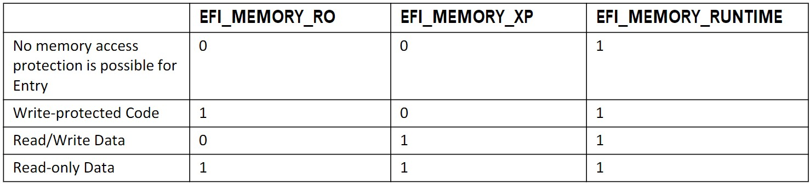

# EFI 系统表

本节介绍 UEFI 映像的入口点以及传递到该入口点的参数。符合本规范的固件可以加载和执行三种类型的 UEFI 镜像。它们是 UEFI 应用程序（参见第 2.1.2 节）、UEFI 引导服务驱动程序（参见第 2.1.4 节）和 UEFI 运行时驱动程序（参见第 2.1.4 节）。UEFI 应用程序包括 UEFI OS 加载程序（参见第 2.1.3 节）。这三种镜像类型的入口点没有区别。

## UEFI Image Entry Point

传递给镜像的最重要参数是指向系统表的指针。该指针是 `EFI_IMAGE_ENTRY_POINT`（参见下面的定义），它是 UEFI 映像的主要入口点。系统表包含指向活动控制台设备的指针、指向启动服务表的指针、指向运行时服务表的指针以及指向系统配置表（如 ACPI、SMBIOS 和 SAL 系统表）列表的指针。本节详细介绍系统表。

**EFI_IMAGE_ENTRY_POINT**

**概述**

这是 UEFI 映像的主要入口点。此入口点对于 UEFI 应用程序和 UEFI 驱动程序是相同的。

**原型**

```C
typedef
EFI_STATUS
(EFIAPI *EFI_IMAGE_ENTRY_POINT) (
IN EFI_HANDLE ImageHandle,
IN EFI_SYSTEM_TABLE *SystemTable
);
```

**参数**

- **ImageHandle**:为 UEFI 映像分配的固件句柄
- **SystemTable**:指向 EFI 系统表的指针

**描述**

此函数是 EFI 映像的入口点。EFI 映像由 EFI 引导服务`EFI_BOOT_SERVICES.LoadImage()` 加载并重新定位在系统内存中。EFI 映像通过 EFI 引导服务 `EFI_BOOT_SERVICES.StartImage()` 调用。

传递给镜像的最重要参数是指向系统表的指针。这个指针是 `EFI_IMAGE_ENTRY_POINT`（见下面的定义），UEFI Image 的主要入口点。系统表包含指向活动控制台设备的指针、指向引导服务表的指针、指向运行时服务表的指针以及指向系统配置表列表（例如 ACPI、SMBIOS 和 SAL 系统表）的指针。本节详细介绍系统表。

`ImageHandle` 是固件分配的句柄，用于在各种功能上识别镜像。该句柄还支持镜像可以使用的一种或多种协议。所有镜像都支持 `EFI_LOADED_IMAGE_PROTOCOL` 和 `EFI_LOADED_IMAGE_DEVICE_PATH_PROTOCOL`，它们返回镜像的源位置、镜像的内存位置、镜像的加载选项等。确切的 `EFI_LOADED_IMAGE_PROTOCOL` 和 `EFI_LOADED_IMAGE_DEVICE_PATH_PROTOCOL` 结构在第 9 节中定义。

如果 UEFI 映像是不是 UEFI 操作系统加载程序的 UEFI 应用程序，则该应用程序将执行并返回或调用 EFI 引导服务 `EFI_BOOT_SERVICES.Exit()`。UEFI 应用程序在退出时总是从内存中卸载，并将其返回状态返回给启动该 UEFI 应用程序的组件。

如果 UEFI 映像是 UEFI 操作系统加载程序，则 UEFI 操作系统加载程序将执行并返回，调用 EFI 引导服务 `Exit()`，或调用 EFI 引导服务 `EFI_BOOT_SERVICES.ExitBootServices()`。如果 EFI OS Loader 返回或调用 `Exit()`，则 OS 加载失败，EFI OS Loader 从内存中卸载，控制权返回到尝试启动 UEFI OS Loader 的组件。如果调用了 `ExitBootServices()`，那么 UEFI OS Loader 已经控制了平台，EFI 将不会重新获得系统的控制权，直到平台被重置。重置平台的一种方法是通过 EFI 运行时服务 `ResetSystem()`。

如果 UEFI 映像是 UEFI 驱动程序，则 UEFI 驱动程序将执行并返回或调用 Boot Service `Exit()`。如果 UEFI 驱动程序返回错误，则驱动程序将从内存中卸载。如果 UEFI 驱动程序返回 `EFI_SUCCESS`，则它会驻留在内存中。如果 UEFI 驱动程序不遵循 UEFI 驱动程序模型，则它会执行任何必需的初始化并在返回之前安装其协议服务。如果驱动程序确实遵循 UEFI 驱动程序模型，则不允许入口点接触任何设备硬件。相反，入口点需要在 UEFI 驱动程序的 `ImageHandle` 上创建和安装 `EFI_DRIVER_BINDING_PROTOCOL`（请参阅第 11.1 节）。如果此过程完成，则返回 `EFI_SUCCESS`。如果资源不可用于完成 UEFI 驱动程序初始化，则返回 `EFI_OUT_OF_RESOURCES`。

**返回的状态码**

- `EFI_SUCCESS`：驱动程序已初始化。
- `EFI_OUT_OF_RESOURCES`：由于缺乏资源，请求无法完成。

## EFI 表头

数据类型 `EFI_TABLE_HEADER` 是所有标准 EFI 表类型之前的数据结构。它包括对每个表类型唯一的签名、可以在扩展添加到 EFI 表类型时更新的表修订以及一个 32 位 CRC，因此 EFI 表类型的消费者可以验证 EFI 表类型的内容 EFI 表。

**EFI_TABLE_HEADER**

**概述**

在所有标准 EFI 表类型之前的数据结构。

**原型**

```C
typedef struct {
    UINT64 Signature;
    UINT32 Revision;
    UINT32 HeaderSize;
    UINT32 CRC32;
    UINT32 Reserved;
} EFI_TABLE_HEADER;
```

**参数**

- **Signature**:标识后面的表类型的 64 位签名。已为 EFI 系统表、EFI 引导服务表和 EFI 运行时服务表生成唯一签名。
- **Revision**:此表符合的 EFI 规范的修订版。该字段的高 16 位包含主修订值，低 16 位包含次修订值。次要修订值是二进制编码的十进制数，并且限制在 00..99 的范围内。
  - 当打印或显示时，UEFI 规范修订被称为（主要修订）。（次要修订上位小数）。（次要修订小数下位）或（主要修订）。（次要修订小数点上位）如果次要修订小数下位设置为 0。例如
  - 具有修订值 ((2<<16) | (30)) 的规范将称为 2.3
  - 具有修订值 ((2<<16) | (31)) 的规范将称为 2.3.1
- **HeaderSize**:整个表的大小（以字节为单位），包括 EFI_TABLE_HEADER。
- **CRC32**：整个表的 32 位 CRC。通过将此字段设置为 0 并计算 HeaderSize 字节的 32 位 CRC 来计算此值
- **Reserved**：必须设置为 0 的保留字段。

**描述**

注：EFI 系统表、运行时表和引导服务表中的功能可能会随时间发生变化。每个表中的第一个字段是 EFI_TABLE_HEADER。当新的能力和功能被添加到表中的功能时，此标头的修订字段会增加。检查功能时，代码应验证 Revision 是否大于或等于将功能添加到 UEFI 规范时表的修订级别。

注：除非另有说明，否则 UEFI 使用标准 CCITT32 CRC 算法进行 CRC 计算，其种子多项式值为 `0x04c11db7`。

注：系统表、运行时服务表和引导服务表的大小可能会随着时间的推移而增加。始终使用 `EFI_TABLE_HEADER` 的 `HeaderSize` 字段来确定这些表的大小非常重要。

## EFI 系统表

UEFI 使用 EFI 系统表，它包含指向运行时和启动服务表的指针。这个表的定义在下面的代码片段中显示。除了表头，服务表中的所有元素都是指向第 7 节和第 8 节中定义的函数的指针。在调用 `EFI_BOOT_SERVICES.ExitBootServices()` 之前，EFI 系统表的所有字段都是有效的。在操作系统通过调用 `ExitBootServices()` 控制平台后，只有 Hdr、`FirmwareVendor`、`FirmwareRevision`、`RuntimeServices`、`NumberOfTableEntries` 和 `ConfigurationTable` 字段有效

**EFI_SYSTEM_TABLE**

**概述**

包含指向运行时和引导服务表的指针。

**相关定义**

```C
#define EFI_SYSTEM_TABLE_SIGNATURE 0x5453595320494249
#define EFI_2_90_SYSTEM_TABLE_REVISION ((2<<16) | (90))
#define EFI_2_80_SYSTEM_TABLE_REVISION ((2<<16) | (80))
#define EFI_2_70_SYSTEM_TABLE_REVISION ((2<<16) | (70))
#define EFI_2_60_SYSTEM_TABLE_REVISION ((2<<16) | (60))
#define EFI_2_50_SYSTEM_TABLE_REVISION ((2<<16) | (50))
#define EFI_2_40_SYSTEM_TABLE_REVISION ((2<<16) | (40))
#define EFI_2_31_SYSTEM_TABLE_REVISION ((2<<16) | (31))
#define EFI_2_30_SYSTEM_TABLE_REVISION ((2<<16) | (30))
#define EFI_2_20_SYSTEM_TABLE_REVISION ((2<<16) | (20))
#define EFI_2_10_SYSTEM_TABLE_REVISION ((2<<16) | (10))
#define EFI_2_00_SYSTEM_TABLE_REVISION ((2<<16) | (00))
#define EFI_1_10_SYSTEM_TABLE_REVISION ((1<<16) | (10))
#define EFI_1_02_SYSTEM_TABLE_REVISION ((1<<16) | (02))
#define EFI_SPECIFICATION_VERSION EFI_SYSTEM_TABLE_REVISION
#define EFI_SYSTEM_TABLE_REVISION EFI_2_90_SYSTEM_TABLE_REVISION
typedef struct {
    EFI_TABLE_HEADER Hdr;
    CHAR16 *FirmwareVendor;
    UINT32 FirmwareRevision;
    EFI_HANDLE ConsoleInHandle;
    EFI_SIMPLE_TEXT_INPUT_PROTOCOL *ConIn;
    EFI_HANDLE ConsoleOutHandle;
    EFI_SIMPLE_TEXT_OUTPUT_PROTOCOL *ConOut;
    EFI_HANDLE StandardErrorHandle;
    EFI_SIMPLE_TEXT_OUTPUT_PROTOCOL *StdErr;
    EFI_RUNTIME_SERVICES *RuntimeServices;
    EFI_BOOT_SERVICES *BootServices;
    UINTN NumberOfTableEntries;
    EFI_CONFIGURATION_TABLE *ConfigurationTable;
    } EFI_SYSTEM_TABLE;
```

参数

- **Hdr**:EFI 系统表的表头。此标头包含 `EFI_SYSTEM_TABLE_SIGNATURE` 和 `EFI_SYSTEM_TABLE_REVISION` 值以及 `EFI_SYSTEM_TABLE` 结构的大小和 32 位 CRC，以验证 EFI 系统表的内容是否有效
- **FirmwareVendor**:指向空终止字符串的指针，该字符串标识为平台生产系统固件的供应商
- **FirmwareRevision**:固件供应商特定值，用于标识平台的系统固件修订版。
- **ConsoleInHandle**:活动控制台输入设备的句柄。此句柄必须支持 `EFI_SIMPLE_TEXT_INPUT_PROTOCOL` 和 `EFI_SIMPLE_TEXT_INPUT_EX_PROTOCOL`。如果没有活动的控制台，这些协议必须仍然存在。
- **ConIn**:指向与 ConsoleInHandle 关联的 `EFI_SIMPLE_TEXT_INPUT_PROTOCOL` 接口的指针。
- **ConsoleOutHandle**:活动控制台输出设备的句柄。此句柄必须支持 `EFI_SIMPLE_TEXT_OUTPUT_PROTOCOL`。如果没有活动控制台，则此协议必须仍然存在
- **ConOut**:指向与 ConsoleOutHandle 关联的 `EFI_SIMPLE_TEXT_OUTPUT_PROTOCOL` 接口的指针
- **StandardErrorHandle**:活动标准错误控制台设备的句柄。此句柄必须支持 `EFI_SIMPLE_TEXT_OUTPUT_PROTOCOL`。如果没有活动控制台，则此协议必须仍然存在
- **StdErr**:指向与 `StandardErrorHandle` 关联的 `EFI_SIMPLE_TEXT_OUTPUT_PROTOCOL` 接口的指针
- **RuntimeServices**:指向 EFI 运行时服务表的指针。请参阅第 4.5 节。
- **BootServices**:指向 EFI 引导服务表的指针。请参阅第 4.4 节。
- **NumberOfTableEntries**:缓冲区 `ConfigurationTable` 中系统配置表的个数
- **ConfigurationTable**:指向系统配置表的指针。表中的条目数是 `NumberOfTableEntries`。

## EFI Boot Services Table

UEFI 使用 EFI 引导服务表，其中包含表头和指向所有引导服务的指针。该表的定义显示在以下代码片段中。除表头外，EFI 引导服务表中的所有元素都是函数指针的原型，指向第 7 节中定义的函数。在操作系统通过调用控制平台后，此表中的函数指针无效 `EFI_BOOT_SERVICES.ExitBootServices()`。

**EFI_BOOT_SERVICES**

**概述**

包含表头和指向所有引导服务的指针。

**相关定义**

```C
#define EFI_BOOT_SERVICES_SIGNATURE 0x56524553544f4f42
#define EFI_BOOT_SERVICES_REVISION EFI_SPECIFICATION_VERSION
typedef struct {
    EFI_TABLE_HEADER Hdr;
    //
    // Task Priority Services
    //
    EFI_RAISE_TPL RaiseTPL; // EFI 1.0+
    EFI_RESTORE_TPL RestoreTPL; // EFI 1.0+
    //
    // Memory Services
    //
    EFI_ALLOCATE_PAGES AllocatePages; // EFI 1.0+
    EFI_FREE_PAGES FreePages; // EFI 1.0+
    EFI_GET_MEMORY_MAP GetMemoryMap; // EFI 1.0+
    EFI_ALLOCATE_POOL AllocatePool; // EFI 1.0+
    EFI_FREE_POOL FreePool; // EFI 1.0+
    //
    // Event & Timer Services
    //
    EFI_CREATE_EVENT CreateEvent; // EFI 1.0+
    EFI_SET_TIMER SetTimer; // EFI 1.0+
    EFI_WAIT_FOR_EVENT WaitForEvent; // EFI 1.0+
    EFI_SIGNAL_EVENT SignalEvent; // EFI 1.0+
    EFI_CLOSE_EVENT CloseEvent; // EFI 1.0+
    EFI_CHECK_EVENT CheckEvent; // EFI 1.0+
    //
    // Protocol Handler Services
    //
    EFI_INSTALL_PROTOCOL_INTERFACE InstallProtocolInterface; // EFI 1.0+
    EFI_REINSTALL_PROTOCOL_INTERFACE ReinstallProtocolInterface; // EFI 1.0+
    EFI_UNINSTALL_PROTOCOL_INTERFACE UninstallProtocolInterface; // EFI 1.0+
    EFI_HANDLE_PROTOCOL HandleProtocol; // EFI 1.0+
    VOID* Reserved; // EFI 1.0+
    EFI_REGISTER_PROTOCOL_NOTIFY RegisterProtocolNotify; // EFI 1.0+
    EFI_LOCATE_HANDLE LocateHandle; // EFI 1.0+
    EFI_LOCATE_DEVICE_PATH LocateDevicePath; // EFI 1.0+
    EFI_INSTALL_CONFIGURATION_TABLE InstallConfigurationTable; // EFI 1.0+
    //
    // Image Services
    //
    EFI_IMAGE_LOAD LoadImage; // EFI 1.0+
    EFI_IMAGE_START StartImage; // EFI 1.0+
    EFI_EXIT Exit; // EFI 1.0+
    EFI_IMAGE_UNLOAD UnloadImage; // EFI 1.0+
    EFI_EXIT_BOOT_SERVICES ExitBootServices; // EFI 1.0+
    //
    // Miscellaneous Services
    //
    EFI_GET_NEXT_MONOTONIC_COUNT GetNextMonotonicCount; // EFI 1.0+
    EFI_STALL Stall; // EFI 1.0+
    EFI_SET_WATCHDOG_TIMER SetWatchdogTimer; // EFI 1.0+
    //
    // DriverSupport Services
    //
    EFI_CONNECT_CONTROLLER ConnectController; // EFI 1.1
    EFI_DISCONNECT_CONTROLLER DisconnectController;// EFI 1.1+
    //
    // Open and Close Protocol Services
    //
    EFI_OPEN_PROTOCOL OpenProtocol; // EFI 1.1+
    EFI_CLOSE_PROTOCOL CloseProtocol; // EFI 1.1+
    EFI_OPEN_PROTOCOL_INFORMATION OpenProtocolInformation; // EFI 1.1+
    //
    // Library Services
    //
    EFI_PROTOCOLS_PER_HANDLE ProtocolsPerHandle; // EFI 1.1+
    EFI_LOCATE_HANDLE_BUFFER LocateHandleBuffer; // EFI 1.1+
    EFI_LOCATE_PROTOCOL LocateProtocol; // EFI 1.1+
    EFI_INSTALL_MULTIPLE_PROTOCOL_INTERFACES
    InstallMultipleProtocolInterfaces; // EFI 1.1+
    EFI_UNINSTALL_MULTIPLE_PROTOCOL_INTERFACES
    UninstallMultipleProtocolInterfaces; // EFI 1.1+
    //
    // 32-bit CRC Services
    //
    EFI_CALCULATE_CRC32 CalculateCrc32; // EFI 1.1+
    //
    // Miscellaneous Services
    //
    EFI_COPY_MEM CopyMem; // EFI 1.1+
    EFI_SET_MEM SetMem; // EFI 1.1+
    EFI_CREATE_EVENT_EX CreateEventEx; // UEFI 2.0+
} EFI_BOOT_SERVICES;
```

**参数**

- **Hdr** EFI 引导服务表的表头。此标头包含 `EFI_BOOT_SERVICES_SIGNATURE` 和 `EFI_BOOT_SERVICES_REVISION` 值以及 `EFI_BOOT_SERVICES` 结构的大小和 32 位 CRC，以验证 EFI 引导服务表的内容是否有效。
- **RaiseTPL** 提高任务优先级。
- **RestoreTPL** 恢复/降低任务优先级。
- **AllocatePages** 分配特定类型的页面。
- **FreePages** 释放分配的页面。
- **GetMemoryMap** 返回当前引导服务内存映射和内存映射键。
- **AllocatePool** 分配特定类型的池。
- **FreePool** 释放分配的池。
- **CreateEvent** 创建通用事件结构。
- **SetTimer** 设置在特定时间发出信号的事件。
- **WaitForEvent** 停止执行，直到发出事件信号。
- **SignalEvent** 发出事件信号。
- **CloseEvent** 关闭和释放事件结构。
- **CheckEvent** 检查事件是否处于信号状态。
- **InstallProtocolInterface** 在设备句柄上安装协议接口。
- **ReinstallProtocolInterface** 在设备句柄上重新安装协议接口。
- **UninstallProtocolInterface** 从设备句柄中删除协议接口。
- **HandleProtocol** 查询句柄以确定它是否支持指定的协议。保留 保留。必须为 NULL。
- **RegisterProtocolNotify** 注册一个事件，每当为指定协议安装接口时，该事件就会发出信号。
- **LocateHandle** 返回支持指定协议的句柄数组。
- **LocateDevicePath** 定位设备路径上支持指定协议的所有设备，并将句柄返回到距离该路径最近的设备。
- **InstallConfigurationTable** 在 EFI 系统表中添加、更新或删除配置表。
- **LoadImage** 将 EFI 镜像加载到内存中。
- **StartImage** 将控制转移到加载镜像的入口点。退出 退出镜像的入口点。
- **UnloadImage** 卸载镜像。
- **ExitBootServices** 终止引导服务。
- **GetNextMonotonicCount** 返回平台的单调递增计数。停止处理器。
- **SetWatchdogTimer** 重置和设置引导服务期间使用的看门狗定时器。
- **ConnectController** 使用一组优先规则来找到最佳驱动程序集来管理控制器。
- **DisconnectController** 通知一组驱动程序停止管理控制器。
- **OpenProtocol** 将元素添加到使用协议接口的代理列表中。
- **CloseProtocol** 从使用协议接口的代理列表中删除元素。
- **OpenProtocolInformation** 检索当前使用协议接口的代理列表。
- **ProtocolsPerHandle** 检索句柄上安装的协议列表。返回缓冲区是自动分配的。
- **LocateHandleBuffer** 从句柄数据库中检索满足搜索条件的句柄列表。返回缓冲区是自动分配的。
- **LocateProtocol** 在句柄数据库中查找支持所请求协议的第一个句柄。
- **InstallMultipleProtocolInterfaces** 在句柄上安装一个或多个协议接口。
- **UninstallMultipleProtocolInterfaces** 从句柄中卸载一个或多个协议接口。
- **CalculateCrc32** 计算并返回数据缓冲区的 32 位 CRC。
- **CopyMem** 将一个缓冲区的内容复制到另一个缓冲区。
- **SetMem** 用指定值填充缓冲区。
- **CreateEventEx** 创建事件结构作为事件组的一部分

## EFI Runtime Services Table

UEFI 使用 EFI 运行时服务表，其中包含表头和指向所有运行时服务的指针。该表的定义显示在以下代码片段中。除表头外，EFI 运行时服务表中的所有元素都是指向第 8 节中定义的函数的函数指针的原型。与 EFI 引导服务表不同，此表及其包含的函数指针在 UEFI 操作系统加载程序和操作系统通过调用 `EFI_BOOT_SERVICES.ExitBootServices()`控制平台后有效。如果操作系统调用 `SetVirtualAddressMap()`，则此表中的函数指针将固定为指向新的虚拟映射入口点。

**EFI_RUNTIME_SERVICES**

**概述**

包含表头和指向所有运行时服务的指针。

**相关定义**

```C
#define EFI_RUNTIME_SERVICES_SIGNATURE 0x56524553544e5552
#define EFI_RUNTIME_SERVICES_REVISION EFI_SPECIFICATION_VERSION
typedef struct {
    EFI_TABLE_HEADER Hdr;
    //
    // Time Services
    //
    EFI_GET_TIME GetTime;
    EFI_SET_TIME SetTime;
    EFI_GET_WAKEUP_TIME GetWakeupTime;
    EFI_SET_WAKEUP_TIME SetWakeupTime;
    //
    // Virtual Memory Services
    //
    EFI_SET_VIRTUAL_ADDRESS_MAP SetVirtualAddressMap;
    EFI_CONVERT_POINTER ConvertPointer;
    //
    // Variable Services
    //
    EFI_GET_VARIABLE GetVariable;
    EFI_GET_NEXT_VARIABLE_NAME GetNextVariableName;
    EFI_SET_VARIABLE SetVariable;
    //
    // Miscellaneous Services
    //
    EFI_GET_NEXT_HIGH_MONO_COUNT GetNextHighMonotonicCount;
    EFI_RESET_SYSTEM ResetSystem;
    //
    // UEFI 2.0 Capsule Services
    //
    EFI_UPDATE_CAPSULE UpdateCapsule;
    EFI_QUERY_CAPSULE_CAPABILITIES QueryCapsuleCapabilities;
    //
    // Miscellaneous UEFI 2.0 Service
    //
    EFI_QUERY_VARIABLE_INFO QueryVariableInfo;
} EFI_RUNTIME_SERVICES;
```

**参数**

- **Hdr** EFI 运行时服务表的表头。此标头包含 `EFI_RUNTIME_SERVICES_SIGNATURE` 和 `EFI_RUNTIME_SERVICES_REVISION` 值以及 `EFI_RUNTIME_SERVICES` 结构的大小和 32 位 CRC，以验证 EFI 运行时服务表的内容是否有效。
- **GetTime** 返回当前时间和日期，以及平台的计时功能。
- **SetTime** 设置当前本地时间和日期信息。
- **GetWakeupTime** 返回当前的唤醒闹钟设置。
- **SetWakeupTime** 设置系统唤醒闹钟时间。
- **SetVirtualAddressMap** 由 UEFI 操作系统加载程序用于从物理寻址转换为虚拟寻址。
- **ConvertPointer** 由 EFI 组件用来在切换到虚拟寻址时转换内部指针。
- **GetVariable** 返回变量的值。
- **GetNextVariableName** 枚举当前变量名。
- **SetVariable** 设置变量的值。
- **GetNextHighMonotonicCount** 返回平台单调计数器的下一个高 32 位。
- **ResetSystem** 重置整个平台。
- **UpdateCapsule** 将胶囊传递给具有虚拟和物理映射的固件。
- **QueryCapsuleCapabilities** 返回是否可以通过 UpdateCapsule() 支持胶囊。
- **QueryVariableInfo** 返回有关 EFI 变量存储的信息

## EFI Configuration Table & Properties Table

EFI 配置表是 EFI 系统表中的 `ConfigurationTable` 字段。此表包含一组 GUID 指针对。该表的每个元素都由下面的 `EFI_CONFIGURATION_TABLE` 结构描述。配置表的类型数量预计会随着时间的推移而增长。这就是使用 GUID 来标识配置表类型的原因。EFI 配置表最多包含每种表类型的一次实例。

**EFI_CONFIGURATION_TABLE**

**概述**

包含一组 GUID/指针对，由 EFI 系统表中的 ConfigurationTable 字段组成

**相关定义**

```C
typedef struct{
    EFI_GUID VendorGuid;
    VOID *VendorTable;
} EFI_CONFIGURATION_TABLE;
```

**参数**

- **VendorGuid** 唯一标识系统配置表的 128 位 GUID 值。
- **VendorTable** 指向与 `VendorGuid` 关联的表的指针。用于存储表的内存类型以及该指针在运行时是物理地址还是虚拟地址（当调用 `SetVirtualAddressMap()` 时，表中报告的特定地址是否得到修复）由 `VendorGuid` 确定。除非另有说明，否则表缓冲区的内存类型由第 2 章调用约定部分中规定的指南定义。定义 VendorTable 的规范有责任指定额外的内存类型要求（如果有）以及是否转换表中报告的地址。任何所需的地址转换都是发布相应配置表的驱动程序的责任。指向与 VendorGuid 关联的表的指针。这个指针在运行时是物理地址还是虚拟地址由 `VendorGuid` 决定。与给定 `VendorTable` 指针关联的 `VendorGuid` 定义在调用 `SetVirtualAddressMap()` 时表中报告的特定地址是否得到修复。定义 `VendorTable` 的规范有责任指定是否转换表中报告的地址。

**行业标准配置表**

以下列表显示了一些行业标准中定义的表的 GUID。这些行业标准定义了在基于 UEFI 的系统上作为 UEFI 配置表访问的表。这些表条目中报告的所有地址都将被引用为物理地址，并且在从预引导阶段过渡到运行时阶段时不会被修复。此列表并不详尽，不会显示所有可能的 UEFI 配置表的 GUID。

```C

#define EFI_ACPI_20_TABLE_GUID
    \
    {
        0x8868e871, 0xe4f1, 0x11d3,\
        {
            0xbc, 0x22, 0x00, 0x80, 0xc7, 0x3c, 0x88, 0x81
        }
    }
#define ACPI_TABLE_GUID \
    {
        0xeb9d2d30, 0x2d88, 0x11d3,\
        {
            0x9a, 0x16, 0x00, 0x90, 0x27, 0x3f, 0xc1, 0x4d
        }
    }
#define SAL_SYSTEM_TABLE_GUID \
    {
        0xeb9d2d32, 0x2d88, 0x11d3,\
        {
            0x9a, 0x16, 0x00, 0x90, 0x27, 0x3f, 0xc1, 0x4d
        }
    }
#define SMBIOS_TABLE_GUID \
    {
        0xeb9d2d31, 0x2d88, 0x11d3,\
        {
            0x9a, 0x16, 0x00, 0x90, 0x27, 0x3f, 0xc1, 0x4d
        }
    }
#define SMBIOS3_TABLE_GUID \
    {0xf2fd1544, 0x9794, 0x4a2c,\  {0x99,0x2e,0xe5,0xbb,0xcf,0x20,0xe3,0x94})#define MPS_TABLE_GUID \
        {
            0xeb9d2d2f, 0x2d88, 0x11d3,\
            {
                0x9a, 0x16, 0x00, 0x90, 0x27, 0x3f, 0xc1, 0x4d
            }
        } //// ACPI 2.0 or newer tables should use EFI_ACPI_TABLE_GUID//#define EFI_ACPI_TABLE_GUID \ 
{0x8868e871,0xe4f1,0x11d3,\ 
{0xbc,0x22,0x00,0x80,0xc7,0x3c,0x88,0x81}}
#define EFI_ACPI_20_TABLE_GUID EFI_ACPI_TABLE_GUID
#define ACPI_TABLE_GUID                                    \
    \ 
{                                                     \
        0xeb9d2d30, 0x2d88, 0x11d3,                        \
        \ 
{                                                 \
            0x9a, 0x16, 0x00, 0x90, 0x27, 0x3f, 0xc1, 0x4d \
        }                                                  \
    }
#define ACPI_10_TABLE_GUID ACPI_TABLE_GUID

```

**JSON Configuration Tables**

以下列表显示了为向 EFI 配置表报告固件配置数据而定义的表的 GUID，以及用于处理第 23.5 节中定义的 JSON 负载胶囊的表。在由 `EFI_JSON_CAPSULE_DATA_TABLE_GUID` 标识的表条目中报告的地址将被引用为物理地址，并且在从预引导阶段过渡到运行时阶段时不会被修复。这些由 `EFI_JSON_CONFIG_DATA_TABLE_GUID` 和 `EFI_JSON_CAPSULE_RESULT_TABLE_GUID` 标识的表条目中报告的地址将被引用为虚拟地址，并且在从预引导阶段过渡到运行时阶段时将得到修复。

```c
# define EFI_JSON_CONFIG_DATA_TABLE_GUID
    \
    {
        0x87367f87, 0x1119, 0x41ce, \
        {
            0xaa, 0xec, 0x8b, 0xe0, 0x11, 0x1f, 0x55, 0x8a
        }
    }
# define EFI_JSON_CAPSULE_DATA_TABLE_GUID \
    {
        0x35e7a725, 0x8dd2, 0x4cac, \
        {
            0x80, 0x11, 0x33, 0xcd, 0xa8, 0x10, 0x90, 0x56
        }
    }
# define EFI_JSON_CAPSULE_RESULT_TABLE_GUID \
    {
        0xdbc461c3, 0xb3de, 0x422a,\
        {
            0xb9, 0xb4, 0x98, 0x86, 0xfd, 0x49, 0xa1, 0xe5
        }
    }
```

**Devicetree Tables**

以下列表显示了设备树表 (DTB) 的 GUID。有关详细信息，请参阅“设备树规范”标题下的“UEFI 相关文档的链接”(<http://uefi.org/uefi>)。DTB 必须包含在 EfiACPIReclaimMemory 类型的内存中。此表条目中报告的地址将被引用为物理地址，并且在从预引导阶段过渡到运行时阶段时不会被修复。固件必须将 DTB 驻留在内存中并安装在 EFI 中在执行不属于系统固件映像的任何 UEFI 应用程序或驱动程序之前检查系统表。一旦 DTB 作为配置表安装，系统固件不得对其进行任何修改或引用 DTB 中包含的任何数据。

允许 UEFI 应用程序修改或替换加载的 DTB。系统固件不得依赖于 DTB 中包含的任何数据。如果系统固件使用 DTB 进行自己的配置，它应该使用一个单独的私有副本，该副本未安装在 EFI 系统表中或以其他方式暴露给 EFI 应用程序。

```C
#define CTEST_MAIN
//// 设备树表，扁平化设备树 Blob (DTB) 格式//
#define EFI_DTB_TABLE_GUID                                 \
    \                                                      \
    {                                                      \
        0xb1b621d5, 0xf19c, 0x41a5, \                      \
        {                                                  \
            0x83, 0x0b, 0xd9, 0x15, 0x2c, 0x69, 0xaa, 0xe0 \
        }                                                  \
    }
```

**EFI_RT_PROPERTIES_TABLE**

如果操作系统调用 ExitBootServices() 后平台不再支持所有 EFI 运行时服务，则该表应由平台发布。请注意，这只是对操作系统的提示，可以随意忽略，因此平台仍然需要提供不受支持的运行时服务的可调用实现，这些服务只返回 EFI_UNSUPPORTED。

```C
#define EFI_RT_PROPERTIES_TABLE_GUID                       \
    {                                                      \
        0xeb66918a, 0x7eef, 0x402a,                        \
        {                                                  \
            0x84, 0x2e, 0x93, 0x1d, 0x21, 0xc3, 0x8a, 0xe9 \
        }                                                  \
    }
typedef struct {
    UINT16 Version;
    UINT16 Length;
    UINT32 RuntimeServicesSupported;
} EFI_RT_PROPERTIES_TABLE;
```

- **Version**:表的版本，必须是 0x1
  - `#define EFI_RT_PROPERTIES_TABLE_VERSION 0x1`
- **Length**:整个 EFI_RT_PROPERTIES_TABLE 的大小（以字节为单位）必须为 8。
- **RuntimeServicesSupported**:支持或不支持调用的位掩码，其中位设置为 1 表示支持该调用，0 表示不支持。

    ```c
    #define EFI_RT_SUPPORTED_GET_TIME                      0x0001
    # define EFI_RT_SUPPORTED_SET_TIME                      0x0002
    # define EFI_RT_SUPPORTED_GET_WAKEUP_TIME               0x0004
    # define EFI_RT_SUPPORTED_SET_WAKEUP_TIME               0x0008
    # define EFI_RT_SUPPORTED_GET_VARIABLE                  0x0010
    # define EFI_RT_SUPPORTED_GET_NEXT_VARIABLE_NAME        0x0020
    # define EFI_RT_SUPPORTED_SET_VARIABLE                  0x0040
    # define EFI_RT_SUPPORTED_SET_VIRTUAL_ADDRESS_MAP       0x0080
    # define EFI_RT_SUPPORTED_CONVERT_POINTER               0x0100
    # define EFI_RT_SUPPORTED_GET_NEXT_HIGH_MONOTONIC_COUNT 0x0200
    # define EFI_RT_SUPPORTED_RESET_SYSTEM                  0x0400
    # define EFI_RT_SUPPORTED_UPDATE_CAPSULE                0x0800
    # define EFI_RT_SUPPORTED_QUERY_CAPSULE_CAPABILITIES    0x1000
    # define EFI_RT_SUPPORTED_QUERY_VARIABLE_INFO           0x2000
    ```

这种类型的 EFI 配置表条目中报告的地址将被引用为物理地址，并且在从预引导过渡到运行时阶段时不会被修复。

**EFI_PROPERTIES_TABLE (deprecated)**

注意：此表已弃用，不应再使用！它将从规范的未来版本中删除。下面描述的 EFI_MEMORY_ATTRIBUTES_TABLE 提供了替代机制来实现运行时内存保护。

如果平台满足 MemoryProtectionAttributes 中列出的某些构造要求，则会发布此表。

```C
typedef struct {
    UINT32 Version;
    UINT32 Length;
    UINT64 MemoryProtectionAttribute;
} EFI_PROPERTIES_TABLE;
```

- **Version**:这是表的修订。后续版本可能会填充额外的位并增加表的长度。如果是后者，Length 字段会适当调整
  - #define EFI_PROPERTIES_TABLE_VERSION 0x00010000
- **Length**:这是整个 EFI_PROPERTIES_TABLE 结构的大小，包括版本。初始版本的长度为 16
- **MemoryProtectionAttribute**:这个字段是一个位掩码。任何未定义的位都应被视为保留位。设置位意味着底层固件已根据给定属性构建。

```C
//
// Memory attribute (Not defined bits are reserved)
//
#define EFI_PROPERTIES_RUNTIME_MEMORY_PROTECTION_NON_EXECUTABLE_PE_DATA 0x1

// BIT 0 – description – implies the runtime data is separated from the code
```

该位意味着可执行映像的 UEFI 运行时代码和数据部分是分开的，并且必须按照第 2.3 节中的规定对齐。该位还暗示数据页没有任何可执行代码。

建议不要使用此属性，尤其是对于将运行时代码内存映射描述符分解为 UEFI 模块中的底层代码和数据部分的实现。这种拆分会导致与调用 SetVirtualAddress() 的操作系统的互操作性问题，而没有意识到这些运行时描述符之间存在关系。

**EFI_MEMORY_ATTRIBUTES_TABLE**

**概述**

当由系统固件发布时，EFI_MEMORY_ATTRIBUTES_TABLE 提供有关运行时内存块中区域的附加信息，这些内存块在从 `EFI_BOOT_SERVICES.GetMemoryMap()` 函数返回的 `EFI_MEMORY_DESCRIPTOR` 条目中定义。内存属性表当前用于描述可由操作系统或管理程序应用于 EFI 运行时代码和数据的内存保护。此表的使用者当前必须忽略包含除 `EfiRuntimeServicesData` 和 `EfiRuntimeServicesCode` 之外的任何类型值的条目，以确保与此表的未来使用兼容。属性表可以定义多个条目来描述子区域，这些子区域包含由 `GetMemoryMap()` 返回的单个条目，但是子区域必须合计以完全描述更大的区域，并且不能跨越 `GetMemoryMap()` 报告的条目之间的边界。如果 `GetMemoryMap()` 条目中返回的运行时区域未在内存属性表中描述，则假定该区域与任何内存保护不兼容。

只有 `GetMemoryMap()` 返回的整个 EFI_MEMORY_DESCRIPTOR 条目可以传递给 `SetVirtualAddressMap`()。

这种类型的 EFI 配置表条目中报告的地址将被引用为物理地址，并且在从预引导阶段过渡到运行时阶段时不会被修复

**原型**

```C
#define EFI_MEMORY_ATTRIBUTES_TABLE_GUID                   \
    {                                                      \
        0xdcfa911d, 0x26eb, 0x469f,                        \
        {                                                  \
            0xa2, 0x20, 0x38, 0xb7, 0xdc, 0x46, 0x12, 0x20 \
        }                                                  \
    }
```

具有以下数据结构

```C
/***********************************************/
/* EFI_MEMORY_ATTRIBUTES_TABLE
/***********************************************/
typedef struct {
    UINT32 Version;
    UINT32 NumberOfEntries;
    UINT32 DescriptorSize;
    UINT32 Reserved;
    // EFI_MEMORY_DESCRIPTOR Entry [1];
} EFI_MEMORY_ATTRIBUTES_TABLE;
```

- **Version**:该表的版本。当前版本为 0x00000001
- **NumberOfEntries**:提供的 EFI_MEMORY_DESCRIPTOR 条目计数。这通常是包含 UEFI 运行时和所有 UEFI 运行时数据区域（例如运行时堆）的所有 UEFI 模块中的 PE/COFF 部分的总数。
- **Entry**:EFI_MEMORY_DESCRIPTOR 类型的条目数组。
- **DescriptorSize**:内存描述符的大小
- **Reserved**:保留字节

**描述**

对于每个数组条目，`EFI_MEMORY_DESCRIPTOR.Attribute` 字段可以通知运行时机构，例如操作系统或管理程序，关于可以在内存管理单元中为该条目定义的内存进行什么级别的保护设置。当前属性字段的唯一有效位是 `EFI_MEMORY_RO`、`EFI_MEMORY_XP` 以及 `EFI_MEMORY_RUNTIME`。无论属性隐含的内存保护如何，`EFI_MEMORY_DESCRIPTOR.Type` 字段都应与封闭的 `SetMemoryMap()` 条目中的内存类型相匹配。`PhysicalStart` 必须按照第 2.3 节中的规定对齐。该列表必须按物理起始地址升序排序。`VirtualStart` 字段必须为零并被操作系统忽略，因为它对该表没有任何用处。`NumPages` 必须覆盖保护映射的整个内存区域。`EFI_MEMORY_ATTRIBUTES_TABLE` 中具有属性 `EFI_MEMORY_RUNTIME` 的每个描述符不得与 `EFI_MEMORY_ATTRIBUTES_TABLE` 中具有属性 `EFI_MEMORY_RUNTIME` 的任何其他描述符重叠。此外，`EFI_MEMORY_ATTRIBUTES_TABLE` 中的描述符描述的每个内存区域必须是 `GetMemoryMap()` 生成的表中描述符的子区域或等于。



**其他配置表**

以下列表显示了本规范中定义的其他配置表：

- EFI_MEMORY_RANGE_CAPSULE_GUID
- EFI_DEBUG_IMAGE_INFO_TABLE (Section 18.4.3)
- EFI_SYSTEM_RESOURCE_TABLE (Section 23.4)
- EFI_IMAGE_EXECUTION_INFO_TABLE (Section 32.5.3.1)
- User Information Table (Section 36.5)
- HII Database export buffer (Section 33.2.11.1, OS Runtime Utilization)

## 镜像入口点示例

以下部分中的示例显示了如何在 UEFI 环境中显示各种表示例。

### 镜像入口点示例

以下示例显示了 UEFI 应用程序的镜像入口点。此应用程序使用 EFI 系统表、EFI 引导服务表和 EFI 运行时服务表

```C
EFI_SYSTEM_TABLE     *gST;
EFI_BOOT_SERVICES    *gBS;
EFI_RUNTIME_SERVICES *gRT;
EfiApplicationEntryPoint(IN EFI_HANDLE        ImageHandle,
                         IN EFI_SYSTEM_TABLE *SystemTable)
{
    EFI_STATUS Status;
    EFI_TIME  *Time;
    gST = SystemTable;
    gBS = gST->BootServices;
    gRT = gST->RuntimeServices;
    //
    // Use EFI System Table to print “Hello World” to the active console output
    // device.
    //
    Status = gST->ConOut->OutputString(gST->ConOut, L”Hello World\n\r”);
    if (EFI_ERROR(Status)) {
        return Status;
    }
    //
    // Use EFI Boot Services Table to allocate a buffer to store the current time
    // and date.
    //
    Status = gBS->AllocatePool(EfiBootServicesData, sizeof(EFI_TIME),
                               (VOID **)&Time);
    if (EFI_ERROR(Status)) {
        return Status;
    }
    //
    // Use the EFI Runtime Services Table to get the current time and date.
    //
    Status = gRT->GetTime(Time, NULL) if (EFI_ERROR(Status))
    {
        return Status;
    }
    return Status;
}
```

以下示例显示了不遵循 UEFI 驱动程序模型的驱动程序的 UEFI 映像入口点。由于此驱动程序返回 `EFI_SUCCESS`，因此它在退出后会一直驻留在内存中。

```C
EFI_SYSTEM_TABLE     *gST;
EFI_BOOT_SERVICES    *gBS;
EFI_RUNTIME_SERVICES *gRT;
EfiDriverEntryPoint(IN EFI_HANDLE ImageHandle, IN EFI_SYSTEM_TABLE *SystemTable)
{
    gST = SystemTable;
    gBS = gST->BootServices;
    gRT = gST->RuntimeServices;
    //
    // Implement driver initialization here.
    //
    return EFI_SUCCESS;
}
```

以下示例显示了不遵循 UEFI 驱动程序模型的驱动程序的 UEFI 映像入口点。由于此驱动返回 `EFI_DEVICE_ERROR`，退出后不会常驻内存。

```C
EFI_SYSTEM_TABLE     *gST;
EFI_BOOT_SERVICES*gBS;
EFI_RUNTIME_SERVICES *gRT;
EfiDriverEntryPoint(IN EFI_HANDLE ImageHandle, IN EFI_SYSTEM_TABLE*SystemTable)
{
    gST = SystemTable;
    gBS = gST->BootServices;
    gRT = gST->RuntimeServices;
    //
    // Implement driver initialization here.
    //
    return EFI_DEVICE_ERROR;
}
```

### UEFI Driver Model Example

以下是一个 UEFI 驱动程序模型示例，它显示了 XYZ 总线上 ABC 设备控制器的驱动程序初始化例程。`EFI_DRIVER_BINDING_PROTOCOL` 和 `AbcSupported()`、`AbcStart()` 和 `AbcStop()` 的函数原型在 11.1 节中定义。该函数将驱动程序的镜像句柄和指向 EFI 引导服务表的指针保存在全局变量中，因此其他函数在同一个驱动程序可以访问这些值。然后它创建 `EFI_DRIVER_BINDING_PROTOCOL` 的实例并将其安装到驱动程序的镜像句柄上

```C
extern EFI_GUID                    gEfiDriverBindingProtocolGuid;
EFI_BOOT_SERVICES                 *gBS;
static EFI_DRIVER_BINDING_PROTOCOL mAbcDriverBinding = { AbcSupported, AbcStart,
                                                         AbcStop,      1,
                                                         NULL,         NULL };
AbcEntryPoint(IN EFI_HANDLE ImageHandle, IN EFI_SYSTEM_TABLE *SystemTable)
{
    EFI_STATUS Status;
    gBS                                    = SystemTable->BootServices;
    mAbcDriverBinding->ImageHandle         = ImageHandle;
    mAbcDriverBinding->DriverBindingHandle = ImageHandle;
    Status = gBS->InstallMultipleProtocolInterfaces(
        &mAbcDriverBinding->DriverBindingHandle, &gEfiDriverBindingProtocolGuid,
        &mAbcDriverBinding, NULL);
    return Status;
}
```

### UEFI Driver Model Example (Unloadable)

下面是与上面相同的 UEFI 驱动程序模型示例，除了它还包含允许通过引导服务 `Unload()` 卸载驱动程序所需的代码。在 `AbcEntryPoint()` 中安装的任何协议或分配的内存都必须在 `AbcUnload()` 中卸载或释放。

```C
extern EFI_GUID                    gEfiLoadedImageProtocolGuid;
extern EFI_GUID                    gEfiDriverBindingProtocolGuid;
EFI_BOOT_SERVICES                 *gBS;
static EFI_DRIVER_BINDING_PROTOCOL mAbcDriverBinding = { AbcSupported, AbcStart,
                                                         AbcStop,      1,
                                                         NULL,         NULL };
EFI_STATUS
AbcUnload(IN EFI_HANDLE ImageHandle);
AbcEntryPoint(IN EFI_HANDLE ImageHandle, IN EFI_SYSTEM_TABLE *SystemTable)
{
    EFI_STATUS                 Status;
    EFI_LOADED_IMAGE_PROTOCOL *LoadedImage;
    gBS    = SystemTable->BootServices;
    Status = gBS->OpenProtocol(ImageHandle, &gEfiLoadedImageProtocolGuid,
                               &LoadedImage, ImageHandle, NULL,
                               EFI_OPEN_PROTOCOL_GET_PROTOCOL);
    if (EFI_ERROR(Status)) {
        return Status;
    }
    LoadedImage->Unload                    = AbcUnload;
    mAbcDriverBinding->ImageHandle         = ImageHandle;
    mAbcDriverBinding->DriverBindingHandle = ImageHandle;
    Status = gBS->InstallMultipleProtocolInterfaces(
        &mAbcDriverBinding->DriverBindingHandle, &gEfiDriverBindingProtocolGuid,
        &mAbcDriverBinding, NULL);
    return Status;
}
EFI_STATUS
AbcUnload(IN EFI_HANDLE ImageHandle)
{
    EFI_STATUS Status;
    Status = gBS->UninstallMultipleProtocolInterfaces(
        ImageHandle, &gEfiDriverBindingProtocolGuid, &mAbcDriverBinding, NULL);
    return Status;
}
```

### EFI Driver Model Example (Multiple Instances)

以下与第一个 UEFI 驱动程序模型示例相同，只是它生成三个 `EFI_DRIVER_BINDING_PROTOCOL` 实例。第一个安装在驱动程序的镜像句柄上。另外两个安装在新创建的句柄上

```C
extern EFI_GUID                    gEfiDriverBindingProtocolGuid;
EFI_BOOT_SERVICES                 *gBS;
static EFI_DRIVER_BINDING_PROTOCOL mAbcDriverBindingA = {
    AbcSupportedA, AbcStartA, AbcStopA, 1, NULL, NULL
};
static EFI_DRIVER_BINDING_PROTOCOL mAbcDriverBindingB = {
    AbcSupportedB, AbcStartB, AbcStopB, 1, NULL, NULL
};
static EFI_DRIVER_BINDING_PROTOCOL mAbcDriverBindingC = {
    AbcSupportedC, AbcStartC, AbcStopC, 1, NULL, NULL
};
AbcEntryPoint(IN EFI_HANDLE ImageHandle, IN EFI_SYSTEM_TABLE *SystemTable)
{
    EFI_STATUS Status;
    gBS = SystemTable->BootServices;
    //
    // Install mAbcDriverBindingA onto ImageHandle
    //
    mAbcDriverBindingA->ImageHandle         = ImageHandle;
    mAbcDriverBindingA->DriverBindingHandle = ImageHandle;
    Status = gBS->InstallMultipleProtocolInterfaces(
        &mAbcDriverBindingA->DriverBindingHandle,
        &gEfiDriverBindingProtocolGuid, &mAbcDriverBindingA, NULL);
    if (EFI_ERROR(Status)) {
        return Status;
    }
    //
    // Install mAbcDriverBindingB onto a newly created handle
    //
    mAbcDriverBindingB->ImageHandle         = ImageHandle;
    mAbcDriverBindingB->DriverBindingHandle = NULL;
    Status = gBS->InstallMultipleProtocolInterfaces(
        &mAbcDriverBindingB->DriverBindingHandle,
        &gEfiDriverBindingProtocolGuid, &mAbcDriverBindingB, NULL);
    if (EFI_ERROR(Status)) {
        return Status;
    }
    //
    // Install mAbcDriverBindingC onto a newly created handle
    //
    mAbcDriverBindingC->ImageHandle         = ImageHandle;
    mAbcDriverBindingC->DriverBindingHandle = NULL;
    Status = gBS->InstallMultipleProtocolInterfaces(
        &mAbcDriverBindingC->DriverBindingHandle,
        &gEfiDriverBindingProtocolGuid, &mAbcDriverBindingC, NULL);
    return Status;
}
```