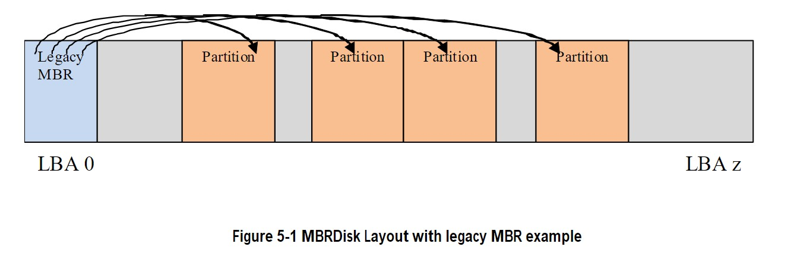
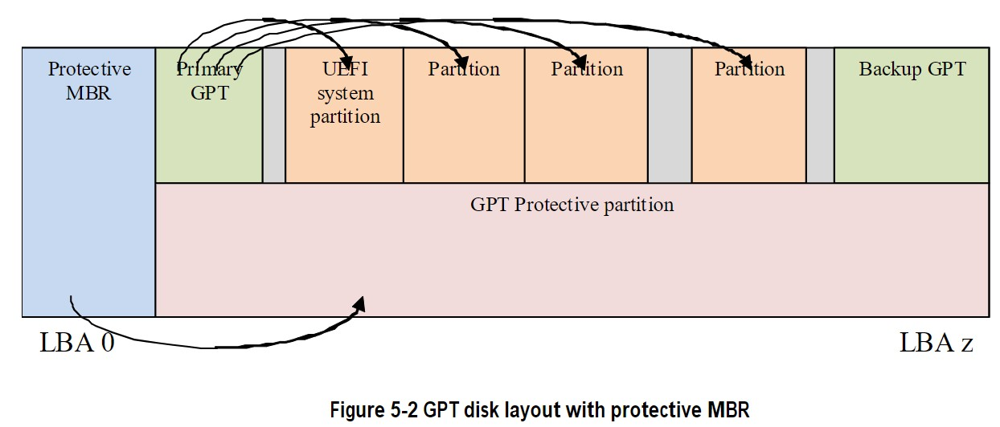
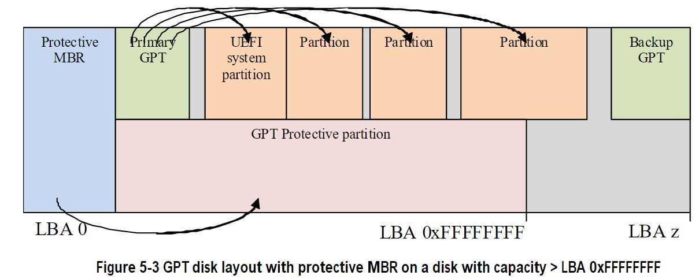

# GUID Partition Table(GPT) Disk Layout

## GPT 和 MBR 磁盘布局对比

此规范定义了 GUID 分区表 (GPT) 磁盘布局（即分区方案）。下表概述了使用 GPT 磁盘布局相对于传统主引导记录 (MBR) 磁盘布局的优势

- 逻辑块地址 (LBA) 是 64 位（而不是 32 位）。
- 支持多个分区（而不仅仅是四个主分区）。
- 提供主分区表和备份分区表以实现冗余。
- 使用版本号和大小字段以供将来扩展。
- 使用 CRC32 字段提高数据完整性。
- 定义用于唯一标识每个分区的 GUID。
- 使用 GUID 和属性来定义分区内容类型。
- 每个分区包含一个 36 个字符的人类可读名称。

## LBA 0 格式

硬盘的 LBA 0（即第一个逻辑块）包含

- 传统主引导记录 (MBR)（参见第 5.2.1 节）
- 或保护性 MBR（参见第 5.2.3 节）。

### 传统主引导记录 (MBR)

如果传统 MBR 未使用 GPT 磁盘布局（即，如果它使用 MBR 磁盘布局），它可能位于磁盘的 LBA 0（即第一个逻辑块）。MBR 上的引导代码不由 UEFI 固件执行。

|         助记符         | 字节偏移 |        字节长度         |                                                        描述                                                         |
| :--------------------: | :------: | :---------------------: | :-----------------------------------------------------------------------------------------------------------------: |
|        BootCode        |    0     |           424           |       x86 代码在非 UEFI 系统上用于选择 MBR 分区记录并加载该分区的第一个逻辑块。此代码不应在 UEFI 系统上执行。       |
| UniqueMBRDiskSignature |   440    |            4            | Unique Disk Signature 这可能被操作系统用来从系统中的其他磁盘中识别磁盘。该值始终由操作系统写入，从不由 EFI 固件写入 |
|        Unknown         |   444    |            2            |                                           未知。UEFI 固件不得使用该字段。                                           |
|    PartitionRecord     |   446    |          16*4           |                                    四个遗留 MBR 分区记录的数组（请参阅表 5-2）。                                    |
|       Signature        |   510    |            2            |                            设置为 0xAA55（即字节 510 包含 0x55，字节 5 11 包含 0xAA）。                             |
|        Reserved        |   512    | Logical BlockSize - 512 |                                         保留逻辑块的其余部分（如果有的话）                                          |

MBR 包含四个分区记录（参见表 11），每个记录定义一个分区在磁盘上使用的开始和结束 LBA
|    助记符     | 字节偏移 | 字节长度 |                                          描述                                          |
| :-----------: | :------: | :------: | :------------------------------------------------------------------------------------: |
| BootIndicator |    0     |    1     | 0x80 表示这是可引导的传统分区。其他值表示这不是可引导的旧分区。UEFI 固件不得使用该字段 |
|  StartingCHS  |    1     |    3     |                   CHS 地址格式的分区开始。UEFI 固件不得使用该字段。                    |
|    OSType     |    4     |    1     |                             分区类型。请参阅第 5.2.2 节。                              |
|   EndingCHS   |    5     |    3     |                   CHS 地址格式的分区结束。UEFI 固件不得使用该字段。                    |
|  StartingLBA  |    8     |    4     |              磁盘上分区的起始 LBA。UEFI 固件使用此字段来确定分区的开始。               |
|   SizeInLBA   |    12    |    4     |         以逻辑块的 LBA 为单位的分区大小。UEFI 固件使用此字段来确定分区的大小。         |

如果 MBR 分区的 OSType 字段为 0xEF（即 UEFI 系统分区），则固件必须使用 InstallProtocolInterface() 将 UEFI 系统分区 GUID 添加到 MBR 分区的句柄中。这允许驱动程序和应用程序（包括操作系统加载程序）轻松搜索代表 UEFI 系统分区的句柄。

必须执行以下测试以确定遗留 MBR 是否有效：

- 签名必须是 0xaa55。
- 包含零 OSType 值或零 SizeInLBA 值的分区记录可能会被忽略。

否则：

- 每个 MBR 分区记录定义的分区必须物理驻留在磁盘上（即不超过磁盘的容量）。
- 每个分区不得与其他分区重叠

图 5-1 显示了具有四个分区的 MBR 磁盘布局示例。



相关定义：

```C
#pragma pack(1)
///
/// MBR Partition Entry
///
typedef struct {
    UINT8 BootIndicator;
    UINT8 StartHead;
    UINT8 StartSector;
    UINT8 StartTrack;
    UINT8 OSIndicator;
    UINT8 EndHead;
    UINT8 EndSector;
    UINT8 EndTrack;
    UINT8 StartingLBA[4];
    UINT8 SizeInLBA[4];
} MBR_PARTITION_RECORD;
///
/// MBR Partition Table
///
typedef struct {
    UINT8                BootStrapCode[440];
    UINT8                UniqueMbrSignature[4];
    UINT8                Unknown[2];
    MBR_PARTITION_RECORD Partition[4];
    UINT16               Signature;
} MASTER_BOOT_RECORD;
#pragma pack()
```

### 操作系统类型

本规范定义的唯一类型（本规范未定义其他值）：

- 0xEF（即 UEFI 系统分区）定义了一个 UEFI 系统分区。
- 0xEE（即 GPT Protective）被保护性 MBR（见 5.2.2）用来定义覆盖整个磁盘的假分区。

其他值由遗留操作系统使用，并独立于 UEFI 规范进行分配。

注意：Andries Brouwer 的“分区类型”：请参阅“MBR 磁盘布局中使用的操作系统类型值”标题下的“UEFI 相关文档链接”(<http://uefi.org/uefi>)

### Protective MBR

对于可引导磁盘，如果它使用 GPT 磁盘布局，则保护性 MBR 必须位于磁盘的 LBA 0（即第一个逻辑块）。保护性 MBR 在 GUID 分区表头之前，以保持与不理解 GPT 分区结构的现有工具的兼容性

**Table 5-3 Protective MBR**
|          助记符           | 字节偏移 |     字节长度     |                                                  描述                                                  |
| :-----------------------: | :------: | :--------------: | :----------------------------------------------------------------------------------------------------: |
|         Boot Code         |    0     |       440        |                                           未被 UEFI 系统使用                                           |
| Unique MBR Disk Signature |   440    |        4         |                                              没用过。归零                                              |
|          Unknown          |   444    |        2         |                                           没用过。设置为零。                                           |
|     Partition Record      |   446    |       16*4       | 四个 MBR 分区记录的数组。包含： • 一个分区记录，如表 5-4 所定义；和 • 三个分区记录，每个记录都设置为零 |
|         Signature         |   510    |        2         |                       设置为 0xAA55（即字节 510 包含 0x55，字节 511 包含 0xAA）                        |
|         Reserved          |   512    | 逻辑块大小 - 512 |                                保留逻辑块的其余部分（如果有的话）。归零                                |

分区记录之一应如表 12 中所定义，在保护性 MBR 本身之后为 GPT 磁盘布局保留磁盘上的整个空间。

**表 5-4 保护整个磁盘的保护性 MBR 分区记录**

|    助记符     | 字节偏移 | 字节长度 |                                                          描述                                                           |
| :-----------: | :------: | :------: | :---------------------------------------------------------------------------------------------------------------------: |
| BootIndicator |    0     |    1     | 设置为 0x00 以指示不可引导分区。如果设置为 0x00 以外的任何值，则此标志在非 UEFI 系统上的行为未定义。UEFI 实现必须忽略。 |
|  StartingCHS  |    1     |    3     |                                         设置为 0x000200，对应 Starting LBA 字段                                         |
|    OSType     |    4     |    1     |                                               设置为 0xEE（即 GPT 保护）                                                |
|   EndingCHS   |    5     |    3     |                   设置为磁盘上最后一个逻辑块的 CHS 地址。如果无法表示该字段中的值，则设置为 0xFFFFFF                    |
|  StartingLBA  |    8     |    4     |                                       设置为 0x00000001（即 GPT 分区标头的 LBA）                                        |
|   SizeInLBA   |    12    |    4     |                     设置为磁盘大小减一。如果磁盘的大小太大而无法在此字段中表示，则设置为 0xFFFFFFFF                     |

剩余的分区记录应分别设置为零。

图 5-2 展示了一个 GPT 磁盘布局的例子，它有四个分区和一个保护性的 MBR。



图 5-3 显示了具有四个分区的 GPT 磁盘布局示例，其中磁盘容量超过 LBA 0xFFFFFFFF。



### 分区信息

在每个安装了逻辑 EFI_BLOCK_IO_PROTOTOL 的设备句柄上安装 EFI_PARTITION_INFO 协议。

## GUID 分区表 (GPT) 磁盘布局

### GPT 概述

GPT 分区方案如图 5-4 所示。GPT 标头（参见第 5.3.2 节）包括一个签名和一个修订号，用于指定分区标头中数据字节的格式。GUID 分区表标头包含一个标头大小字段，用于计算确认 GPT 标头完整性的 CRC32。虽然 GPT 标头的大小在未来可能会增加，但它不能跨越设备上的多个逻辑块。

LBA 0（即第一个逻辑块）包含一个保护性 MBR（参见第 5.2.3 节）。

设备上存储了两个 GPT 标头结构：主要和备份。主 GPT Header 必须位于 LBA 1（即第二个逻辑块），备份 GPT Header 必须位于设备的最后一个 LBA。在 GPT 标头中，我的 LBA 字段包含 GPT 标头本身的 LBA，备用 LBA 字段包含其他 GPT 标头的 LBA。例如，主 GPT 标头的我的 LBA 值将为 1，其备用 LBA 将为设备的最后一个 LBA 的值。备份 GPT 标头的字段将被反转。GPT 标头定义了 GPT 分区条目可用的 LBA 范围。此范围定义为包括逻辑设备上的第一个可用 LBA 到最后一个可用 LBA。存储在卷上的所有数据必须存储在第一个可用 LBA 到最后一个可用 LBA 之间，并且只有 UEFI 定义的用于管理分区的数据结构可以驻留在可用空间之外。Disk GUID 的值是唯一标识整个 GPT Header 及其所有关联存储的 GUID。该值可用于唯一标识磁盘。GPT 分区条目数组的开始位于分区条目 LBA 字段指示的 LBA 处。GUID 分区条目元素的大小在“分区条目大小”字段中定义。GPT 分区条目数组的 32 位 CRC 存储在分区条目数组 CRC32 字段的 GPT 标头中。GPT 分区条目数组的大小是分区条目大小乘以分区条目数。如果 GUID 分区条目数组的大小不是逻辑块大小的偶数倍，则最后一个逻辑块中剩余的任何空间都将保留，并且不会被分区条目数组 CRC32 字段覆盖。更新 GUID 分区条目时，必须更新分区条目数组 CRC32。当 Partition Entry Array CRC32 更新时，GPT Header CRC 也必须更新，因为 Partition Entry Array CRC32 存储在 GPT Header 中。

 示例")

主 GPT 分区条目数组必须位于主 GPT 标头之后并在第一个可用 LBA 之前结束。备份 GPT Partition Entry Array 必须位于 Last Usable LBA 之后并在备份 GPT Header 之前结束。

因此，主要和备份 GPT 分区 EntryArrays 存储在磁盘上的不同位置。每个 GPT 分区条目定义一个分区，该分区包含在 GPT 标头声明的可用空间内的范围内。GPT 分区条目数组中可能正在使用零个或多个 GPT 分区条目。每个定义的分区不得与任何其他定义的分区重叠。如果 GUID 分区条目的所有字段都为零，则该条目未在使用中。必须为 GPT 分区条目数组保留至少 16,384 字节的空间。

如果块大小为 512，则 First Usable LBA 必须大于或等于 34（允许 1 块用于 Protective MBR，1 块用于 Partition Table Header，32 块用于 GPT Partition Entry Array）；如果逻辑块大小为 4096，则 First Useable LBA 必须大于或等于 6（允许 1 个块用于 Protective MBR，1 个块用于 GPT Header，4 个块用于 GPT Partition Entry Array）。

设备可能会提供一个长度不是 512 字节的逻辑块大小。在 ATA 中，这称为 Long Logical Sector 功能集；ATA 设备在 IDENTIFY DEVICE 数据字 106 位 12 中报告支持此功能集，并在 IDENTIFY DEVICE 数据字 117-118 中报告每个逻辑扇区的字数（即 2 个字节）（请参阅 ATA8-ACS）。SCSI 设备在 READ CAPACITY 参数数据 Block Length In Bytes 字段中报告其逻辑块大小（请参阅 SBC-3）。设备可能呈现小于物理块大小的逻辑块大小（例如，呈现 512 字节的逻辑块大小但实现 4,096 字节的物理块大小）。在 ATA 中，这称为 Long Physical Sector 功能集；ATA 设备在 IDENTIFY DEVICE 数据字 106 位 13 中报告支持此功能集，并在 IDENTIFY DEVICE 数据字 106 位 3-0 中报告物理扇区大小/逻辑扇区大小指数比（请参阅 ATA8-ACS）。SCSI 设备在读取容量 (16) 参数数据逻辑块每个物理块指数字段（请参阅 SBC-3）中报告其逻辑块大小/物理块指数比率。这些字段返回每个物理扇区 2x 逻辑扇区（例如，3 表示 23=每个物理扇区 8 个逻辑扇区）。

实现长物理块的设备可能会呈现未与底层物理块边界对齐的逻辑块。ATA 设备在 IDENTIFY DEVICE 数据字 209（参见 ATA8-ACS）中报告物理块内逻辑块的对齐情况。SCSI 设备在 READ CAPACITY (16) 参数数据最低对齐逻辑块地址字段中报告其对齐情况（请参阅 SBC-3）。请注意，ATA 和 SCSI 字段的定义不同（例如，为了使 LBA 63 对齐，ATA 返回值 1 而 SCSI 返回值 7）。在 SCSI 设备中，Block Limits VPD 页面 Optimal Transfer Length Granularity 字段（参见 SBC-3）也可能报告对对齐目的很重要的粒度（例如，RAID 控制器可能会在该字段中返回其 RAID 条带深度）。

GPT 分区应与以下较大者对齐：

- a 物理块边界，如果有的话
- b 最佳传输长度粒度，如果有的话。

例如：

- 如果逻辑块大小为 512 字节，物理块大小为 4,096 字节（即 512 字节 x 8 个逻辑块），没有最佳传输长度粒度，并且逻辑块 0 与物理块边界对齐，则每个 GPT 分区应从 8 的倍数的 LBA 开始。
- 如果逻辑块大小为 512 字节，物理块大小为 8,192 字节（即 512 字节 x 16 逻辑块），最佳传输长度粒度为 65,536 字节（即，512 字节 x 128 个逻辑块），并且逻辑块 0 与物理块边界对齐，那么每个 GPT 分区应该从 LBA 开始，该 LBA 是 128 的倍数。

为避免需要确定物理块大小和最佳传输长度粒度，软件可能会在明显更大的边界处对齐 GPT 分区。例如，假设逻辑块 0 对齐，它可以使用 2,048 的倍数的 LBA 对齐到 1,048,576 字节 (1 MiB) 的边界，这支持最常见的物理块大小和 RAID 条带大小。

参考资料如下：

ISO/IEC 24739-200 [ANSI INCITS 452-2008] AT Attachment 8 - ATA/ATAPI Command Set (ATA8-ACS)。由 INCITS T13 技术委员会提供。 （参见“UEFI 相关文档的链接”（<http://uefi.org/uefi>，标题为“国际信息技术标准委员会 (INCITS)”和“INCITs T13 技术委员会”）。

ISO/IEC 14776-323 [ T10/1799-D] SCSI Block Commands - 3 (SBC-3)。可从 www.incits.org 获得。由 INCITS T10 技术委员会提供（参见“UEFI 相关文档的链接”(<http://uefi.org/> uefi 在“国际信息技术标准委员会 (INCITS)”和“SCSI 块命令”的标题下）

### GPT Header

表 5-5 定义 GPT Header。

|          助记符          | 字节偏移 | 字节长度 |                                                                                         描述                                                                                         |
| :----------------------: | :------: | :------: | :----------------------------------------------------------------------------------------------------------------------------------------------------------------------------------: |
|        Signature         |    0     |    8     |                                         标识 EFI 兼容的分区表头。该值必须包含 ASCII 字符串“EFI PART”，编码为 64 位常量 0x5452415020494645。                                          |
|         Revision         |    8     |    4     |                                                此标头的修订号。此修订值与 UEFI 规范版本无关。此标头是 1.0 版，因此正确值为 0x00010000                                                |
|        HeaderSize        |    12    |    4     |                                             GPT 标头的大小（以字节为单位）。HeaderSize 必须大于或等于 92，并且必须小于或等于逻辑块大小。                                             |
|       HeaderCRC32        |    16    |    4     |                                          GPT 标头结构的 CRC32 校验和。通过将此字段设置为 0 并计算 HeaderSize 字节的 32 位 CRC 来计算此值 s                                           |
|         Reserved         |    20    |    4     |                                                                                       必须为零                                                                                       |
|          MyLBA           |    24    |    8     |                                                                                包含这个数据结构的 LBA                                                                                |
|       AlternateLBA       |    32    |    8     |                                                                                备用 GPT 头的 LBA 地址                                                                                |
|      FirstUsableLBA      |    40    |    8     |                                                                  GUID 分区条目描述的分区可能使用的第一个可用逻辑块                                                                   |
|      LastUsableLBA       |    48    |    8     |                                                                GUID 分区条目描述的分区可能使用的最后一个可用逻辑块。                                                                 |
|         DiskGUID         |    56    |    16    |                                                                             可用于唯一标识磁盘的 GUID。                                                                              |
|    PartitionEntryLBA     |    72    |    8     |                                                                             GUID 分区条目数组的起始 LBA                                                                              |
| NumberOfPartitionEntries |    80    |    4     |                                                                           GUID 分区条目数组中的分区条目数                                                                            |
|   SizeOfPartitionEntry   |    84    |    4     | GUID 分区条目数组中每个 GUID 分区条目结构的大小（以字节为单位）。该字段应设置为 128 x 2n 的值，其中 n 是大于或等于零的整数（例如，128、256、512 等）。注意：本规范的早期版本允许 8.. |
| PartitionEntryArrayCRC32 |    88    |    4     |                               GUID 分区条目数组的 CRC32。从 PartitionEntryLBA 开始，计算 NumberOfPartitionEntries * SizeOfPartitionEntry 的字节长度。                                |
|         Reserved         |    92    |    4     |                                                                        块的其余部分由 UEFI 保留并且必须为零。                                                                        |

必须执行以下测试以确定 GPT 是否有效：

- 检查签名
- 检查标头 CRC
- 检查 MyLBA 条目是否指向包含 GUID 分区表的 LBA
- 检查 GUID 分区条目数组的 CRC 如果 GPT 是主表，存储在 LBA 1：
- 检查 AlternateLBA 查看它是否是一个有效的 GPT

如果主 GPT 已损坏，软件必须检查设备的最后一个 LBA 以查看它是否具有有效的 GPT 标头并指向有效的 GPT 分区条目阵列。如果它指向一个有效的 GPT 分区条目数组，那么软件应该在平台策略设置允许的情况下恢复主 GPT（例如，平台可能需要用户在恢复表之前提供确认，或者可能允许自动恢复表）.

软件必须在恢复 GPT 时进行报告。软件应该在恢复主要 GPT 之前询问用户确认，并且必须在它修改媒体以恢复 GPT 时报告。如果 GPT 格式的磁盘被旧版软件重新格式化为旧版 MBR 格式，最后一个逻辑块可能不会被覆盖，并且可能仍包含陈旧的 GPT。如果 GPT 识别软件随后访问磁盘并接受陈旧的 GPT，它会误解磁盘的内容。如果遗留 MBR 包含有效分区而不是保护性 MBR，软件可能会检测到这种情况（请参阅第 5.2.1 节）。

更新主 GPT 的任何软件也必须更新备份 GPT。软件可以按任何顺序更新 GPT 标头和 GPT 分区条目数组，因为所有 CRC 都存储在 GPT 标头中。软件必须在主 GPT 之前更新备份 GPT，因此如果设备大小发生变化（例如卷扩​​展）并且更新中断，则备份 GPT 位于磁盘上的正确位置。

如果主 GPT 无效，则备份而是使用 GPT，它位于磁盘上的最后一个逻辑块上。如果备份 GPT 有效，则必须使用它来恢复主 GPT。如果主 GPT 有效而备份 GPT 无效，则软件必须恢复备份 GPT。如果主 GPT 和备份 GPT 都已损坏，则此块设备被定义为没有有效的 GUID 分区标头。

在尝试增加物理卷的大小之前，主 GPT 和备份 GPT 都必须有效。这是由于 GPT 恢复方案取决于在设备末端定位备份 GPT。将磁盘添加到 RAID 设备时，卷的大小可能会增加。一旦卷大小增加，备份 GPT 必须移动到卷的末尾，并且必须更新主要和备份 GPT 标头以反映新的卷大小。

### GPT 分区条目数组

GPT 分区条目数组包含一个 GPT 分区条目数组。表 5-6 定义了 GPT 分区条目。

| 助记符 | 字节偏移 | 字节长度 |  描述  |
| :----: | :------: | :------: | :----: |
| PartitionTypeGUID |  0  |  16  | 定义此分区的用途和类型的唯一 ID。零值定义此分区条目未被使用。 |
| UniquePartitionGUID |  16  |  16  | 每个分区条目唯一的 GUID。曾经创建的每个分区都有一个唯一的 GUID。创建 GPT 分区条目时必须分配此 GUID。每当 GPT 标头中的 NumberOfPartitionEntrie 增加以包含更大范围的地址时，就会创建 GPT 分区条目 |
| StartingLBA |  32  |  8  | 此项定义的分区的起始 LBA。 |
| EndingLBA |  40  |  8  | 此条目定义的分区的结束 LBA |
| Attributes |  48  |  8  | 属性位，UEFI 保留的所有位（见表 5-8） |
| PartitionName |  56  |  72  | 包含人类可读的分区名称的以空字符结尾的字符串 |
| Reserved |  128  |  SizeOfPartitio
nEntry - 128  | GPT 分区条目的其余部分（如果有）由 UEFI 保留并且必须为零。说明 GUID 值未使用条目 00000000-0000-0000-0000-000000000000 |

GPT 标头中的 SizeOfPartitionEntry 变量定义了每个 GUID 分区条目的大小。每个分区条目都包含一个唯一分区 GUID 值，该值唯一标识将要创建的每个分区。每当创建一个新的分区条目时，都必须为该分区生成一个新的 GUID，并且保证每个分区都具有唯一的 GUID。分区定义为包括 StartingLBA 和 EndingLBA 在内的所有逻辑块。

PartitionTypeGUID 字段标识分区的内容。此 GUID 类似于 MBR 中的操作系统类型字段。每个文件系统都必须发布其唯一的 GUID。实用程序可以使用 Attributes 字段对分区的使用进行广泛的推断，并在表 5-7 中定义。

固件必须使用 EFI_BOOT_SERVICES.InstallProtocolInterface() 将 PartitionTypeGuid 添加到每个活动 GPT 分区的句柄。这将允许驱动程序和应用程序（包括操作系统加载程序）轻松搜索代表 EFI 系统分区或供应商特定分区类型的句柄。制作 GPT 格式磁盘和分区副本的软件必须在 GPT 标头中生成新的磁盘 GUID 值，并在每个 GPT 分区条目中生成新的唯一分区 GUID 值。如果 GPT 识别软件遇到具有相同 GUID 的两个磁盘或分区，则结果将不确定。

**Table 5-7 Defined GPT Partition Entry - Partition Type GUIDs**
| 描述 | GUID 值 |
| :----: | :------: |
| EFI System Partition |  C12A7328-F81F-11D2-BA4B-00A0C93EC93B  |
| Partition containing a legacy MBR |  024DEE41-33E7-11D3-9D69-0008C781F39F  |

操作系统供应商需要生成他们自己的分区类型 GUID 来标识他们的分区类型。

**Table 5-8 Defined GPT Partition Entry - Attributes**

| Bits | Name | 描述 |
| :----: | :------: | :------: |
| Bit 0 |  Required
Partition | 如果设置了此位，则平台需要分区才能运行。分区的所有者/创建者表示，删除或修改内容可能会导致平台功能丢失或平台无法启动或运行。如果删除该分区，系统将无法正常运行，应将其视为系统硬件的一部分。如果删除此分区，运行诊断、系统恢复甚至操作系统安装或引导等操作可能会停止工作。除非 OS 软件或固件识别此分区，否则不应删除或修改它，因为 UEFI 固件或平台硬件可能会变得无法正常工作。 |
| Bit 1 |  No Block IO
Protocol | 如果设置了该位，则固件不得为该分区生成 EFI_BLOCK_IO_PROTOCOL 设备。有关详细信息，请参阅第 13.3.2 节。通过不生成 EFI_BLOCK_IO_PROTOCOL 分区，不会在 UEFI 中为该分区创建文件系统映射。 |
| Bit 2 |  Legacy BIOS
Bootable | 此位由本规范留出，让具有传统 PC-AT BIOS 固件实现的系统通知在这些系统上运行的某些有限的专用软件 GPT 分区可能是可引导的。对于具有符合此规范的固件实现的系统，UEFI 引导管理器（请参阅第 3 章）在选择符合 UEFI 的应用程序时必须忽略此位，例如，操作系统加载程序（请参阅 2.1.3）。因此本规范无需定义该位的确切含义 |
| Bits 3-47 |   | 未定义且必须为零。为 UEFI 规范的未来版本扩展而保留 |
| Bits 48-63 |   | 为 GUID 特定用途保留。这些位的使用将因 PartitionTypeGUID 而异。只允许 PartitionTypeGUID 的所有者修改这些位。如果修改了位 0-47，则必须保留它们 |

**相关定义**

```C
#pragma pack(1)
///
/// GPT Partition Entry.
///
typedef struct {
    EFI_GUID PartitionTypeGUID;
    EFI_GUID UniquePartitionGUID;
    EFI_LBA  StartingLBA;
    EFI_LBA  EndingLBA;
    UINT64   Attributes;
    CHAR16   PartitionName[36];
} EFI_PARTITION_ENTRY;
#pragma pack()
```