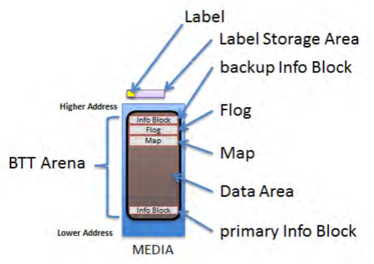
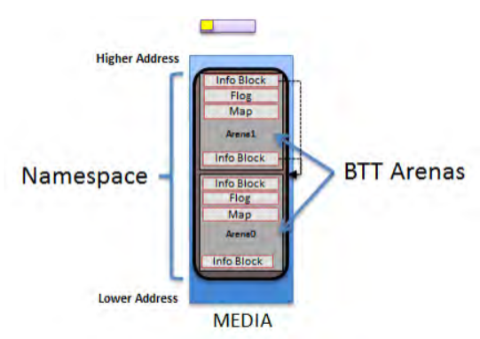
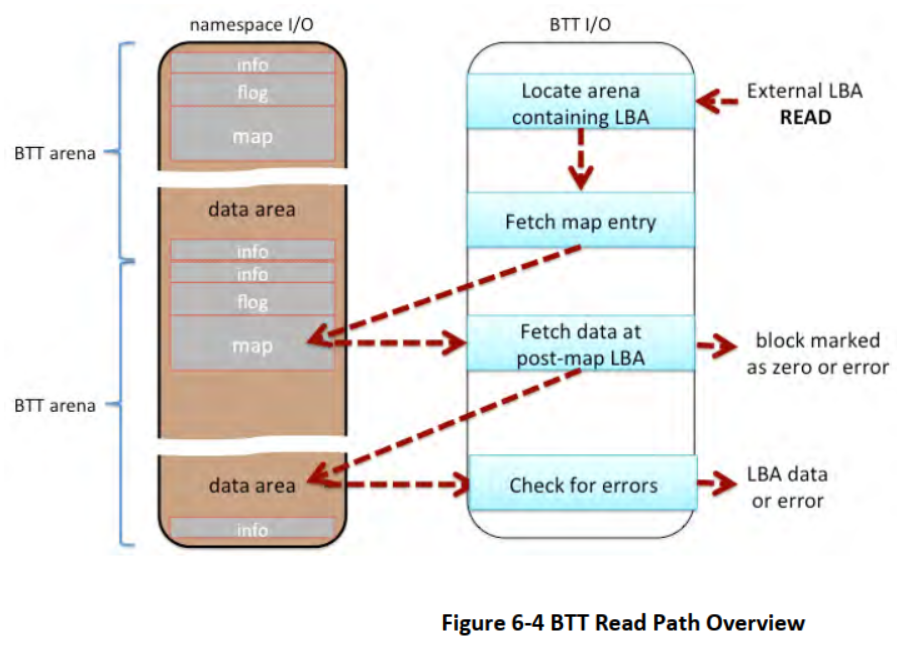
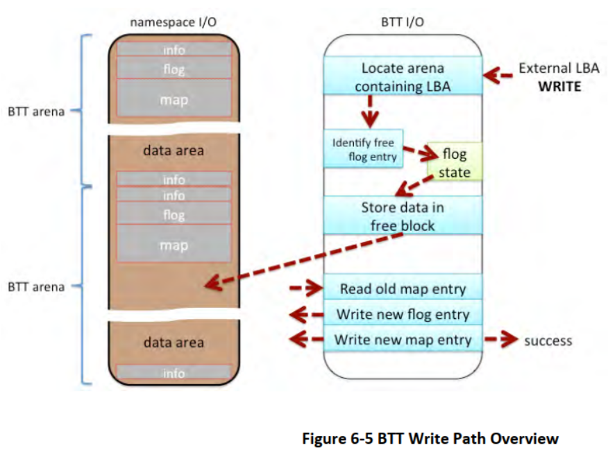

# 区块转换表（BTT）布局

本规范定义了块转换表（BTT）元数据布局。以下各小节概述了在媒体上使用的 BTT 格式，涉及的数据结构，以及对 SW 如何解释 BTT 布局的详细描述。

## 区块转换表（BTT）背景

命名空间定义了非易失性存储器的连续地址范围，概念上类似于 SCSI 逻辑单元（LUN）或 NVM Express 命名空间。

任何被用于块存储的命名空间都可能包含一个块转换表（BTT），这是一个布局和一组进行块 I/O 的规则，提供单一区块的电源故障写入原子性。传统的块状存储，包括硬盘和固态硬盘，通常会防止撕裂的扇区，也就是在断电中断时部分写入的扇区。现有的软件，主要是文件系统，依赖于这种行为，往往作者没有意识到这一点。为了使这种软件能够在支持块存储访问的命名空间上正常工作，本文定义的 BTT 布局将一个命名空间细分为一个或多个 BTT 区域 (TODO)，这些命名空间的大块区域包含了提供所需写入原子性的元数据。如图 6-1 和图 6-2 所示，这些 BTT A 中的每一个都包含一个元数据布局。



每个区域都包含图中所示的布局。BTT 区域中的 BTT 布局，主要信息块、数据区、地图、flog 和一个备份信息块。当命名空间大于 512G 时，BTT 布局需要多个区域，如图 6-2 所示。每个使用 BTT 的命名空间都被划分为尽可能多的 512G 的区域，然后是一个更小的区域，以包含任何适当的剩余空间。最小的区域大小为 16M，所以最后的区域大小应在 16M 和 512G 之间。任何小于 16M 的剩余空间都是未使用的。由于这些区域放置规则，软件可以定位每个主要信息块和每个备份信息块，而无需读取任何元数据，仅基于命名空间大小。



## 区块转换表（BTT）数据结构

以下各小节概述了与 BTT 布局相关的数据结构。

### BTT 信息块

```c
// Alignment of all BTT structures
#define EFI_BTT_ALIGNMENT           4096
#define EFI_BTT_INFO_UNUSED_LEN     3968
#define EFI_BTT_INFO_BLOCK_SIG_LEN  16

// Constants for Flags field
#define EFI_BTT_INFO_BLOCK_FLAGS_ERROR  0x00000001

// Constants for Major and Minor version fields
#define EFI_BTT_INFO_BLOCK_MAJOR_VERSION  2
#define EFI_BTT_INFO_BLOCK_MINOR_VERSION  0

typdef struct _EFI_BTT_INFO_BLOCK {
    CHAR8 Sig[EFI_BTT_INFO_BLOCK_SIG_LEN];
    EFI_GUID Uuid;
    EFI_GUID ParentUuid;
    UINT32 Flags;
    UINT16 Major;
    UINT16 Minor;
    UINT32 ExternalLbaSize;
    UINT32 ExternalNLba;
    UINT32 InternalLbaSize;
    UINT32 InternalNLba;
    UINT32 NFree;
    UINT32 InfoSize;
    UINT64 NextOff;
    UINT64 DataOff;
    UINT64 MapOff;
    UINT64 FlogOff;
    UINT64 InfoOff;
    CHAR8 Unused[EFI_BTT_INFO_UNUSED_LEN];
    UINT64 Checksum;
} EFI_BTT_INFO_BLOCK
```

**Sig**

BTT 索引块数据结构的签名。应为 `BTT_ARENA_INFO\0\0`。

**Uuid**

UUID 识别这个 BTT 实例。每次写入初始 BTT 区域时都会创建一个新的 UUID。这个值在一个命名空间的所有领域内的所有 BTT 信息块中应是相同的。

**ParentUuid**

包含命名空间的 UUID，在验证 BTT 信息块时使用，以确保 BTT 布局的这个实例是为当前周围的命名空间准备的，而不是从使用媒体相同区域的前一个命名空间遗留下来的。这个值在一个命名空间的所有领域内的所有 BTT 信息块中应是相同的。

**Flags**

该 BTT 信息块的布尔属性。参见下面关于标志的使用的补充说明。以下是定义的数值。
`EFI_BTT_INFO_BLOCK_FLAGS_ERROR` - BTT 区域处于错误状态。当 BTT 实现发现不一致的元数据或由于不可恢复的媒体错误而丢失的元数据等问题时，相关区域的错误位应被设置。关于`EFI_BTT_INFO_BLOCK_FLAGS_ERROR`的处理，请参见`BTT Theory of Operation`部分。

**Major**

主要版本号。目前为第 2 版。这个值在一个命名空间的所有区域内的所有 BTT 信息块中应是相同的。

**Minor**

次要版本号。目前为第 0 版。这个值在一个命名空间的所有区域内的所有 BTT 信息块中应是相同的。

**ExternalLbaSize**

公布的 LBA[^1]大小，以字节为单位。I/O请求应在这个大小的块中。这个值在一个命名空间的所有区域内的所有BTT信息块中应是相同的。
[^1]: LBA(logical block address):逻辑块地址

**ExternalNLba**

本区域中公布的 LBA 数量。这个字段的总和，在所有 BTT 区域中，是命名空间中可用 LBA 的总数。

**InternalLbaSize**

内部 LBA 大小应大于或等于 `ExternalLbaSize`，并且不应小于 512 字节。区域数据区的每个块都是这个大小的字节，并且正好包含一个数据块。可以选择，由于 LBA 之间的对齐填充，这可能大于`ExternalLbaSize`。这个值在一个命名空间的所有区域内的所有 BTT 信息块中应是相同的。

**InternalNLba**

区域数据区的内部块数。这应等于 `ExternalNLba + NFree`，因为每个内部 LBA 要么被映射到一个外部 LBA，要么在 flog(TODO) 中显示为自由。

**NFree**

为写到该区域而保持的空闲块的数量。`NFree`应等于`InternalNLba-ExternalNLba`。这个值在一个命名空间的所有区域内的所有 BTT 信息块中应是相同的。

**InfoSize**

该信息块的大小，以字节为单位。这个值在一个命名空间的所有区域内的所有 BTT 信息块中应是相同的。

**NextOff**

相对于这个区域的起点，下一个区域的偏移量。偏移量为 0 表示当前区域后面没有区域。提供这个字段是为了方便，因为每个区域的起点可以根据命名空间的大小来计算，如 `Theory of Operation – Validating BTT Arenas at start-up` 描述中所述。该值在一个区域内的主要和备用 BTT 信息块中应是相同的。

**DataOff**

相对于这个区域的起点，本区域的数据区域的偏移量。内部 LBA number zero(TODO) 指向这个偏移处。该值在一个区域内的主要和备用 BTT 信息块中应是相同的。

**MapOff**

相对于这个区域的起点，本区域的地图的偏移量。该值在一个区域内的主要和备用 BTT 信息块中应是相同的。

**FlogOff**

相对于这个区域的起点，本区域的 flog 偏移。该值在一个区域内的主要和备用 BTT 信息块中应是相同的。

**InfoOff**

相对于这个区域的起点，本区域信息块的备份副本的偏移量。该值在一个区域内的主要和备用 BTT 信息块中应是相同的。

**Reserved**

应为 0。

**Checksum**

所有字段`64-bit Fletcher64`的检查和。在计算校验和时，这个字段被认为是含有零。

**BTT Info Block Description**

一个有效的 BTT 信息块的存在被用来确定一个命名空间是否被用作 BTT 块设备。

每个 BTT 区域包含两个 BTT 信息块，主信息块复制到 BTT 区域的开始位置，地址偏移量为 0，最后是一个相同备份 BTT 信息块，位于区域中可用的最高块，以 `EFI_BTT_ALIGNMENT` 为边界对齐。当写入 BTT 布局时，实施方案为将信息块从最高区域写到最低区域，在写主信息块之前写出备份信息块和其他 BTT 数据结构。以这种方式写入布局应确保只有在整个布局被写入后才会检测到一个有效的 BTT 布局。

### BTT Map Entry

```c
typedef struct _EFI_BTT_MAP_ENTRY {
    UINT32 PostMapLba : 30;
    UINT32 Error : 1;
    UINT32 Zero : 1;
} EFI_BTT_MAP_ENTRY;
```

**PostMapLba**

映射后的 LBA 号码（该区域数据区的块号）

**Error**

当被设置且 Zero 未被设置时，对该块的读取会返回一个错误。对该块的写操作会清除该标志。

**Zero**

当设置和 Error 未设置时，对该块的读取会返回整块的零。对该块的写操作会清除该标志。

**BTT Map Description**

BTT Map 将索引到区域的 LBA 映射到其实际位置。BTT Map 在区域中的位置要尽可能高，在考虑到备用信息块和 flog（以及任何所需的排列）的空间后。术语*pre-map LBA*和*post-map LBA*被用来描述这种映射的输入和输出值。

**Error**(TODO) 和**Zero**(TODO) 比特位表示不能同时为真的条件，所以该组合用于表示一个正常的地图 map entry(TODO:地图条目)，其中没有错误或归零块的指示。只有当**Error**位被设置且**Zero**位被清除时，才会显示错误状态，零块条件的逻辑类似。当这两种情况都没有显示时，**Error**和**Zero**都被设置为表示 map entry(TODO) 处于正常、非错误状态。这就留下了**Error**和**Zero**都是零的情况，这也是 BTT 布局首次写入时所有 map entry(TODO) 的初始状态。两个位都为零意味着 map entry 包含初始身份映射，其中前映射 LBA 被映射到相同的后映射 LBA。以这种方式定义映射，允许实现方案为利用已知命名空间的初始内容为零的情况，在写布局时不需要写到映射。这可以大大改善布局时间，因为 map 是布局过程中写入的最大 BTT 数据结构。

### BTT Flog

```c
// Alignment of each flog structure
#define EFI_BTT_FLOG_ENTRY_ALIGNMENT  64
typedef struct _EFI_BTT_FLOG {
    UINT32 Lba0;
    UINT32 OldMap0;
    UINT32 NewMap0;
    UINT32 Seq0;
    UINT32 Lba1;
    UINT32 OldMap1;
    UINT32 NewMap1;
    UINT32 Seq1;
} EFI_BTT_FLOG
```

**Lba0**

最后一次使用此 flog entry(TODO) 写入 pre-map(TODO:预制图) 的 LBA。在更新 BTT map 以完成交易时，这个值被用作 BTT 地图的索引。

**OldMap0**

旧的 post-map(TODO)LBA。这是 map 中的旧 entry，当最后一次使用这个 flog entry(TODO) 的写入发生时。如果交易完成，这个 LBA 现在是与这个 flog entry(TODO) 相关的自由块。

**NewMap0**

新的 post-map(TODO)LBA。最后一次使用该 flog entry 的写发生时分配的块。根据定义，如果 BTT map entry 包含这个值，那么一个写交易就完成了。

**Seq0**

每个 flog entry 中的 Seq0 字段被用来确定两组字段中哪一组较新（Lba0, OldMap0, NewMpa0, Seq0 vs Lba1, Oldmap1, NewMap1, Seq1）。对 flog entry 的更新应总是在较早的一组字段集进行，并应谨慎执行，以便**Seq0**位仅在已知其他字段被提交到 persistence(TODO) 后才被写入。下图显示了**Seq0**位随时间变化的进程，较新的 entry 由较旧的数值的顺时针方向表示。


**Lba1**

备用 lba entry

**OldMap1**

替代旧 entry

**NewMap1**

备选新 entry

**Seq1**

替代序列 entry

**BTT Flog Description**

BTT Flog 如此命名是为了说明它既是一个自由列表，又是一个日志，被卷进了一个数据结构。Flog 的大小是由 BTT 信息块中的 **NFree** 字段决定的，它决定了有多少个这样的 flog entry。在考虑了备份信息块的空间和对齐要求后，flog 位置是场内的最高地址。

### BTT 数据区

从低位地址开始到高位，BTT 数据区在 BTT 信息块之后立即开始，一直延伸到 BTT Map 数据结构的开始。一个区域可以存储的内部数据块的数量是通过以下方式计算的：首先计算 BTT 信息块、地图和 flog（加上任何需要的对齐）所需的必要空间，从总的区域大小中减去这个数量，然后计算有多少块适合于所产生的空间。

### NVDIMM 标签协议地址抽象指南

这个版本的 BTT 布局和行为利用这个 GUID 由 `UEFI NVDIMM` 标签协议部分的 `AddressAbstractionGuid` 集体描述：

```c
#define EFI_BTT_ABSTRACTION_GUID \
    {0x18633bfc,0x1735,0x4217,
    {0x8a,0xc9,0x17,0x23,0x92,0x82,0xd3,0xf8}}
```

## BTT 操作理论

本节概述了 BTT 的操作理论，并描述了任何软件实现应遵循的责任。

BTT 布局的具体实例取决于命名空间的大小和在创建初始布局时的三个管理选择：

- **ExternalLbaSize**:所需的区块大小
  
- **InternalLbaSize**:块的大小与任何内部填充物

- **NFree**:布局所支持的并发写的数量

BTT 数据结构不支持小于 512 字节的**InternalLbaSize**，所以如果**ExternalLbaSize**小于 512 字节，**InternalLbaSize**应被四舍五入为 512。为了提高性能，**InternalLbaSize**可能还包括一些填充字节。例如，一个支持 520 字节块的 BTT 布局可以在内部使用 576 字节的块，以便将大小四舍五入到 64 字节高速缓存行大小的倍数。在这个例子中，对 BTT 软件上的软件来说，**ExternalLbaSize**将是 520 字节，但**InternalLbaSize**将是 576 字节。

一旦确定了上述这些管理选择，命名空间就会被划分为区域，如 BTT 区域部分所述，每个区域对**ExternalLbaSize**、**InternalLbaSize**和**Nfree**使用相同的值。

### BTT 区域

为了减少 BTT 元数据的大小，增加并发更新的可能性，命名空间中的 BTT 布局被划分为若干个区域。一个区域不能大于 512G 或小于 16M。一个命名空间被分为尽可能多的 512G 区域，从偏移量 0 开始，不需要填充就可以打包在一起，如果剩余的空间至少有 16M，那么后面还有一个小于 512G 的区域。如有必要，较小的区域大小将被四舍五入为`EFI_BTT_ALIGNMENT`的倍数。由于这些规则，命名空间中每个 BTT Arena 的位置和大小都可以从命名空间的大小中确定。

在一个区域内，用于 Flog 的空间量是每个 Flog entry 所需空间量的**NFree**倍。Flog entry 应在 64 字节的边界上对齐。

此外，完整的 BTT Flog 表应在**EFI_BTT_ALIGNMENT**边界上对齐，其大小被填充为**EFI_BTT_ALIGNMENT**的倍数。

```c
    FlogSize = roundup(NFree * roundup(sizeof(EFI_BTT_FLOG),
    EFI_BTT_FLOG_ENTRY_ALIGNMENT), EFI_BTT_ALIGNMENT)
```

在一个区域内，数据块和相关 Map 的可用空间是区域大小减去用于 BTT 信息块和 Flog 的空间。

```c
DataAndMapSize = ArenaSize – 2 * sizeof(EFI_BTT_INFO_BLOCK) - FlogSize
```

在一个区域内，数据块的数量是通过可用空间**DataAndMapSize**除以**InternalLbaSize**再加上每个块所需的 Map 开销来计算的，并对结果进行四舍五入以确保数据区在**EFI_BTT_ALIGNMENT**边界上对齐。

```c
InternalNLba = (DataAndMapSize – EFI_BTT_ALIGNMENT) / (InternalLbaSize +
sizeof(EFI_BTT_MAP_ENTRY)
```

在知道**InternalNLba**值的情况下，计算外部 LBA 的数量时要减去未公布的自由块池的**NFree**。

```c
ExternalNLba = InternalNLba – Nfree
```

在一个区域内，BTT Map 所需的字节数为每个外部 LBA 的一个 entry，加上为保持整个 Map**EFI_BTT_ALIGNMENT**对齐所需的任何对齐方式。

```c
MapSize = roundup(ExternalNLba * sizeof(EFI_BTT_MAP_ENTRY),
EFI_BTT_ALIGNMENT)
```

一个区域允许的并发写的数量是基于 BTT 布局时选择的**NFree**值。例如，选择 256 的**NFree**意味着 BTT 区域将有 256 个空闲块用于 inflight(TODO) 的写入操作。由于 BTT 区域中每个都有**NFree**空闲块，当有多个区域，且写入分散在多个区域之间时，一个命名空间允许的并发写入数量可能更大。

### 区域中数据块的原子性

BTT 的主要原因是为了在写入数据块时提供故障原子性，因此对单个数据块的任何写入都不会被断电等中断情况所撕裂。BTT 通过维护一个空闲块池来提供这种服务，这些空闲块不属于向 BTT 软件之上的软件层公布的容量。BTT 数据区足够大，可以容纳广告中的容量以及自由块池。BTT 软件将 BTT 数据区的块作为内部*LBAs*的列表进行管理，这些块的编号只在 BTT 软件内部可见。构成广告容量的块编号被称为外部*LBAs*，在任何给定的时间点，这些外部*LBAs*中的每一个都被 BTT Map 映射到 BTT 数据区中的一个块。BTT 软件所做的每一个区块写入都是从分配一个空闲区块开始，将数据写入其中，只有当该区块完全 persistent(TODO)（包括任何需要的刷新）时，才会采取步骤使该区块处于活动状态，如`BTT Theory of Operations – Write Path`部分所述。

BTT Flog（自由列表和日志的组合）是写块时原子更新的核心。在 BTT Flog 的 "安静 "状态下，当没有 in-flight(TODO) 中的写操作发生，也没有未完成的恢复步骤时，当前可用于写操作的**NFree**块包含在 Flog entries 的 OldMap 字段中。写入应使用这些 Flog entries 之一来寻找一个空闲的块来写入，然后 Flog 中的 Lba 和 NewMap 字段在写入的数据部分完成后被用作 BTT 地图更新的写前日志，如在`Validating the Flog at start-up`部分所述。

由 BTT 软件的运行时逻辑来确保一次只使用一个 Flog entry，并且在开始使用该区块的写之前，仍在执行 OldMap entry 所指示的区块上的任何读都已完成。

### BTT 数据结构的原子性

可字节寻址的 persistent media(TODO) 可能不支持大于 8 字节的原子更新，因此 BTT 中任何大于 8 字节的数据结构都使用软件实现的原子性进行更新。请注意，8 字节写的原子性，即 8 字节存储到 persistent media(TODO) 不会被中断，如断电，是使用本文件中描述的 BTT 的最低要求。

在 BTT 中，有四种数据结构：

- BTT 信息块

- BTT Map

- BTT Flog

- BTT 数据区

BTT Map entrys 的大小为 4 字节，因此可以用一条存储指令原子式地更新。所有其他的数据结构都是按照本文描述的规则进行更新的，首先更新数据结构的非活动版本，然后是使其原子化的步骤。

对于 BTT 信息块来说，原子性是通过总是先写备份信息块来提供的，只有在该更新完全 persistent(TODO) 之后（块的校验正确），主 BTT 信息块才会按照`Writing the initial BTT layout`部分的描述进行更新。

对于 BTT Flog，每个 entry 都是双倍大小，每个字段都有两个完整的副本（Lba, OldMap, NewMap, Seq）。活跃的 entry 有更高的序列号，所以更新总是写到不活跃的字段，一旦这些字段完全 persistent，不活跃的 entry 的 Seq 字段就会被更新，使其成为活跃的 entry，这是原子性的。这将在`Validating the Flog at start-up`一节中描述。

对于 BTT 数据区，所有的区块写入可以被认为是分配写入，其中一个不活动的区块是从 Flog 维护的空闲列表中选择的，只有在写入该区块的新数据完全 persistent 之后，该区块才会通过更新 Flog 和 Map entry，如`Write Path`部分所述，以原子方式变成活动的。

### 编写初始 BTT 布局

BTT 的整体布局依赖于这样一个事实：除了最后一个区域最小为 16MB 外，所有区域的大小都应是 512GiB。在一个 BTT 的生命周期中，初始化 BTT 的 on-media(TODO) 结构只发生一次，即在它被创建时。这个序列假设软件已经确定需要创建新的 BTT 布局，并且已知命名空间的总原始大小。

在创建一个新的 BTT 布局之前，周围命名空间的 UUID 可以被更新为新生成的 UUID。根据 BTT 软件实施的需要，这一可选的步骤具有使命名空间中任何先前的 BTT 信息块无效的效果，并确保在 BTT 布局创建过程被中断时检测到无效的布局。因为父 UUID 字段，所以这种检测是有效的。

BTT 布局中的 on-media(TODO) 结构可以按任何顺序写出，但 BTT 信息块除外，BTT 信息块应作为布局的最后一步写出，从最后一个 arena（命名空间中的最高偏移量）开始到第一个 arena（命名空间中的最低偏移量），首先在每个 arena 中写入备份 BTT 信息块，然后为该 arena 写入主 BTT 信息块。这允许在执行`Validating BTT Arenas at start-up`部分的算法时检测出不完整的 BTT 布局。

由于一个区域内部 LBA 数量超过了**NFree**的外部 LBA 数量，所以有足够的内部 LBA 数量来完全初始化 BTT Map 以及 BTT Flog，其中 BTT Flog 用**NFree**最高的内部 LBA 数量初始化，其余的用于 BTT Map。

每个竞技场中的 BTT Map 被初始化为零。地图中的零 entry 表示所有 pre-map 的 LBAs 与相应的 post-map 的 LBAs 的身份映射。这使用了所有的内部 LBA，只有**NFree**的 LBA，留下**Nfree**的 LBA 供 BTT Flog 使用。

每个区域的 BTT Flog 的初始化方法是：整个 flog 区域从所有的零开始，将每个 flog 条目中的 Lba0 字段设置为唯一的 pre-map LBA，从 0 到**Free-1**，每个 flog entry 中的**OldMap0**和**NewMap0**字段都设置为剩余的内部 LBA 之一。
例如，flog entry 0 会将 Lba0 设置为 0，**OldMap0**和**NewMap0**都设置为 Map 中没有代表的第一个内部 LBA（因为 Map 中存在**ExternalNLba**entry，下一个可用的内部 LBA 等于**ExternalNLba**）。

### 启动时验证 BTT 区域

当软件准备访问命名空间中的 BTT 布局时，第一步是检查 BTT Arenas 的一致性。读取和验证 BTT 区域时依赖于这样一个事实，即所有区域的大小应是 512GiB，除了最后一个竞技场是最小的 16MiB。

在软件认为 BTT 布局有效之前，必须通过以下测试：

- 对于每一个 BTT 区域
  
  - 读取和验证主 BTT 信息块
  
    - 如果对主 BTT 信息块读取失败，则转到读取和验证备份 BTT 信息块

    - 如果主 BTT 信息块包含一个不正确的**Sig**字段，则为无效，转到读取和验证备用的 BTT 信息块

    - 如果主 BTT 信息块的父级 Uuid 字段与周围命名空间的 UUID 不匹配，则转到读取和验证备用的 BTT 信息块

    - 如果主 BTT 信息块包含一个不正确的 Checksum(校验和)，则为无效，转到读取和验证备用的 BTT 信息块

    - 主 BTT 信息块有效。使用**NextOff**字段找到下一个区域的开始，继续 BTT 信息块的验证，转到读取和验证备用的 BTT 信息块

  - 读取和验证备份 BTT 信息块

    - 确定备份 BTT 信息块的位置

      1. 所有区域都应是完整的 512G 数据区大小，除了最后一个区域至少是 16MB

      2. 备份 BTT 信息块是区域中最后一个`EFI_BTT_ALIGNMENT`对齐的块

    - 如果在 BTT 区域的高地址上读取备份 BTT 信息块失败，neither copy could be read(则两个副本都无法读取)，软件应假定命名空间没有有效的 BTT 元数据布局
  
    - 如果备份的 BTT 信息块父级 Uuid 字段与周围命名空间的 UUID 不匹配，则为无效，软件应假定该命名空间没有有效的 BTT 元数据布局。
  
    - 如果备份的 BTT 信息块包含一个不正确的 Checksum(校验和)，则为无效，软件应假定命名空间没有有效的 BTT 元数据布局

    - 备份 BTT 信息块是有效的。由于主副本是坏的，软件应将有效的备份 BTT 信息块的内容复制到主 BTT 信息块中，然后才能成功地完成对所有区域的 BTT 信息块的验证

### 启动时验证 Flog Entry

在按照`Validating BTT Arenas at start-up`一节所述验证 BTT 信息块后，软件应采取的下一步是验证 BTT Flog entry。当数据块被写入时，如下面`Write Path`部分所述，persistent(持久的)Flog 和 Map 状态不会被更新，直到空闲块被写入新数据。将部分写入的数据保留在一个空闲的块中，这确保了数据传输过程中任何时候的电源故障都是无害的。一旦 Flog 被更新（通过 Flog entry 中的**Seq**位使之成为原子），写入算法就致力于更新，从写入流程中的这一点开始，电源故障应通过在恢复时完成对 BTT Map 的更新来处理。Flog 包含完成 Map entry 更新所需的所有信息。

请注意，这里概述的 Flog entry 的恢复是为了在不活动的 BTT 上单线程发生（在 BTT 块命名空间被允许接受 I/O 请求之前）。恢复所需的最大时间由**NFree**决定，但对于发现的每个不完整的写，只需要几次加载和一次存储（以及相应的缓存刷新）。

针对每个区域中的每个 flog entry 执行以下步骤，以恢复任何中断的写入，并验证 flog entry 在启动时是否一致。在这些步骤中发现的任何一致性问题都会导致为区域设置错误状态 (`EFI_BTT_INFO_BLOCK_FLAGS_ERROR`) 并终止该区域的 flog 验证过程。

1. 针对 flog entry 检查**Seq0**和**Seq1**字段。如果两个字段都为零，或者两个字段彼此相等，则 flog entry 不一致。否则，较高的 Seq 字段表明在接下来的步骤中使用哪一组 flog 字段 (**Lba0**, **OldMap0**, **NewMap0**与**Lba1**, **OldMap1**, **NewMap1**)。从本节的这一点开始，所选字段被称为**Lba**、**OldMap**和**NewMap**

2. 如果**OldMap**和**NewMap**相等，这就是一个自 BTT 的初始布局创建以来从未使用过的 Flog entry；

3. **Lba**字段被检查以确保它是一个有效的 pre-map(预映射) LBA（范围在 0 到**External NLba 1**）。如果检查失败，flog entry 就不一致了；

4. 获取对应 Flog entry Lba 字段中的 BTT Map Entry。由于 Map 中可包含特殊的 Zero Entry 以指示身份映射，因此当遇到零时，将获取的 Entry 调整为相应的内部 LBA（通过将 Entry 解释为与 Flog Entry LBA 字段相同的 LBA）；

5. 如果上一步调整后的 Map Entry 与 Flog Entry 中的 NewMap 字段不匹配，并且与 OldMap 字段匹配，则检测到 BTT Map 更新中断。恢复步骤是将 NewMap 字段写入 Flog entry Lba 字段索引的 BTT Map entry。

### 读取路径

以下高级序列描述了在使用 BTT 时读取单个数据块的步骤，如图所示：BTT 读取路径概述如下：

1. 如果在 Arena 的 BTT 信息块中设置了 `EFI_BTT_INFO_BLOCK_FLAGS_ERROR`，BTT 软件可能会返回读取错误，或者实现可能会选择继续提供只读访问并继续这些步骤；

2. 使用随读取操作提供的外部 LBA 来确定要访问的 BTT Arena。从第一个 Arena（命名空间中的最低偏移量）开始，依次循环遍历 Arena，BTT 信息块中的 **ExternalNLba**字段描述了该区域中有多少外部 LBA。一旦确定了正确的 Arena，就从提供的 LBA 中减去包含在较低、跳过的 Arena 中的外部 LBA，以获得所选 Arena 的 pre-map LBA；

3. 使用 pre-map LBA 索引到 Arena 的 BTT Map 并获取 Map Entry；

4. 如果在映射条目中设置了零位和错误位，则这表示正常 Entry。Map Entry 中的**PostMapLba**字段用于通过将其乘以**InternalLbaSize**并将结果添加到来自 Arena 的 BTT 信息块的 **DataOff** 字段来索引到 Arena 数据区域。这提供了数据在 Arena 中的位置，然后软件将**ExternalLbaSize**字节复制到提供的缓冲区中以满足读取请求;

5. 否则，如果仅在 Map Entry 中设置了错误位，则返回读取错误；

6. 否则，如果在 Map Entry 中仅设置了零位，则会将一块**ExternalLbaSize**字节的零复制到提供的缓冲区中以满足读取请求；

7. 最后，如果零位和错误位都被清除，这表示初始标识映射，并且 Pre-Map（预映射）LBA 用于通过将其乘以 **InternalLbaSize** 并将结果添加到竞技场 BTT 的 **DataOff**字段来索引到 Arena 数据区域信息块。这提供了数据在 Arena 中的位置，然后软件将 **ExternalLbaSize** 字节复制到提供的缓冲区中以满足读取请求。



### 写入路径

以下高级序列描述了在使用 BTT 时写入单个数据块的步骤，如下图所示：BTT 写入路径概述：

1. 如果在 Arena 的 BTT 信息块中设置了`EFI_BTT_INFO_BLOCK_FLAGS_ERROR`，则 BTT 软件将返回写入错误；

2. 使用随写入操作提供的外部 LBA 来确定要访问的 BTT Arena。从第一个 Arena（命名空间中的最小偏移）开始，依次循环遍历 Arena，BTT 信息块中的**ExternalNLba**字段描述了该区域中有多少外部 LBA。一旦识别出正确的 Arena，就从提供的 LBA 中减去包含在较低、跳过的 Arena 中的外部 LBA，以获得所选 Arena 的地图前 LBA。

3. BTT 软件在 Arena 中分配一个 Flog Entry 用于此写入。多个并发写入不能共享 Flog Entry。管理 Flog Entry 的独占使用的确切方法取决于 BTT 软件实现。媒体上没有关于 Flog Entry 当前是否分配给写入请求的指示。请注意，**OldMap** 字段中的 Flog Entry 跟踪的空闲块可能仍然有来自运行在其上的相对较慢的线程的读取。BTT 软件实施应确保在进行下一步之前已完成任何此类读取。

4. 在接下来的三个步骤中，锁定对与 Pre-Map（预映射）LBA 相关联的 BTT Map 区域的访问。锁定的粒度取决于实现；一个实现可以选择锁定单个 Map Entry、锁定整个 BTT Map 或介于两者之间的东西。

5. 使用 Pre-Map LBA 索引到 Arena 的 BTT Map 并获取旧地图 Entry。

6. 通过写入非活动的 Flog 字段集（较低的 Seq 编号）来更新 Flog Entry。首先，分别用 Pre-Map LBA、旧 Map Entry 和上面选择的空闲块更新 **LBA**、**OldMap** 和 **NewMap** 字段。一旦这些字段完全持久化（完成任何所需的刷新），Seq 字段就会更新，以使新字段处于活动状态。**Seq** 字段的此更新提交写入 - 在此更新之前，如果操作中断，则写入不应发生。在 **Seq** 字段更新后，即使操作中断，也应进行写入，因为下一步中的 Map 更新将在启动时发生的 BTT 恢复期间进行。

7. 使用上面选择的空闲块更新 Map Entry。

8. 删除在上述步骤 4 中获取的地图锁。写请求现在得到满足。


