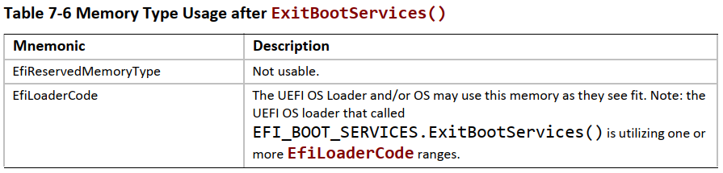
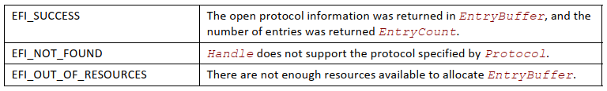
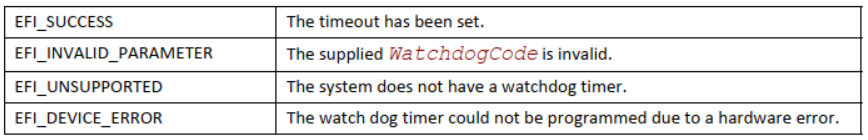

# 引导服务

本节讨论 UEFI 兼容系统中存在的基本引导服务。这些服务可由在 UEFI 环境中运行的代码使用的接口函数定义。此类代码可能包括管理设备访问或扩展平台功能的协议，以及在预引导环境中运行的应用程序和操作系统加载程序。

适用于合规系统的两种类型服务：

- 引导服务 (Boot Services)

在成功调用之前可用的函数 `EFI_BOOT_SERVICES.ExitBootServices()`。本节介绍了这些功能。

- 运行时服务 (Runtime Services)

在任何调用之前和之后可用的函数 `ExitBootServices()`。这些功能在第 8 节中描述。

在引导期间，系统资源归固件所有，并通过引导服务接口函数进行控制。这些功能可以被描述为“全局”或“基于句柄”。术语“全局”仅仅意味着一个函数访问系统服务并且在所有平台上都可用（因为所有平台都支持所有系统服务）。术语“基于句柄”是指函数访问一个特定设备或设备功能，并且可能在某些平台上不可用（因为某些设备在某些平台上不可用）。协议是动态创建的。本节讨论“全局”函数和运行时函数；后续章节讨论“基于句柄”。

UEFI 应用程序（包括 UEFI OS 加载程序）必须使用引导服务功能来访问设备和分配内存。进入时，Image 会提供一个指向系统表的指针，该系统表包含引导服务调度表和用于访问控制台的默认句柄。所有引导服务功能都是直到 UEFI OS 加载程序加载足够的自身环境以控制系统继续操作，然后通过调用 `ExitBootServices()` 终止引导服务。

原则上，`ExitBootServices()` 调用旨在供操作系统使用，以指示其加载程序已准备好承担对平台和所有平台资源管理的控制。因此，引导服务可用于协助 UEFI OS 加载程序准备引导操作系统。一旦 UEFI OS 加载程序控制系统并完成操作系统引导过程，就只能调用运行时服务。但是，UEFI OS 加载程序以外的代码可能会也可能不会选择调用 `ExitBootServices()`。这种选择可能部分取决于此类代码是否旨在继续使用引导服务或引导服务环境。

本节的其余部分将讨论各个功能。全局引导服务功能分为以下几类：

- 事件、计时器和任务优先级服务（Event, Timer, and Task Priority Services）（第 7.1 节)

- 内存分配服务 (Memory Allocation Services)(第 7.2 节)

- 协议处理程序服务 (Protocol Handler Services)(第 7.3 节)

- 镜像服务 (Image Services)(第 7.4 节)

- 杂项服务 (Miscellaneous Services)(第 7.5 节)

## 事件、计时器和任务优先级服务

构成事件、定时器和任务优先级服务的函数在预引导期间用于创建、关闭、发出信号和等待事件；设置定时器；并提高和恢复任务优先级。
见表 7-1。


引导服务环境中的执行发生在不同的任务优先级或 TPL [^1] 上。引导服务环境仅向 UEFI 应用程序和驱动程序公开其中三个级别：

[^1]: TPL(Task Priority Levels)：任务优先级

- TPL APPLICATION：最低优先级

- TPL CALLBACK：中等优先级

- TPL NOTIFY：最高优先级

以较高优先级执行的任务可能会中断以较低优先级执行的任务。例如，在 `TPL_NOTIFY` 级别运行的任务可能会中断在 `TPL_APPLICATION` 或 `TPL_CALLBACK` 级别运行的任务。而 `TPL_NOTIFY` 是暴露给引导服务的最高级别应用程序中，固件可能具有更高的任务优先级项目。例如，固件可能必须处理更高优先级的任务，如计时器滴答声（Timer Ticks）和内部设备。因此，有第四个 TPL，`TPL_HIGH_LEVEL`，专为固件使用而设计。

优先级的预期用途如表 7-2 所示，从最低级别 (`TPL_APPLICATION`) 到最高级别 (`TPL_HIGH_LEVEL`)。随着级别的增加，代码的持续时间和允许的阻塞量减少。执行通常发生在 `TPL_APPLICATION` 级别。作为触发事件通知功能的直接结果（这通常是由事件的信号引起的），执行发生在其他级别。在定时器中断期间，固件会在事件的“触发时间（Trigger Time）”到期时发出定时器事件信号。这允许事件通知功能中断较低优先级的代码以检查设备（例如）。通知功能可以根据需要通知其他事件。在所有未决事件通知函数执行后，在 `TPL_APPLICATION` 级别继续执行。


执行代码可以通过调用 `EFI_BOOT_SERVICES` 临时提高其优先级。`RaiseTPL()` 函数。这样做会屏蔽以相同或更低优先级运行的代码的事件通知，直到 `EFI_BOOT_SERVICES`。调用 `RestoreTPL()` 函数以将优先级降低到低于未决事件通知的级别。许多 UEFI 服务功能和协议接口功能可以执行的 TPL 级别存在限制。表 7-3 总结了这些限制。


**EFI_BOOT_SERVICES.CreateEvent()**

- 概要（Summary）

    创建一个事件。

- 原型（Prototype）

    ```c
    typedef EFI_STATUS (EFIAPI *EFI_CREATE_EVENT) (
        IN UINT32            Type,
        IN EFI_TPL           NotifyTpl,
        IN EFI_EVENT_NOTIFY  NotifyFunction, OPTIONAL
        IN VOID              *NotifyContext, OPTIONAL
        OUT EFI_EVENT        *Event
    );
    ```

- 参数（Parameters）

    *Type*：要创建的事件类型及其模式和属性。

    *NotifyTpl*：事件通知的任务优先级，如果需要。请参阅 `EFI_BOOT_SERVICES.RaiseTPL()`。

    *NotifyFunction*：指向事件通知函数的指针，如果有。

    *NotifyContext*：指向通知函数上下文的指针；对应通知函数中的参数 *Context*。

    *EventGroup*：指向此事件所属组的唯一标识符的指针。如果这是 `NULL`，那么函数的行为就好像参数被传递给了 `CreateEvent`。

    *Event*：如果调用成功，则指向新创建的事件；否则未定义。

- 相关定义（Related Definitions）

    ```c
    //*******************************************************
    // EFI_EVENT
    //*******************************************************
    typedef VOID *EFI_EVENT
    //*******************************************************
    // Event Types
    //*******************************************************
    // These types can be “ORed” together as needed – for example,
    // EVT_TIMER might be “Ored” with EVT_NOTIFY_WAIT or
    // EVT_NOTIFY_SIGNAL.
    #define EVT_TIMER                         0x80000000
    #define EVT_RUNTIME                       0x40000000
    #define EVT_NOTIFY_WAIT                   0x00000100
    #define EVT_NOTIFY_SIGNAL                 0x00000200
    #define EVT_SIGNAL_EXIT_BOOT_SERVICES     0x00000201
    #define EVT_SIGNAL_VIRTUAL_ADDRESS_CHANGE 0x60000202
    ```

    `EVT_TIMER`：该事件是一个计时器事件，可以传递给 `EFI_BOOT_SERVICES.SetTimer()`。请注意，计时器仅在引导服务期间起作用。

    `EVT_RUNTIME`：该事件是从运行时内存中分配的。如果要在调用 EFI_BOOT_SERVICES 后发出事件信号。`ExitBootServices()` 事件的数据结构和通知函数需要从运行时内存中分配。有关详细信息，请参阅 `SetVirtualAddressMap()`。

    `EVT_NOTIFY_WAIT`：如果此类型的事件尚未处于信号状态，则每当通过等待事件时，事件的 NotificationFunction 将在事件的 NotifyTpl 排队 `EFI_BOOT_SERVICES.WaitForEvent()` 或 `EFI_BOOT_SERVICES.CheckEvent()`。

    `EVT_NOTIFY_SIGNAL`：每当事件发出信号时，事件的 NotifyFunction 就会排队。

    `EVT_SIGNAL_EXIT_BOOT_SERVICES`：此事件的类型为 `EVT_NOTIFY_SIGNAL`。它不应与任何其他事件类型结合使用。此事件类型在功能上等同于 `EFI_EVENT_GROUP_EXIT_BOOT_SERVICES` 事件组。参考 `EFI_EVENT_GROUP_EXIT_BOOT_SERVICES` 事件组 `EFI_BOOT_SERVICES.CreateEventEx()` 部分中的描述下面的更多细节。

    `EVT_SIGNAL_VIRTUAL_ADDRESS_CHANGE`：执行 `SetVirtualAddressMap()` 时，系统将通知该事件。此事件类型是 `EVT_NOTIFY_SIGNAL`、`EVT_RUNTIME` 和 `EVT_RUNTIME_CONTEXT` 的组合，不应与任何其他事件类型组合。

    ```c
    //*******************************************************
    // EFI_EVENT_NOTIFY
    //*******************************************************
    typedef
    VOID
    (EFIAPI *EFI_EVENT_NOTIFY) (
        IN EFI_EVENT Event,
        IN VOID *Context
    );
    ```

    Event：正在调用其通知功能的事件。

    Context：指向通知函数上下文的指针，它依赖于实现。Context 对应于 `EFI_BOOT_SERVICES.CreateEventEx()` 中的 NotifyContext。

- 描述（Description）

    `CreateEvent()` 函数创建一个 `Type` 类型的新事件并将其返回到 `Event` 引用的位置。事件的通知函数、上下文和任务优先级分别由 `NotifyFunction``、NotifyContext` 和 `NotifyTpl` 指定。事件存在于两种状态之一，“等待”或“信号”。创建事件后，固件会将其置于“等待”状态。当事件发出信号时，固件将其状态更改为“已发出信号”，如果指定了 `EVT_NOTIFY_SIGNAL`，则将对其通知函数的调用置于 FIFO 队列中。在第 7.1 节（`TPL_CALLBACK` 和 `TPL_NOTIFY`）中定义的每个“基本”任务优先级都有一个队列。这些队列中的函数按 FIFO 顺序调用，从最高优先级队列开始，然后到当前 TPL 未屏蔽的最低优先级队列。如果当前 TPL 等于或大于排队的通知，它将等到通过 `EFI_BOOT_SERVICES.RestoreTPL()` 降低 TPL。

    一般来说，有两种“类型”的事件，同步和异步。异步事件与计时器密切相关，用于支持程序执行的周期性或定时中断。此功能通常用于设备驱动程序。例如，需要轮询新数据包存在的网络设备驱动程序可以创建一个类型包括 `EVT_TIMER` 的事件，然后调用 `EFI_BOOT_SERVICES。SetTimer()` 函数。定时器到期时，固件发出事件信号。

    同步事件与定时器没有特别的关系。相反，它们用于确保在调用特定接口函数之后发生某些活动。其中一个示例是需要执行的清理以响应对 `EFI_BOOT_SERVICES.ExitBootServices()` 的调用功能。`ExitBootServices()` 可以清理固件，因为它了解固件内部结构，但它不能代表已加载到系统中的驱动程序进行清理。驱动程序必须通过创建一个类型为 `EVT_SIGNAL_EXIT_BOOT_SERVICES` 且其通知函数是驱动程序本身内的函数的事件来自己执行此操作。然后，当 `ExitBootServices()` 完成清理时，它会向每个 `EVT_SIGNAL_EXIT_BOOT_SERVICES` 类型的事件发出信号。

    当 `EVT_SIGNAL_VIRTUAL_ADDRESS_CHANGE` 类型的事件与 `SetVirtualAddressMap()` 一起使用时，会发生使用同步事件的另一个示例。

    `EVT_NOTIFY_WAIT` 和 `EVT_NOTIFY_SIGNAL` 标志是互斥的。如果未指定任何标志，则调用者不需要任何有关事件的通知，并且 `NotifyTpl`、`NotifyFunction` 和 `NotifyContext` 参数将被忽略。如果指定了 `EVT_NOTIFY_WAIT` 并且事件未处于信号状态，则只要事件的使用者正在等待事件（通过 `EFI_BOOT_SERVICES.WaitForEvent()` 或 `EFI_BOOT_SERVICES.CheckEvent()`），`EVT_NOTIFY_WAIT` 通知函数就会排队。如果指定了 `EVT_NOTIFY_SIGNAL` 标志，那么只要发出事件信号，事件的通知函数就会排队。

    注：因为调用者不知道它的内部结构，所以调用者不能修改 `Event`。操作它的唯一方法是使用已发布的事件接口。

- 返回的状态码（Status Codes Returned）

    

**EFI_BOOT_SERVICES.CreateEventEx()**

- 概要（Summary）

    在组中创建事件。

- 原型（Prototype）

    ```c
    typedef EFI_STATUS (EFIAPI *EFI_CREATE_EVENT_EX) (
        IN UINT32            Type,
        IN EFI_TPL           NotifyTpl,
        IN EFI_EVENT_NOTIFY  NotifyFunction OPTIONAL,
        IN CONST VOID        *NotifyContext OPTIONAL,
        IN CONST EFI_GUID    *EventGroup OPTIONAL,
        OUT EFI_EVENT        *Event
    );
    ```

- 参数（Parameters）

    *Type*：要创建的事件类型及其模式和属性。

    *NotifyTpl*：事件通知的任务优先级（如果需要）。请参阅 `EFI_BOOT_SERVICES.RaiseTPL()`。

    *NotifyFunction*：指向事件通知函数的指针（如果有）。

    *NotifyContext*：指向通知函数上下文的指针；对应于通知函数中的参数 *Context*。

    *EventGroup*：指向此事件所属组的唯一标识符的指针。如果这是 `NULL`，那么函数的行为就好像参数被传递给了 `CreateEvent`。

    *Event*：如果调用成功，则指向新创建的事件；否则未定义。

- 描述（Description）

    `CreateEventEx` 函数创建一个 `Type` 类型的新事件，并将其返回到 `Event` 指示的指定位置。事件的通知函数、上下文和任务优先级分别由 `NotifyFunction`、`NotifyContext` 和 `NotifyTpl` 指定。该事件将被添加到由 `EventGroup` 标识的事件组中。

    事件组是由共享 `EFI_GUID` 标识的事件的集合，其中，当一个成员事件发出信号时，所有其他事件都会发出信号并执行它们各自的通知操作（如 `CreateEvent` 中所述）。保证在采取第一个通知操作之前发出所有事件。所有通知函数将按照其 `NotifyTpl` 指定的顺序执行。

    单个事件只能是单个事件组的一部分。可以使用 `CloseEvent` 从事件组中删除事件。

    事件的类型使用与 `CreateEvent` 中定义的值相同的值，除了 `EVT_SIGNAL_EXIT_BOOT_SERVICES` 和 `EVT_SIGNAL_VIRTUAL_ADDRESS_CHANGE` 无效。

    如果 `Type` 具有 `EVT_NOTIFY_SIGNAL` 或 `EVT_NOTIFY_WAIT`，则 `NotifyFunction` 必须为非空且 `NotifyTpl` 必须是有效的任务优先级。否则这些参数将被忽略。

    多个 `EVT_TIMER` 类型的事件可能是单个事件组的一部分。然而，没有机制可以确定哪个定时器被发送信号。

- 配置表组（Configuration Table Groups）

    配置表的 `GUID` 还定义了具有相同值的相应事件组 `GUID`。如果配置表表示的数据已更改，则应调用 `InstallConfigurationTable()`。调用 `InstallConfigurationTable()` 时，会发出相应的事件信号。当发出此事件的信号时，从配置表中缓存信息的任何组件都可以选择更新其缓存状态。

    例如，`EFI_ACPI_TABLE_GUID` 定义 ACPI 数据的配置表。更改 ACPI 数据时，将调用 `InstallConfigurationTable()`。在执行 `InstallConfigurationTable()` 的过程中，会发出带有 `EFI_ACPI_TABLE_GUID` 的相应事件组的信号，允许应用程序使任何缓存的 ACPI 数据无效。

- 预定义事件组（Pre-Defined Event Groups）

  本节介绍 UEFI 规范使用的预定义事件组。

    - `EFI_EVENT_GROUP_EXIT_BOOT_SERVICES`：在通知 `EFI_EVENT_GROUP_BEFORE_EXIT_BOOT_SERVICES` 事件组后调用 `ExitBootServices()` 时，系统会通知该事件组。此事件组在功能上等同于 `CreateEvent` 的 Type 参数的 `EVT_SIGNAL_EXIT_BOOT_SERVICES` 标志。此事件的通知功能必须符合以下要求：

        - 通知函数不允许使用内存分配服务，也不允许调用任何使用内存分配服务的函数，因为这些服务会修改当前的内存映射。注：由于服务的使用者不一定知道服务是否使用内存分配服务，这一要求实际上是将任何外部服务（在拥有通知功能的驱动程序之外实现的服务）的使用减少到执行有序过渡到运行时环境所需的绝对最低限度。使用外部服务可能会产生意想不到的结果。由于 UEFI 规范不保证任何给定的通知函数调用顺序，因此可以在提供服务的驱动程序的通知函数之前或之后调用使用服务的通知函数。因此，被通知函数调用的服务可能显示启动时行为或运行时行为（对于纯启动服务而言，这是未定义的）。

        - 通知函数不能依赖于定时器事件，因为定时器服务将在调用任何通知函数之前被停用。

    有关其他详细信息，请参阅下面的 `EFI_BOOT_SERVICES.ExitBootServices()`。

    - `EFI_EVENT_GROUP_BEFORE_EXIT_BOOT_SERVICES`：当在通知 `EFI_EVENT_GROUP_EXIT_BOOT_SERVICES` 事件组之前调用 `ExitBootServices()` 时，系统会通知此事件组。该事件提供了在引导环境中使用固件接口的最后机会。此事件的通知函数不得依赖于任何类型的延迟处理（在超出通知函数时间跨度的计时器回调中发生的处理），因为系统固件会在为此事件组调度处理程序后立即停用计时器服务。

    有关其他详细信息，请参阅下面的 `EFI_BOOT_SERVICES.ExitBootServices()`。

    - `EFI_EVENT_GROUP_VIRTUAL_ADDRESS_CHANGE`：当调用 `SetVirtualAddressMap()` 时，系统会通知此事件组。这在功能上等同于 `CreateEvent` 的 Type 参数的 `EVT_SIGNAL_VIRTUAL_ADDRESS_CHANGE` 标志。

    - `EFI_EVENT_GROUP_MEMORY_MAP_CHANGE`：当内存映射发生变化时，系统会通知该事件组。此事件的通知功能不应使用内存分配服务以避免重入复杂性。

    - `EFI_EVENT_GROUP_READY_TO_BOOT`：当引导管理器即将加载并执行引导选项时，系统会在通知 `EFI_EVENT_GROUP_AFTER_READY_TO_BOOT` 事件组之前通知此事件组。事件组提供了在将控制权传递给引导选项之前修改设备或系统配置的最后机会。

    - `EFI_EVENT_GROUP_AFTER_READY_TO_BOOT`：当引导管理器即将加载并执行引导选项时，系统会在通知 `EFI_EVENT_GROUP_READY_TO_BOOT` 事件组后立即通知该事件组。事件组提供了在将控制权传递给引导选项之前调查设备或系统配置的最后机会。

    - `EFI_EVENT_GROUP_RESET_SYSTEM`：当调用 `ResetSystem()` 并且系统即将重置时，系统会通知此事件组。仅在调用 `ExitBootServices()` 之前通知事件组。

- 相关定义（Related Definitions）

    `EFI_EVENT` 在 `CreateEvent` 中定义。

    `EVT_SIGNAL_EXIT_BOOT_SERVICES` 和 `EVT_SIGNAL_VIRTUAL_ADDRESS_CHANGE` 在 `CreateEvent` 中定义。

    ```c
    #define EFI_EVENT_GROUP_EXIT_BOOT_SERVICES
    {0x27abf055, 0xb1b8, 0x4c26, 0x80, 0x48, 0x74, 0x8f, 0x37, 0xba, 0xa2, 0xdf}

    #define EFI_EVENT_GROUP_BEFORE_EXIT_BOOT_SERVICES
    { 0x8be0e274, 0x3970, 0x4b44, { 0x80, 0xc5, 0x1a, 0xb9, 0x50, 0x2f, 0x3b, 0xfc } }

    #define EFI_EVENT_GROUP_VIRTUAL_ADDRESS_CHANGE
    {0x13fa7698, 0xc831, 0x49c7, 0x87, 0xea, 0x8f, 0x43, 0xfc, 0xc2, 0x51, 0x96}

    #define EFI_EVENT_GROUP_MEMORY_MAP_CHANGE
    {0x78bee926, 0x692f, 0x48fd, 0x9e, 0xdb, 0x1, 0x42, 0x2e, 0xf0, 0xd7, 0xab}

    #define EFI_EVENT_GROUP_READY_TO_BOOT
    {0x7ce88fb3, 0x4bd7, 0x4679, 0x87, 0xa8, 0xa8, 0xd8, 0xde, 0xe5,0xd, 0x2b}

    #define EFI_EVENT_GROUP_AFTER_READY_TO_BOOT 
    { 0x3a2a00ad, 0x98b9, 0x4cdf, { 0xa4, 0x78, 0x70, 0x27, 0x77, 0xf1, 0xc1, 0xb } }

    #define EFI_EVENT_GROUP_RESET_SYSTEM
    { 0x62da6a56, 0x13fb, 0x485a, { 0xa8, 0xda, 0xa3, 0xdd, 0x79, 0x12, 0xcb, 0x6b } }
    ```

- 返回的状态码（Status Codes Returned）

    

**EFI_BOOT_SERVICES.CloseEvent()**

- 概要（Summary）

    关闭一个事件。

- 原型（Prototype）

    ```c
    typedef EFI_STATUS (EFIAPI *EFI_CLOSE_EVENT) (
        IN EFI_EVENT Event
    );
    ```

- 参数（Parameter）

    *Event*：要关闭的事件。`EFI_EVENT` 类型在 `CreateEvent()` 函数描述中定义。

- 描述（Description）

    `CloseEvent()` 函数删除调用者对事件的引用，将其从它所属的任何事件组中删除，然后关闭它。一旦事件关闭，该事件就不再有效，并且不能用于任何后续函数调用。如果 `Event` 已使用 `RegisterProtocolNotify()` 注册，则 `CloseEvent()` 将删除相应的注册。在相应的通知函数中调用 `CloseEvent()` 是安全的。

- 返回的状态码（Status Codes Returned）

    

**EFI_BOOT_SERVICES.SignalEvent()**

- 概要（Summary）

    发出事件信号。

- 原型（Prototype）

    ```c
    typedef EFI_STATUS (EFIAPI *EFI_SIGNAL_EVENT) (
        IN EFI_EVENT Event
    );
    ```

- 参数（Parameters）

    *Event*：要发出信号的事件。`EFI_EVENT` 类型在 `EFI_BOOT_SERVICES.CheckEvent()` 函数描述中定义。

- 描述（Description）

    提供的事件被置于信号状态。如果 `Event` 已经处于信号状态，则返回 `EFI_SUCCESS`。如果 `Event` 是 `EVT_NOTIFY_SIGNAL` 类型，那么事件的通知函数被安排在事件的通知任务优先级调用。`SignalEvent()` 可以从任何任务优先级调用。如果提供的事件是事件组的一部分，则事件组中的所有事件也会被发送信号，并且它们的通知功能会被调度。当向事件组发送信号时，可以在组中创建一个事件，向它发出信号，然后关闭该事件以将其从组中删除。

    例如：

    ```c
    EFI_EVENT Event;
    EFI_GUID gMyEventGroupGuid = EFI_MY_EVENT_GROUP_GUID;
    gBS->CreateEventEx (
        0,
        0,
        NULL,
        NULL,
        &gMyEventGroupGuid,
        &Event
    );

    gBS->SignalEvent (Event);
    gBS->CloseEvent (Event);
    ```

- 返回的状态码（Status Codes Returned）

    

**EFI_BOOT_SERVICES.WaitForEvent()**

- 概要（Summary）

    停止执行，直到发出事件信号

- 原型（Prototype）

    ```c
    typedef EFI_STATUS (EFIAPI *EFI_WAIT_FOR_EVENT) (
        IN UINTN      NumberOfEvents,
        IN EFI_EVENT  *Event,
        OUT UINTN     *Index
    );
    ```

- 参数（Parameters）

    *NumberOfEvents*：事件数组中的事件数。

    *Event*：`EFI_EVENT` 数组。`EFI_EVENT` 类型在 `CreateEvent()` 函数描述中定义。

    *Index*：指向满足等待条件的事件索引的指针。

- 描述（Description）

    必须在优先级 `TPL_APPLICATION` 调用此函数。如果尝试以任何其他优先级调用它，则返回 `EFI_UNSUPPORTED`。

    `Event` 数组中的事件列表按从第一个到最后一个的顺序进行评估，并重复此评估，直到发出事件信号或检测到错误。对 `Event` 数组中的每个事件执行以下检查。

    - 如果事件的类型为 `EVT_NOTIFY_SIGNAL`，则返回 `EFI_INVALID_PARAMETER`，`Index` 指示导致失败的事件。

    - 如果事件处于信号状态，则清除信号状态并返回 `EFI_SUCCESS`，并且 `Index` 指示已发出信号的事件。

    - 如果一个事件不处于信号状态但确实具有通知功能，则通知功能将在事件的通知任务优先级排队。如果事件的通知函数的执行导致事件发出信号，则清除信号状态，返回 `EFI_SUCCESS`，`Index` 指示发出信号的事件。

    要等待指定的时间，必须在 Event 数组中包含一个计时器事件。

    要检查一个事件是否在没有等待的情况下发出信号，可以将已发出信号的事件用作列表中的最后一个事件，或者可以使用 `CheckEvent()` 接口。

- 返回的状态码（Status Codes Returned）

    

**EFI_BOOT_SERVICES.CheckEvent()**

- 概要（Summary）

    检查事件是否处于信号状态。

- 原型（Prototype）

    ```c
    typedef EFI_STATUS (EFIAPI *EFI_CHECK_EVENT) (
        IN EFI_EVENT Event
    );
    ```

- 参数（Parameters）

    *Event*：要检查的事件。`EFI_EVENT` 类型在 `CreateEvent()` 函数描述中定义。

- 描述（Description）

    `CheckEvent()` 函数检查事件是否处于信号状态。如果 `Event` 是 `EVT_NOTIFY_SIGNAL` 类型，则返回 `EFI_INVALID_PARAMETER`。否则，有三种可能：

    - 如果 `Event` 处于信号状态，则将其清除并返回 `EFI_SUCCESS`。

    - 如果 `Event` 不处于信号状态且没有通知功能，则返回 `EFI_NOT_READY`。

    - 如果 `Event` 不处于信号状态但确实具有通知功能，则通知功能在事件的通知任务优先级排队。如果通知函数的执行导致 `Event` 被发出信号，则清除发出信号的状态并返回 `EFI_SUCCESS`；如果未发出事件信号，则返回 `EFI_NOT_READY`。

- 返回的状态码（Status Codes Returned）

    

**EFI_BOOT_SERVICES.SetTimer()**

- 概要（Summary）

    设置定时器类型和定时器事件的触发时间。

- 原型（Prototype）

    ```c
    typedef EFI_STATUS (EFIAPI *EFI_SET_TIMER) (
        IN EFI_EVENT        Event,
        IN EFI_TIMER_DELAY  Type,
        IN UINT64           TriggerTime
    );
    ```

- 参数（Parameters）

    *Event*：要在指定时间发出信号的计时器事件。`EFI_EVENT` 类型在 `CreateEvent()` 函数描述中定义。

    *Type*：在 *TriggerTime* 中指定的时间类型。请参阅“相关定义”中的定时器延迟类型。

    *TriggerTime*：计时器到期前的 100ns 单位数。*TriggerTime* 为 0 是合法的。如果 Type 为 `TimerRelative` 且 *TriggerTime* 为 0，则计时器事件将在下一个计时器滴答时发出信号。如果 Type 为 `TimerPeriodic` 且 *TriggerTime* 为 0，则计时器事件将在每个计时器滴答时发出信号。

- 相关定义（Related Definitions）

    ```c
    //*******************************************************
    //EFI_TIMER_DELAY
    //*******************************************************
    typedef enum {
        TimerCancel,
        TimerPeriodic,
        TimerRelative
    } EFI_TIMER_DELAY;

    TimerCancel：取消事件的定时器设置，不设置定时器触发。取消计时器时将忽略 TriggerTime。

    TimerPeriodic：该事件将从当前时间开始以 TriggerTime 间隔周期性地发出信号。这是唯一一个不需要为每个通知重置事件计时器的计时器触发器类型。所有其他计时器触发类型都是“一次性”。

    TimerRelative：该事件将以 TriggerTime 100ns 为单位发出信号。
    ```

- 描述（Description）

    `SetTimer()` 函数取消该事件之前的任何时间触发设置，并为该事件设置新的触发时间。此函数只能用于 `EVT_TIMER` 类型的事件。

- 返回的状态码（Status Codes Returned）

    

**EFI_BOOT_SERVICES.RaiseTPL()**

- 概要（Summary）

    提高任务的优先级并返回其先前的级别。

- 原型（Prototype）

    ```c
    typedef
    EFI_TPL
    (EFIAPI *EFI_RAISE_TPL) (
        IN EFI_TPL NewTpl
    );
    ```

- 参数（Parameters）

    *NewTpl*：新的任务优先级。它必须大于或等于当前任务优先级。请参阅“相关定义”。

- 相关定义（Related Definitions）

    ```c
    //*******************************************************
    // EFI_TPL
    //*******************************************************
    typedef UINTN EFI_TPL

    //*******************************************************
    // Task Priority Levels
    //*******************************************************
    #define TPL_APPLICATION  4
    #define TPL_CALLBACK     8
    #define TPL_NOTIFY       16
    #define TPL_HIGH_LEVEL   31
    ```

- 描述（Description）

    `EFI_BOOT_SERVICES.RaiseTPL()` 函数提高当前执行任务的优先级并返回其先前的优先级。在启动服务执行期间，只有三个任务优先级暴露在固件之外。第一个是 `TPL_APPLICATION`，所有正常执行都会发生。该级别可能会被中断以执行各种异步中断样式通知，这些通知发生在 `TPL_CALLBACK` 或 `TPL_NOTIFY` 级别。通过将任务优先级提高到 `TPL_NOTIFY`，此类通知将被屏蔽，直到任务优先级恢复，从而与此类通知同步执行。同步阻塞 I/O 函数在 `TPL_NOTIFY` 处执行。`TPL_CALLBACK` 通常用于应用程序级通知功能。设备驱动程序通常将 `TPL_CALLBACK` 或 `TPL_NOTIFY` 用于其通知功能。应用程序和驱动程序也可以使用 `TPL_NOTIFY` 来保护代码关键部分中的数据结构。

    调用者必须在返回之前使用 `EFI_BOOT_SERVICES.RestoreTPL()` 将任务优先级恢复到之前的级别。

    注：如果 `NewTpl` 低于当前 `TPL` 级别，则系统行为是不确定的。此外，只能使用 `TPL_APPLICATION`、`TPL_CALLBACK`、`TPL_NOTIFY` 和 `TPL_HIGH_LEVEL`。所有其他值保留供固件使用；使用它们将导致不可预测的行为。良好的编码习惯要求所有代码都应在其可能的最低 TPL 级别执行，并且必须尽量减少使用高于 `TPL_APPLICATION` 的 TPL 级别。长时间在高于 `TPL_APPLICATION` 的 TPL 级别执行也可能导致不可预知的行为。

- 返回的状态码（Status Codes Returned）

    与其他 `UEFI` 接口函数不同，`EFI_BOOT_SERVICES.RaiseTPL()` 不返回状态码。相反，它返回先前的任务优先级，稍后将通过对 `RestoreTPL()` 的匹配调用来恢复该优先级。

**EFI_BOOT_SERVICES.RestoreTPL()**

- 概要（Summary）

    将任务的优先级恢复到之前的值。

- 原型（Prototype）

    ```c
    typedef
    VOID
    (EFIAPI *EFI_RESTORE_TPL) (
        IN EFI_TPL OldTpl
    )
    ```

- 参数（Parameters）

    *OldTpl*：要恢复的上一个任务优先级（来自上一个匹配调用 `EFI_BOOT_SERVICES.RaiseTPL()` 的值）。`EFI_TPL` 类型在 `RaiseTPL()` 函数描述中定义。

- 描述（Description）

    `RestoreTPL()` 函数将任务的优先级恢复到之前的值。对 `RestoreTPL()` 的调用与对 `RaiseTPL()` 的调用相匹配。

    注：如果 `OldTpl` 高于当前 TPL 级别，则系统行为是不确定的。此外，只能使用 `TPL_APPLICATION`、`TPL_CALLBACK`、`TPL_NOTIFY` 和 `TPL_HIGH_LEVEL`。所有其他值保留供固件使用；使用它们将导致不可预测的行为。良好的编码习惯要求所有代码都应在其可能的最低 TPL 级别执行，并且必须尽量减少使用高于 `TPL_APPLICATION` 的 TPL 级别。长时间在高于 `TPL_APPLICATION` 的 TPL 级别执行也可能导致不可预知的行为。

- 返回的状态码（Status Codes Returned）

    None；

## 内存分配服务

组成内存分配服务的函数在预引导期间用于分配和释放内存，以及获取系统的内存映射。请参见表 7-4。


这些函数的使用方式与 UEFI 内存设计的一个重要特性直接相关。此功能规定 EFI 固件在预引导期间拥有系统的内存映射，具有三个主要后果：

- 在预引导期间，所有组件（包括执行 EFI 镜像）必须与固件配合使用函数 `EFI_BOOT_SERVICES.AllocatePages()`、`EFI_BOOT_SERVICES.AllocatePool()`、`EFI_BOOT_SERVICES.FreePages()` 和 `EFI_BOOT_SERVICES.FreePool()`。

- 在预引导期间，正在执行的 EFI 镜像必须只使用它已分配的内存。

- 在执行的 EFI 镜像退出并将控制权返回给固件之前，它必须释放已明确分配的所有资源。这包括所有内存页面、池分配、打开的文件句柄等。卸载镜像时，固件会释放固件为加载镜像而分配的内存。当调用这些函数时，固件会动态维护内存映射。

本规范描述了由服务分配的大量内存缓冲区，调用者负责释放分配的内存。除非在本规范中另有说明，否则假定此类内存缓冲区由 `AllocatePool()` 分配并由 `FreePool()` 释放。

分配内存时，根据 `EFI_MEMORY_TYPE` 中的值对其进行“类型化”（参见 `EFI_BOOT_SERVICES.AllocatePages()` 的描述）。在调用 `EFI_BOOT_SERVICES.ExitBootServices()` 之前，某些类型的用法与调用之后的用法不同。表 7-5 列出了每种类型及其调用前的用法；表 7-6 列出了每种类型及其调用后的用法。系统固件必须遵循 EFI 内存映射布局中第 2.3.2 节和第 2.3.4 节中概述的处理器特定规则，以使操作系统能够进行所需的虚拟映射。


注：在 Itanium-based(TODO) 的平台的体系结构中只定义了一个类型为 `EfiMemoryMappedIoPortSpace` 的区域。因此，在 Itanium-based(TODO) 的平台的 EFI 内存映射中应该只有一个类型为 `EfiMemoryMappedIoPortSpace` 的区域。




注：调用 `ExitBootServices()` 的镜像（即 UEFI OS Loader）首先调用 `EFI_BOOT_SERVICES.GetMemoryMap()` 以获取当前内存映射。在 `ExitBootServices()` 调用之后，镜像隐含地拥有映射中所有未使用的内存。这包括内存类型 `EfiLoaderCode`、`EfiLoaderData`、`EfiBootServicesCode`、`EfiBootServicesData` 和 `EfiConventionalMemory`。UEFI OS Loader 和 OS 必须保留标记为 `EfiRuntimeServicesCode` 和 `EfiRuntimeServicesData` 的内存。

**EFI_BOOT_SERVICES.AllocatePages()**

- 概要（Summary）

    从系统分配内存页。

- 原型（Prototype）

    ```c
    typedef EFI_STATUS (EFIAPI *EFI_ALLOCATE_PAGES) (
        IN EFI_ALLOCATE_TYPE         Type,
        IN EFI_MEMORY_TYPE           MemoryType,
        IN UINTN                     Pages,
        IN OUT EFI_PHYSICAL_ADDRESS  *Memory
    );
    ```

- 参数（Parameters）

    *Type*：要执行的分配类型。请参阅“相关定义”。

    *MemoryType*：要分配的内存类型。`EFI_MEMORY_TYPE` 类型在下面的“相关定义”中定义。表 7-5 和表 7-6 中也更详细地描述了这些存储器类型。正常分配（即任何 UEFI 应用程序的分配）的类型为 `EfiLoaderData`。`0x70000000..0x7FFFFFFF` 范围内的 *MemoryType* 值保留供 OEM 使用。`0x80000000..0xFFFFFFFF` 范围内的 *MemoryType* 值保留供操作系统供应商提供的 UEFI OS 加载程序使用。

    *Pages*：要分配的连续 4 KiB 页面的数量。

    *Memory*：指向物理地址的指针。在输入时，地址的使用方式取决于 *Type* 的值。有关详细信息，请参阅“说明”。在输出时，地址被设置为分配的页面范围的基础。请参阅“相关定义”。

    注：UEFI 应用程序、UEFI 驱动程序和 UEFI 操作系统加载程序不得分配 `EfiReservedMemoryType`、`EfiMemoryMappedIO` 和 `EfiUnacceptedMemoryType` 类型的内存。

- 相关定义（Related Definitions）

    ```c
    //*******************************************************
    //EFI_ALLOCATE_TYPE
    //*******************************************************
    // These types are discussed in the “Description” section below.
    typedef enum {
        AllocateAnyPages,
        AllocateMaxAddress,
        AllocateAddress,
        MaxAllocateType
    } EFI_ALLOCATE_TYPE;

    //*******************************************************
    //EFI_MEMORY_TYPE
    //*******************************************************
    // These type values are discussed in Table 7-5 and Table 7-6.
    typedef enum {
        EfiReservedMemoryType,
        EfiLoaderCode,
        EfiLoaderData,
        EfiBootServicesCode,
        EfiBootServicesData,
        EfiRuntimeServicesCode,
        EfiRuntimeServicesData,
        EfiConventionalMemory,
        EfiUnusableMemory,
        EfiACPIReclaimMemory,
        EfiACPIMemoryNVS,
        EfiMemoryMappedIO,
        EfiMemoryMappedIOPortSpace,
        EfiPalCode,
        EfiPersistentMemory,
        EfiUnacceptedMemoryType
        EfiMaxMemoryType
    } EFI_MEMORY_TYPE;

    //*******************************************************
    //EFI_PHYSICAL_ADDRESS
    //*******************************************************
    typedef UINT64 EFI_PHYSICAL_ADDRESS;
    ```

- 描述（Description）

    `AllocatePages()` 函数分配请求的页数，并返回一个指针，该指针指向 *Memory* 引用的位置中的页范围的基地址。该函数扫描内存映射以定位空闲页面。当它发现一个物理上连续的页面块足够大并且也满足 *Type* 的分配要求时，它会更改内存映射以指示页面现在是 *MemoryType* 类型。

    通常，UEFI OS 加载程序和 UEFI 应用程序应分配 `EfiLoaderData` 类型的内存（和池）。UEFI 引导服务驱动程序必须分配 `EfiBootServicesData` 类型的内存（和池）。UREFI 运行时驱动程序应该分配类型为 `EfiRuntimeServicesData` 的内存（和池）（尽管这种分配只能在启动服务期间进行）。

    `AllocateAnyPages` 类型的分配请求分配满足请求的任何可用页面范围。在输入时，*Memory* 指向的地址被忽略。

    `AllocateMaxAddress` 类型的分配请求分配任何可用范围的页面，其最高地址小于或等于输入时 *Memory* 指向的地址。

    `AllocateAddress` 类型的分配请求在输入时 *Memory* 指向的地址分配页面。

    注：不针对特定实现的 UEFI 驱动程序和 UEFI 应用程序必须使用 `AllocateAnyPages` 地址模式为以下运行时类型执行内存分配：

    ```c
    EfiACPIReclaimMemory,

    EfiACPIMemoryNVS,

    EfiRuntimeServicesCode,

    EfiRuntimeServicesData,

    EfiReservedMemoryType.
    ```

- 返回的状态码（Status Codes Returned）

    

**EFI_BOOT_SERVICES.FreePages()**

- 概要（Summary）

    释放内存页面。

- 原型（Prototype）

    ```c
    typedef EFI_STATUS (EFIAPI *EFI_FREE_PAGES) (
        IN EFI_PHYSICAL_ADDRESS  Memory,
        IN UINTN                 Pages
    );
    ```

- 参数（Parameters）

    *Memory*：要释放的页面的基本物理地址。`EFI_PHYSICAL_ADDRESS` 类型在 `EFI_BOOT_SERVICES.AllocatePages()` 函数描述中定义。

    *Pages*：要释放的连续 4 KiB 页面的数量。

- 描述（Description）

    `FreePages()` 函数将 `AllocatePages()` 分配的内存返回给固件。

- 返回的状态码（Status Codes Returned）

    

**EFI_BOOT_SERVICES.GetMemoryMap()**

- 概要（Summary）

    返回当前的内存映射。

- 原型（Prototype）

    ```c
    typedef EFI_STATUS (EFIAPI *EFI_GET_MEMORY_MAP) (
        IN OUT UINTN               *MemoryMapSize,
        OUT EFI_MEMORY_DESCRIPTOR  *MemoryMap,
        OUT UINTN                  *MapKey,
        OUT UINTN                  *DescriptorSize,
        OUT UINT32                 *DescriptorVersion
    );
    ```

- 参数（Parameters）

    *MemoryMapSize*：指向 *MemoryMap* 缓冲区大小（以字节为单位）的指针。在输入时，这是调用者分配的缓冲区的大小。在输出时，如果缓冲区足够大，则为固件返回的缓冲区大小；如果缓冲区太小，则为包含映射所需的缓冲区大小。

    *MemoryMap*：指向固件放置当前内存映射的缓冲区的指针。该映射是一个 `EFI_MEMORY_DESCRIPTOR` 数组。请参阅“相关定义”。

    *MapKey*：指向固件返回当前内存映射密钥的位置的指针。

    *DescriptorSize*：指向固件返回单个 `EFI_MEMORY_DESCRIPTOR` 大小（以字节为单位）的位置的指针。

    *DescriptorVersion*：指向固件返回与 `EFI_MEMORY_DESCRIPTOR` 关联的版本号的位置的指针。请参阅“相关定义”。

- 相关定义（Related Definitions）

    ```c
    //*******************************************************
    //EFI_MEMORY_DESCRIPTOR
    //*******************************************************
    typedef struct {
        UINT32                Type;
        EFI_PHYSICAL_ADDRESS  PhysicalStart;
        EFI_VIRTUAL_ADDRESS   VirtualStart;
        UINT64                NumberOfPages;
        UINT64                Attribute;
    } EFI_MEMORY_DESCRIPTOR;
    ```

    *Type*：内存区域的类型。`EFI_MEMORY_TYPE` 类型在 `AllocatePages()` 函数描述中定义。

    *PhysicalStart*：内存区域中第一个字节的物理地址。`PhysicalStart` 必须在 4 KiB 边界上对齐，并且不得高于 `0xfffffffffffff000`。`EFI_PHYSICAL_ADDRESS` 类型在 `AllocatePages()` 函数描述中定义。

    *VirtualStart*：内存区域中第一个字节的虚拟地址。`VirtualStart` 必须在 4 KiB 边界上对齐，并且不得高于 `0xfffffffffffff000`。`EFI_VIRTUAL_ADDRESS` 类型在“相关定义”中定义。

    *NumberOfPages*：内存区域中 4 KiB 页的数量。`NumberOfPages` 不能为 0，并且不能是任何可以表示内存页的起始地址（物理或虚拟）大于 `0xfffffffffffff000` 的值。

    *Attribute*：描述该内存区域功能位掩码的内存区域属性，不一定是该内存区域的当前设置。请参阅以下“内存属性定义”。

    ```c
    //*******************************************************
    // Memory Attribute Definitions
    //*******************************************************
    // These types can be “ORed” together as needed.
    #define EFI_MEMORY_UC             0x0000000000000001
    #define EFI_MEMORY_WC             0x0000000000000002
    #define EFI_MEMORY_WT             0x0000000000000004
    #define EFI_MEMORY_WB             0x0000000000000008
    #define EFI_MEMORY_UCE            0x0000000000000010
    #define EFI_MEMORY_WP             0x0000000000001000
    #define EFI_MEMORY_RP             0x0000000000002000
    #define EFI_MEMORY_XP             0x0000000000004000
    #define EFI_MEMORY_NV             0x0000000000008000
    #define EFI_MEMORY_MORE_RELIABLE  0x0000000000010000
    #define EFI_MEMORY_RO             0x0000000000020000
    #define EFI_MEMORY_SP             0x0000000000040000
    #define EFI_MEMORY_CPU_CRYPTO     0x0000000000080000
    #define EFI_MEMORY_RUNTIME        0x8000000000000000
    ```

    `EFI_MEMORY_UC`：内存缓存属性：内存区域支持配置为不可缓存。

    `EFI_MEMORY_WC`：内存缓存属性：内存区域支持配置为写合并。

    `EFI_MEMORY_WT`：内存缓存属性：内存区域支持使用“直写”策略配置为可缓存。在缓存中命中的写入也将写入主内存。

    `EFI_MEMORY_WB`：内存缓存属性：内存区域支持通过“写回”策略配置为可缓存。在缓存中命中的读取和写入不会传播到主内存。当分配新的高速缓存行时，脏数据被写回主存储器。

    `EFI_MEMORY_UCE`：内存缓存属性：内存区域支持配置为不可缓存、导出，并支持“获取和添加”信号量机制。

    `EFI_MEMORY_WP`：物理内存保护属性：内存区域支持被系统硬件配置为写保护。这通常用作当前的可缓存性属性。内存区域支持使用“写保护”策略配置为可缓存。读取尽可能来自缓存行，读取未命中会导致缓存填充。写入被传播到系统总线并导致总线上所有处理器上的相应高速缓存行无效。

    `EFI_MEMORY_SP`：专用内存 (Specific-purpose memory:SPM)。内存被指定用于特定目的，例如特定设备驱动程序或应用程序。SPM 属性用作提示操作系统避免为核心操作系统数据或无法重定位的代码分配此内存。出于预期目的以外的目的长时间使用此内存可能会导致平台性能欠佳。

    `EFI_MEMORY_CPU_CRYPTO`：如果设置了此标志，则内存区域能够受到 CPU 的内存加密功能的保护。如果清除此标志，则内存区域无法使用 CPU 的内存加密功能进行保护，或者 CPU 不支持 CPU 内存加密功能。

    注：UEFI 规范 2.5 及以下：使用 *EFI_MEMORY_RO* 作为写保护的物理内存保护属性。此外，*EFI_MEMORY_WP* 表示可缓存性属性。

    *EFI_MEMORY_RP*：物理内存保护属性：内存区域支持被系统硬件配置为读保护。

    *EFI_MEMORY_XP*：物理内存保护属性：内存区域支持配置，因此它受到系统硬件的保护，不会执行代码。

    *EFI_MEMORY_NV*：运行时内存属性：内存区域是指持久内存。

    *EFI_MEMORY_MORE_RELIABLE*：相对于系统中的其他内存，内存区域提供了更高的可靠性。如果所有存储器具有相同的可靠性，则不使用该位。

    *EFI_MEMORY_RO*：物理内存保护属性：内存区域支持系统硬件将此内存范围设为只读。

    *EFI_MEMORY_RUNTIME*：运行时内存属性：当调用 `SetVirtualAddressMap()` 时（在第 8.4 节中描述），操作系统需要给内存区域一个虚拟映射。

    ```c
    //*******************************************************
    //EFI_VIRTUAL_ADDRESS
    //*******************************************************
    typedef UINT64 EFI_VIRTUAL_ADDRESS;

    //*******************************************************
    // Memory Descriptor Version Number
    //*******************************************************
    #define EFI_MEMORY_DESCRIPTOR_VERSION 1
    ```

- 描述（Description）

    `GetMemoryMap()` 函数返回当前内存映射的副本。该映射是一个内存描述符数组，每个描述符描述一个连续的内存块。该映射描述了所有内存，无论它是如何使用的。也就是说，它包括由 `EFI_BOOT_SERVICES.AllocatePages()` 和 `EFI_BOOT_SERVICES.AllocatePool()` 分配的块，以及固件用于其自身目的的块。内存映射仅用于描述系统中存在的内存。固件不会返回不受物理硬件支持的地址空间区域的范围描述。由物理硬件支持但不应由操作系统访问的区域必须作为 `EfiReservedMemoryType` 返回。操作系统可以自行决定使用未在内存映射中描述的内存范围的地址。

    在调用 `EFI_BOOT_SERVICES.ExitBootServices()` 之前，内存映射归固件所有，当前执行的 UEFI 镜像应仅使用已显式分配的内存页。如果 *MemoryMap* 缓冲区太小，则返回 `EFI_BUFFER_TOO_SMALL` 错误代码，并且 *MemoryMapSize* 值包含包含当前内存映射所需的缓冲区大小。为后续调用 `GetMemoryMap()` 分配的缓冲区的实际大小应该大于 *MemoryMapSize* 中返回的值，因为分配新缓冲区可能会增加内存映射大小。

    成功时返回一个标识当前内存映射的 *MapKey*。每次内存映射中的某些内容发生更改时，固件的密钥都会更改。为了成功调用 `EFI_BOOT_SERVICES.ExitBootServices()` 调用者必须提供当前内存映射密钥。

    `GetMemoryMap()` 函数还返回 `EFI_MEMORY_DESCRIPTOR` 的大小和修订号。*DescriptorSize* 表示在 *MemoryMap* 中返回的 `EFI_MEMORY_DESCRIPTOR` 数组元素的大小（以字节为单位）。返回大小以允许将来扩展 `EFI_MEMORY_DESCRIPTOR` 以响应硬件 innovation（创新）。`EFI_MEMORY_DESCRIPTOR` 的结构将来可能会扩展，但它将保持与当前定义的向后兼容。因此操作系统软件必须使用 *DescriptorSize* 来找到 *MemoryMap* 数组中每个 `EFI_MEMORY_DESCRIPTOR` 的开始。

- 返回的状态码（Status Codes Returned）

    

**EFI_BOOT_SERVICES.AllocatePool()**

- 概要（Summary）

- 分配池内存。

- 原型（Prototype）

    ```c
    typedef EFI_STATUS (EFIAPI *EFI_ALLOCATE_POOL) (
        IN EFI_MEMORY_TYPE  PoolType,
        IN UINTN            Size,
        OUT VOID            **Buffer
    );
    ```

- 参数（Parameters）

    *PoolType*：要分配的池类型。`EFI_MEMORY_TYPE` 类型在 `EFI_BOOT_SERVICES.AllocatePages()` 函数描述中定义。`0x70000000..0x7FFFFFFF` 范围内的 *PoolType* 值保留供 OEM 使用。`0x80000000..0xFFFFFFFF` 范围内的 *PoolType* 值保留供操作系统供应商提供的 UEFI OS 加载程序使用。

    *Size*：要从池中分配的字节数。

    *Buffer*：如果调用成功，则指向分配缓冲区的指针；否则未定义。

    注：UEFI 应用程序和 UEFI 驱动程序不得分配 `EfiReservedMemoryType` 类型的内存。

- 描述（Description）

    `AllocatePool()` 函数从 *PoolType* 类型的内存中分配 *Size* 字节的内存区域，并返回 *Buffer* 引用的位置中分配内存的地址。此函数根据需要从 `EfiConventionalMemory` 分配页面以增加请求的池类型。所有分配都是 8-byte 对齐的。

    分配的池内存使用 `EFI_BOOT_SERVICES.FreePool()` 函数返回到可用池。

- 返回的状态码（Status Codes Returned）


**EFI_BOOT_SERVICES.FreePool()**

- 概要（Summary）

    将池内存返回给系统。

- 原型（Prototype）

    ```c
    typedef EFI_STATUS (EFIAPI *EFI_FREE_POOL) (
        IN VOID  *Buffer
    );
    ```

- 参数（Parameters）

    *Buffer*：指向要释放的缓冲区的指针。

- 描述（Description）

    `FreePool()` 函数将 *Buffer* 指定的内存返回给系统。返回时，内存的类型是 `EfiConventionalMemory`。释放的 *Buffer* 必须由 `AllocatePool()` 分配。

- 返回的状态码（Status Codes Returned）

    

## 协议处理程序服务（Protocol Handler Services）

抽象地说，一个协议由一个 128 位的全局唯一标识符 (GUID) 和一个协议接口结构组成。该结构包含用于访问设备的函数和实例数据。组成协议处理服务的功能允许应用程序在句柄上安装协议、识别支持给定协议的句柄、确定句柄是否支持给定协议等等。请参见表 7-7。


协议处理程序启动服务已被修改，利用`EFI_BOOT_SERVICES.OpenProtocol()` 和 `EFI_BOOT_SERVICES.CloseProtocol()` 引导服务正在跟踪的信息。由于这些新的引导服务正在跟踪协议接口的使用情况，因此现在可以安全地卸载和重新安装 UEFI 驱动程序正在使用的协议接口。

如图 7-1 所示，固件负责维护一个“数据库”，该数据库显示哪些协议附加到每个设备句柄。（图中将“数据库”描述为链表，但数据结构的选择取决于实现。）“数据库”是通过调用 `EFI_BOOT_SERVICES.InstallProtocolInterface()` 函数动态构建的。协议只能由 UEFI 驱动程序或固件本身安装。在图中，设备句柄 (`EFI_HANDLE`) 是指该句柄的一个或多个已注册协议接口的列表。系统中的第一个句柄有四个附加协议，第二个句柄有两个附加协议。每个附加的协议都表示为一个 GUID/接口指针对。GUID 是协议的名称，Interface 指向一个协议实例。这个数据结构通常包含一个接口函数列表和一些实例数据。

通过调用 `EFI_BOOT_SERVICES.HandleProtocol()` 函数来启动对设备的访问，该函数确定句柄是否支持给定协议。如果是，则返回一个指向匹配协议接口结构的指针。

当一个协议被添加到系统中时，它可以被添加到现有的设备句柄中，也可以被添加以创建一个新的设备句柄。图 7-1 显示了为每个设备句柄列出了协议处理程序，并且每个协议处理程序在逻辑上都是一个 UEFI 驱动程序。


将新协议接口添加为新句柄或在现有接口上分层的能力提供了极大的灵活性。分层使添加基于设备基本协议的新协议成为可能。这方面的一个示例可能是在 `EFI_SIMPLE_TEXT_OUTPUT_PROTOCOL` 支持上进行分层，该支持将建立在句柄的底层 `EFI_SERIAL_IO_PROTOCOL` 之上。

添加新句柄的能力可用于在发现新设备时生成新设备，甚至生成抽象设备。这方面的一个示例可能是添加一个多路复用设备，将 ConsoleOut 替换为将 EFI_SIMPLE_TEXT_OUTPUT_PROTOCOL 协议多路复用到多个底层设备句柄的虚拟设备。

**驱动程序模型引导服务（Driver Model Boot Services）**

以下是 UEFI 驱动程序模型所需的新 UEFI 引导服务的详细说明。添加这些引导服务是为了减少总线驱动程序和设备驱动程序的大小和复杂性。反过来，这将减少驱动程序所需的 ROM 空间量，这些驱动程序被编程到适配器上的 ROM 或系统闪存中，并减少驱动程序编写者所需的开发和测试时间。

这些新服务分为两类。第一组用于跟踪系统中不同代理对协议接口的使用情况。协议接口存储在句柄数据库中。句柄数据库由一系列句柄组成，每个句柄上都有一个或多个协议接口的列表。引导服务 `EFI_BOOT_SERVICES.InstallProtocolInterface()`、`EFI_BOOT_SERVICES.UninstallProtocolInterface()` 和 `EFI_BOOT_SERVICES.ReinstallProtocolInterface()` 用于在句柄数据库中添加、删除和替换协议接口。引导服务 `EFI_BOOT_SERVICES.HandleProtocol()` 用于在句柄数据库中查找协议接口。但是，调用 `HandleProtocol()` 的代理不会被跟踪，因此调用 `UninstallProtocolInterface()` 或 `ReinstallProtocolInterface()` 是不安全的，因为代理可能正在使用正在被删除或替换的协议接口。

解决方案是在句柄数据库本身中跟踪协议接口的使用情况。为此，每个协议接口都包含一个正在使用该协议接口的代理列表。图 7-2 显示了带有这些新代理列表的示例句柄数据库。代理由镜像句柄、控制器句柄和一些属性组成。镜像句柄标识正在使用协议接口的驱动程序或应用程序。控制器句柄标识正在使用协议接口的控制器。由于驱动程序可能管理多个控制器，驱动程序的镜像句柄和控制器的控制器句柄的组合唯一地标识正在使用协议接口的代理。这些属性显示了协议接口是如何被使用的。


为了在句柄数据库中维护这些代理列表，需要一些新的引导服务。它们是 `EFI_BOOT_SERVICES.OpenProtocol()`、`EFI_BOOT_SERVICES.CloseProtocol()` 和 `EFI_BOOT_SERVICES.OpenProtocolInformation()`。`OpenProtocol()` 将元素添加到使用协议接口的代理列表中。`CloseProtocol()` 从使用协议接口的代理列表中删除元素，并且 `EFI_BOOT_SERVICES.OpenProtocolInformation()` 检索当前正在使用协议接口的代理的整个列表。

第二组引导服务用于确定性地连接和断开驱动程序与控制器。该组中的引导服务是 `EFI_BOOT_SERVICES.ConnectController()` 和 `EFI_BOOT_SERVICES.DisconnectController()`。这些服务利用句柄数据库的新功能以及本文档中描述的新协议来管理系统中存在的驱动程序和控制器。`ConnectController()` 使用一组严格的优先级规则来找到控制器的最佳驱动程序集。这通过 OEM、IBV 和 IHV 的可扩展机制提供了驱动程序与控制器的确定性匹配。`DisconnectController()` 允许驱动程序以受控方式与控制器断开连接，并且通过使用句柄数据库的新功能，可能会使断开连接请求失败，因为在断开连接请求时无法释放协议接口。

第三组引导服务旨在帮助简化驱动程序的实现，并生成可执行文件占用空间更小的驱动程序。`EFI_BOOT_SERVICES.LocateHandleBuffer()` 是 `EFI_BOOT_SERVICES.LocateHandle()` 的新版本，它为调用者分配所需的缓冲区。这消除了调用方代码中对 `LocateHandle()` 的两次调用和对 `EFI_BOOT_SERVICES.AllocatePool()` 的调用。`EFI_BOOT_SERVICES.LocateProtocol()` 在句柄数据库中搜索与搜索条件匹配的第一个协议实例。`EFI_BOOT_SERVICES.InstallMultipleProtocolInterfaces()` 和 `EFI_BOOT_SERVICES.UninstallMultipleProtocolInterfaces()` 对驱动程序编写者非常有用。这些引导服务允许从句柄中添加或删除一个或多个协议接口。此外，`InstallMultipleProtocolInterfaces()` 保证永远不会将重复的设备路径添加到句柄数据库中。这对于一次可以创建一个子句柄的总线驱动程序非常有用，因为它保证总线驱动程序不会无意中创建同一个子句柄的两个实例。

**EFI_BOOT_SERVICES.InstallProtocolInterface()**

- 概要（Summary）

    在设备句柄上安装协议接口。如果句柄不存在，则将其创建并添加到系统中的句柄列表中。`InstallMultipleProtocolInterfaces()` 比`InstallProtocolInterface()` 执行更多错误检查，因此建议使用 `InstallMultipleProtocolInterfaces()` 代替 `InstallProtocolInterface()`。

- 原型（Prototype）

    ```c
    typedef EFI_STATUS (EFIAPI *EFI_INSTALL_PROTOCOL_INTERFACE) (
        IN OUT EFI_HANDLE      *Handle,
        IN EFI_GUID            *Protocol,
        IN EFI_INTERFACE_TYPE  InterfaceType,
        IN VOID                *Interface
    );
    ```

- 参数（Parameters）

    *Handle*：指向要在其上安装接口的 `EFI_HANDLE` 的指针。如果 **Handle* 在输入时为 `NULL`，则创建一个新句柄并在输出时返回。如果 **Handle* 在输入时不为 `NULL`，则将协议添加到句柄中，并且句柄不加修改地返回。`EFI_HANDLE` 类型在“相关定义”中定义。如果 **Handle* 不是有效句柄，则返回 `EFI_INVALID_PARAMETER`。

    Protocol：协议接口的数字 ID。`EFI_GUID` 类型在“相关定义”中定义。传入有效的 GUID 是调用者的责任。有关有效 GUID 值的说明，请参阅“Wired For Management Baseline”。

    InterfaceType：指示接口是否以本机形式提供。该值表示请求的原始执行环境。请参阅“相关定义”。

    Interface：指向协议接口的指针。接口必须遵守协议定义的结构。如果结构与协议无关，则可以使用 `NULL`。

- 相关定义（Related Definitions）

    ```c
    //*******************************************************
    //EFI_HANDLE
    //*******************************************************
    typedef VOID *EFI_HANDLE;

    //*******************************************************
    //EFI_GUID
    //*******************************************************
    typedef struct {
        UINT32 Data1;
        UINT16 Data2;
        UINT16 Data3;
        UINT8 Data4[8];
    } EFI_GUID;

    //*******************************************************
    //EFI_INTERFACE_TYPE
    //*******************************************************
    typedef enum {
        EFI_NATIVE_INTERFACE
    } EFI_INTERFACE_TYPE;

    ```

- 描述（Description）

    `InstallProtocolInterface()` 函数在设备句柄上安装协议接口（GUID/协议接口结构对）。同一个 GUID 不能多次安装到同一个句柄上。如果尝试在句柄上安装重复的 GUID，则会产生 `EFI_INVALID_PARAMETER`。安装协议接口允许其他组件定位 *Handle*，以及安装在其上的接口。

    安装协议接口时，固件会调用所有已注册的通知函数等待协议的安装。有关详细信息，请参阅 `EFI_BOOT_SERVICES.RegisterProtocolNotify()` 函数说明。

- 返回的状态码（Status Codes Returned）

    

**EFI_BOOT_SERVICES.UninstallProtocolInterface()**

- 概要（Summary）

    从设备句柄中删除协议接口。建议使用 `UninstallMultipleProtocolInterfaces()` 代替 `UninstallProtocolInterface()`。

- 原型（Prototype）

    ```c
    typedef EFI_STATUS (EFIAPI *EFI_UNINSTALL_PROTOCOL_INTERFACE) (
        IN EFI_HANDLE  Handle,
        IN EFI_GUID    *Protocol,
        IN VOID        *Interface
    );
    ```

- 参数（Parameters）

    *Handle*：安装接口的句柄。如果 *Handle* 不是有效句柄，则返回 `EFI_INVALID_PARAMETER。EFI_HANDLE` 类型在 `EFI_BOOT_SERVICES.InstallProtocolInterface()` 函数描述中定义。

    *Protocol*：接口的数字 ID。传入有效的 GUID 是调用者的责任。有关有效 GUID 值的说明，请参阅“Wired For Management Baseline”。类型 `EFI_GUID` 在 `InstallProtocolInterface()` 函数描述中定义。

    *Interface*：指向接口的指针。如果结构与 *Protocol* 无关，则可以使用 `NULL`。

- 描述（Description）

    `UninstallProtocolInterface()` 函数从之前安装的句柄中删除协议接口。*Protocol* 和 *Interface* 值定义要从句柄中删除的协议接口。

    调用者负责确保没有对已删除的协议接口的引用。在某些情况下，协议中没有突出的参考信息，因此协议一旦添加，就无法删除。示例包括控制台 I/O、块 I/O、磁盘 I/O 和（通常）设备协议句柄。

    如果从句柄中删除最后一个协议接口，则该句柄将被释放并且不再有效。

    此服务的扩展直接解决了上述部分中描述的限制。可能有一些驱动程序当前正在使用需要卸载的协议接口，因此盲目地从系统中删除协议接口可能是危险的。由于现在正在跟踪使用 `EFI_BOOT_SERVICES.OpenProtocol()` 和 `EFI_BOOT_SERVICES.CloseProtocol()` 引导服务的组件的协议接口的使用，因此可以实现此函数的安全版本。在删除协议接口之前，会尝试强制所有使用该协议接口的驱动程序停止使用该协议接口。这是通过调用启动服务 `EFI_BOOT_SERVICES.DisconnectController()` 来完成的，该驱动程序当前打开了具有 `EFI_OPEN_PROTOCOL_BY_DRIVER` 或 `EFI_OPEN_PROTOCOL_BY_DRIVER | EFI_OPEN_PROTOCOL_EXCLUSIVE` 属性的协议接口。

    如果断开连接成功，那么这些代理将调用启动服务 `EFI_BOOT_SERVICES.CloseProtocol()` 以释放协议接口。最后，所有具有 `EFI_OPEN_PROTOCOL_BY_HANDLE_PROTOCOL`、`EFI_OPEN_PROTOCOL_GET_PROTOCOL` 或 `EFI_OPEN_PROTOCOL_TEST_PROTOCOL` 属性的协议接口打开的代理都将关闭。如果剩余的任何代理仍然打开协议接口，则不会从句柄中删除协议接口并返回 `EFI_ACCESS_DENIED`。此外，之前与引导服务 `DisconnectController()` 断开连接的所有驱动程序都将与引导服务 `EFI_BOOT_SERVICES.ConnectController()` 重新连接。如果没有剩余的代理正在使用协议接口，则协议接口从句柄中删除，如上所述。

- 返回的状态码（Status Codes Returned）

    

**EFI_BOOT_SERVICES.ReinstallProtocolInterface()**

- 概要（Summary）

    在设备句柄上重新安装协议接口。

- 原型（Prototype）

    ```c
    typedef EFI_STATUS (EFIAPI *EFI_REINSTALL_PROTOCOL_INTERFACE) (
        IN EFI_HANDLE  Handle,
        IN EFI_GUID    *Protocol,
        IN VOID        *OldInterface,
        IN VOID        *NewInterface
    );
    ```

- 参数（Parameters）

    *Handle*：要重新安装接口的句柄。如果 *Handle* 不是有效句柄，则返回 `EFI_INVALID_PARAMETER`。`EFI_HANDLE` 类型在 `EFI_BOOT_SERVICES.InstallProtocolInterface()` 函数描述中定义。

    *Protocol*：接口的数字 ID。传递有效的 GUID 是调用者的责任。有关有效 GUID 值的说明，请参阅“有线管理基线”。`EFI_GUID` 类型在 `InstallProtocolInterface()` 函数描述中定义。

    *OldInterface*：指向旧接口的指针。如果结构不与协议相关联，则可以使用 `NULL`。

    *NewInterface*：指向新接口的指针。如果结构不与协议相关联，则可以使用 `NULL`。

- 描述（Description）

    `ReinstallProtocolInterface()` 函数在设备句柄上重新安装协议接口。协议的 *OldInterface* 被 *NewInterface* 取代。*NewInterface* 可能与 *OldInterface* 相同。如果是，注册的协议通知会发生在句柄上，而不用替换句柄上的接口。

    与 `InstallProtocolInterface()` 一样，任何已注册等待接口安装的进程都会收到通知。

    调用者负责确保没有对要删除的 *OldInterface* 的引用。

- EFI 1.10 扩展（EFI 1.10 Extension）

    此服务的扩展直接解决了上一节中描述的限制。当前可能有一些驱动程序正在使用正在重新安装的协议接口。在这种情况下，替换系统中的协议接口可能是危险的。它可能导致状态不稳定，因为驱动程序可能会在重新安装新协议接口后尝试使用旧协议接口。由于现在正在跟踪使用 `EFI_BOOT_SERVICES.OpenProtocol()` 和 `EFI_BOOT_SERVICES.CloseProtocol()` 引导服务的组件的协议接口的使用情况，因此可以实现此功能的安全版本。

    调用此函数时，首先调用引导服务 `UninstallProtocolInterface()`。这将保证所有代理当前正在使用协议接口 *OldInterface* 将停止使用 *OldInterface*。如果 `UninstallProtocolInterface()` 返回 `EFI_ACCESS_DENIED`，则此函数返回 `EFI_ACCESS_DENIED`，*OldInterface* 保留在 *Handle* 上，并且协议通知未被处理，因为 *NewInterface* 从未安装过。

    如果 `UninstallProtocolInterface()` 成功，则调用引导服务 `EFI_BOOT_SERVICES.InstallProtocolInterface()` 以将 *NewInterface* 放到 *Handle* 上。

    最后，启动服务 `EFI_BOOT_SERVICES.ConnectController()` 被调用，因此所有被迫使用 `UninstallProtocolInterface()` 释放 *OldInterface* 的代理现在可以使用使用 `InstallProtocolInterface()` 安装的协议接口 *NewInterface*。在 *OldInterface* 被 *NewInterface* 替换后，任何已注册等待接口安装的进程都会收到通知。

- 返回的状态码（Status Codes Returned）

    

**EFI_BOOT_SERVICES.RegisterProtocolNotify()**

- 概要（Summary）

    创建一个事件，每当为指定协议安装接口时，该事件就会发出信号。

- 原型（Prototype）

    ```c
    typedef EFI_STATUS (EFIAPI *EFI_REGISTER_PROTOCOL_NOTIFY) (
        IN EFI_GUID   *Protocol,
        IN EFI_EVENT  Event,
        OUT VOID      **Registration
    );
    ```

- 参数（Parameters）

    *Protocol*：事件要注册的协议的数字 ID。`EFI_GUID` 类型在 `EFI_BOOT_SERVICES.InstallProtocolInterface()` 函数描述中定义。

    *Event*：每当为协议注册协议接口时，要发出信号的事件。`EFI_EVENT` 类型在 `CreateEvent()` 函数描述中定义。同一个 `EFI_EVENT` 可以用于多个协议通知注册。

    *Registration*：指向接收注册值（registration value）的内存位置的指针。该值必须被保存，并由 *Event* 的通知函数使用，以检索已添加 *Protocol* 类型的协议接口的句柄列表。

- 描述（Description）

    `RegisterProtocolNotify()` 函数创建一个事件，每当通过 `InstallProtocolInterface()` 或 `EFI_BOOT_SERVICES.ReinstallProtocolInterface()` 为 *Protocol* 安装协议接口时，该事件就会发出信号。

    一旦发出事件信号，就可以调用 `EFI_BOOT_SERVICES.LocateHandle()` 函数来识别新安装或重新安装的支持协议的句柄。`EFI_BOOT_SERVICES.RegisterProtocolNotify()` 中的 `Registration` 参数对应 `LocateHandle()` 中的 `SearchKey` 参数。请注意，如果句柄多次重新安装目标协议 ID，则可能会多次返回同一个句柄。这对于可移动媒体设备来说是典型的，因为当这样的设备再次出现时，它会重新安装 Block I/O 协议以指示需要再次检查该设备。作为响应，分层磁盘 I/O 和简单文件系统协议可能会重新安装它们的协议以指示它们可以被重新检查，等等。

    已为协议接口通知注册的事件可以通过调用 `CloseEvent()` 注销。

- 返回的状态码（Status Codes Returned）

    

**EFI_BOOT_SERVICES.LocateHandle()**

- 概要（Summary）

    返回支持指定协议的句柄数组。

- 原型（Prototype）

    ```c
    typedef EFI_STATUS (EFIAPI *EFI_LOCATE_HANDLE) (
        IN EFI_LOCATE_SEARCH_TYPE  SearchType,
        IN EFI_GUID                *Protocol OPTIONAL,
        IN VOID                    *SearchKey OPTIONAL,
        IN OUT UINTN               *BufferSize,
        OUT EFI_HANDLE             *Buffer
    );
    ```

- 参数（Parameters）

    *SearchType*：指定要返回的句柄。`EFI_LOCATE_SEARCH_TYPE` 类型在“相关定义”中定义。

    *Protocol*：指定要搜索的协议。此参数仅在 *SearchType* 为 `ByProtocol` 时有效。`EFI_GUID` 类型在 `EFI_BOOT_SERVICES.InstallProtocolInterface()` 函数描述中定义。

    *SearchKey*：指定搜索关键字。如果 *SearchType* 是 `AllHandles` 或 `ByProtocol`，则忽略此参数。如果 *SearchType* 是 `ByRegisterNotify`，则参数必须是函数 `EFI_BOOT_SERVICES.RegisterProtocolNotify()` 返回的 *Registration* （注册）值。

    *BufferSize*：输入时，*Buffer* 的大小（以字节为单位）。在输出时，*Buffer* 中返回的数组的字节大小（如果缓冲区足够大）或获取数组所需的缓冲区大小（以字节为单位）（如果缓冲区不够大）。

    *Buffer*：返回数组的缓冲区。`EFI_HANDLE` 类型在 `InstallProtocolInterface()` 函数描述中定义。

- 相关定义（Related Definitions）

    ```c
    //*******************************************************
    // EFI_LOCATE_SEARCH_TYPE
    //*******************************************************
    typedef enum {
        AllHandles,
        ByRegisterNotify,
        ByProtocol
    } EFI_LOCATE_SEARCH_TYPE;
    ```

    *AllHandles*：*Protocol* 和 `SearchKey` 被忽略，函数返回系统中每个句柄的数组。

    *ByRegisterNotify*：`SearchKey` 提供由 `EFI_BOOT_SERVICES.RegisterProtocolNotify()` 返回的注册值。该函数返回下一个新的注册句柄。一次只返回一个句柄，从第一个开始，调用者必须循环直到不再返回句柄。此搜索类型忽略协议。

    *ByProtocol*：返回所有支持协议的句柄。此搜索类型忽略 `SearchKey`。

- 描述（Description）

    `LocateHandle()` 函数返回匹配 *SearchType* 请求的句柄数组。如果 *BufferSize* 的输入值太小，函数返回 `EFI_BUFFER_TOO_SMALL` 并将 *BufferSize* 更新为获取数组所需的缓冲区大小。

- 返回的状态码（Status Codes Returned）

    

**EFI_BOOT_SERVICES.HandleProtocol()**

- 概要（Summary）

    查询句柄以确定它是否支持指定的协议。

- 原型（Prototype）

    ```c
    typedef EFI_STATUS (EFIAPI *EFI_HANDLE_PROTOCOL) (
        IN EFI_HANDLE  Handle,
        IN EFI_GUID    *Protocol,
        OUT VOID       **Interface
    );
    ```

- 参数（Parameters）

    *Handle*：被查询的句柄。如果 *Handle* 为 `NULL`，则返回 `EFI_INVALID_PARAMETER`。`EFI_HANDLE` 类型在 `EFI_BOOT_SERVICES.InstallProtocolInterface()` 函数描述中定义。

    *Protocol*：协议的已发布唯一标识符。传递有效的 GUID 是调用者的责任。有关有效 GUID 值的说明，请参阅“有线管理基线”。`EFI_GUID` 类型在 `InstallProtocolInterface()` 函数描述中定义。

    *Interface*：提供返回指向相应协议接口的指针的地址。如果结构未与 *Protocol* 相关联，则 **Interface* 将返回 `NULL`。

- 描述（Description）

    `HandleProtocol()` 函数查询 *Handle* 以确定它是否支持协议。如果是，则返回接口指向相应协议接口的指针。然后可以将接口传递给任何协议服务以识别请求的上下文。

- EFI 1.10 扩展（EFI 1.10 Extension）

    `HandleProtocol()` 函数仍然可供旧的 EFI 应用程序和驱动程序使用。但是，所有新的应用程序和驱动程序都应该使用 `EFI_BOOT_SERVICES.OpenProtocol()` 代替 `HandleProtocol()`。以下代码片段显示了使用 `OpenProtocol()` 的 `HandleProtocol()` 的可能实现。变量 `EfiCoreImageHandle` 是 EFI 核心的镜像句柄。

    ```c
    typedef EFI_STATUS HandleProtocol (
        IN EFI_HANDLE  Handle,
        IN EFI_GUID    *Protocol,
        OUT VOID       **Interface
    )
    {
    return OpenProtocol (
        Handle,
        Protocol,
        Interface,
        EfiCoreImageHandle,
        NULL,
        EFI_OPEN_PROTOCOL_BY_HANDLE_PROTOCOL
    );
    }
    ```

- 返回的状态码（Status Codes Returned）

    

**EFI_BOOT_SERVICES.LocateDevicePath()**

- 概要（Summary）

    在支持指定协议的设备路径上找到设备的句柄。

- 原型（Prototype）

    ```c
    typedef EFI_STATUS (EFIAPI *EFI_LOCATE_DEVICE_PATH) (
        IN EFI_GUID                      *Protocol,
        IN OUT EFI_DEVICE_PATH_PROTOCOL  **DevicePath,
        OUT EFI_HANDLE                   *Device
    );
    ```

- 参数（Parameters）

    *Protocol*：要搜索的协议。`EFI_GUID` 类型在 `EFI_BOOT_SERVICES.InstallProtocolInterface()` 函数描述中定义。

    *DevicePath*：输入时，指向指向设备路径的指针。在输出时，设备路径指针被修改为指向设备路径的剩余部分——也就是说，当函数找到最近的句柄时，它将设备路径分成两部分，剥离前面的部分，并返回剩余部分。`EFI_DEVICE_PATH_PROTOCOL` 在第 10.2 节中定义。

    *Device*：指向返回的设备句柄的指针。`EFI_HANDLE` 类型在 `InstallProtocolInterface()` 函数描述中定义。

- 描述（Description）

    `LocateDevicePath()` 函数在 *DevicePath* 上定位所有支持协议的设备，并将句柄返回到离 *DevicePath* 最近的设备。*DevicePath* 在匹配的设备路径节点上前进。

    此函数对于定位要从逻辑父设备驱动程序使用的协议接口的正确实例很有用。例如，目标设备驱动程序可能会发出带有自己设备路径的请求，并定位接口以在其总线上执行 I/O。它还可以与包含文件路径的设备路径一起使用，以剥离设备路径的文件系统部分，将文件路径和句柄留给访问文件所需的文件系统驱动程序。

    如果 *DevicePath* 的句柄支持协议（直接匹配），则生成的设备路径将前进到设备路径终止符节点。如果 *DevicePath* 是多实例设备路径，该函数将在第一个实例上运行。

- 返回的状态码（Status Codes Returned）

    

**EFI_BOOT_SERVICES.OpenProtocol()**

- 概要（Summary）

    查询句柄以确定它是否支持指定的协议。如果句柄支持该协议，它将代表调用代理打开该协议。这是 EFI 引导服务 `EFI_BOOT_SERVICES.HandleProtocol()` 的扩展版本。

- 原型（Prototype）

    ```c
    typedef EFI_STATUS (EFIAPI *EFI_OPEN_PROTOCOL) (
        IN EFI_HANDLE  Handle,
        IN EFI_GUID    *Protocol,
        OUT VOID       **Interface OPTIONAL,
        IN EFI_HANDLE  AgentHandle,
        IN EFI_HANDLE  ControllerHandle,
        IN UINT32      Attributes
    );
    ```

- 参数（Parameters）

    *Handle*：正在打开的协议接口的句柄。

    *Protocol*：协议的已发布唯一标识符。传递有效的 GUID 是调用者的责任。有关有效 GUID 值的说明，请参阅“有线管理基线”。

    *Interface*：提供返回指向相应协议接口的指针的地址。如果结构未与协议相关联，则 **Interface* 将返回 `NULL`。此参数是可选的，如果 *Attributes* 是 `EFI_OPEN_PROTOCOL_TEST_PROTOCOL`，将被忽略。

    *AgentHandle*：打开由 *Protocol* 和 *Interface* 指定的协议接口的代理的句柄。对于遵循 UEFI 驱动程序模型的代理，此参数是包含 `EFI_DRIVER_BINDING_PROTOCOL` 实例的句柄，该实例由打开协议接口的 UEFI 驱动程序生成。对于 UEFI 应用程序，这是打开协议接口的 UEFI 应用程序的镜像句柄。对于使用 `HandleProtocol()` 打开协议接口的应用程序，此参数是 EFI 固件的镜像句柄。

    *ControllerHandle*：如果打开协议的代理是遵循 UEFI 驱动程序模型的驱动程序，则此参数是需要协议接口的控制器句柄。如果代理不遵循 UEFI 驱动程序模型，则此参数是可选的，可以为 `NULL`。

    *Attributes*：*Handle* 和 *Protocol* 指定的协议接口的打开方式。有关合法属性列表，请参阅“相关定义”。

- 描述（Description）

    此函数在 *handle* 指定的句柄上为 *protocol* 指定的协议打开协议接口。前三个参数与 `EFI_BOOT_SERVICES.HandleProtocol()` 相同。唯一的区别是打开协议接口的代理在 EFI 的内部句柄数据库中被跟踪。跟踪由 UEFI 驱动程序模型使用，还用于确定卸载或重新安装协议接口是否安全。

    打开协议接口的代理由 `AgentHandle`、`ControllerHandle` 和 `Attributes` 指定。如果可以打开协议接口，则将 `AgentHandle`、`ControllerHandle` 和 `Attributes` 添加到正在使用 *Handle* 和 *Protocol* 指定的协议接口的代理列表中。另外，在 *Interface* 中返回协议接口，返回 `EFI_SUCCESS`。如果 *Attributes* 是 `TEST_PROTOCOL`，那么 *Interface* 是可选的，可以为 `NULL`。

    此函数调用可能返回错误的原因有很多。如果返回错误，则不会将 AgentHandle、ControllerHandle 和 Attributes 添加到正在使用 *Handle* 和 *Protocol* 指定的协议接口的代理列表中。对于除 `EFI_UNSUPPORTED` 和 `EFI_ALREADY_STARTED` 之外的所有错误情况，接口均未修改地返回，当 `EFI_UNSUPPORTED` 和 *Attributes* 不是 `EFI_OPEN_PROTOCOL_TEST_PROTOCOL` 时，**Interface* 将返回 `NULL`，当 `EFI_ALREADY_STARTED` 时，协议接口将在 **Interface* 中返回。

    以下是此函数返回 `EFI_SUCCESS` 之前必须检查的条件列表：

    - 如果 *Protocol* 为 `NULL`，则返回 `EFI_INVALID_PARAMETER`；

    - 如果 *Interface* 为 `NULL` 且 *Attributes* 不是 `TEST_PROTOCOL`，则返回 `EFI_INVALID_PARAMETER`；

    - 如果 *Handle* 为 `NULL`，则返回 `EFI_INVALID_PARAMETER`；

    - 如果句柄不支持协议，则返回 `EFI_UNSUPPORTED`；

    - 如果 *Attributes* 不是合法值，则返回 `EFI_INVALID_PARAMETER`。“相关定义”中列出了合法值；

    - 如果 *Attributes* 为 `BY_CHILD_CONTROLLER`、`BY_DRIVER`、`EXCLUSIVE` 或 `BY_DRIVER|EXCULSIVE`，并且 *AgentHandle* 为 `NULL`，则返回 `EFI_INVALID_PARAMETER`；

    - 如果 *Attributes* 为 `BY_CHILD_CONTROLLER`、`BY_DRIVER` 或 `BY_DRIVER|EXCULSIVE`，并且 *ControllerHandle* 为 `NULL`，则返回 `EFI_INVALID_PARAMETER`；

    - 如果 *Attributes* 是 `BY_CHILD_CONTROLLER` 并且 *Handle* 与 *ControllerHandle* 相同，则返回 `EFI_INVALID_PARAMETER`；

    - 如果 *Attributes* 是 `BY_DRIVER、BY_DRIVER | EXCLUSIVE` 或 `EXCLUSIVE`，并且协议接口的打开列表中有任何项的 *Attributes* 为 `EXCLUSIVE`或 `BY_DRIVER | EXCLUSIVE`，则返回 `EFI_ACCESS_DENIED`；

    - 如果 *Attributes* 为 `BY_DRIVER`，并且协议接口的打开列表中有任何项的属性为 `BY_DRIVER`，并且 *AgentHandle* 是打开列表项中相同的代理句柄，则返回 `EFI_ALREADY_STARTED`；

    - 如果 *Attributes* 为 `BY_DRIVER`，并且协议接口的打开列表中有任何项的属性为 `BY_DRIVER`，并且 *AgentHandle* 与打开列表项中的代理句柄不同，则返回 `EFI_ACCESS_DENIED`；

    - 如果属性为 `BY_DRIVER | EXCLUSIVE`，并且协议接口的打开列表中有任何项目的属性为 `BY-DRIVER | EXCLUSIVE`，并且 *AgentHandle* 是打开列表项目中的相同代理句柄，则返回 `EFI_ALREADY_STARTED`；

    - 如果属性为 `BY_DRIVER | EXCLUSIVE`，并且协议接口的打开列表中有任何项目的属性为 `BY-DRIVER | EXCLUSIVE`，并且 *AgentHandle* 与打开列表项目中的代理句柄不同，则返回 `EFI_ACCESS_DENIED`；

    - 如果属性为 `BY_DRIVER | EXCLUSIVE` 或 `EXCLUSIV`，并且协议接口的打开列表中有一个项目的属性为 `BY-DRIVER`，则启动服务 `EFI_boot_SERVICES`。为打开列表上的驱动程序调用 `DisconnectController()`。如果在调用 `DisconnectController()` 后协议接口的打开列表中还有一个 *Attributes* 为 `BY_DRIVER` 的项，则返回 `EFI_ACCESS_DENIED`；

- 相关定义（Related Definitions）

    ```c
    #define EFI_OPEN_PROTOCOL_BY_HANDLE_PROTOCOL   0x00000001
    #define EFI_OPEN_PROTOCOL_GET_PROTOCOL         0x00000002
    #define EFI_OPEN_PROTOCOL_TEST_PROTOCOL        0x00000004
    #define EFI_OPEN_PROTOCOL_BY_CHILD_CONTROLLER  0x00000008
    #define EFI_OPEN_PROTOCOL_BY_DRIVER            0x00000010
    #define EFI_OPEN_PROTOCOL_EXCLUSIVE            0x00000020
    ```

    以下是 *Attributes* 参数的合法值列表，以及每个值的使用方式。

    *BY_HANDLE_PROTOCOL*：用于 `EFI_BOOT_SERVICES.HandleProtocol()` 的实现。由于 `EFI_BOOT_SERVICES.OpenProtocol()` 执行与 `HandleProtocol()` 相同的功能并具有附加功能，因此 `HandleProtocol()` 可以使用此属性值简单地调用 `OpenProtocol()`。

    *GET_PROTOCOL*：由驱动程序用于从句柄获取协议接口。使用这种打开方式时必须小心，因为如果协议接口被卸载或重新安装，以这种方式打开协议接口的驱动程序将不会得到通知。调用者也不需要使用 `EFI_BOOT_SERVICES.CloseProtocol()` 关闭协议接口。

    *TEST_PROTOCOL*：由驱动程序用来测试句柄上是否存在协议接口。接口对于这个属性值是可选的，所以被忽略，调用者应该只使用返回状态码。调用者也不需要使用 `CloseProtocol()` 关闭协议接口。

    *BY_CHILD_CONTROLLER*：总线驱动程序使用它来表明协议接口正在被总线的子控制器之一使用。此信息由引导服务 `EFI_BOOT_SERVICES.ConnectController()` 用于递归连接所有子控制器，由引导服务 `EFI_BOOT_SERVICES.DisconnectController()` 用于获取总线驱动程序创建的子控制器列表。

    *BY_DRIVER*：由驱动程序用来访问协议接口。使用此模式时，如果重新安装或卸载协议接口，`EFI_BOOT_SERVICES.DisconnectController()` 将调用驱动程序的 `Stop()` 函数。一旦一个协议接口被具有该属性的驱动程序打开，其他驱动程序将不允许打开具有 `BY_DRIVER` 属性的相同协议接口。

    *BY_DRIVER|EXCLUSIVE*：由驱动程序用来获得对协议接口的独占访问权。如果任何其他驱动程序使用 `BY_DRIVER` 属性打开协议接口，则将尝试使用 `DisconnectController()` 删除它们。

    *EXCLUSIVE*：应用程序使用它来获得对协议接口的独占访问权。如果任何驱动程序使用 `BY_DRIVER` 属性打开了协议接口，则将尝试通过调用驱动程序的 `Stop()` 函数来删除它们。

- 返回的状态码（Status Codes Returned）

    

- 示例（Examples）

    ```c
    EFI_BOOT_SERVICES            *gBS;
    EFI_HANDLE                   ImageHandle;
    EFI_DRIVER_BINDING_PROTOCOL  *This;
    IN EFI_HANDLE                ControllerHandle,
    extern EFI_GUID              gEfiXyzIoProtocol;
    EFI_XYZ_IO_PROTOCOL          *XyzIo;
    EFI_STATUS                   Status;

    //
    // EFI_OPEN_PROTOCOL_BY_HANDLE_PROTOCOL example
    // Retrieves the XYZ I/O Protocol instance from ControllerHandle
    // The application that is opening the protocol is identified by ImageHandle
    // Possible return status codes:
    // EFI_SUCCESS : The protocol was opened and returned in XyzIo
    // EFI_UNSUPPORTED : The protocol is not present on ControllerHandle
    //
    Status = gBS->OpenProtocol (
             ControllerHandle,
             &gEfiXyzIoProtocol,
             &XyzIo,
             ImageHandle,
             NULL,
             EFI_OPEN_PROTOCOL_BY_HANDLE_PROTOCOL
             );

    //
    // EFI_OPEN_PROTOCOL_GET_PROTOCOL example
    // Retrieves the XYZ I/O Protocol instance from ControllerHandle
    // The driver that is opening the protocol is identified by the
    // Driver Binding Protocol instance This. This->DriverBindingHandle
    // identifies the agent that is opening the protocol interface, and it
    // is opening this protocol on behalf of ControllerHandle.
    // Possible return status codes:
    // EFI_SUCCESS : The protocol was opened and returned in XyzIo
    // EFI_UNSUPPORTED : The protocol is not present on ControllerHandle
    //
    Status = gBS->OpenProtocol (
             ControllerHandle,
             &gEfiXyzIoProtocol,
             &XyzIo,
             This->DriverBindingHandle,
             ControllerHandle,
             EFI_OPEN_PROTOCOL_GET_PROTOCOL
             );

    //
    // EFI_OPEN_PROTOCOL_TEST_PROTOCOL example
    // Tests to see if the XYZ I/O Protocol is present on ControllerHandle
    // The driver that is opening the protocol is identified by the
    // Driver Binding Protocol instance This. This->DriverBindingHandle
    // identifies the agent that is opening the protocol interface, and it
    // is opening this protocol on behalf of ControllerHandle.
    // EFI_SUCCESS : The protocol was opened and returned in XyzIo
    // EFI_UNSUPPORTED : The protocol is not present on ControllerHandle
    //
    Status = gBS->OpenProtocol (
             ControllerHandle,
             &gEfiXyzIoProtocol,
             NULL,
             This->DriverBindingHandle,
             ControllerHandle,
             EFI_OPEN_PROTOCOL_TEST_PROTOCOL
    );

    //
    // EFI_OPEN_PROTOCOL_BY_DRIVER example
    // Opens the XYZ I/O Protocol on ControllerHandle
    // The driver that is opening the protocol is identified by the
    // Driver Binding Protocol instance This. This->DriverBindingHandle
    // identifies the agent that is opening the protocol interface, and it
    // is opening this protocol on behalf of ControllerHandle.
    // Possible return status codes:
    // EFI_SUCCESS : The protocol was opened and returned in XyzIo
    // EFI_UNSUPPORTED : The protocol is not present on ControllerHandle
    // EFI_ALREADY_STARTED : The protocol is already opened by the driver
    // EFI_ACCESS_DENIED : The protocol is managed by a different driver
    //
    Status = gBS->OpenProtocol (
             ControllerHandle,
             &gEfiXyzIoProtocol,
             &XyzIo,
             This->DriverBindingHandle,
             ControllerHandle,
             EFI_OPEN_PROTOCOL_BY_DRIVER
             );

    //
    // EFI_OPEN_PROTOCOL_BY_DRIVER | EFI_OPEN_PROTOCOL_EXCLUSIVE example
    // Opens the XYZ I/O Protocol on ControllerHandle
    // The driver that is opening the protocol is identified by the
    // Driver Binding Protocol instance This. This->DriverBindingHandle
    // identifies the agent that is opening the protocol interface, and it
    // is opening this protocol on behalf of ControllerHandle.
    // Possible return status codes:
    // EFI_SUCCESS : The protocol was opened and returned in XyzIo. If
    // a different driver had the XYZ I/O Protocol opened
    // BY_DRIVER, then that driver was disconnected to
    // allow this driver to open the XYZ I/O Protocol.
    // EFI_UNSUPPORTED : The protocol is not present on ControllerHandle
    // EFI_ALREADY_STARTED : The protocol is already opened by the driver
    // EFI_ACCESS_DENIED : The protocol is managed by a different driver that 
    // already has the protocol opened with an EXCLUSIVE attribute.
    //
    Status = gBS->OpenProtocol (
             ControllerHandle,
             &gEfiXyzIoProtocol,
             &XyzIo,
             This->DriverBindingHandle,
             ControllerHandle,
             EFI_OPEN_PROTOCOL_BY_DRIVER | EFI_OPEN_PROTOCOL_EXCLUSIVE
             );
    ```

**EFI_BOOT_SERVICES.CloseProtocol()**

- 概要（Summary）

    关闭使用 `EFI_BOOT_SERVICES.OpenProtocol()` 打开的句柄上的协议。

- 原型（Prototype）

    ```c
    typedef EFI_STATUS (EFIAPI *EFI_CLOSE_PROTOCOL) (
        IN EFI_HANDLE  Handle,
        IN EFI_GUID    *Protocol,
        IN EFI_HANDLE  AgentHandle,
        IN EFI_HANDLE  ControllerHandle
    );
    ```

- 参数（Parameters）

    *Handle*：以前用 `OpenProtocol()` 打开的协议接口的句柄，现在正在关闭。

    *Protocol*：协议的已发布唯一标识符。传递有效的 GUID 是调用者的责任。有关有效 GUID 值的说明，请参阅“有线管理基线”。

    *AgentHandle*：关闭协议接口的代理句柄。对于遵循 UEFI 驱动程序模型的代理，此参数是包含 `EFI_DRIVER_BINDING_PROTOCOL` 实例的句柄，该实例由打开协议接口的 UEFI 驱动程序生成。对于 UEFI 应用程序，这是 UEFI 应用程序的镜像句柄。对于使用 `EFI_BOOT_SERVICES.HandleProtocol()` 打开协议接口的应用程序，这将是 EFI 固件的镜像句柄。

    *ControllerHandle*：如果打开协议的代理是遵循 UEFI 驱动模型的驱动，那么这个参数就是需要协议接口的控制器句柄。如果代理不遵循 UEFI 驱动程序模型，则此参数是可选的，可以为 `NULL`。

- 描述（Description）

    此函数更新句柄数据库以显示由 *Handle* 和 *Protocol* 指定的协议实例不再被指定的 *AgentHandle* 和 *ControllerHandle* 的代理和控制器所需要。如果 *Handle* 或 *AgentHandle* 为 `NULL`，则返回 `EFI_INVALID_PARAMETER`。

    如果 *ControllerHandle* 不为 `NULL`，并且 *ControllerHandle* 为 `NULL`，则返回 `EFI_INVALID_PARAMETER`。如果 *Protocol* 为 `NULL`，则返回 `EFI_INVALID_PARAMETER`。

    如果 *Handle* 指定的句柄不支持 *Protocol* 指定的接口，则返回 `EFI_NOT_FOUND`。

    如果 *Handle* 指定的句柄支持 *Protocol* 指定的接口，则检查 *Protocol* 和 *Handle* 指定的协议实例是否由 *AgentHandle* 和 *ControllerHandle* 使用 `EFI_BOOT_SERVICES.OpenProtocol()` 打开。如果协议实例未被 *AgentHandle* 和 *ControllerHandle* 打开，则返回 `EFI_NOT_FOUND`。如果协议实例由 *AgentHandle* 和 *ControllerHandle* 打开，则所有这些引用都将从句柄数据库中删除，并返回 `EFI_SUCCESS`。

- 返回的状态码（Status Codes Returned）

    

- 示例（Examples）

    ```c
    EFI_BOOT_SERVICES            *gBS;
    EFI_HANDLE                   ImageHandle;
    EFI_DRIVER_BINDING_PROTOCOL  *This;
    IN EFI_HANDLE                ControllerHandle,
    extern EFI_GUID              gEfiXyzIoProtocol;
    EFI_STATUS                   Status;

    //
    // Close the XYZ I/O Protocol that was opened on behalf of ControllerHandle
    //
    Status = gBS->CloseProtocol (
             ControllerHandle,
             &gEfiXyzIoProtocol,
             This->DriverBindingHandle,
             ControllerHandle
             );

    //
    // Close the XYZ I/O Protocol that was opened with BY_HANDLE_PROTOCOL
    //
    Status = gBS->CloseProtocol (
             ControllerHandle,
             &gEfiXyzIoProtocol,
             ImageHandle,
             NULL
             );
    ```

**EFI_BOOT_SERVICES.OpenProtocolInformation()**

- 概要（Summary）

    检索当前已打开协议接口的代理列表。

- 原型（Prototype）

    ```c
    typedef EFI_STATUS (EFIAPI *EFI_OPEN_PROTOCOL_INFORMATION) (
        IN EFI_HANDLE                            Handle,
        IN EFI_GUID                              *Protocol,
        OUT EFI_OPEN_PROTOCOL_INFORMATION_ENTRY  **EntryBuffer,
        OUT UINTN                                *EntryCount
    );
    ```

- 参数（Parameters）

    *Handle*：正在查询的协议接口的句柄。

    *Protocol*：协议的已发布唯一标识符。传递有效的 GUID 是调用者的责任。有关有效 GUID 值的说明，请参阅“有线管理基线”。

    *EntryBuffer*：指向 `EFI_OPEN_PROTOCOL_INFORMATION_ENTRY` 结构形式的开放协议信息缓冲区的指针。该类型的声明见“相关定义”。缓冲区由该服务分配，当调用者不再需要缓冲区的内容时，调用者有责任释放该缓冲区。

    *EntryCount*：指向 `EntryBuffer` 中 `Entries` 数目的指针。

- 相关定义（Related Definitions）

    ```c
    typedef struct {
        EFI_HANDLE AgentHandle;
        EFI_HANDLE ControllerHandle;
        UINT32 Attributes;
        UINT32 OpenCount;
    } EFI_OPEN_PROTOCOL_INFORMATION_ENTRY;
    ```

- 描述（Description）

    此函数分配并返回 `EFI_OPEN_PROTOCOL_INFORMATION_ENTRY` 结构的缓冲区。缓冲区在 *EntryBuffer* 中返回，`Entries` 数量在 *EntryCount* 中返回。

    如果 *Handle* 指定的句柄不支持 *Protocol* 指定的接口，则返回 `EFI_NOT_FOUND`。

    如果 *Handle* 指定的句柄支持 *Protocol* 指定的接口，则 *EntryBuffer* 被分配启动服务 `EFI_BOOT_SERVICES.AllocatePool()`，*EntryCount* 被设置为 *EntryBuffer* 中的 `Entries` 数量。*EntryBuffer* 的每个 *Entry* 都填充了打开协议接口时传递给 `EFI_BOOT_SERVICES.OpenProtocol()` 的镜像句柄、控制器句柄和属性。*OpenCount* 字段显示协议接口已被 `ImageHandle`、`ControllerHandle` 和 `Attributes` 指定的代理打开的次数。*EntryBuffer* 的内容填满后，返回 `EFI_SUCCESS`。当调用者不再需要 *EntryBuffer* 的内容时，调用者有责任在 *EntryBuffer* 上调用 `EFI_BOOT_SERVICES.FreePool()`。

    如果没有足够的资源可用于分配 *EntryBuffer*，则返回 `EFI_OUT_OF_RESOURCES`。

- 返回的状态码（Status Codes Returned）

    

- 示例 (Examples)

    有关如何使用 `LocateHandleBuffer()`、`EFI_BOOT_SERVICES.ProtocolsPerHandle()`、`OpenProtocol()` 和 `EFI_BOOT_SERVICES.OpenProtocolInformation()` 遍历整个句柄数据库的示例，请参阅 `EFI_BOOT_SERVICES.LocateHandleBuffer()` 函数描述中的示例。

**EFI_BOOT_SERVICES.ConnectController()**

- 概要（Summary）

    将一个或多个驱动程序连接到控制器。

- 原型（Prototype）

    ```c
    typedef EFI_STATUS (EFIAPI *EFI_CONNECT_CONTROLLER) (
        IN EFI_HANDLE                ControllerHandle,
        IN EFI_HANDLE                *DriverImageHandle OPTIONAL,
        IN EFI_DEVICE_PATH_PROTOCOL  *RemainingDevicePath OPTIONAL,
        IN BOOLEAN                   Recursive
    );
    ```

- 参数（Parameters）

    *ControllerHandle*：驱动程序要连接到的控制器的句柄。

    *DriverImageHandle*：指向支持 `EFI_DRIVER_BINDING_PROTOCOL` 的有序列表句柄的指针。该列表以 `NULL` 句柄值终止。这些句柄是驱动程序绑定协议的候选对象，该协议将管理由 *ControllerHandle* 指定的控制器。这是一个可选参数，可以为 `NULL`。此参数通常用于调试新驱动程序。

    *RemainingDevicePath*：指向设备路径的指针，该路径指定由 *ControllerHandle* 指定的控制器的子级。这是一个可选参数，可以为 `NULL`。如果它为 `NULL`，则将创建 *ControllerHandle* 的所有子项的句柄。此参数不变的传递给附加到 *ControllerHandle* 的 `EFI_DRIVER_BINDING_PROTOCOL` 的 `Supported()` 和 `Start()` 服务。

    *Recursive*：如果为 `TRUE`，则递归调用 `ConnectController()`，直到创建了由 *ControllerHandle* 指定的控制器下的整个控制器树。如果为 `FALSE`，则控制器树仅展开一级。

- 描述（Description）

    此函数将一个或多个驱动程序连接到 *ControllerHandle* 指定的控制器。如果 *ControllerHandle* 为 `NULL`，则返回 `EFI_INVALID_PARAMETER`。如果系统中不存在 `EFI_DRIVER_BINDING_PROTOCOL` 实例，则返回 `EFI_NOT_FOUND`。如果没有足够的可用资源来完成此功能，则返回 `EFI_OUT_OF_RESOURCES`。

    如果平台支持用户身份验证，如第 36 节所述，则根据当前用户配置文件中的连接权限检查与 *ControllerHandle* 关联的设备路径。如果禁止，则返回 `EFI_SECURITY_VIOLATION`。然后，在连接任何 *DriverImageHandles* 之前，根据当前用户配置文件中的连接权限检查与句柄关联的设备路径。

    如果 *Recursive* 为 `FALSE`，则此函数在所有驱动程序都已连接到 *ControllerHandle* 后返回。如果 *Recursive* 为 `TRUE`，则在 *ControllerHandle* 的所有子控制器上递归调用 `ConnectController()`。可以通过在句柄数据库中搜索所有已打开 *ControllerHandle* 且属性为 `EFI_OPEN_PROTOCOL_BY_CHILD_CONTROLLER` 的控制器来识别子控制器。

    在决定针对控制器测试驱动程序的顺序时，此函数使用五个优先规则。这五个规则从最高优先级到最低优先级如下：

    - *上下文覆盖（Context Override）*：*DriverImageHandle* 是支持 `EFI_DRIVER_BINDING_PROTOCOL` 的句柄的有序列表。优先级最高的镜像句柄是列表的第一个元素，优先级最低的镜像句柄是列表的最后一个元素。该列表以 `NULL` 镜像句柄终止。

    - *平台驱动程序覆盖（Platform Driver Override）*：如果系统中存在 `EFI_PLATFORM_DRIVER_OVERRIDE_PROTOCOL` 实例，则此协议的 `GetDriver()` 服务用于检索 *ControllerHandle* 的镜像句柄的有序列表。从此列表中，删除了上述规则 (1) 中找到的镜像句柄。从 `GetDriver()` 返回的第一个镜像句柄具有最高优先级，而从 `GetDriver()` 返回的最后一个镜像句柄具有最低优先级。当 `GetDriver()` 返回 `EFI_NOT_FOUND` 时，有序列表终止。`GetDriver()` 不返回镜像句柄是合法的。`EFI_PLATFORM_DRIVER_OVERRIDE_PROTOCOL` 的系统中最多只能有一个实例。如果不止一个，则系统行为不是确定性的。

    - *驱动程序家族覆盖搜索（Driver Family Override Search）*：可用的驱动程序镜像句柄列表可以通过使用引导服务 `EFI_BOOT_SERVICES.LocateHandle()` 以及 `EFI_DRIVER_FAMILY_OVERRIDE_PROTOCOL` 的 GUID 的 *SearchType* 的 *ByProtocol* 找到。从此列表中，删除了上述规则 (1) 和 (2) 中找到的镜像句柄。其余镜像句柄根据与每个镜像句柄关联的 `EFI_DRIVER_FAMILY_OVERRIDE_PROTOCOL` 的 `GetVersion()` 函数返回的值从高到低排序。

    - *总线特定驱动程序覆盖（Bus Specific Driver Override）*：如果有一个 `EFI_BUS_SPECIFIC_DRIVER_OVERRIDE_PROTOCOL` 的实例附加到 *ControllerHandle*，则该协议的 `GetDriver()` 服务用于检索 *ControllerHandle* 的镜像句柄的有序列表。从此列表中，删除了上述规则 (1)、(2) 和 (3) 中找到的镜像句柄。从 `GetDriver()` 返回的第一个镜像句柄具有最高优先级，而从 `GetDriver()` 返回的最后一个镜像句柄具有最低优先级。当 `GetDriver()` 返回 `EFI_NOT_FOUND` 时，有序列表终止。`GetDriver()` 不返回镜像句柄是合法的。

    - *驱动程序绑定搜索（Driver Binding Search）*：可用的驱动程序镜像句柄列表可以通过使用引导服务 `EFI_BOOT_SERVICES.LocateHandle()` 以及 `EFI_DRIVER_BINDING_PROTOCOL` 的 GUID 的 *SearchType* 的 *ByProtocol* 找到。从此列表中，删除了上述规则 (1)、(2)、(3) 和 (4) 中找到的镜像句柄。其余镜像句柄根据与每个镜像句柄关联的 `EFI_DRIVER_BINDING_PROTOCOL` 实例的 *Version* 字段从高到低排序。

    使用 `EFI_DRIVER_BINDING_PROTOCOL` 服务 `Supported()` 按顺序针对 *ControllerHandle* 测试上面列出的五组镜像句柄中的每一组。*RemainingDevicePath* 未经修改地传递到 `Supported()`。`Supported()` 服务返回 `EFI_SUCCESS` 的第一个镜像句柄被标记，因此在调用 `ConnectController()` 期间不会再次尝试镜像句柄。然后，为 *ControllerHandle* 调用 `EFI_DRIVER_BINDING_PROTOCOL的Start()` 服务。再一次，*RemainingDevicePath* 未经修改地传入。每次 `Supported()` 返回 `EFI_SUCCESS` 时，都会以最高优先级镜像句柄重新开始搜索驱动程序。重复此过程，直到没有镜像句柄通过 `Supported()` 检查。

    如果至少一个镜像句柄从其 `Start()` 服务返回 `EFI_SUCCESS`，则返回 `EFI_SUCCESS`。

    如果没有镜像句柄从它们的 `Start()` 服务返回 `EFI_SUCCESS`，则返回 `EFI_NOT_FOUND`，除非 *RemainingDevicePath* 不为 `NULL`，并且 *RemainingDevicePath* 是一个结束节点。在这种特殊情况下，返回 `EFI_SUCCESS`，因为无法启动终端设备路径节点指定的子控制器不是错误。

- 返回的状态码（Status Codes Returned）

    

- 示例（Examples）

    ```c
    //
    // Connect All Handles Example
    // The following example recursively connects all controllers in a platform.
    //

    EFI_STATUS         Status;
    EFI_BOOT_SERVICES  *gBS;
    UINTN              HandleCount;
    EFI_HANDLE         *HandleBuffer;
    UINTN              HandleIndex;

    //
    // Retrieve the list of all handles from the handle database
    //
    Status = gBS->LocateHandleBuffer (
             AllHandles,
             NULL,
             NULL,
             &HandleCount,
             &HandleBuffer
             );
    if (!EFI_ERROR (Status)) {
    for (HandleIndex = 0; HandleIndex < HandleCount; HandleIndex++) {
    Status = gBS->ConnectController (
             HandleBuffer[HandleIndex],
             NULL,
             NULL,
             TRUE
             );
    }
    gBS->FreePool(HandleBuffer);
    }

    //
    // Connect Device Path Example
    // The following example walks the device path nodes of a device path, and
    // connects only the drivers required to force a handle with that device path
    // to be present in the handle database. This algorithms guarantees that
    // only the minimum number of devices and drivers are initialized.
    //

    EFI_STATUS                Status;
    EFI_DEVICE_PATH_PROTOCOL  *DevicePath;
    EFI_DEVICE_PATH_PROTOCOL  *RemainingDevicePath;
    EFI_HANDLE                Handle;

    //
    // Find the handle that best matches the Device Path. If it is only a
    // partial match the remaining part of the device path is returned in
    // RemainingDevicePath.
    //

    do {
    RemainingDevicePath = DevicePath;
    Status = gBS->LocateDevicePath (
             &gEfiDevicePathProtocolGuid,
             &RemainingDevicePath,
             &Handle
    );
    if (EFI_ERROR(Status)) {
        return EFI_NOT_FOUND;
    }

    //
    // Connect all drivers that apply to Handle and RemainingDevicePath
    // If no drivers are connected Handle, then return EFI_NOT_FOUND
    // The Recursive flag is FALSE so only one level will be expanded.
    //

    Status = gBS->ConnectController (
             Handle,
             NULL,
             RemainingDevicePath,
             FALSE
             );
    if (EFI_ERROR(Status)) {
        return EFI_NOT_FOUND;
    }

    //
    // Loop until RemainingDevicePath is an empty device path
    //

    } while (!IsDevicePathEnd (RemainingDevicePath));

    //
    // A handle with DevicePath exists in the handle database
    //

    return EFI_SUCCESS;
    ```

**EFI_BOOT_SERVICES.DisconnectController()**

- 概要（Summary）

    从控制器断开一个或多个驱动程序。

- 原型（Prototype）

    ```c
    typedef EFI_STATUS (EFIAPI *EFI_DISCONNECT_CONTROLLER) (
        IN EFI_HANDLE  ControllerHandle,
        IN EFI_HANDLE  DriverImageHandle OPTIONAL,
        IN EFI_HANDLE  ChildHandle OPTIONAL
    );
    ```

- 参数（Parameters）

    *ControllerHandle*：要断开驱动程序连接的控制器的句柄。

    *DriverImageHandle*：与 *ControllerHandle* 断开连接的驱动程序。如果 *DriverImageHandle* 为 `NULL`，则当前管理 *ControllerHandle* 的所有驱动程序都与 *ControllerHandle* 断开连接。

    *ChildHandle*：要销毁的子句柄。如果 *ChildHandle* 为 `NULL`，则在驱动程序与 *ControllerHandle* 断开连接之前，*ControllerHandle* 的所有子项都将被销毁。

- 描述（Description）

    此函数断开一个或多个驱动程序与 *ControllerHandle* 指定的控制器的连接。如果 *DriverImageHandle* 为 `NULL`，则当前管理 *ControllerHandle* 的所有驱动程序都与 *ControllerHandle* 断开连接。如果 *DriverImageHandle* 不为 `NULL`，则只有 *DriverImageHandle* 指定的驱动程序与 *ControllerHandle* 断开连接。如果 *ChildHandle* 为 `NULL`，则在驱动程序与 *ControllerHandle* 断开连接之前，*ControllerHandle* 的所有子项都将被销毁。如果 *ChildHandle* 不为 `NULL`，则仅销毁 *ChildHandle* 指定的子控制器。如果 *ChildHandle* 是 *ControllerHandle* 的唯一子节点，则 *DriverImageHandle* 指定的驱动程序将与 *ControllerHandle* 断开连接。通过调用 `EFI_DRIVER_BINDING_PROTOCOL` 的 `Stop()` 服务，驱动程序与控制器断开连接。`EFI_DRIVER_BINDING_PROTOCOL` 在驱动程序镜像句柄上，控制器的句柄被传递到 `Stop()` 服务中。可以使用引导服务 `EFI_BOOT_SERVICES.OpenProtocolInformation()` 从句柄数据库中检索管理控制器的驱动程序列表以及特定控制器的子级列表。如果所有必需的驱动程序都与 *ControllerHandle* 断开连接，则返回 `EFI_SUCCESS`。

    如果 *ControllerHandle* 为 `NULL`，则返回 `EFI_INVALID_PARAMETER`。如果没有驱动程序正在管理 *ControllerHandle*，则返回 `EFI_SUCCESS`。如果 *DriverImageHandle* 不为 `NULL`，并且 *DriverImageHandle* 不是有效的 `EFI_HANDLE`，则返回 `EFI_INVALID_PARAMETER`。如果 *DriverImageHandle* 不为 `NULL`，并且 *DriverImageHandle* 当前未管理 *ControllerHandle*，则返回 `EFI_SUCCESS`。如果 *ChildHandle* 不为 `NULL`，并且 *ChildHandle* 不是有效的 `EFI_HANDLE`，则返回 `EFI_INVALID_PARAMETER`。如果没有足够的资源可用于断开驱动程序与 *ControllerHandle* 的连接，则返回 `EFI_OUT_OF_RESOURCES`。

- 返回的状态码（Status Codes Returned）

    

- 示例（Examples）

    ```c
    //
    // Disconnect All Handles Example
    // The following example recursively disconnects all drivers from all
    // controllers in a platform.
    //

    EFI_STATUS         Status;
    EFI_BOOT_SERVICES  *gBS;
    UINTN              HandleCount;
    EFI_HANDLE         *HandleBuffer;
    UINTN              HandleIndex;

    //
    // Retrieve the list of all handles from the handle database
    //

    Status = gBS->LocateHandleBuffer (
             AllHandles,
             NULL,
             NULL,
             &HandleCount,
             &HandleBuffer
             );
    if (!EFI_ERROR (Status)) {
    for (HandleIndex = 0; HandleIndex < HandleCount; HandleIndex++) {
    Status = gBS->DisconnectController (
             HandleBuffer[HandleIndex],
             NULL,
             NULL
             );
    }
    gBS->FreePool(HandleBuffer);
    ```

**EFI_BOOT_SERVICES.ProtocolsPerHandle()**

- 概要（Summary）

    检索安装在从池分配的缓冲区中的句柄上的协议接口 GUID 的列表。

- 原型（Prototype）

    ```c
    typedef EFI_STATUS (EFIAPI *EFI_PROTOCOLS_PER_HANDLE) (
        IN EFI_HANDLE  Handle,
        OUT EFI_GUID   ***ProtocolBuffer,
        OUT UINTN      *ProtocolBufferCount
    );
    ```

- 参数（Parameters）

    *Handle*：从中检索协议接口 GUID 列表的句柄。

    *ProtocolBuffer*：指向安装在 *Handle* 上的协议接口 GUID 指针列表的指针。此缓冲区是通过调用引导服务 `EFI_BOOT_SERVICES.AllocatePool()` 来分配的。当调用者不再需要 *ProtocolBuffer* 的内容时，调用者有责任调用引导服务 `EFI_BOOT_SERVICES.FreePool()`。

    *ProtocolBufferCount*：指向 *ProtocolBuffer* 中存在的 GUID 指针数的指针。

- 描述（Description）

    `ProtocolsPerHandle()` 函数检索安装在 *Handle* 上的协议接口 GUID 的列表。该列表在 *ProtocolBuffer* *中返回，ProtocolBuffer* 中 GUID 指针的数量在 *ProtocolBufferCount* 中返回。

    如果 *Handle* 为 `NULL` 或 *Handle* 为 `NULL`，则返回 `EFI_INVALID_PARAMETER`。

    如果 *ProtocolBuffer* 为 `NULL`，则返回 `EFI_INVALID_PAREMETER`。

    如果 *ProtocolBufferCount* 为 `NULL`，则返回 `EFI_INVALID_PARAMETER`。

    如果没有足够的资源可用于分配 *ProtocolBuffer，则返回* `EFI_OUT_OF_RESOURCES`。

- 返回的状态码（Status Codes Returned）

    

- 示例（Examples）

    有关如何使用 `LocateHandleBuffer()`、`EFI_BOOT_SERVICES.ProtocolsPerHandle()`、`EFI_BOOT_SERVICES.OpenProtocol()` 和 `EFI_BOOT_SERVICES.OpenProtocolInformation()` 遍历整个句柄数据库的示例，请参阅 `EFI_BOOT_SERVICES.LocateHandleBuffer()` 函数描述中的示例。

**EFI_BOOT_SERVICES.LocateHandleBuffer()**

- 概要（Summary）

    在从池中分配的缓冲区中返回支持所请求协议的句柄数组。

- 原型（Prototype）

    ```c
    typedef EFI_STATUS (EFIAPI *EFI_LOCATE_HANDLE_BUFFER) (
        IN EFI_LOCATE_SEARCH_TYPE  SearchType,
        IN EFI_GUID                *Protocol OPTIONAL,
        IN VOID *SearchKey         OPTIONAL,
        OUT UINTN                  *NoHandles,
        OUT EFI_HANDLE             **Buffer
    );
    ```

- 参数（Parameters）

    *SearchType*：指定要返回的句柄。

    *Protocol*：提供用于搜索的协议。此参数仅对 *ByProtocol* 的 *SearchType* 有效。

    *SearchKey*：根据 SearchType 提供搜索关键字

    *NoHandles*：Buffer 中返回的句柄数。

    *Buffer*：指向缓冲区的指针，用于返回请求的支持协议的句柄数组。此缓冲区是通过调用引导服务 `EFI_BOOT_SERVICES.AllocatePool()` 来分配的。当调用者不再需要 *Buffer* 的内容时，调用者有责任调用引导服务 `EFI_BOOT_SERVICES.FreePool()`。

- 描述（Description）

    `LocateHandleBuffer()` 函数返回一个或多个与 *SearchType* 请求匹配的句柄。*Buffer* 从 *pool* 中分配，*NoHandles* 返回 *Buffer* 中的 `Entries` 数量。每个 *SearchType* 描述如下：

    - `AllHandles`：*Protocol* 和 *SearchKey* 被忽略，函数返回系统中每个句柄的数组。

    - `ByRegisterNotify`：*SearchKey* 提供由 `EFI_BOOT_SERVICES.RegisterProtocolNotify()` 返回的 *Registration*。该函数返回 *Registration* 的新句柄。一次只返回一个句柄，调用者必须循环直到不再返回句柄。此搜索类型忽略协议。

    - `ByProtocol`：返回所有支持 *Protocol* 的句柄。此搜索类型忽略 *SearchKey*。

    如果 *NoHandles* 为 `NULL`，则返回 `EFI_INVALID_PARAMETER`。

    如果 *Buffer* 为 `NULL`，则返回 `EFI_INVALID_PARAMETER`。

    如果句柄数据库中没有匹配搜索条件的句柄，则返回 `EFI_NOT_FOUND`。

    如果没有足够的资源可用于分配 *Buffer*，则返回 `EFI_OUT_OF_RESOURCES`。

- 返回的状态码（Status Codes Returned）

    

- 示例（Examples）

    ```c
    //
    // The following example traverses the entire handle database. First all of
    // the handles in the handle database are retrieved by using
    // LocateHandleBuffer(). Then it uses ProtocolsPerHandle() to retrieve the
    // list of protocol GUIDs attached to each handle. Then it uses OpenProtocol()
    // to get the protocol instance associated with each protocol GUID on the
    // handle. Finally, it uses OpenProtocolInformation() to retrieve the list of
    // agents that have opened the protocol on the handle. The caller of these
    // functions must make sure that they free the return buffers with FreePool()
    // when they are done.
    //

    EFI_STATUS                           Status;
    EFI_BOOT_SERVICES                    *gBS;
    EFI_HANDLE                           ImageHandle;
    UINTN                                HandleCount;
    EFI_HANDLE                           *HandleBuffer;
    UINTN                                HandleIndex;
    EFI_GUID                             **ProtocolGuidArray;
    UINTN                                ArrayCount;
    UINTN                                ProtocolIndex;
    EFI_OPEN_PROTOCOL_INFORMATION_ENTRY  *OpenInfo;
    UINTN                                OpenInfoCount;
    UINTN                                OpenInfoIndex;

    //
    // Retrieve the list of all handles from the handle database
    //
    Status = gBS->LocateHandleBuffer (
             AllHandles,
             NULL,
             NULL,
             &HandleCount,
             &HandleBuffer
             );
    if (!EFI_ERROR (Status)) {
        for (HandleIndex = 0; HandleIndex < HandleCount; HandleIndex++) {

            //
            // Retrieve the list of all the protocols on each handle
            //

            Status = gBS->ProtocolsPerHandle (
                    HandleBuffer[HandleIndex],
                    &ProtocolGuidArray,
                    &ArrayCount
                    );
            if (!EFI_ERROR (Status)) {
                for (ProtocolIndex = 0; ProtocolIndex < ArrayCount; ProtocolIndex++) {

                    //
                    // Retrieve the protocol instance for each protocol
                    //

                    Status = gBS->OpenProtocol (
                            HandleBuffer[HandleIndex],
                            ProtocolGuidArray[ProtocolIndex],
                            &Instance,
                            ImageHandle,
                            NULL,
                            EFI_OPEN_PROTOCOL_GET_PROTOCOL
                            );

                    //
                    // Retrieve the list of agents that have opened each protocol
                    //

                    Status = gBS->OpenProtocolInformation (
                            HandleBuffer[HandleIndex],
                            ProtocolGuidArray[ProtocolIndex],
                            &OpenInfo,
                            &OpenInfoCount
                            );
                    if (!EFI_ERROR (Status)) {
                        for (OpenInfoIndex=0;OpenInfoIndex<OpenInfoCount;OpenInfoIndex++) {

                        //
                        // HandleBuffer[HandleIndex] is the handle
                        // ProtocolGuidArray[ProtocolIndex] is the protocol GUID
                        // Instance is the protocol instance for the protocol
                        // OpenInfo[OpenInfoIndex] is an agent that has opened a protocol
                        //

                        }
                        if (OpenInfo != NULL) {
                            gBS->FreePool(OpenInfo);
                        }
                    }
                }
                if (ProtocolGuidArray != NULL) {
                    gBS->FreePool(ProtocolGuidArray);
                }
            }
        }
        if (HandleBuffer != NULL) {
            gBS->FreePool (HandleBuffer);
        }
    }
    ```

**EFI_BOOT_SERVICES.LocateProtocol()**

- 概要（Summary）

    返回与给定协议匹配的第一个协议实例。

- 原型（Prototype）

    ```c
    typedef EFI_STATUS (EFIAPI *EFI_LOCATE_PROTOCOL) (
        IN EFI_GUID  *Protocol,
        IN VOID      *Registration OPTIONAL,
        OUT VOID     **Interface
    );
    ```

- 参数（Parameters）

    *Protocol*：提供要搜索的协议。

    *Registration*：从 `EFI_BOOT_SERVICES.RegisterProtocolNotify()` 返回的可选 `Registration` （注册）密钥。如果 `Registration` 为 `NULL`，则忽略它。

    *Interface*：返回时，指向匹配 *Protocol* 和 *Registration* 的第一个接口的指针。

- 描述（Description）

    `LocateProtocol()` 函数找到第一个支持 *Protocol* 的设备句柄，并从接口中的该句柄返回指向协议接口的指针。如果未找到协议实例，则将 *Interface* 设置为 `NULL`。

    如果 *Interface* 为 `NULL`，则返回 `EFI_INVALID_PARAMETER`。

    如果 *Protocol* 为 `NULL`，则返回 `EFI_INVALID_PARAMETER`。

    如果 *Registration* 为 `NULL`，并且句柄数据库中没有支持 *Protocol* 的句柄，则返回 `EFI_NOT_FOUND`。

    如果 *Registration* 不为 `NULL`，并且没有新的 *Registration* 句柄，则返回 `EFI_NOT_FOUND`。

- 返回的状态码（Status Codes Returned）

    

**EFI_BOOT_SERVICES.InstallMultipleProtocolInterfaces()**

- 概要（Summary）

    将一个或多个协议接口安装到引导服务环境中。

- 原型（Prototype）

    ```c
    typedef EFI_STATUS (EFIAPI *EFI_INSTALL_MULTIPLE_PROTOCOL_INTERFACES) (
        IN OUT EFI_HANDLE  *Handle,
        ...
    );
    ```

- 参数（Parameters）

    *Handle*：指向安装新协议接口的句柄的指针，或者如果要分配新句柄则指向 `NULL` 的指针。包含协议 GUID 和协议接口对的可变参数列表。

- 描述（Description）

    此函数将一组协议接口安装到引导服务环境中。它成对地从可变参数列表中删除参数。第一项始终是指向协议 GUID 的指针，第二项始终是指向协议接口的指针。这些对用于调用引导服务 `EFI_BOOT_SERVICES.InstallProtocolInterface()` 以将协议接口添加到 *Handle*。如果 *Handle* 在入口处为 `NULL`，则将分配一个新句柄。从变量参数列表中按顺序删除参数对，直到找到 `NULL` 协议 GUID 值。如果在安装协议接口时产生任何错误，则在返回错误之前，将使用引导服务 `EFI_BOOT_SERVICES.UninstallProtocolInterface()` 卸载错误之前安装的所有协议。同一个 GUID 不能在同一个句柄上安装多次。

    在句柄数据库中有两个具有相同设备路径的句柄是非法的。此服务执行测试以确保不会在两个不同的句柄上无意中安装重复的设备路径。在将任何协议接口安装到 *Handle* 之前，会搜索 `GUID/Pointer` 对参数列表以查看是否正在安装设备路径协议实例。如果要将设备路径协议实例安装到句柄上，则进行检查以查看句柄数据库中是否已经存在具有相同设备路径协议实例的句柄。如果 *handle* 数据库中已经存在相同的设备路径协议实例，则不会在 *Handle* 上安装任何协议，并返回 `EFI_ALREADY_STARTED`。

- 返回的状态码（Status Codes Returned）

    

**EFI_BOOT_SERVICES.UninstallMultipleProtocolInterfaces()**

- 概要（Summary）

    将一个或多个协议接口移除到引导服务环境中。

- 原型（Prototype）

    ```c
    typedef EFI_STATUS (EFIAPI *EFI_UNINSTALL_MULTIPLE_PROTOCOL_INTERFACES) (
        IN EFI_HANDLE Handle,
        ...
    );
    ```

- 参数（Parameters）

    *Handle*：从中删除协议接口的句柄。包含成对的协议 GUID 和协议接口的可变参数列表。

- 描述（Description）

    此函数从引导服务环境中删除一组协议接口。它成对地从可变参数列表中删除参数。第一项始终是指向协议 GUID 的指针，第二项始终是指向协议接口的指针。这些对用于调用引导服务 `EFI_BOOT_SERVICES.UninstallProtocolInterface()` 以从句柄中删除协议接口。从变量参数列表中按顺序删除参数对，直到找到 NULL 协议 GUID 值。如果所有协议都从 Handle 中卸载，则返回 `EFI_SUCCESS`。如果在卸载协议接口时生成任何错误，则将使用引导服务 `EFI_BOOT_SERVICES.InstallProtocolInterface()` 重新安装错误之前卸载的协议，并返回状态代码 `EFI_INVALID_PARAMETER`。

- 返回的状态码（Status Codes Returned）

    

## 镜像服务（Image Services）

可以加载三种类型的镜像：编写的 UEFI 应用程序（参见第 2.1.2 节）、UEFI 引导服务驱动程序（参见第 2.1.4 节）和 EFI 运行时驱动程序（参见第 2.1.4 节）。UEFI 操作系统加载程序（请参阅第 2.1.3 节）是一种 UEFI 应用程序。这些镜像类型之间最显着的区别是固件加载程序将它们加载到的内存类型。表 7-8 总结了镜像之间的差异。


大多数 UEFI 镜像由引导管理器加载。安装 UEFI 应用程序或 UEFI 驱动程序时，安装过程会向引导管理器注册自身以进行加载。但是，在某些情况下，UEFI 应用程序或 UEFI 驱动程序可能希望以编程方式加载和启动另一个 UEFI 镜像。这可以通过 `EFI_BOOT_SERVICES.LoadImage()` 和 `EFI_BOOT_SERVICES.StartImage()` 接口来完成。UEFI 驱动程序只能在 UEFI 驱动程序的初始化入口点期间加载 UEFI 应用程序。表 7-9 列出了构成镜像服务的函数。


镜像引导服务已被修改以利用现在使用 `EFI_BOOT_SERVICES.OpenProtocol()` 和 `EFI_BOOT_SERVICES.CloseProtocol()` 引导服务跟踪的信息。由于正在使用这些新的引导服务跟踪协议接口的使用情况，因此现在可以在卸载或退出 UEFI 应用程序或 UEFI 驱动程序时自动关闭协议接口。

**EFI_BOOT_SERVICES.LoadImage()**

- 概要（Summary）

    将 EFI 镜像加载到内存中。

- 原型（Prototype）

    ```c
    typedef EFI_STATUS (EFIAPI *EFI_IMAGE_LOAD) (
        IN BOOLEAN                   BootPolicy,
        IN EFI_HANDLE                ParentImageHandle,
        IN EFI_DEVICE_PATH_PROTOCOL  *DevicePath,
        IN VOID *SourceBuffer        OPTIONAL,
        IN UINTN                     SourceSize,
        OUT EFI_HANDLE               *ImageHandle
    );
    ```

- 参数（Parameters）

    *BootPolicy*：如果为 `TRUE`，则表示请求源自引导管理器，并且引导管理器正在尝试加载 *DevicePath* 作为引导选择。如果 *SourceBuffer* 不为 `NULL`，则忽略。

    *ParentImageHandle*：调用者的镜像句柄。`EFI_HANDLE` 类型在 `EFI_BOOT_SERVICES.InstallProtocolInterface()` 函数描述中定义。该字段用于为正在加载的镜像初始化 `EFI_LOADED_IMAGE_PROTOCOL` 的 *ParentHandle* 字段。

    *DevicePath*：从中加载镜像的 *DeviceHandle* 特定文件路径。`EFI_DEVICE_PATH_PROTOCOL` 在第 10.2 节中定义。

    *SourceBuffer*：如果不是 `NULL`，则指向包含要加载的镜像副本的内存位置。

    *SourceSize*：SourceBuffer 的字节大小。如果 SourceBuffer 为 NULL，则忽略。

    *ImageHandle*：指向成功加载镜像时创建的返回镜像句柄的指针。`EFI_HANDLE` 类型在 `InstallProtocolInterface()` 函数描述中定义。

- 相关定义（Related Definitions）

    ```c
    #define EFI_HII_PACKAGE_LIST_PROTOCOL_GUID \
        { 0x6a1ee763, 0xd47a, 0x43b4, \
        { 0xaa, 0xbe, 0xef, 0x1d, 0xe2, 0xab, 0x56, 0xfc } }

    typedef EFI_HII_PACKAGE_LIST_HEADER *EFI_HII_PACKAGE_LIST_PROTOCOL;
    ```

- 描述（Description）

    `LoadImage()` 函数将 EFI 镜像加载到内存中并返回镜像的句柄。镜像以两种方式之一加载。

    - 如果 *SourceBuffer* 不为 `NULL`，则该函数是内存到内存加载，其中 *SourceBuffer* 指向要加载的镜像，*SourceSize* 指示镜像的大小（以字节为单位）。在这种情况下，调用者已将镜像复制到 *SourceBuffer* 中，并且可以在加载完成后释放缓冲区。

    - 如果 *SourceBuffer* 为 `NULL`，则该函数是使用 `EFI_SIMPLE_FILE_SYSTEM_PROTOCOL` 的文件复制操作。

    如果没有与文件路径关联的 `EFI_SIMPLE_FILE_SYSTEM_PROTOCOL` 实例，则此函数将尝试使用 `EFI_LOAD_FILE_PROTOCOL`（*BootPolicy* 为 `TRUE`）或 `EFI_LOAD_FILE2_PROTOCOL`，然后是 `EFI_LOAD_FILE_PROTOCOL`（*BootPolicy* 为 `FALSE`）。

    在所有情况下，此函数将使用与将使用的 *DevicePath* 最匹配的句柄关联的这些协议的实例。有关如何定位最近的句柄的更多信息，请参阅引导服务描述。

    - 在 `EFI_SIMPLE_FILE_SYSTEM_PROTOCOL` 的情况下，使用 *DevicePath* 的文件路径媒体设备路径节点的路径名。

    - 在 `EFI_LOAD_FILE_PROTOCOL` 的情况下，将 *DevicePath* 的其余设备路径节点和 *BootPolicy* 标志传递给 `EFI_LOAD_FILE_PROTOCOL.LoadFile()` 函数。当 *DevicePath* 仅指定设备（并且没有其他设备节点）时，将加载负责引导的默认镜像。有关详细信息，请参阅第 13.1 节中对 `EFI_LOAD_FILE_PROTOCOL` 的讨论。

    - 在 `EFI_LOAD_FILE2_PROTOCOL` 的情况下，行为与上面相同，只是它仅在 *BootOption* 为 `FALSE` 时使用。有关详细信息，请参阅 `EFI_LOAD_FILE2_PROTOCOL` 的讨论。

    - 如果平台支持驱动程序签名，如第 32.4.2 节所述，并且镜像签名无效，则有关镜像的信息将记录在 `EFI_IMAGE_EXECUTION_INFO_TABLE`（参见第 32.4.2 节）中，并返回 `EFI_SECURITY_VIOLATION`。

    - 如果平台支持用户身份验证，如第 36 节所述，并且在当前用户配置文件中禁止在指定的文件路径上加载镜像，则记录有关镜像的信息（参见第 36.1.5 节中的延迟执行）并且 `EFI_SECURITY_VIOLATION` 是 回来。

    加载镜像后，固件会创建并返回一个 `EFI_HANDLE`，用于标识镜像并支持 `EFI_LOADED_IMAGE_PROTOCOL` 和 `EFI_LOADED_IMAGE_DEVICE_PATH_PROTOCOL`。调用者可以填写镜像的“加载选项”数据，或者在通过调用 `EFI_BOOT_SERVICES.StartImage()` 将控制权传递给新加载的镜像之前向句柄添加额外的协议支持。此外，一旦镜像被加载，调用者要么通过调用 `StartImage()` 启动它，要么通过调用 `EFI_BOOT_SERVICES.UnloadImage()` 卸载它。

    加载镜像后，如果镜像包含类型为“HII”的自定义 `PE/COFF` 资源，则 `LoadImage()` 会在句柄上安装 `EFI_HII_PACKAGE_LIST_PROTOCOL`。协议的接口指针指向包含在资源数据中的 `HII` 包列表。其格式在第 33.3.1 节中。

- 返回的状态码（Status Codes Returned）

    

**EFI_BOOT_SERVICES.StartImage()**

- 概要（Summary）

    将控制转移到加载镜像的入口点。

- 原型（Prototype）

    ```c
    typedef EFI_STATUS (EFIAPI *EFI_IMAGE_START) (
        IN EFI_HANDLE  ImageHandle,
        OUT UINTN      *ExitDataSize,
        OUT CHAR16     **ExitData OPTIONAL
    );
    ```

- 参数（Parameters）

    *ImageHandle*：要启动的镜像句柄。`EFI_HANDLE` 类型在 `EFI_BOOT_SERVICES.InstallProtocolInterface()` 函数描述中定义。

    *ExitDataSize*：指向 *ExitData* 大小（以字节为单位）的指针。如果 *ExitData* 为 `NULL`，则忽略此参数并且不修改 *ExitDataSize* 的内容。

    *ExitData*：指向数据缓冲区的指针，该缓冲区包含以 `Null` 结尾的字符串，后面可以选择附加二进制数据。该字符串是调用者可以用来进一步指示镜像退出原因的描述。

- 描述（Description）

    `StartImage()` 函数将控制转移到由 `EFI_BOOT_SERVICES.LoadImage()` 加载的镜像的入口点。镜像只能启动一次。

    当加载镜像的 `EFI_IMAGE_ENTRY_POINT` 返回或加载镜像调用 `EFI_BOOT_SERVICES.Exit()` 时，控制从 `StartImage()` 返回。进行该调用时，`Exit()` 中的 *ExitData* 缓冲区和 *ExitDataSize* 通过此函数中的 *ExitData* 缓冲区和 *ExitDataSize* 传回。当不再需要缓冲区时，此函数的调用者负责通过调用 `EFI_BOOT_SERVICES.FreePool()` 将 *ExitData* 缓冲区返回到池中。使用 `Exit()` 类似于从镜像的 `EFI_IMAGE_ENTRY_POINT` 返回，除了 `Exit()` 还可能返回额外的 *ExitData*。`Exit()` 函数描述定义了固件在加载镜像返回控制后执行的清理过程。

- EFI 1.10 扩展（EFI 1.10 Extension）

    为了保持与写入 EFI 1.02 规范的 UEFI 驱动程序的兼容性，`StartImage()` 必须在启动每个镜像之前和之后监视句柄数据库。如果在启动镜像时创建或修改了任何句柄，则必须在 `StartImage()` 返回之前为每个新创建或修改的句柄调用 `EFI_BOOT_SERVICES.ConnectController()` 并将 *Recursive* 参数设置为 `TRUE`。

- 返回的状态码（Status Codes Returned）

    

**EFI_BOOT_SERVICES.UnloadImage()**

- 概要（Summary）

    卸载镜像。

- 原型（Prototype）

    ```c
    typedef EFI_STATUS (EFIAPI *EFI_IMAGE_UNLOAD) (
        IN EFI_HANDLE  ImageHandle
    );
    ```

- 参数（Parameters）

    *ImageHandle*：标识待卸载镜像的句柄。

- 描述（Description）

    `UnloadImage()` 函数卸载先前加载的镜像。

    存在三种可能的情况。如果镜像尚未启动，函数将卸载镜像并返回 `EFI_SUCCESS`。

    如果镜像已启动并且具有 `Unload()` 入口点，则控制权将传递到该入口点。

    如果镜像的卸载函数返回 `EFI_SUCCESS`，镜像被卸载；否则，镜像卸载函数返回的错误返回给调用者。镜像卸载函数负责释放所有分配的内存，并确保在返回 `EFI_SUCCESS` 之前没有对任何已释放内存或镜像本身的引用。

    如果镜像已启动且没有 `Unload()` 入口点，则该函数返回 `EFI_UNSUPPORTED`。

- EFI 1.10 扩展（EFI 1.10 Extension）

    *ImageHandle* 使用启动服务 `EFI_BOOT_SERVICES.OpenProtocol()` 打开的所有协议都将自动关闭启动服务 `EFI_BOOT_SERVICESCloseProtocol()`。如果关闭所有打开的协议，则返回 `EFI_SUCCESS`。如果对 `CloseProtocol()` 的任何调用失败，则返回 `CloseProtocol()` 的错误代码。

- 返回的状态码（Status Codes Returned）

    

**EFI_IMAGE_ENTRY_POINT**

- 概要（Summary）

    这是 EFI 镜像入口点的声明。这可以是写入此规范的应用程序、EFI 引导服务驱动程序或 EFI 运行时驱动程序的入口点。

- 原型（Prototype）

    ```c
    typedef EFI_STATUS (EFIAPI *EFI_IMAGE_ENTRY_POINT) (
        IN EFI_HANDLE        ImageHandle,
        IN EFI_SYSTEM_TABLE  *SystemTable
    );
    ```

- 参数（Parameters）

    *ImageHandle*：标识加载镜像的句柄。`EFI_HANDLE` 类型在 `EFI_BOOT_SERVICES.InstallProtocolInterface()` 函数描述中定义。

    *SystemTable*：此镜像的系统表。`EFI_SYSTEM_TABLE` 类型在第 4 节中定义。

- 描述（Description）

    图像的入口点是 `EFI_IMAGE_ENTRY_POINT` 类型。固件将图像加载到内存后，控制权将传递到图像的入口点。入口点负责初始化图像。图像的 *ImageHandle* 被传递给图像。*ImageHandle* 为图像提供它需要的所有绑定和数据信息。此信息可通过协议接口获得。但是，要访问 *ImageHandle* 上的协议接口，需要访问引导服务功能。因此，`EFI_BOOT_SERVICES.LoadImage()` 将一个从 `LoadImage()` 当前范围继承的 *SystemTable* 传递给 `EFI_IMAGE_ENTRY_POINT`。

    所有图像句柄都支持 `EFI_LOADED_IMAGE_PROTOCOL` 和 `EFI_LOADED_IMAGE_DEVICE_PATH_PROTOCOL`。这些协议可用于获取有关已加载图像状态的信息，例如，从中加载图像的设备和图像的加载选项。此外，*ImageHandle* 可能支持父图像提供的其他协议。

    如果图像支持动态卸载，它必须在从其入口点返回控制之前在 `EFI_LOADED_IMAGE_PROTOCOL` 结构中提供一个卸载函数。

    通常，镜像通过调用 `EFI_BOOT_SERVICES.Exit()` 或通过从其入口点返回控制来从其初始化入口点返回控制。如果图像从其入口点返回控制，则固件将控制传递给 `Exit()`，使用返回代码作为 `Exit()` 的 *ExitStatus* 参数。

    请参阅下面的 `Exit()` 以了解入口点退出条件。

**EFI_BOOT_SERVICES.Exit()**

- 概要（Summary）

    终止加载的 EFI 镜像并将控制权返回给引导服务。

- 原型（Prototype）

    ```c
    typedef
    EFI_STATUS (EFIAPI *EFI_EXIT) (
        IN EFI_HANDLE  ImageHandle,
        IN EFI_STATUS  ExitStatus,
        IN UINTN       ExitDataSize,
        IN CHAR16      *ExitData OPTIONAL
    );
    ```

- 参数（Parameters）

    *ImageHandle*：标识图像的句柄。此参数在输入时传递给图像。

    *ExitStatus*：图像的退出代码。

    *ExitDataSize*：*ExitData* 的大小（以字节为单位）。如果 *ExitStatus* 为 `EFI_SUCCESS`，则忽略。

    *ExitData*：指向包含 `Null` 终止字符串的数据缓冲区的指针，后面可以选择附加二进制数据。该字符串是调用者可以用来进一步指示图像退出原因的描述。只有当 *ExitStatus* 不是 `EFI_SUCCESS` 时，*ExitData* 才有效。必须通过调用 `EFI_BOOT_SERVICES.AllocatePool()` 来分配 *ExitData* 缓冲区。

- 描述（Description）

    `Exit()` 函数终止 *ImageHandle* 引用的图像并将控制权返回给启动服务。如果图像已经从其入口点 (`EFI_IMAGE_ENTRY_POINT`) 返回，或者如果它加载了任何尚未退出的子图像（所有子图像必须在此图像退出之前退出），则可能不会调用此函数。

    使用 `Exit()` 类似于从图像的 `EFI_IMAGE_ENTRY_POINT` 返回，除了 `Exit()` 还可能返回额外的 *ExitData*。

    当应用程序退出兼容系统时，固件会释放用于保存图像的内存。固件还释放它对 *ImageHandle* 和句柄本身的引用。在退出之前，应用程序负责释放它分配的任何资源。这包括内存（页面和/或池）、打开的文件系统句柄等。此规则的唯一例外是 *ExitData* 缓冲区，它必须由 `EFI_BOOT_SERVICES.StartImage()` 的调用者释放。（如果需要缓冲区，固件必须通过调用 `EFI_BOOT_SERVICES.AllocatePool()` 分配它，并且必须将指向它的指针返回给 `StartImage()` 的调用者。）

    当 EFI 引导服务驱动程序或运行时服务驱动程序退出时，固件仅在 ExitStatus 为错误代码时释放映像；否则图像将驻留在内存中。如果驱动程序已将任何协议处理程序或其他活动回调安装到尚未（或无法）清理的系统中，则驱动程序不得返回错误代码。如果驱动程序以错误代码退出，则它负责在退出前释放所有资源。这包括任何分配的内存（页面和/或池）、打开的文件系统句柄等。

    在调用 `EFI_BOOT_SERVICES.StartImage()` 之前，为 `EFI_BOOT_SERVICES.LoadImage()` 加载的图像调用 `Exit()` 或 `UnloadImage()` 是有效的。这将在不启动图像的情况下从内存中释放图像。

- EFI 1.10 扩展（EFI 1.10 Extension）

    如果 *ImageHandle* 是 UEFI 应用程序，则 *ImageHandle* 使用引导服务 `EFI_BOOT_SERVICES.OpenProtocol()` 打开的所有协议将自动使用引导服务 `EFI_BOOT_SERVICES.CloseProtocol()` 关闭。如果 *ImageHandle* 是 UEFI 引导服务驱动程序或 UEFI 运行时服务驱动程序，并且 *ExitStatus* 是错误代码，则 *ImageHandle* 使用引导服务 `OpenProtocol()` 打开的所有协议将自动使用引导服务 `CloseProtocol()` 关闭。如果 *ImageHandle* 是 UEFI 引导服务驱动程序或 UEFI 运行时服务驱动程序，并且 *ExitStatus* 不是错误代码，则此服务不会自动关闭任何协议。

- 返回的状态码（Status Codes Returned）

    

**EFI_BOOT_SERVICES.ExitBootServices()**

- 概要（Summary）

    终止所有引导服务。

- 原型（Prototype）

    ```c
    typedef EFI_STATUS (EFIAPI *EFI_EXIT_BOOT_SERVICES) (
        IN EFI_HANDLE ImageHandle,
        IN UINTN MapKey
    );
    ```

- 参数（Parameters）

    *ImageHandle*：标识加载镜像的句柄。`EFI_HANDLE` 类型在 `EFI_BOOT_SERVICES.InstallProtocolInterface()` 函数描述中定义。

    *MapKey*：最新内存映射的 *Key*。

- 描述（Description）

    `ExitBootServices()` 函数由当前正在执行的 UEFI OS 加载程序映像调用以终止所有引导服务。成功后，UEFI OSloader 将负责系统的持续运行。来自 `EFI_EVENT_GROUP_BEFORE_EXIT_BOOT_SERVICES` 和 `EFI_EVENT_GROUP_EXIT_BOOT_SERVICES` 事件通知组的所有事件以及 `EVT_SIGNAL_EXIT_BOOT_SERVICES` 类型的事件必须在 `ExitBootServices()` 返回 `EFI_SUCCESS` 之前发出信号。即使多次调用 `ExitBootServices()`，事件也只会发出一次信号。

    UEFI 操作系统加载程序必须确保它在调用 `ExitBootServices()` 时具有系统的当前内存映射。这是通过传入 `EFI_BOOT_SERVICES.GetMemoryMap()` 返回的当前内存映射的 *MapKey* 值来完成的。必须注意确保内存映射在这两个调用之间不会发生变化。建议在调用 `ExitBootServices()` 之前立即调用 `GetMemoryMap()`。如果 *MapKey* 值不正确，则 `ExitBootServices()` 返回 `EFI_INVALID_PARAMETER` 并且必须再次调用带有 `ExitBootServices()` 的 `GetMemoryMap()`。固件实现可能会选择在第一次调用 `ExitBootServices()` 期间部分关闭引导服务。在第一次调用 `ExitBootServices()` 之后，UEFI 操作系统加载程序不应调用内存分配服务以外的任何引导服务函数。

    成功后，UEFI 操作系统加载程序拥有系统中的所有可用内存。此外，UEFI 操作系统加载程序可以将映射中标记为 `EfiBootServicesCode` 和 `EfiBootServicesData` 的所有内存视为可用空闲内存。不能进一步调用引导服务函数或基于 EFI 设备句柄的协议，并且引导服务看门狗定时器被禁用。成功时，EFI 系统表的几个字段应设置为 `NULL`。这些包括 *ConsoleInHandle*、*ConIn*、*ConsoleOutHandle*、*ConOut*、*StandardErrorHandle*、*StdErr* 和 *BootServicesTable*。此外，由于正在修改 EFI 系统表的字段，因此必须重新计算 EFI 系统表的 32 位 CRC。

    固件必须保证以下处理顺序：

    - `EFI_EVENT_GROUP_BEFORE_EXIT_BOOT_SERVICES` 处理程序被调用；

    - 定时器服务被停用（定时器事件活动停止）；

    - 调用 `EVT_SIGNAL_EXIT_BOOT_SERVICES` 和 `EFI_EVENT_GROUP_EXIT_BOOT_SERVICES` 处理程序。

    注意：`EVT_SIGNAL_EXIT_BOOT_SERVICES` 事件类型和 `EFI_EVENT_GROUP_EXIT_BOOT_SERVICES` 事件组在功能上是等效的。固件在订购处理程序时不区分两者。

    请参阅上面 `EFI_BOOT_SERVICES.CreateEventEx()` 部分中的 `EFI_EVENT_GROUP_EXIT_BOOT_SERVICES` 描述，了解对 `EXIT_BOOT_SERVICES` 处理程序的其他限制。

- 返回的状态码（Status Codes Returned）

    

## 杂项启动服务（Miscellaneous Boot Services）

本节包含其他地方未定义但完成 EFI 环境定义所需的引导服务的其余函数定义。表 7-10 列出了其他引导服务功能。


添加 `EFI_BOOT_SERVICES.CalculateCrc32()` 服务是因为 EFI 中有多个地方使用了 32 位 CRC。其中包括 EFI 系统表、EFI 引导服务表、EFI 运行时服务表和 GUID 分区表 (GPT) 结构。`CalculateCrc32()` 服务允许计算新的 32 位 CRC，并验证现有的 32 位 CRC。

**EFI_BOOT_SERVICES.SetWatchdogTimer()**

- 概要（Summary）

    设置系统的看门狗定时器。

- 原型（Prototype）

    ```c
    typedef EFI_STATUS (EFIAPI *EFI_SET_WATCHDOG_TIMER) ((
        IN UINTN   Timeout,
        IN UINT64  WatchdogCode,
        IN UINTN   DataSize,
        IN CHAR16  *WatchdogData OPTIONAL
    );
    ```

- 参数（Parameters）

    *Timeout*：设置看门狗定时器的秒数。零值禁用计时器。

    *WatchdogCode*：用于记录看门狗定时器超时事件的数字代码。固件保留代码 `0x0000` 到 `0xFFFF`。加载程序和操作系统可能会使用其他超时代码。

    *DataSize*：*WatchdogData* 的大小（以字节为单位）。

    *WatchdogData*：包含以 `Null` 结尾的字符串的数据缓冲区，后面可以选择附加二进制数据。该字符串是调用可用于进一步指示使用看门狗事件记录的原因的描述。

- 描述（Description）

    `SetWatchdogTimer()` 函数设置系统的看门狗定时器。

    如果看门狗定时器到期，固件会记录该事件。然后，系统可以使用运行时服务 `ResetSystem()` 进行重置，或者执行最终必须导致平台重置的平台特定操作。看门狗定时器在固件的引导管理器调用 EFI 引导选项之前准备就绪。看门狗必须设置为 5 分钟的周期。EFI 镜像可以根据需要重置或禁用看门狗定时器。如果控制权返回到固件的引导管理器，则必须禁用看门狗定时器。

    看门狗定时器仅在引导服务期间使用。在 `EFI_BOOT_SERVICES.ExitBootServices()` 成功完成后，看门狗定时器被禁用。

    看门狗定时器的精度为请求超时 +/- 1 秒。

- 返回的状态码（Status Codes Returned）

    

**EFI_BOOT_SERVICES.Stall()**

- 概要（Summary）

    导致细粒度的停顿。(TODO:Induces a fine-grained stall.)

- 原型（Prototype）

    ```c
    typedef EFI_STATUS (EFIAPI *EFI_STALL) (
        IN UINTN Microseconds
    );
    ```

- 参数（Parameters）

    *Microseconds*：停止执行的微秒数。

- 描述（Description）

    `Stall()` 函数至少在请求的微秒数内停止处理器的执行。在停顿期间不会让出处理器的执行。

- 返回的状态码（Status Codes Returned）

    

**EFI_BOOT_SERVICES.CopyMem()**

- 概要（Summary）

    `CopyMem()` 函数将一个缓冲区的内容复制到另一个缓冲区。

- 原型（Prototype）

    ```c
    typedef VOID (EFIAPI *EFI_COPY_MEM) (
        IN VOID   *Destination,
        IN VOID   *Source,
        IN UINTN  Length
    );
    ```

- 参数（Parameters）

    *Destination*：指向内存复制的目标缓冲区的指针。

    *Source*：指向内存复制的源缓冲区的指针。

    *Length*：从源缓冲区复制到目标缓冲区的字节数。

- 描述（Description）

    `CopyMem()` 函数将 *Length* 字节从缓冲区 *Source* 复制到缓冲区 *Destination*。

    `CopyMem()` 的实现必须是可重入的，并且它必须处理重叠的源缓冲区和目标缓冲区。这意味着 `CopyMem()` 的实现必须根据源缓冲区和目标缓冲区之间存在的重叠类型选择正确的复制操作方向。如果源缓冲区或目标缓冲区越过处理器地址空间的顶部，则复制操作的结果是不可预测的。

    退出此服务时目标缓冲区的内容必须与进入此服务时源缓冲区的内容相匹配。由于潜在的重叠，此服务可能会修改源缓冲区的内容。以下规则可用于保证正确的行为：

    1. 如果 *Destination* 和 *Source* 相同，则不应执行任何操作;

    2. 如果 *Destination* > *Source* 且 *Destination* < (*Source* + *Length*)，则数据应从 *Source* 缓冲区复制到 *Destination* 缓冲区，从缓冲区的末尾开始，一直到缓冲区的开头；

    3. 否则，数据应该从源缓冲区复制到目标缓冲区，从缓冲区的开头开始，一直到缓冲区的结尾。

- 返回的状态码（Status Codes Returned）

    无。

**EFI_BOOT_SERVICES.SetMem()**

- 概要（Summary）

    `SetMem()` 函数用指定值填充缓冲区。

- 原型（Prototype）

    ```c
    typedef VOID (EFIAPI *EFI_SET_MEM) (
        IN VOID   *Buffer,
        IN UINTN  Size,
        IN UINT8  Value
    );
    ```

- 参数（Parameters）

    *Buffer*：指向要填充的缓冲区的指针。

    *Size*：缓冲区中要填充的字节数。

    *Value*：填充缓冲区的值。

- 描述（Description）

    此函数用 *Value* 填充 *Buffer* 的 *Size* 字节。`SetMem()` 的实现必须是可重入的。如果 *Buffer* 越过处理器地址空间的顶部，则 `SetMem()` 操作的结果是不可预测的。

- 返回的状态码（Status Codes Returned）

    无。

**EFI_BOOT_SERVICES.GetNextMonotonicCount()**

- 概要（Summary）

    返回平台的单调递增计数。

- 原型（Prototype）

    ```c
    typedef EFI_STATUS (EFIAPI *EFI_GET_NEXT_MONOTONIC_COUNT) (
        OUT UINT64  *Count
    );
    ```

- 参数（Parameters）

    *Count*：指向返回值的指针。

- 描述（Description）

    `GetNextMonotonicCount()` 函数返回一个 64 位值，该值的数值大于上次调用该函数时的数值。

    该平台的单调计数器由两部分组成：高 32 位和低 32 位。低 32 位值是易失性的，在每次系统复位时复位为零。每次调用 `GetNextMonotonicCount()` 时它都会增加 1。高 32 位值是非易失性的，每当系统复位或低 32 位计数器溢出时都会加 1。

- 返回的状态码（Status Codes Returned）

    

**EFI_BOOT_SERVICES.InstallConfigurationTable()**

- 概要（Summary）

    从 EFI 系统表中添加、更新或删除配置表 Entry(TODO：项)。

- 原型（Prototype）

    ```c
    typedef EFI_STATUS (EFIAPI *EFI_INSTALL_CONFIGURATION_TABLE) (
        IN EFI_GUID  *Guid,
        IN VOID      *Table
    );
    ```

- 参数（Parameters）

    *Guid*：指向要添加、更新或删除的条目的 GUID 的指针。

    *Table*：指向要添加、更新或删除的条目的配置表的指针。可以为 `NULL`。

- 描述（Description）

    `InstallConfigurationTable()` 函数用于维护存储在 EFI 系统表中的配置表列表。该列表存储为 (GUID, Pointer) 对数组。该列表必须从 *PoolType* 设置为 `EfiRuntimeServicesData` 的池内存中分配。

    如果 *Guid* 为 `NULL`，则返回 `EFI_INVALID_PARAMETER`。如果 *Guid* 有效，则有四种可能：

    - 如果 *Guid* 不存在于系统表中，并且 *Table* 不为 NULL，则将 (Guid, Table) 对添加到系统表中。请参阅下面的注释；

    - 如果系统表中不存在 *Guid*，并且 *Table* 为 `NULL`，则返回 `EFI_NOT_FOUND`；

    - 如果 *Guid* 存在于系统表中，并且 *Table* 不为 NULL，则 (Guid, Table) 对将更新为新的 *Table* 值；

    - 如果 *Guid* 存在于系统表中，并且 *Table* 为 `NULL`，则与 Guid 关联的条目将从系统表中删除。

    如果添加、修改或删除操作完成，则返回 `EFI_SUCCESS`。

    注：如果没有足够的内存来执行添加操作，则返回 `EFI_OUT_OF_RESOURCES`。

- 返回的状态码（Status Codes Returned）

    

**EFI_BOOT_SERVICES.CalculateCrc32()**

- 概要（Summary）

    计算并返回数据缓冲区的 32 位 CRC。

- 原型（Prototype）

    ```c
    typedef EFI_STATUS (EFIAPI *EFI_CALCULATE_CRC32)
        IN VOID     *Data,
        IN UINTN    DataSize,
        OUT UINT32  *Crc32
    );
    ```

- 参数（Parameters）

    *Data*：指向要在其上计算 32 位 CRC 的缓冲区的指针。

    *DataSize*：缓冲区数据中的字节数。

    *Crc32*：为 *Data* 和 *DataSize* 指定的数据缓冲区计算的 32 位 CRC。

- 描述（Description）

    此函数计算由 *Data* 和 *DataSize* 指定的数据缓冲区的 32 位 CRC。如果计算出 32 位 CRC，则在 *Crc32* 中返回，并返回 `EFI_SUCCESS`。

    如果 *Data* 为 `NULL`，则返回 `EFI_INVALID_PARAMETER`。

    如果 *Crc32* 为 NULL，则返回 `EFI_INVALID_PARAMETER`。

    如果 *DataSize* 为 0，则返回 `EFI_INVALID_PARAMETER`。

- 返回的状态码（Status Codes Returned）

    
