# 运行时服务

本节讨论兼容系统中存在的基本服务。这些服务由在 EFI 环境中运行的代码可以使用的接口函数定义。此类代码可能包括管理设备访问或扩展平台功能的协议，以及在预引导环境和 EFI OS 加载程序中运行的应用程序。

此处描述了两种类型的服务：

- 引导服务。在成功调用 `EFI_BOOT_SERVICES.ExitBootServices()` 之前可用的函数。这些功能在第 7 节中描述。

- 运行时服务。在任何调用 `ExitBootServices()` 之前和之后可用的函数。这些功能在本节中描述。

在引导期间，系统资源由固件拥有，并通过引导服务接口函数进行控制。这些功能可以描述为“全局”或“基于句柄”。术语“全局”仅表示功能访问系统服务并且在所有平台上都可用（因为所有平台都支持所有系统服务）。术语“基于句柄”意味着该函数访问特定设备或设备功能，并且在某些平台上可能不可用（因为某些设备在某些平台上不可用）。协议是动态创建的。本节讨论“全局”功能和运行时功能；随后的部分讨论“基于句柄”。

UEFI 应用程序（包括 UEFI 操作系统加载程序）必须使用引导服务功能来访问设备和分配内存。进入时，图像会提供一个指向系统表的指针，该表包含引导服务分派表和用于访问控制台的默认句柄。所有引导服务功能都可用，直到 UEFI 操作系统加载程序加载了足够多的自身环境以控制系统的持续运行，然后通过调用 `ExitBootServices()` 终止引导服务。

原则上，`ExitBootServices()` 调用旨在供操作系统使用，以指示其加载程序已准备好接管平台和所有平台资源管理的控制权。因此，到目前为止，引导服务可用以协助 UEFI OS 加载程序准备引导操作系统。一旦 UEFI 操作系统加载程序控制了系统并完成了操作系统启动过程，就只能调用运行时服务。但是，UEFI 操作系统加载程序以外的代码可能会也可能不会选择调用 `ExitBootServices()`。这种选择可能部分取决于此类代码是否旨在继续使用 EFI 引导服务或引导服务环境。

本节的其余部分将讨论各个函数。运行时服务分为以下几类：

- 运行时规则和限制（第 8.1 节）

- 可变服务（第 8.1.1 节）

- 时间服务（第 8.3 节）

- 虚拟内存服务（第 8.4 节）

- 杂项服务（第 8.5 节）

## 运行时服务规则和限制（Runtime Services Rules and Restrictions）

如果需要，可以在启用中断的情况下调用所有运行时服务。当需要保护对硬件资源的访问时，运行时服务功能将在内部禁用中断。

对关键硬件资源的访问完成后，中断使能控制位将返回其入口状态。

运行时服务的所有调用者都被限制在先前运行时服务调用完成和返回之前调用相同或某些其他运行时服务功能。这些限制适用于：

- 被中断的运行时服务；

- 在另一个处理器上处于活动状态的运行时服务。

如表 8-1（重新进入运行时服务的规则）中所述，调用者被禁止在中断后使用来自另一个处理器或同一处理器的某些其他服务。对于此表，“忙碌”定义为运行时服务已进入且尚未返回给调用者时的状态。

调用者违反这些限制的后果是未定义的，除了下面描述的某些特殊情况。

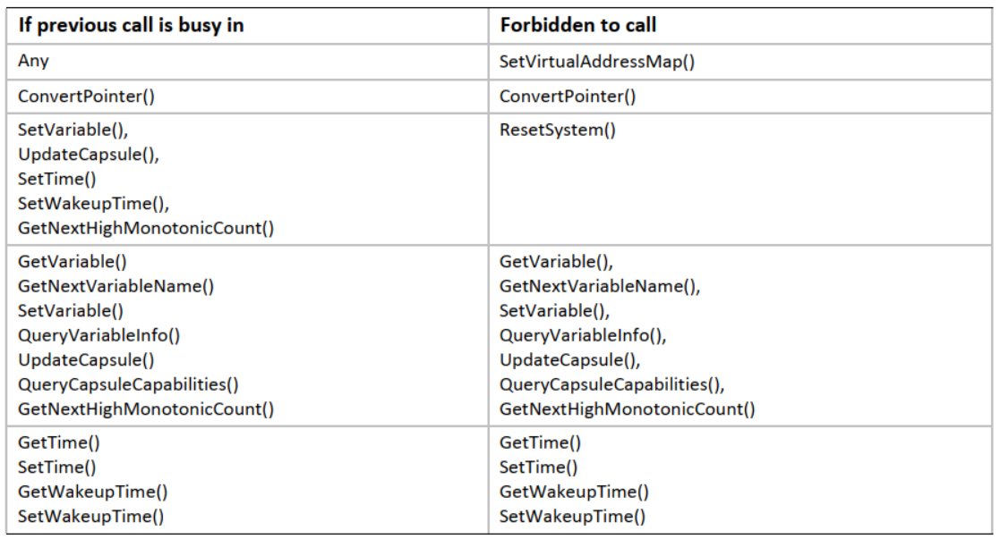

如果操作系统在运行时不支持使用任何 `EFI_RUNTIME_SERVICES` 调用，则应发布 `EFI_RT_PROPERTIES_TABLE` 配置表，描述在运行时支持哪些运行时服务（请参阅第 4.6 节）。请注意，这只是对操作系统的提示，可以随意忽略，因此平台仍然需要提供不受支持的运行时服务的可调用实现，这些服务只返回 `EFI_UNSUPPORTED`。

### Machine Check, INIT and NMI [^1] 异常（Exception for Machine Check, INIT and NMI）

^1: NMI(Non-Maskable Interrupt)：不可屏蔽中断

某些异步事件（例如，`IA-32` 和 `x64` 系统上的 NMI、`Itanium` 系统上的 Machine Check 和 INIT）无法被屏蔽，并且可能在启用任何中断设置的情况下发生。这些事件还可能需要 OS 级处理程序的参与，这可能涉及调用某些运行时服务（见下文）。

如果调用了 `SetVirtualAddressMap()`，则在 Machine Check、INIT 或 NMI 之后对运行时服务的所有调用都必须使用该调用设置的虚拟地址映射进行。

Machine Check 可能中断了运行时服务（见下文）。如果 OS 确定 Machine Check 是可恢复的，则 OS 级别的处理程序必须遵循表 8-1 中的正常限制。

如果 OS 确定 Machine Check 是不可恢复的，则 OS 级别的处理程序可能会忽略正常限制，并且可能会调用表 8-2（Machine Check、INIT 和 NMI 之后可能调用的函数）中描述的运行时服务，即使在先前调用繁忙的情况下也是如此。系统固件将接受新的运行时服务调用，并且不保证先前中断的调用的操作。任何中断的运行时函数都不会重新启动。

INIT 和 NMI 事件遵循相同的限制。

注：在 `Itanium` 系统上，操作系统机器检查处理程序不得调用 `ResetSystem()`。如果需要重置，操作系统机器检查处理程序可能会请求 `SAL` [^2] 在返回到 `SAL_CHECK` 时重置。

^2: SAL(System Abstraction Layer)：系统抽象层

平台实现需要清除任何正在进行的运行时服务，以便操作系统处理程序能够调用这些运行时服务，即使在先前的调用繁忙的情况下也是如此。在这种情况下，不能保证原来中断的呼叫的正常运行。

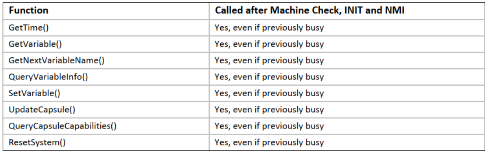

## 可变服务（Variable Services）

变量被定义为键/值对，由标识信息加上属性（键）和任意数据（值）组成。变量旨在用作存储在平台中实现的 EFI 环境与 EFI 操作系统加载程序和在 EFI 环境中运行的其他应用程序之间传递的数据的一种方式。

虽然本规范没有定义变量存储的实现，但在大多数情况下变量必须是持久的。这意味着平台上的 EFI 实现必须对其进行安排，以便在每次系统启动时保留并可供使用，至少在它们被明确删除或覆盖之前，传递给存储的变量都可以使用。在某些平台上提供这种类型的非易失性存储可能非常有限，因此在无法使用其他通信信息方式的情况下应谨慎使用变量。

表 8-3 列出了本节中描述的变量服务函数：

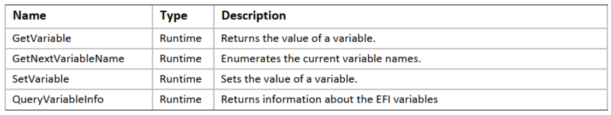

**GetVariable()**

- 概要（Summary）

    返回变量的值。

- 原型（Prototype）

    ```c
    typedef
    EFI_STATUS GetVariable (
        IN CHAR16     *VariableName,
        IN EFI_GUID   *VendorGuid,
        OUT UINT32    *Attributes OPTIONAL,
        IN OUT UINTN  *DataSize,
        OUT VOID      *Data OPTIONAL
    );
    ```

- 参数（Parameters）

    *VariableName*：一个以 `Null` 结尾的字符串，它是供应商变量的名称。

    *VendorGuid*：供应商的唯一标识符。`EFI_GUID` 类型在 `EFI_BOOT_SERVICES.InstallProtocolInterface()` 函数描述中定义。

    *Attributes*：如果不是 `NULL`，则指向内存位置的指针以返回变量的属性位掩码。参见“相关定义”。如果不为 `NULL`，则在返回 `EFI_SUCCESS` 和 `EFI_BUFFER_TOO_SMALL` 时都在输出上设置 *Attributes*。

    *DataSize*：输入时，返回 *data* 缓冲区的大小（以字节为单位）。输出数据中返回的 *data* 大小。

    *Data*：返回变量内容的缓冲区。可以为 `NULL` 且 *DataSize* 为零，以确定所需的缓冲区大小。

- 相关定义（Related Definitions）

    ```c
    //*******************************************************
    // Variable Attributes
    //*******************************************************
    #define EFI_VARIABLE_NON_VOLATILE                           0x00000001
    #define EFI_VARIABLE_BOOTSERVICE_ACCESS                     0x00000002
    #define EFI_VARIABLE_RUNTIME_ACCESS                         0x00000004
    #define EFI_VARIABLE_HARDWARE_ERROR_RECORD                  0x00000008 \

    //This attribute is identified by the mnemonic 'HR' elsewhere
    //in this specification.
    #define EFI_VARIABLE_AUTHENTICATED_WRITE_ACCESS              0x00000010
    //NOTE: EFI_VARIABLE_AUTHENTICATED_WRITE_ACCESS is deprecated
    //and should be considered reserved.
    #define EFI_VARIABLE_TIME_BASED_AUTHENTICATED_WRITE_ACCESS \ 0x00000020
    #define EFI_VARIABLE_APPEND_WRITE                            0x00000040
    #define EFI_VARIABLE_ENHANCED_AUTHENTICATED_ACCESS           0x00000080
    //This attribute indicates that the variable payload begins
    //with an EFI_VARIABLE_AUTHENTICATION_3 structure, and
    //potentially more structures as indicated by fields of this
    //structure. See definition below and in SetVariable().
    ```

- 描述（Description）

    每个供应商都可以通过使用唯一的 *VendorGuid* 创建和管理自己的变量，而不会出现名称冲突的风险。设置变量时，将提供其 *Attributes* 以指示系统应如何存储和维护数据变量。这些属性会影响何时可以访问变量和数据的易变性。如果 `EFI_BOOT_SERVICES.ExitBootServices()` 已经执行，没有设置 `EFI_VARIABLE_RUNTIME_ACCESS` 属性的数据变量将对 `GetVariable()` 不可见，并将返回 `EFI_NOT_FOUND` 错误。

    如果数据缓冲区太小无法容纳变量的内容，则返回错误 `EFI_BUFFER_TOO_SMALL` 并将 *DataSize* 设置为获取数据所需的缓冲区大小。

    `EFI_VARIABLE_TIME_BASED_AUTHENTICATED_WRITE_ACCESS` 和 `EFI_VARIABLE_AUTHENTICATED_WRITE_ACCESS` 属性都可以在 `GetVariable()` 调用的返回属性位掩码参数中设置，但应注意 `EFI_VARIABLE_AUTHENTICATED_WRITE_ACCESS` 属性已弃用，不应再使用。`EFI_VARIABLE_APPEND_WRITE` 属性永远不会在返回的 *Attributes* 位掩码参数中设置。

    当调用 `GetVariable()` 时，使用 `EFI_VARIABLE_ENHANCED_AUTHENTICATED_ACCESS` 属性集存储的变量将返回元数据以及变量数据。如果 `GetVariable()` 调用指示设置了此属性，则必须根据元数据标头解释 `GetVariable()` 有效负载。除了 `SetVariable()` 中描述的标头之外，以下标头用于指示当前可能与变量关联的证书。

    ```c
    //
    // EFI_VARIABLE_AUTHENTICATION_3_CERT_ID descriptor
    //
    // An extensible structure to identify a unique x509 cert
    // associated with a given variable
    //
    #define EFI_VARIABLE_AUTHENTICATION_3_CERT_ID_SHA256 1

    typedef struct {
        UINT8   Type;
        UINT32  IdSize
    // UINT8 Id[IdSize];
    } EFI_VARIABLE_AUTHENTICATION_3_CERT_ID;
    ```

    *Type*：标识返回的 ID 类型以及应如何解释 ID。

    *IdSize*：指示结构中此字段后面的 Id 缓冲区的大小。

    *Id(Not a formal structure member)*：这是 *Type* 字段定义的关联证书的唯一标识符。对于 `CERT_ID_SHA256`，缓冲区将是证书的 tbsCertificate（x509 中定义的待签名证书数据）数据的 SHA-256 摘要。

    当设置 `EFI_VARIABLE_ENHANCED_AUTHENTICATED_ACCESS` 属性时，数据缓冲区应解释如下：

    ```c
    // NOTE: “||” indicates concatenation.

    // Example: EFI_VARIABLE_AUTHENTICATION_3_TIMESTAMP_TYPE
    EFI_VARIABLE_AUTHENTICATION_3 || EFI_TIME || EFI_VARIABLE_AUTHENTICATION_3_CERT_ID || Data

    // Example: EFI_VARIABLE_AUTHENTICATION_3_NONCE_TYPE
    EFI_VARIABLE_AUTHENTICATION_3 || EFI_VARIABLE_AUTHENTICATION_3_NONCE || EFI_VARIABLE_AUTHENTICATION_3_CERT_ID || Data
    ```

    注：每个示例中的 `EFI_VARIABLE_AUTHENTICATION_3` 结构的 *MetadataSize* 字段不包含任何 `WIN_CERTIFICATE_UEFI_GUID` 结构。这些结构用于 `SetVariable()` 接口，而不是 `GetVariable()`，如上例中所述。

- 返回的状态码（Status Codes Returned）

    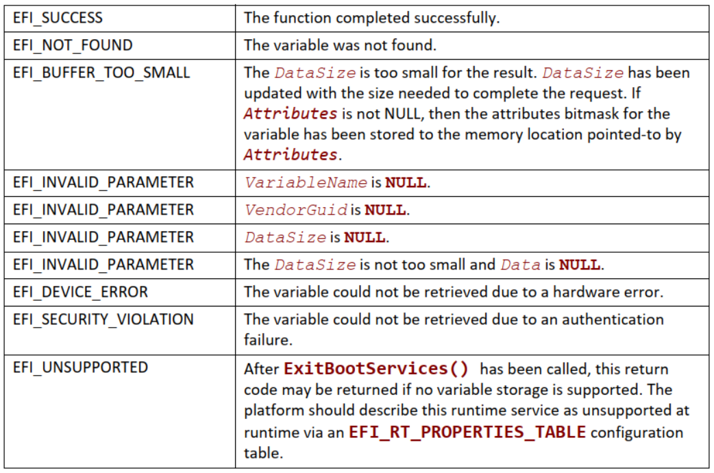

**GetNextVariableName()**

- 概要（Summary）

    枚举当前变量名称。

- 原型（Prototype）

    ```c
    typedef
    EFI_STATUS GetNextVariableName (
        IN OUT UINTN     *VariableNameSize,
        IN OUT CHAR16    *VariableName,
        IN OUT EFI_GUID  *VendorGuid
    );
    ```

- 参数（Parameters）

    *VariableNameSize*：变量名缓冲区的大小。大小必须足够大以适合 *VariableName* 缓冲区中提供的输入字符串。

    *VariableName*：输入时，提供由 `GetNextVariableName()` 返回的最后一个 *VariableName*。在输出时，返回当前变量的 `Null` 终止字符串。

    *VendorGuid*：在输入时，提供由 `GetNextVariableName()` 返回的最后一个 *VendorGuid*。在输出时，返回当前变量的 *VendorGuid*。*EFI_GUID* 类型在 `EFI_BOOT_SERVICES.InstallProtocolInterface()` 函数描述中定义。

- 描述（Description）

    多次调用 `GetNextVariableName()` 以检索系统中当前可用的所有变量的 *VariableName* 和 *VendorGuid*。在每次调用 `GetNextVariableName()` 时，先前的结果都会传递到接口中，而在输出时，接口会返回下一个变量名称数据。返回整个变量列表后，将返回错误 `EFI_NOT_FOUND`。

    请注意，如果返回 `EFI_BUFFER_TOO_SMALL`，则 *VariableName* 缓冲区对于下一个变量来说太小了。发生此类错误时，将更新 *VariableNameSize* 以反映所需缓冲区的大小。在所有情况下，当调用 `GetNextVariableName()` 时，*VariableNameSize* 不得超过为 *VariableName* 分配的实际缓冲区大小。*VariableNameSize* 不得小于在 *VariableName* 缓冲区输入时传递给 `GetNextVariableName()` 的变量名称字符串的大小。

    要开始搜索，将以 `Null` 结尾的字符串传递到 *VariableName* 中；也就是说，*VariableName* 是指向 `Null` 字符的指针。这始终在首次调用 `GetNextVariableName()` 时完成。当 *VariableName* 是指向 `Null` 字符的指针时，*VendorGuid* 将被忽略。`GetNextVariableName()` 不能用作过滤器以返回具有特定 GUID 的变量名称。相反，必须检索整个变量列表，并且调用者可以选择充当过滤器。在调用 `GetNextVariableName()` 之间调用 `SetVariable()` 可能会产生不可预知的结果。如果输入的 *VariableName* 缓冲区不是以 `Null` 结尾的字符串，则返回 `EFI_INVALID_PARAMETER`。如果 *VariableName* 和 *VendorGuid* 的输入值不是现有变量的名称和 GUID，则返回 `EFI_INVALID_PARAMETER`。

    一旦执行 `EFI_BOOT_SERVICES.ExitBootServices()`，将不再返回仅在引导服务期间可见的变量。要获取由 `GetNextVariableName()` 返回的变量的数据内容或属性，可使用 `GetVariable()` 接口。

- 返回的状态码（Status Codes Returned）

    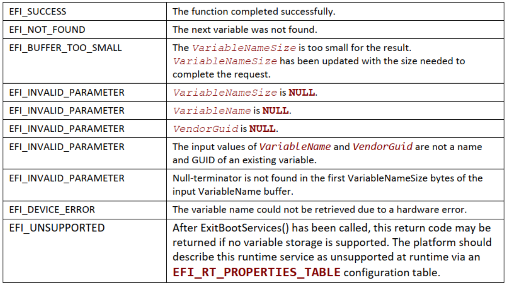

**SetVariable()**

- 概要（Summary）

    设置变量的值。此服务可用于创建新变量、修改现有变量的值或删除现有变量。

- 原型（Prototype）

    ```c
    typedef EFI_STATUS SetVariable (
        IN CHAR16    *VariableName,
        IN EFI_GUID  *VendorGuid,
        IN UINT32    Attributes,
        IN UINTN     DataSize,
        IN VOID      *Data
    );
    ```

- 参数（Parameters）

    *VariableName*：一个以 `Null` 结尾的字符串，它是供应商变量的名称。每个 *VariableName* 对于每个 *VendorGuid* 都是唯一的。变量名必须包含 1 个或多个字符。如果 *VariableName* 是空字符串，则返回 `EFI_INVALID_PARAMETER`。

    *VendorGuid*：供应商的唯一标识符。`EFI_GUID` 类型在 `EFI_BOOT_SERVICES.InstallProtocolInterface()` 函数描述中定义。

    *Attributes*：为变量设置的属性位掩码。请参阅 `GetVariable()` 函数说明。

    *DataSize*：数据缓冲区的大小（以字节为单位）。除非设置了 `EFI_VARIABLE_APPEND_WRITE`、`EFI_VARIABLE_AUTHENTICATED_WRITE_ACCESS`、`EFI_VARIABLE_ENHANCED_AUTHENTICATED_ACCESS` 或 `EFI_VARIABLE_TIME_BASED_AUTHENTICATED_WRITE_ACCESS` 属性，否则大小为零会导致变量被删除。当设置了 `EFI_VARIABLE_APPEND_WRITE` 属性时，*DataSize* 为零的 `SetVariable()` 调用将不会导致变量值发生任何变化（然而，与变量关联的时间戳可能会更新，即使没有提供新的数据值；请参阅下面对 `EFI_VARIABLE_AUTHENTICATION_2` 描述符的描述）。在这种情况下，*DataSize* 不会为零，因为将填充 `EFI_VARIABLE_AUTHENTICATION_2` 描述符）。

    *Data*：变量的内容。

- 相关定义（Related Definitions）

    ```c
    //*******************************************************
    // Variable Attributes
    //*******************************************************

    // NOTE: This interface is deprecated and should no longer be used!
    //
    // EFI_VARIABLE_AUTHENTICATION descriptor
    //
    // A counter-based authentication method descriptor template
    //
    typedef struct {
        UINT64                     MonotonicCount;
        WIN_CERTIFICATE_UEFI_GUID  AuthInfo
    } EFI_VARIABLE_AUTHENTICATION;
    ```

    *MonotonicCount*：包含在 *AuthInfo* 的签名中。用于确保新鲜度/无重播。在每次“写入”访问期间递增。

    *AuthInfo*：提供变量访问权限。它是跨可变数据和单调计数值的签名。调用方使用与通过密钥交换提供的公钥相关联的私钥。

    ```c
    //
    // EFI_VARIABLE_AUTHENTICATION_2 descriptor
    //
    // A time-based authentication method descriptor template
    //
    typedef struct {
        EFI_TIME                   TimeStamp;
        WIN_CERTIFICATE_UEFI_GUID  AuthInfo
    } EFI_VARIABLE_AUTHENTICATION_2;
    ```

    *TimeStamp*：与身份验证描述符关联的时间。对于 *TimeStamp* 值，组件 *Pad1*、*Nanosecond*、*TimeZone*、*Daylight* 和 *Pad2* 应设置为 0。这意味着时间应始终以 GMT [^3] 表示。

    ^3: GMT(Greenwich Mean Time): 格林威治标准时间。

    *AuthInfo*：提供变量访问权限。仅接受 `EFI_CERT_TYPE_PKCS7_GUID` 的 *CertType*。

    ```c
    //
    // EFI_VARIABLE_AUTHENTICATION_3 descriptor
    //
    // An extensible implementation of the Variable Authentication
    // structure.
    //
    #define EFI_VARIABLE_AUTHENTICATION_3_TIMESTAMP_TYPE  1
    #define EFI_VARIABLE_AUTHENTICATION_3_NONCE_TYPE      2

    typedef struct {
        UINT8   Version;
        UINT8   Type;
        UINT32  MetadataSize;
        UINT32  Flags
    } EFI_VARIABLE_AUTHENTICATION_3;
    ```

    *Version*：该字段用于 `EFI_VARIABLE_AUTHENTICATION_3` 结构本身需要更新的情况。目前，它被硬编码为“0x1”。

    *Type*：在可变数据有效负载中声明紧跟在该结构之后的结构。对于 `EFI_VARIABLE_AUTHENTICATION_3_TIMESTAMP_TYPE`，它将是 `EFI_TIME`（对于 *TimeStamp*）的一个实例。对于 `EFI_VARIABLE_AUTHENTICATION_3_NONCE_TYPE`，该结构将是 `EFI_VARIABLE_AUTHENTICATION_3_NONCE` 的一个实例。该结构定义如下。请注意，这些结构都不包含 `WIN_CERTIFICATE_UEFI_GUID` 结构。有关结构排序的说明，请参见第 8.2.1 节。

    *MetadataSize*：声明所有变量身份验证元数据（与变量身份验证相关的数据本身不是变量数据）的大小，包括此标头结构和特定于类型的结构（例如 `EFI_VARIABLE_AUTHENTICATION_3_NONCE`）和任何 `WIN_CERTIFICATE_UEFI_GUID` 结构。

    *Flags*：指示此调用的任何可选配置的位字段。目前，唯一定义的值是：

    ```c
    #define EFI_VARIABLE_ENHANCED_AUTH_FLAG_UPDATE_CERT 0x00000001
    ```

    `SetVariable()` 上此标志的存在表明在特定类型的结构之后有 `WIN_CERTIFICATE_UEFI_GUID` 结构的两个实例。
    第一个实例描述了要设置为变量权限的新证书。
    第二个是授权当前更新的签名数据。
    注意：所有其他位当前在 `SetVariable()` 上保留。
    注意：所有标志都保留在 `GetVariable()` 上。

    ```c
    //
    // EFI_VARIABLE_AUTHENTICATION_3_NONCE descriptor
    //
    // A nonce-based authentication method descriptor template. This
    // structure will always be followed by a
    // WIN_CERTIFICATE_UEFI_GUID structure.
    //
    typedef struct {
        UINT32  NonceSize
        // UINT8 Nonce[NonceSize];
    } EFI_VARIABLE_AUTHENTICATION_3_NONCE;
    ```

    *NonceSize*：指示结构中此字段后面的 *Nonce* 缓冲区的大小。不得为 0。

    *Nonce (Not a formal structure member)*：保证签名有效载荷的唯一随机值不能在多台机器或机器系列之间共享。在 `SetVariable()` 上，如果 *Nonce* 字段全为 0，主机将尝试使用内部生成的随机数。如果不可能，将返回 `EFI_UNSUPPORTED`。此外，在 `SetVariable()` 上，如果变量已经存在并且随机数与当前随机数相同，将返回 `EFI_INVALID_PARAMETER`。

- 描述（Description）

    变量由固件存储，并且可以在电源循环期间保持它们的值。每个供应商都可以通过使用唯一的 *VendorGuid* 创建和管理自己的变量，而不会出现名称冲突的风险。

    每个变量都有定义固件如何存储和维护数据值的属性。如果未设置 `EFI_VARIABLE_NON_VOLATILE` 属性，则固件会将变量存储在普通内存中，并且不会在电源循环期间保持不变。这些变量用于将信息从一个组件传递到另一个组件。这方面的一个例子是固件的语言代码支持变量。它是在固件初始化时创建的，供可能需要该信息的 EFI 组件访问，但不需要备份到非易失性存储器。

    `EFI_VARIABLE_NON_VOLATILE` 变量存储在存储容量有限的固定硬件中；有时能力严重受限。软件只应在绝对必要时才使用非易失性变量。此外，如果软件使用非易失性变量，它应该尽可能使用只能在引导服务时访问的变量。

    变量必须包含一个或多个字节的数据。除非设置了 `EFI_VARIABLE_APPEND_WRITE`、`EFI_VARIABLE_TIME_BASED_AUTHENTICATED_WRITE_ACCESS` 或 `EFI_VARIABLE_ENHANCED_AUTHENTICATED_ACCESS` 属性（见下文），否则使用 *DataSize* 为零的 `SetVariable()` 将导致删除整个变量。被删除的变量占用的空间可能在下一次电源循环之前不可用。

    如果具有匹配名称、GUID 和属性的变量已经存在，则更新其值。

    属性具有以下使用规则：

    - 如果用不同的属性重写一个预先存在的变量，`SetVariable()` 不应修改该变量并应返回 `EFI_INVALID_PARAMETER`。唯一的例外是唯一不同的属性是 `EFI_VARIABLE_APPEND_WRITE`。在这种情况下，调用的成功与否取决于写入的实际值。此规则有两个例外：

        - 如果一个预先存在的变量在没有指定访问属性的情况下被重写，该变量将被删除。

        - `EFI_VARIABLE_APPEND_WRITE` 属性代表了一种特殊情况。可以使用或不使用 `EFI_VARIABLE_APPEND_WRITE` 属性重写变量。

        - 设置没有访问属性的数据变量会导致它被删除。

        - `EFI_VARIABLE_AUTHENTICATED_WRITE_ACCESS` 已弃用，不应使用。如果 `SetVariable()` 的调用方指定了此属性，平台应返回 `EFI_UNSUPPORTED`。

        - 除非设置了 `EFI_VARIABLE_APPEND_WRITE`、`EFI_VARIABLE_TIME_BASED_AUTHENTICATED_WRITE_ACCESS` 或 `EFI_VARIABLE_ENHANCED_AUTHENTICATED_WRITE_ACCESS` 属性，设置指定为零 DataSize 的数据变量会导致其被删除。

        - 对数据变量的运行时访问意味着引导服务访问。设置了 `EFI_VARIABLE_RUNTIME_ACCESS` 的属性也必须设置 `EFI_VARIABLE_BOOTSERVICE_ACCESS`。调用者有责任遵守此规则。

        - 一旦执行了 `EFI_BOOT_SERVICES.ExitBootServices()`，没有设置 `EFI_VARIABLE_RUNTIME_ACCESS` 的数据变量将不再对 `GetVariable()` 可见。

        - 执行 `ExitBootServices()` 后，只有设置了 `EFI_VARIABLE_RUNTIME_ACCESS` 和 `EFI_VARIABLE_NON_VOLATILE` 的变量才能使用 `SetVariable()` 进行设置。执行 `ExitBootServices()` 后，具有运行时访问权限但非非易失性的变量是只读数据变量。
        当在 `SetVariable()` 调用中设置 `EFI_VARIABLE_ENHANCED_AUTHENTICATED_ACCESS` 属性时，身份验证应使用 `EFI_VARIABLE_AUTHENTICATION_3` 描述符，其后将是类型和标志字段中指示的任何描述符。

        - 当在 `SetVariable()` 调用中设置 `EFI_VARIABLE_TIME_BASED_AUTHENTICATED_WRITE_ACCESS` 属性时，验证应使用 `EFI_VARIABLE_AUTHENTICATION_2` 描述符。

        - 如果在 `SetVariable()` 调用中设置了 `EFI_VARIABLE_TIME_BASED_AUTHENTICATED_WRITE_ACCESS` 和 `EFI_VARIABLE_ENHANCED_AUTHENTICATED_ACCESS` 属性，则固件必须返回 `EFI_INVALID_PARAMETER`。

        - 如果在 `SetVariable()` 调用中设置了 `EFI_VARIABLE_APPEND_WRITE` 属性，则任何现有变量值都应附加 *Data* 参数的值。如果固件不支持附加操作，则 `SetVariable()` 调用应返回 `EFI_INVALID_PARAMETER`。

        - 如果在 `SetVariable()` 调用中设置了 `EFI_VARIABLE_TIME_BASED_AUTHENTICATED_WRITE_ACCESS` 属性，并且固件不支持包含在 `EFI_VARIABLE_AUTHENTICATION_2` 描述符中的证书的签名类型，则 `SetVariable()` 调用应返回 `EFI_INVALID_PARAMETER`。固件支持的签名类型列表由 *SignatureSupport* 变量定义。证书的签名类型由其摘要和加密算法定义。

        - 如果设置了 `EFI_VARIABLE_HARDWARE_ERROR_RECORD` 属性，*VariableName* 和 *VendorGuid* 必须符合 **Section 8.2.4.2** 和 **附录 P** 中规定的规则。否则，`SetVariable()` 调用应返回 `EFI_INVALID_PARAMETER`。

        - 必须使用 `Boot Manager` 这一章 **Table 3-1** 中定义的属性创建 **Globally Defined Variables**。如果使用错误的属性创建全局定义的变量，则结果是不确定的，并且可能因实现而异。

        - 如果使用 `EFI_VARIABLE_ENHANCED_AUTHETICATED_ACCESS` 接口更新给定变量的证书颁发机构，有效负载的 *Data* 区域为空是有效的。这将在不修改数据本身的情况下更新证书。如果 *Data* 区域为空且未指定 *NewCert*，则将删除该变量（假设已验证所有授权）。

        - 必须使用 `EFI_VARIABLE_TIME_BASED_AUTHENTICATED_WRITE_ACCESS` 属性集创建安全启动策略变量，并且身份验证应使用 `EFI_VARIABLE_AUTHENTICATION_2` 描述符。如果未设置适当的属性位，则固件应返回 `EFI_INVALID_PARAMETER`。

    固件在保存非易失性变量时必须执行的唯一规则是它在返回 `EFI_SUCCESS` 之前实际上已经保存到非易失性存储中，并且不执行部分保存。如果在调用 `SetVariable()` 期间发生电源故障，则变量可能包含其先前值或新值。此外，没有读取、写入或删除安全保护。

    要删除使用 `EFI_VARIABLE_TIME_BASED_AUTHENTICATED_WRITE_ACCESS` 属性创建的变量，必须将 *SetVariable* 与与现有变量匹配的属性一起使用，并将 *DataSize* 设置为 *AuthInfo* 描述符的大小。数据缓冲区必须包含 *AuthInfo* 描述符的实例，该实例将根据上面相应部分中参考更新已验证变量的步骤进行验证。尝试删除使用 `EFI_VARIABLE_TIME_BASED_AUTHENTICATED_WRITE_ACCESS` 属性创建的变量时，规定的 *AuthInfo* 验证失败或使用 **0** 值的 *DataSize* 调用时将失败，状态为 `EFI_SECURITY_VIOLATION`。

    要删除使用 `EFI_VARIABLE_ENHANCED_AUTHENTICATED_ACCESS` 属性创建的变量，必须将 *SetVariable* 与与现有变量匹配的属性一起使用，并将 *DataSize* 设置为整个有效负载的大小，包括所有描述符和证书。数据缓冲区必须包含 `EFI_VARIABLE_AUTHENTICATION_3` 描述符的实例，它将指示如何根据 **Section 8.2.1** 中的描述验证有效负载。尝试删除使用 `EFI_VARIABLE_ENHANCED_AUTHENTICATED_ACCESS` 属性创建的变量时，规定的验证失败或使用 **0** 值的 *DataSize* 调用时将失败，状态为 `EFI_SECURITY_VIOLATION`。

- 返回的状态码（Status Codes Returned）

    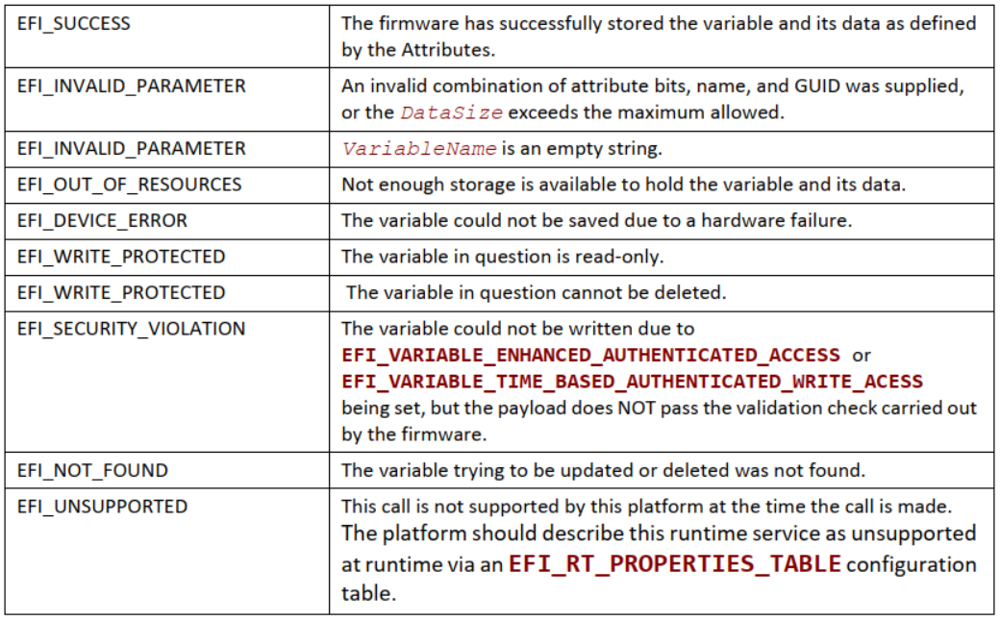

**QueryVariableInfo()**

- 概要（Summary）

    返回有关 EFI 变量的信息。

- 原型（Prototype）

    ```c
    typedef EFI_STATUS QueryVariableInfo (
        IN UINT32   Attributes,
        OUT UINT64  *MaximumVariableStorageSize,
        OUT UINT64  *RemainingVariableStorageSize,
        OUT UINT64  *MaximumVariableSize
    );
    ```

- 参数（Parameters）

    *Attributes*：属性位掩码指定返回信息的变量类型。请参阅 `GetVariable()` 函数说明。`EFI_VARIABLE_APPEND_WRITE` 属性，如果在属性位掩码中设置，将被忽略。

    *MaximumVariableStorageSize*：输出时可用于与指定属性关联的 EFI 变量的存储空间的最大大小。

    *RemainingVariableStorageSize*：返回可用于与指定属性关联的 EFI 变量的存储空间的剩余大小。

    *MaximumVariableSize*：返回与指定属性关联的单个 EFI 变量的最大大小。

- 描述（Description）

    `QueryVariableInfo()` 函数允许调用者获取有关 EFI 变量可用存储空间的最大大小、EFI 变量可用存储空间的剩余大小以及每个单独的 EFI 变量的最大大小的信息，与 指定的属性。

    *MaximumVariableSize* 值将反映与保存单个 EFI 变量相关的开销，与 EFI 变量的字符串名称的长度相关的开销除外。

    返回的 *MaximumVariableStorageSize*、*RemainingVariableStorageSize*、*MaximumVariableSize* 信息可能会在调用后根据其他运行时活动（包括异步错误事件）立即更改。此外，这些与不同属性关联的值在本质上不是相加的。

    系统转换到运行时后（调用 `ExitBootServices()` 后），实现可能无法准确返回有关引导服务变量存储的信息。在这种情况下，应返回 `EFI_INVALID_PARAMETER`。

- 返回的状态码（Status Codes Returned）

    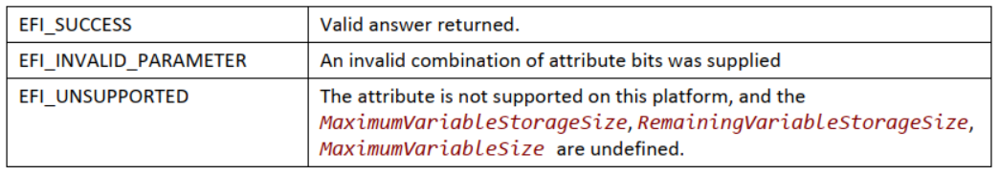

### 使用 EFI_VARIABLE_AUTHENTICATION_3 描述符（Using the EFI_VARIABLE_AUTHENTICATION_3 descriptor）

当设置 `EFI_VARIABLE_ENHANCED_AUTHENTICATED_ACCESS` 属性时，有效负载缓冲区（作为“数据”传递到 `SetVariable()` 中）应按如下方式构造：

```c
// NOTE: “||” indicates concatenation.
// NOTE: “[]” indicates an optional element.

// Example: EFI_VARIABLE_AUTHENTICATION_3_TIMESTAMP_TYPE
EFI_VARIABLE_AUTHENTICATION_3 || EFI_TIME || [ NewCert ] || SigningCert || Data

// Example: EFI_VARIABLE_AUTHENTICATION_3_NONCE_TYPE
EFI_VARIABLE_AUTHENTICATION_3 || EFI_VARIABLE_AUTHENTICATION_3_NONCE || [ NewCert ] || SigningCert || Data
```

在此示例中，*NewCert* 和 *SigningCert* 都是 `WIN_CERTIFICATE_UEFI_GUID` 的实例。*NewCert* 的存在由 `EFI_VARIABLE_AUTHENTICATION_3.Flags` 字段指示（请参阅 `SetVariable()` 中的定义）。如果提供 - 并假设有效负载通过所有完整性和安全验证 - 此证书将被设置为基础变量的新权限，即使变量是新创建的。

*NewCert* 元素必须具有 `EFI_CERT_TYPE_PKCS7_GUID` 的 *CertType*，并且 *CertData* 必须是符合 **PKCS#7 version 1.5 (RFC 2315)** 的 `DER-encoded SignedData` 结构，根据 **PKCS#7 version 1.5**，无论是否使用 `DER-encoded ContentInfo` 结构都应支持该结构。创建 *SignedData* 结构时，应遵循以下步骤：

1. 创建 `WIN_CERTIFICATE_UEFI_GUID` 结构，其中 *CertType* 设置为 `EFI_CERT_TYPE_PKCS7_GUID`。

2. 使用添加的 **x509** 证书作为新权限来签署自己的 *tbsCertificate* 数据。

3. 构造一个 **PKCS#7 version 1.5 SignedData（参见 [RFC2315]）**，其签名内容如下：

    - *SignedData.version* 应设置为 1。

    - *SignedData.digestAlgorithms* 应包含准备签名时使用的摘要算法。仅接受 **SHA-256** 的摘要算法。

    - *SignedData.contentInfo.contentType* 应设置为 **id-data**。

    - *SignedData.contentInfo.content* 应该是为新的 **x509** 证书签名的 *tbsCertificate* 数据。

    - *SignedData.certificates* 应至少包含签名者的 `DER-encoded X.509` 证书。

    - *SignedData.crls* 是可选的。

    - *SignedData.signerInfos* 应构造为：

        - *SignerInfo.version* 应设置为 1；

        - *SignerInfo.issuerAndSerial* 应存在并与签名者的证书相同；

        - *SignerInfo.authenticatedAttributes* 不应存在；

        - *SignerInfo.digestEncryptionAlgorithm* 应设置为用于签署数据的算法。仅接受具有 **PKCS #1 v1.5 padding (RSASSA_PKCS1v1_5)** 的 RSA 摘要加密算法；

        - *SignerInfo.encryptedDigest* 应存在；

        - *SignerInfo.unauthenticatedAttributes* 不应存在；

        - 将 *CertData* 字段设置为 `DER-encoded PKCS#7 SignedData` 值。

4. 将 *CertData* 字段设置为 `DER-encoded PKCS#7 SignedData` 值。

尝试创建、更新或删除带有 `EFI_VARIABLE_ENHANCED_AUTHENTICATED_ACCESS` 集的变量的 `SetVariable()` 调用者应执行以下步骤来为 *SigningCert* 创建 *SignedData* 结构：

1. 使用以下值创建 `EFI_VARIABLE_AUTHENTICATION_3` 主描述符：

    - 版本应设置为适合正在使用的元数据头的版本（当前为 1）;

    - 类型应根据调用者规范进行设置（请参阅 `SetVariable()` 下的 `EFI_VARIABLE_AUTHENTICATION_3` 描述符）；

    - *MetadataSize* 暂时可以忽略，会在构建最终 *payload* 时更新；

    - 应根据调用方规范设置标志。

2. 可能需要根据类型创建二级描述符：

    - 对于 `EFI_VARIABLE_AUTHENTICATION_3_TIMESTAMP_TYPE` 类型，这将是 `EFI_TIME` 设置为当前时间的一个实例；

    - 对于 `EFI_VARIABLE_AUTHENTICATION_3_NONCE_TYPE` 类型，这将是 `EFI_VARIABLE_AUTHENTICATION_3_NONCE` 的实例，根据调用者规范（不得为零）设置 *NonceSize* 更新，并将 *Nonce*（非正式结构成员）设置为：

        - 全零请求平台创建随机数；

        - 调用者为预生成的随机数指定值。

    - 散列有效负载的序列化。序列化应按此顺序包含以下元素：

        - *VariableName*、*VendorGuid*、*Attributes* 和 *Secondary* 描述符（如果存在）；

        - 变量的新值（即 Data 参数的新变量内容）；

        - 如果这是对类型为 `EFI_VARIABLE_AUTHENTICATION_3_NONCE` 的变量的更新或删除，请序列化当前随机数。当前随机数是当前与该变量关联的随机数，而不是二级描述符中的随机数。仅序列化 *nonce* 缓冲区内容，而不序列化大小或任何其他数据。如果这是尝试创建一个新变量（即没有当前随机数），请跳过此步骤;

    - 签署生成的摘要。

    - 创建 `WIN_CERTIFICATE_UEFI_GUID` 结构，其中 *CertType* 设置为 `EFI_CERT_TYPE_PKCS7_GUID`。

    - 按照上面为 *NewCert*（步骤 3）描述的步骤构建一个  `DER-encoded PKCS #7 version 1.5 SignedData`（请参阅 [RFC2315]），但有以下例外：

        - `SignedData.contentInfo.content` 应不存在（内容在 *Data* 参数中提供给 `SetVariable()` 调用）。

    - 根据本节开头对“payload buffer”的描述，构造 `SetVariable()` 的最终 *payload*。

    - 更新 `EFI_VARIABLE_AUTHENTICATION_3.MetadataSize` 字段以包含最终有效负载的所有部分，但“数据”除外。

实现 `SetVariable()` 服务并支持 `EFI_VARIABLE_ENHANCED_AUTHENTICATED_ACCESS` 属性的固件应执行以下操作以响应被调用：

1. 阅读 `EFI_VARIABLE_AUTHENTICATION_3` 描述符以确定正在执行的身份验证类型以及如何解析其余有效负载。

2. 验证 `SigningCert.CertType` 是否为 `EFI_CERT_TYPE_PKCS7_GUID`。

    - 如果 `EFI_VARIABLE_AUTHENTICATION_3.Flags` 字段指示存在 *NewCert*，请验证 `NewCert.CertType` 是否为 `EFI_CERT_TYPE_PKCS7_GUID`；

    - 如果任一失败，则返回 `EFI_INVALID_PARAMETER`。

3. 如果该变量已存在，请验证传入类型是否与现有类型匹配。

4. 确认任何 `EFI_TIME` 结构都将 *Pad1*、*Nanosecond*、*TimeZone*、*Daylight* 和 *Pad2* 字段设置为零。

5. 如果 `EFI_VARIABLE_AUTHENTICATION_3_NONCE_TYPE`：

    - 验证 *NonceSize* 是否大于零。如果为零，则返回 `EFI_INVALID_PARAMETER`；

    - 如果传入的 *nonce* 全为 0，确认平台支持生成随机 *nonce*。如果不受支持，则返回 `EFI_UNSUPPORTED`；

    - 如果指定了 *nonce* 并且变量已经存在，请验证传入的 *nonce* 是否与现有的 *nonce* 不匹配。如果相同，则返回 `EFI_INVALID_PARAMETER`。

6. 如果 `EFI_VARIABLE_AUTHENTICATION_3_TIMESTAMP_TYPE` 和变量已经存在，请验证新时间戳在时间上是否大于当前 *Timestamp*。

7. 通过以下方式验证有效负载签名：

    - 根据描述符解析整个有效载荷；

    - 使用描述符内容（以及必要时来自现有变量的元数据）构建本节前面描述的序列化（`SetVariable()` 指令的第 3 步）；

    - 计算摘要并与将 *SigningCert* 的公钥应用于签名的结果进行比较。

8. 如果该变量已存在，请验证 *SigningCert* 权限是否与已与该变量关联的权限相同。

9. 如果提供了 *NewCert*，请通过以下方式验证 *NewCert* 签名：

    - 根据描述符解析整个有效载荷；

    - 计算 *NewCert* 中 **x509** 证书的 *tbsCertificate* 摘要，并与将 *NewCert* 的公钥应用于签名的结果进行比较；

    - 如果失败，返回 `EFI_SECURITY_VIOLATION`。

### 使用 EFI_VARIABLE_AUTHENTICATION_2 描述符 (Using the EFI_VARIABLE_AUTHENTICATION_2 descriptor)

当设置了 `EFI_VARIABLE_TIME_BASED_AUTHENTICATED_WRITE_ACCESS` 属性时，数据缓冲区应以一个完整（和序列化）的实例开始。

`EFI_VARIABLE_AUTHENTICATION_2` 描述符。描述符后应跟新变量值，*DataSize* 应反映描述符和新变量值的组合大小。身份验证描述符不是变量数据的一部分，并且不会由对 `GetVariable()` 的后续调用返回。

使用 `EFI_VARIABLE_TIME_BASED_AUTHENTICATED_WRITE_ACCESS` 属性集调用 `SetVariable()` 服务的调用方应在调用服务之前执行以下操作：

1. 创建描述符

    创建 `EFI_VARIABLE_AUTHENTICATION_2` 描述符，其中：

    - *TimeStamp* 设置为当前时间；

    注：在某些环境中，可靠的时间源可能不可用。在这种情况下，由于 `EFI_VARIABLE_APPEND_WRITE` 属性在设置时会禁用时间戳验证（见下文），因此实现可能仍会向经过身份验证的变量添加值。在这些情况下，应使用 `EFI_TIME` 结构的每个组件（包括日和月）都设置为 0 的特殊时间值。

    - `AuthInfo.CertType` 设置为 `EFI_CERT_TYPE_PKCS7_GUID`。

2. 散列 `SetVariable()` 调用的 *VariableName*、*VendorGuid* 和 *Attributes* 参数值的序列化以及 `EFI_VARIABLE_AUTHENTICATION_2` 描述符的 *TimeStamp* 组件，后跟变量的新值（即 *Data* 参数的新变量内容）。即 `digest = hash(VariableName, VendorGuid, Attributes, TimeStamp, DataNew_variable_content)`。终止 *VariableName* 值的 `NULL` 字符不应包含在散列计算中。

3. 使用选定的签名方案（例如 `PKCS #1 v1.5`）对生成的摘要进行签名。

4. 根据 `PKCS#7 v1.5 (RFC 2315)` 构造一个 `DER-encoded SignedData` 结构，无论是否使用 `PKCS#7 v1.5` 的 `DER-encoded ContentInfo` 结构都应支持，签名内容如下：

    - `SignedData.version` 应设置为 1；

    - `SignedData.digestAlgorithms` 应包含准备签名时使用的摘要算法。仅接受 **SHA-256** 的摘要算法；

    - `SignedData.contentInfo.contentType` 应设置为 `id-data`；

    - `SignedData.contentInfo.content` 应不存在（内容在 *Data* 参数中提供给 `SetVariable()` 调用）；

    - `SignedData.certificates` 应至少包含签名者的 `DER-encoded X.509` 证书；

    - `SignedData.crls` 可选；

    - `SignedData.signerInfos` 应构造为：

        - `SignerInfo.version` 应设置为 1；

        - `SignerInfo.issuerAndSerial` 应存在，并且在签名者的证书中 `SignerInfo.authenticatedAttributes` 不应存在；

        - `SignerInfo.digestEncryptionAlgorithm` 应设置为用于签署数据的算法。仅接受具有 `PKCS #1 v1.5 padding (RSASSA_PKCS1v1_5)` 的 RSA 摘要加密算法；

        - `SignerInfo.encryptedDigest` 应存在；

        - `SignerInfo.unauthenticatedAttributes` 不应存在；

    - 将 `AuthInfo.CertData` 设置为 `DER-encoded PKCS #7 SignedData` 值；

    - 构造数据参数：通过将完整的序列化 `EFI_VARIABLE_AUTHENTICATION_2` 描述符与变量的新值 (`DataNew_variable_content`) 连接起来构造 `SetVariable()` 的数据参数。

实现 `SetVariable()` 服务并支持 `EFI_VARIABLE_TIME_BASED_AUTHENTICATED_WRITE_ACCESS` 属性的固件应执行以下操作以响应调用：

1. 验证是否使用了正确的 `AuthInfo.CertType (EFI_CERT_TYPE_PKCS7_GUID)` 以及 `AuthInfo.CertData` 值是否正确解析为 `PKCS #7 SignedData` 值；

2. 验证 *TimeStamp* 值的 *Pad1*、*Nanosecond*、*TimeZone*、*Daylight* 和 *Pad2* 组件是否设置为零。除非设置了 `EFI_VARIABLE_APPEND_WRITE` 属性，否则验证 *TimeStamp* 值是否晚于与变量关联的当前时间戳值；

3. 如果变量 `SetupMode==1`，并且该变量是安全启动策略变量，则固件实现应认为已通过以下步骤 4 和 5 中的检查，并继续更新变量值，如下所述。

4. 通过以下方式验证签名：

    - 从数据缓冲区中提取 `EFI_VARIABLE_AUTHENTICATION_2` 描述符；

    - 使用描述符内容和其他参数来：(a) 构造摘要算法的输入；(b) 计算摘要；(c) 将摘要与将签名者的公钥应用于签名的结果进行比较；

5. 如果变量是全局 PK 变量或全局 KEK 变量，请验证是否使用当前 `Platform Key` 进行了签名；

    - 如果变量是步骤 3 中提到的“db”、“dbt”、“dbr”或“dbx”变量，请验证签名者的证书链接到密钥交换密钥数据库中的证书（或者签名是使用 当前的平台密钥）；

    - 如果变量是步骤 3 中提到的“OsRecoveryOrder”或“OsRecover####”变量，请验证签名者的证书是否链接到“dbr”数据库或密钥交换密钥数据库中的证书，或者签名是使用当前平台密钥进行的；

    - 否则，如果变量不是上述任何一种，则应将其指定为私有验证变量。如果私有身份验证变量不存在，则签名证书的主题的 CN 和顶级颁发者证书的 *tbsCertificate* 的哈希值（如果不存在其他证书或证书链长度为 1，则为签名证书本身) 在 `SignedData.certificates`中注册用于此变量的后续验证。实现可能只存储这两个元素的单个散列以减少存储需求。如果 *Private Authenticated* 变量以前存在，则签名者的证书链接到以前与该变量关联的信息。请注意，由于不存在针对它们的撤销列表，如果证书链的任何成员遭到破坏，则撤销对私有身份验证变量证书的信任的唯一方法是删除该变量，重新颁发链中的所有证书颁发机构，并使用新的证书链重新创建变量。因此，剩下的好处可能是对发起者的强烈识别，或遵守某些证书颁发机构的政策。进一步注意，经过身份验证的变量更新的 PKCS7 包必须包含签名证书链，包括所需信任锚的完整证书。信任锚可能是中级证书或根，但由于它们为不同目的颁发的 CA 数量，许多根可能不适合作为信任锚。一些工具需要非默认参数来包含信任锚证书。

只有当所有这些检查都通过时，驱动程序才会更新变量的值。如果任何检查失败，固件必须返回 `EFI_SECURITY_VIOLATION`。仅当设置了 `EFI_VARIABLE_APPEND_WRITE` 属性时，固件才应执行对现有变量值的追加。

对于具有 `GUID EFI_IMAGE_SECURITY_DATABASE_GUID` 的变量（即数据缓冲区格式为 `EFI_SIGNATURE_LIST` 的地方），驱动程序不应执行已经是现有变量值的一部分的 `EFI_SIGNATURE_DATA` 值的追加。

注意：这种情况不被视为错误，并且本身不会导致返回 `EFI_SUCCESS` 以外的状态代码或不更新与变量关联的时间戳。

固件应将新 *TimeStamp* 与更新值相关联（在设置 `EFI_VARIABLE_APPEND_WRITE` 属性的情况下，这仅适用于新时间戳值晚于与变量关联的当前时间戳的情况）。

如果该变量以前不存在，并且不是上面第 3 步中列出的变量之一，则固件应将签名者的公钥与该变量相关联，以供将来验证之用。

### 使用 EFI_VARIABLE_AUTHENTICATION 描述符（Using the EFI_VARIABLE_AUTHENTICATION descriptor）

注意：此接口已弃用，不应再使用！它将从规范的未来版本中删除。

### 硬件错误记录持久化（Hardware Error Record Persistence）

本节定义如何实现硬件错误记录持久性。通过实现对硬件错误记录持久性的支持，该平台使操作系统能够利用 EFI 变量服务来保存硬件错误记录，因此它们是持久的，并且在操作系统会话中保持可用，直到它们被其创建者明确清除或覆盖。

#### 硬件错误记录非易失性存储（Hardware Error Record Non-Volatile Store）

需要一个实现支持硬件错误记录持久化的平台，以保证一定数量的 NVR 可供 OS 用于保存硬件错误记录。平台通过 *QueryVariableInfo* 例程传达为错误记录分配的空间量，如 **附录 P** 中所述。

#### 硬件错误记录变量（Hardware Error Record Variables）

本节定义了一组具有架构定义含义的硬件错误记录变量。除了定义的数据内容之外，每个这样的变量都有一个体系结构定义的属性，指示何时可以访问数据变量。具有 HR 属性的变量存储在 NVR 分配给错误记录的部分。NV、BS 和 RT 具有第 3.2 节中定义的含义。所有硬件错误记录变量都使用 `EFI_HARDWARE_ERROR_VARIABLE VendorGuid`：

```c
#define EFI_HARDWARE_ERROR_VARIABLE\
{0x414E6BDD,0xE47B,0x47cc,{0xB2,0x44,0xBB,0x61,0x02,0x0C,0xF5,0x16}}
```

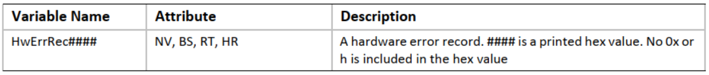

`HwErrRec####` 变量包含硬件错误记录。每个 `HwErrRec####` 变量都是名称 `“HwErrRec”` 附加一个唯一的 4 位十六进制数。例如 `HwErrRec0001`、`HwErrRec0002`、`HwErrRecF31A` 等。HR 属性表示此变量将存储在分配给错误记录的 NVR 部分中。

#### 通用平台错误记录格式（Common Platform Error Record Format）

使用此接口保留的错误记录变量以通用平台错误记录格式进行编码，该格式在 UEFI 规范的附录 N 中进行了描述。由于使用此接口保存的错误记录符合此标准格式，因此错误信息可能会被 OS 以外的实体使用。

## 时间服务（Time Services）

本节包含与时间相关的功能的功能定义，操作系统通常需要这些功能在运行时访问管理时间信息和服务的底层硬件。这些接口的目的是为操作系统编写者提供硬件时间设备的抽象，从而减轻直接访问遗留硬件设备的需要。还有一个用于预引导环境的停止功能。表 8-5 列出了本节中描述的时间服务功能：

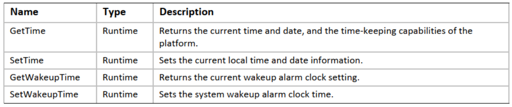

**GetTime()**

- 概要（Summary）

    返回当前时间和日期信息，以及硬件平台的计时能力。

- 原型（Prototype）

    ```c
    typedef EFI_STATUS GetTime (
        OUT EFI_TIME               *Time,
        OUT EFI_TIME_CAPABILITIES  *Capabilities OPTIONAL
    );
    ```

- 参数（Parameters）

    *Time*：指向存储的指针以接收当前时间的快照。`EFI_TIME` 类型在“相关定义”中定义。

    *Capabilities*：指向缓冲区的可选指针，用于接收实时时钟设备的功能。`EFI_TIME_CAPABILITIES` 类型在“相关定义”中定义。

- 相关定义（Related Definitions）

    ```c
    //*******************************************************
    //EFI_TIME
    //*******************************************************
    // This represents the current time information
    typedef struct {
        UINT16 Year;       // 1900 – 9999
        UINT8  Month;      // 1 – 12
        UINT8  Day;        // 1 – 31
        UINT8  Hour;       // 0 – 23
        UINT8  Minute;     // 0 – 59
        UINT8  Second;     // 0 – 59
        UINT8  Pad1;
        UINT32 Nanosecond; // 0 – 999,999,999
        INT16  TimeZone;   // -1440 to 1440 or 2047
        UINT8  Daylight;
        UINT8  Pad2
    } EFI_TIME;

    //*******************************************************
    // Bit Definitions for EFI_TIME.Daylight. See below.
    //*******************************************************
    #define EFI_TIME_ADJUST_DAYLIGHT  0x01
    #define EFI_TIME_IN_DAYLIGHT      0x02
    //*******************************************************
    // Value Definition for EFI_TIME.TimeZone. See below.
    //*******************************************************
    #define EFI_UNSPECIFIED_TIMEZONE  0x07FF
    ```

    *Year, Month, Day*：当前本地日期。

    *Hour, Minute, Second, Nanosecond*：当前当地时间。纳秒报告设备中的当前秒数。时间格式为 `hh:mm:ss.nnnnnnnnn`。电池供电的实时时钟设备保持日期和时间。

    *TimeZone*：时间与 UTC 的偏移量（以分钟为单位）。如果值为 `EFI_UNSPECIFIED_TIMEZONE`，则时间被解释为本地时间。*TimeZone* 是本地时间相对于 UTC 的分钟数。要计算 *TimeZone* 值，请遵循以下等式：`Localtime = UTC - TimeZone`。为了进一步说明这一点，下面给出了一个例子：`PST（太平洋标准时间是中午 12 点）= UTC（晚上 8 点）- 8 小时（480 分钟）`。在这种情况下，如果引用 PST，*TimeZone* 的值将为 480。

    *Daylight*：包含时间的夏令时信息的位掩码。`EFI_TIME_ADJUST_DAYLIGHT` 位指示时间是否受夏令时影响。此值并不表示时间已针对夏令时进行了调整。仅表示 `EFI_TIME` 进入夏令时时需要调整。如果设置了 `EFI_TIME_IN_DAYLIGHT`，则时间已针对夏令时进行了调整。所有其他位必须为零。输入夏令时时，如果时间受到影响，但没有调整（DST = 1），则使用新计算：

    1. 日期/时间适当增加；

    2. *TimeZone* 应适当减少（例如：从 PST 移动到 PDT 时 +480 变为 +420）；

    3. 日光值变为 3；

    退出夏令时时，如果时间受到影响并已调整（DST = 3），则使用新计算：

    1. 日期/时间应适当减少;

    2. *TimeZone* 要适当增加;

    3. 日光值变为 1;

    ```c
    //*******************************************************
    // EFI_TIME_CAPABILITIES
    //*******************************************************
    // This provides the capabilities of the
    // real time clock device as exposed through the EFI interfaces.
    typedef struct {
        UINT32   Resolution;
        UINT32   Accuracy;
        BOOLEAN  SetsToZero
    } EFI_TIME_CAPABILITIES;
    ```

    *Resolution*：提供实时时钟设备每秒计数的报告分辨率。对于普通的 PC-AT CMOS RTC 设备，此值将为 1 Hz 或 1，以指示该设备仅报告 1 秒分辨率的时间。

    *Accuracy*：提供实时时钟的计时精度，误差率为百万分之 1E-6。对于精度为百万分之 50 的时钟，此字段中的值为 50,000,000。

    *SetsToZero*：`TRUE` 表示时间设置操作将设备的时间清除到 *Resolution* 报告级别以下。`FALSE` 表示在设置时间时不清除设备 *Resolution* 级别以下的状态。普通 PC-AT CMOS RTC 设备将此值设置为 `FALSE`。

- 描述（Description）

    `GetTime()` 函数返回一个在函数调用期间有效的时间。虽然返回的 `EFI_TIME` 结构包含 *TimeZone* 和夏令时信息，但实际时钟不维护这些值。`GetTime()` 返回的当前时区和夏令时信息是上次通过 `SetTime()` 设置的值。

    `GetTime()` 函数在每次调用时应该花费大致相同的时间来读取时间。所有报告的设备功能都将被四舍五入。

    在运行时期间，如果平台中存在 PC-AT CMOS 设备，则调用者必须在调用 `GetTime()` 之前同步对设备的访问。

- 返回的状态码（Status Codes Returned）

    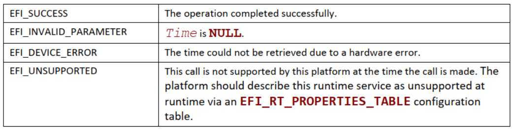

**SetTime()**

- 概要（Summary）

    设置当前本地时间和日期信息。

- 原型（Prototype）

    ```c
    typedef EFI_STATUS SetTime (
        IN EFI_TIME  *Time
    );
    ```

- 参数（Parameters）

    *Time*：指向当前时间的指针。`EFI_TIME` 类型在 `GetTime()` 函数描述中定义。对 `EFI_TIME` 结构的不同字段执行完整的错误检查（有关完整详细信息，请参阅 `GetTime()` 函数描述中的 `EFI_TIME` 定义），如果任何字段超出范围，则返回 `EFI_INVALID_PARAMETER`。

- 描述（Description）

    `SetTime()` 函数将实时时钟设备设置为提供的时间，并记录当前时区和夏令时信息。`SetTime()` 函数不允许根据当前时间循环。例如，如果设备不支持亚分辨率时间的硬件重置，则代码不会通过等待时间回绕来实现该功能。

    在运行期间，如果平台中存在 PC-AT CMOS 设备，则调用者必须在调用 `SetTime()` 之前同步对设备的访问。

- 返回的状态码（Status Codes Returned）

    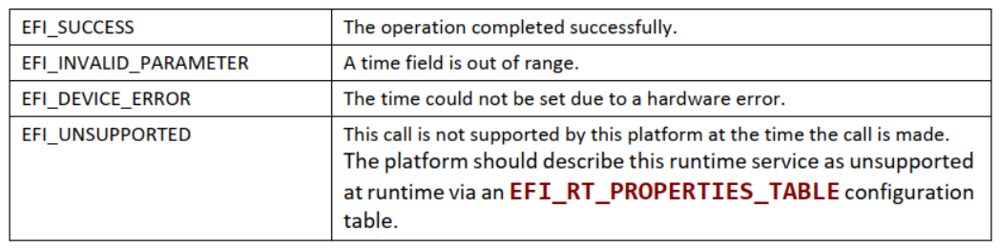

**GetWakeupTime()**

- 概要（Summary）

    返回当前唤醒闹钟设置。

- 原型（Prototype）

    ```c
    typedef EFI_STATUS GetWakeupTime (
        OUT BOOLEAN   *Enabled,
        OUT BOOLEAN   *Pending,
        OUT EFI_TIME  *Time
    );
    ```

- 参数（Parameters）

    *Enabled*：指示警报当前是启用还是禁用；

    *Pending*：指示警报信号是否未决并需要确认；

    *Time*：当前闹钟设置。`EFI_TIME` 类型在 `GetTime()` 函数描述中定义。

- 描述（Description）

    闹钟时间可以从设置的闹钟时间四舍五入到闹钟设备的分辨率内。闹钟设备的分辨率定义为一秒。

    在运行时期间，如果平台中存在 PC-AT CMOS 设备，则调用者必须在调用 `GetWakeupTime()` 之前同步对设备的访问。

- 返回的状态码（Status Codes Returned）

    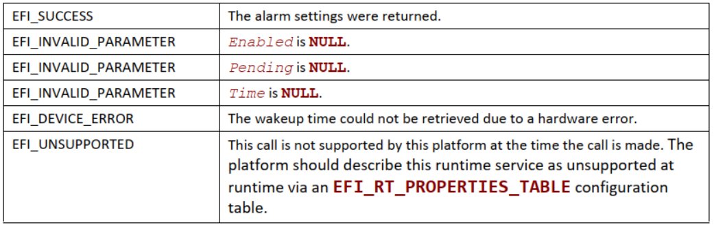

**SetWakeupTime()**

- 概要（Summary）

    设置系统唤醒闹钟时间。

- 原型（Prototype）

    ```c
    typedef EFI_STATUS SetWakeupTime (
        IN BOOLEAN   Enable,
        IN EFI_TIME  *Time OPTIONAL
    );
    ```

- 参数（Parameters）

    *Enable*：启用或禁用唤醒警报；

    *Time*：如果 *Enable* 为 `TRUE`，则为设置唤醒警报的时间。`EFI_TIME` 类型在 `GetTime()` 函数描述中定义。如果 *Enable* 为 `FALSE`，则此参数是可选的，并且可以为 `NULL`。

- 描述（Description）

    设置系统唤醒警报会使系统在设置的时间唤醒或开机。当警报触发时，警报信号将被锁存，直到通过调用 `SetWakeupTime()` 确认以禁用警报。如果警报在系统进入休眠或关闭状态之前触发，由于警报信号被锁存，系统将立即唤醒。如果在系统关闭且没有足够的电力启动系统时发出警报，系统会在电源恢复时启动。

    对于 ACPI 感知操作系统，此函数仅处理为所需的唤醒时间编程唤醒警报。操作系统仍然像往常一样通过 ACPI 电源管理寄存器组控制唤醒事件。

    唤醒警报的分辨率定义为 1 秒。

    在运行期间，如果平台中存在 PC-AT CMOS 设备，则调用者必须在调用 `SetWakeupTime()` 之前同步对设备的访问。

- 返回的状态码（Status Codes Returned）

    

## 虚拟内存服务（Virtual Memory Services）

本节包含操作系统在运行时可选择使用的虚拟内存支持的函数定义。如果操作系统选择以虚拟寻址模式而不是平面物理模式进行 EFI 运行时服务调用，则操作系统必须使用本节中的服务将 EFI 运行时服务从平面物理寻址切换到虚拟寻址。Table 8-6 列出了本节中描述的虚拟内存服务函数。系统固件必须遵循 EFI 内存映射布局中 **Section 2.3.2** 到 **Section 2.3.2** 中概述的特定于处理器的规则，以使操作系统能够进行所需的虚拟映射。

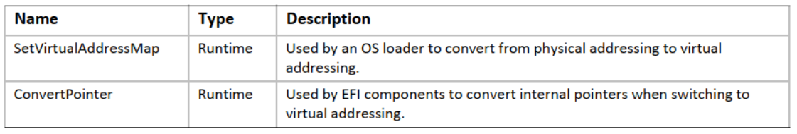

**SetVirtualAddressMap()**

- 概要（Summary）

    将 EFI 固件的运行时寻址模式从物理更改为虚拟。

- 原型（Prototype）

    ```c
    typedef EFI_STATUS SetVirtualAddressMap (
        IN UINTN                  MemoryMapSize,
        IN UINTN                  DescriptorSize,
        IN UINT32                 DescriptorVersion,
        IN EFI_MEMORY_DESCRIPTOR  *VirtualMap
    );
    ```

- 参数（Parameters）

    *MemoryMapSize*：*VirtualMap* 的字节大小；

    *DescriptorSize*：*VirtualMap* 中 *entry* 的大小（以字节为单位）；

    *DescriptorVersion*：*VirtualMap* 中结构 *entry* 的版本；

    *VirtualMap*：包含所有运行时范围的新虚拟地址映射信息的内存描述符数组。`EFI_MEMORY_DESCRIPTOR` 类型在 `EFI_BOOT_SERVICES.GetMemoryMap()` 函数描述中定义。

- 描述（Description）

    OS 加载程序使用 `SetVirtualAddressMap()` 函数。该函数只能在运行时调用，并由系统内存映射的所有者调用：即调用 `EFI_BOOT_SERVICES.ExitBootServices()` 的组件。所有类型为 `EVT_SIGNAL_VIRTUAL_ADDRESS_CHANGE` 的事件都必须在 `SetVirtualAddressMap()` 返回之前发出信号。

    此调用将 EFI 固件的运行时组件的地址更改为 *VirtualMap* 中提供的新虚拟地址。提供的 *VirtualMap* 必须在 `ExitBootServices()` 处为内存映射中的每个条目提供一个新的虚拟地址，这些条目被标记为需要运行时使用。*VirtualMap* 中的所有虚拟地址字段都必须在 4 KiB 边界上对齐。

    必须使用物理映射来调用 `SetVirtualAddressMap()`。从此函数成功返回后，系统必须使用新分配的虚拟映射进行任何未来调用。所有地址空间映射都必须根据原始地址映射中指定的可缓存性标志来完成。

    调用此函数时，将通知所有注册为在地址映射更改时发出信号的事件。收到通知的每个组件必须更新其新地址的任何内部指针。这可以通过 `ConvertPointer()` 函数来完成。通知所有事件后，EFI 固件会重新应用映像“修复”信息，以虚拟方式将所有运行时映像重新定位到它们的新地址。此外，EFI 运行时服务表中除 *SetVirtualAddressMap* 和 *ConvertPointer* 之外的所有字段都必须使用 `ConvertPointer()` 服务从物理指针转换为虚拟指针。`SetVirtualAddressMap()` 和 `ConvertPointer()` 服务只能在物理模式下调用，因此不需要将它们从物理指针转换为虚拟指针。EFI 系统表的几个字段必须使用 `ConvertPointer()` 服务从物理指针转换为虚拟指针。这些字段包括 *FirmwareVendor*、*RuntimeServices* 和 *ConfigurationTable*。由于 EFI 运行时服务表和 EFI 系统表的内容都被该服务修改，因此必须重新计算 EFI 运行时服务表和 EFI 系统表的 32 位 CRC。

    虚拟地址映射只能应用一次。一旦运行时系统处于虚拟模式，对该函数的调用将返回 `EFI_UNSUPPORTED`。

- 返回的状态码（Status Codes Returned）

    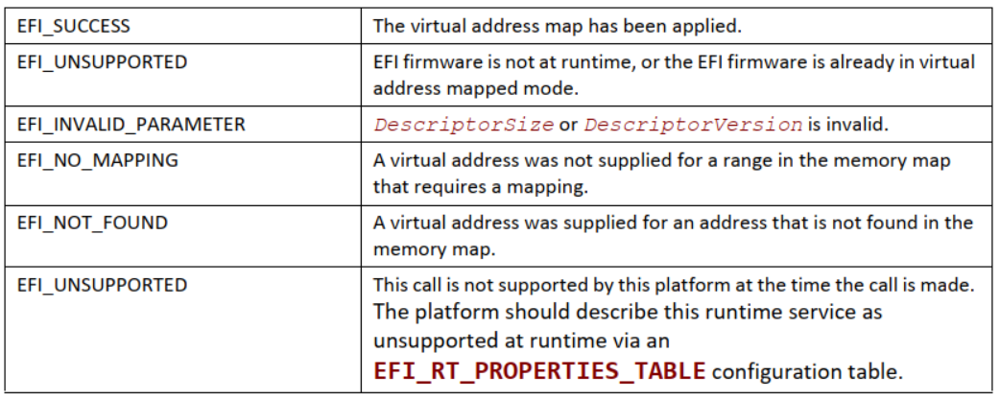

**ConvertPointer()**

- 概要（Summary）

    确定要在后续内存访问中使用的新虚拟地址。

- 原型（Prototype）

    ```c
    typedef EFI_STATUS ConvertPointer (
        IN UINTN  DebugDisposition,
        IN VOID   **Address
    );
    ```

- 参数（Parameters）

    *DebugDisposition*：为正在转换的指针提供类型信息。参见“相关定义”。

    *Address*：指向要固定为正在应用的新虚拟地址映射所需的值的指针的指针。

- 相关定义（Related Definitions）

    ```c
    //*******************************************************
    // EFI_OPTIONAL_PTR
    //*******************************************************
    #define EFI_OPTIONAL_PTR  0x00000001
    ```

- 描述（Description）

    EFI 组件在 `SetVirtualAddressMap()` 操作期间使用 `ConvertPointer()` 函数。在执行 `SetVirtualAddressMap()` 期间，必须使用物理地址指针调用 `ConvertPointer()`。

    `ConvertPointer()` 函数将 *Address* 指向的当前指针更新为新地址映射的正确值。只有运行时组件需要执行此操作。`EFI_BOOT_SERVICES.CreateEvent()` 函数用于创建一个事件，该事件将在地址映射发生变化时被通知。必须更新组件已分配或指定的所有指针。

    如果指定了 `EFI_OPTIONAL_PTR` 标志，则允许被转换的指针为 `NULL`。

    一旦所有组件都收到地址映射更改的通知，固件就会修复嵌入任何运行时映像中的任何编译指针。

- 返回的状态码（Status Codes Returned）

    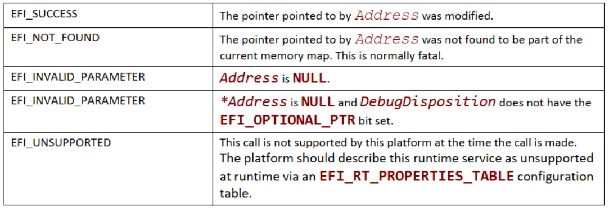

## 杂项运行时服务（Miscellaneous Runtime Services）

本节包含其他地方未定义但需要完成 EFI 环境定义的运行时服务的其余函数定义。Table 8-7 列出了杂项运行时服务。

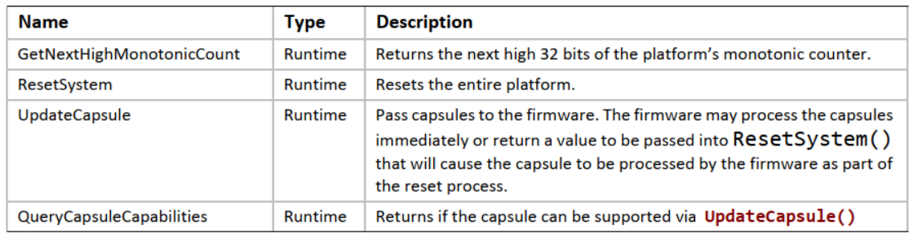

### 重置系统（Reset System）

**ResetSystem()**

- 概要（Summary）

    重置整个平台。如果平台支持 `EFI_RESET_NOTIFICATION_PROTOCOL`，则在完成平台重置之前，必须调用所有挂起的通知。

- 原型（Prototype）

    ```c
    typedef VOID (EFIAPI *EFI_RESET_SYSTEM) (
        IN EFI_RESET_TYPE  ResetType,
        IN EFI_STATUS      ResetStatus,
        IN UINTN           DataSize,
        IN VOID            *ResetData OPTIONAL
    );
    ```

- 参数（Parameters）

    *ResetType*：要执行的重置类型。`EFI_RESET_TYPE` 类型在下面的“相关定义”中定义；

    *ResetStatus*：重置的状态代码。如果系统重置是正常操作的一部分，则状态代码将为 `EFI_SUCCESS`。如果系统重置是由于某种类型的故障，将使用最合适的 EFI 状态代码；

    *DataSize*：*ResetData* 的大小（以字节为单位）；

    *ResetData*：对于 *EfiResetCold*、*EfiResetWarm* 或 *EfiResetShutdown* 的 *ResetType*，数据缓冲区以 `Null` 终止字符串开头，后面可以选择附加二进制数据。该字符串是调用者可以用来进一步指示系统重置原因的描述。对于 *EfiResetPlatformSpecific* 的 *ResetType*，数据缓冲区也以 `Null` 终止的字符串开头，后跟描述要执行的特定重置类型的 `EFI_GUID`。

- 相关定义（Related Definitions）

    ```c
    //*******************************************************
    // EFI_RESET_TYPE
    //*******************************************************
    typedef enum {
        EfiResetCold,
        EfiResetWarm,
        EfiResetShutdown,
        EfiResetPlatformSpecific
    } EFI_RESET_TYPE;
    ```

- 描述（Description）

    `ResetSystem()` 函数重置整个平台，包括所有处理器和设备，并重新启动系统。

    使用 *EfiResetCold* 的 *ResetType* 调用此接口会导致系统范围的重置。这会将系统内的所有电路设置为其初始状态。这种类型的复位与系统操作异步，并且在不考虑周期边界的情况下进行操作。*EfiResetCold* 等同于系统电源循环。

    使用 *EfiResetWarm* 的 *ResetType* 调用此接口会导致系统范围的初始化。处理器被设置为它们的初始状态，挂起的周期没有被破坏。如果系统不支持此重置类型，则必须执行 *EfiResetCold*。

    使用 *EfiResetShutdown* 的 *ResetType* 调用此接口会导致系统进入等效于 ACPI G2/S5 或 G3 状态的电源状态。如果系统不支持这种重置类型，那么当系统重新启动时，它应该显示 *EfiResetCold* 属性。

    使用 *EfiResetPlatformSpecific* 的 *ResetType* 调用此接口会导致系统范围的重置。重置的确切类型由 `EFI_GUID` 定义，该 `EFI_GUID` 跟随传递到 *ResetData* 的 `Null` 终止的 *Unicode* 字符串。如果平台无法识别 *ResetData* 中的 `EFI_GUID`，则平台必须选择支持的重置类型来执行。该平台可以选择记录来自发生的任何非正常重置的参数。

    `ResetSystem()` 函数不返回。

### 获取下一个高单调计数（Get Next High Monotonic Count）

本节介绍 *GetNextHighMonotonicCount* 运行时服务及其关联的数据结构。

**GetNextHighMonotonicCount()**

- 概要（Summary）

    返回平台单调计数器的下一个高 32 位。

- 原型（Prototype）

    ```c
    typedef EFI_STATUS GetNextHighMonotonicCount (
        OUT UINT32  *HighCount
    );
    ```

- 参数（Parameters）

    *HighCount*：指向返回值的指针。

- 描述（Description）

    `GetNextHighMonotonicCount()` 函数返回平台单调计数器的下一个高 32 位。

    该平台的单调计数器由两个 32 位量组成：高 32 位和低 32 位。在引导服务期间，低 32 位值是易变的：它在每次系统重置时重置为零，并在每次调用 `GetNextMonotonicCount()` 时增加 1。高 32 位值是非易失性的，每当系统重置、调用 `GetNextHighMonotonicCount()` 或低 32 位计数（由 `GetNextMonoticCount()` 返回）溢出时都会增加 1。

    `EFI_BOOT_SERVICES.GetNextMonotonicCount()` 函数仅在引导服务时可用。如果操作系统希望将平台单调计数器扩展到运行时，它可以通过使用 `GetNextHighMonotonicCount()` 来实现。为此，在调用 `EFI_BOOT_SERVICES.ExitBootServices()` 之前，操作系统将调用 `GetNextMonotonicCount()` 以获取当前平台单调计数。然后操作系统将提供一个接口，通过以下方式返回下一个计数：

    1. 最后一次计数加 1；

    2. 在计数的低 32 位溢出之前，调用 `GetNextHighMonotonicCount()`。这会将平台的单调计数的非易失性部分的高 32 位增加 1。

    该函数只能在运行时调用。

- 返回的状态码（Status Codes Returned）

    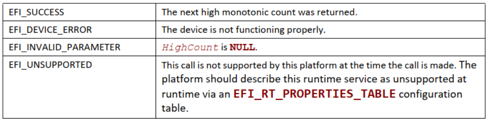

### 更新胶囊（Update Capsule）

此运行时函数允许调用者将信息传递给固件。*Update Capsule* 通常用于更新固件 FLASH 或操作系统，让信息在系统重置时保持不变。

**UpdateCapsule()**

- 概要（Summary）

    通过虚拟和物理映射将胶囊传递给固件。根据预期消耗量，固件可能会立即处理胶囊。如果有效负载应在系统重置期间持续存在，则必须将 `EFI_QueryCapsuleCapabilities` 返回的重置值传递到 `ResetSystem()` 并将导致胶囊作为重置过程的一部分由固件处理。

- 原型（Prototype）

    ```c
    typedef EFI_STATUS UpdateCapsule (
        IN EFI_CAPSULE_HEADER    **CapsuleHeaderArray,
        IN UINTN                 CapsuleCount,
        IN EFI_PHYSICAL_ADDRESS  ScatterGatherList OPTIONAL
    );
    ```

- 参数（Parameters）

    *CapsuleHeaderArray*：指向被传递到更新胶囊的胶囊的虚拟指针数组的虚拟指针。假定每个胶囊存储在连续的虚拟内存中。*CapsuleHeaderArray* 中的胶囊必须与 *ScatterGatherList* 中的胶囊相同。*CapsuleHeaderArray* 必须具有与 *ScatterGatherList* 相同顺序的胶囊。

    *CapsuleCount*：*CapsuleHeaderArray* 中指向 `EFI_CAPSULE_HEADER` 的指针数。

    *ScatterGatherList*：指向一组 `EFI_CAPSULE_BLOCK_DESCRIPTOR` 的物理指针，描述一组胶囊在物理内存中的位置。请参阅“相关定义”以了解如何通过此接口传递一个以上的胶囊。*ScatterGatherList* 中的胶囊必须与 *CapsuleHeaderArray* 的顺序相同。仅当 *capsules* 被定义为在系统重置时持续存在时才引用此参数。

- 相关定义（Related Definitions）

    ```c
    typedef struct {
        UINT64 Length;
        union {
            EFI_PHYSICAL_ADDRESS DataBlock;
            EFI_PHYSICAL_ADDRESS ContinuationPointer;
        } Union;
    } EFI_CAPSULE_BLOCK_DESCRIPTOR;
    ```

    *Length*：`DataBlock/ContinuationPointer` 指向的数据的字节长度；

    *DataBlock*：数据块的物理地址。如果 *Length* 不等于零，则使用该联合成员；

    *ContinuationPointer*：另一个 `EFI_CAPSULE_BLOCK_DESCRIPTOR` 结构块的物理地址。如果 *Length* 等于零，则使用该联合成员。如果 *ContinuationPointer* 为零，则此 *entry* 表示列表的末尾。

- 相关定义（Related Definitions）

    此数据结构定义操作系统传递给固件的 *ScatterGatherList* 列表。*ScatterGatherList* 表示一个结构体数组，以长度为 0 且 *DataBlock* 物理地址为 0 的结构体成员结束。如果 *Length* 为 0 且 *DataBlock* 物理地址不为 0，则指定的物理地址称为“连续指针”，它指向 `EFI_CAPSULE_BLOCK_DESCRIPTOR` 结构的进一步列表。连续指针用于允许分散收集列表包含在不连续的物理内存中。它还用于允许一次通过多个胶囊。

    ```c
    typedef struct {
        EFI_GUID  CapsuleGuid;
        UINT32    HeaderSize;
        UINT32    Flags;
        UINT32    CapsuleImageSize;
    } EFI_CAPSULE_HEADER;
    ```

    *CapsuleGuid*：定义胶囊内容的 GUID；

    *HeaderSize*：胶囊标头的大小。这可能大于 `EFI_CAPSULE_HEADER` 的大小，因为 *CapsuleGuid* 可能暗示扩展的标头 *entry*；

    *Flags*：标志位[15:0] 由 CapsuleGuid 定义，标志位[31:16] 由本规范定义；

    *CapsuleImageSize*：胶囊的字节大小（包括胶囊标头）。

    ```c
    #define CAPSULE_FLAGS_PERSIST_ACROSS_RESET   0x00010000
    #define CAPSULE_FLAGS_POPULATE_SYSTEM_TABLE  0x00020000
    #define CAPSULE_FLAGS_INITIATE_RESET         0x00040000
    ```

    注：具有 `CAPSULE_FLAGS_INITIATE_RESET` 标志的胶囊必须在其标头中也设置 `CAPSULE_FLAGS_PERSIST_ACROSS_RESET`。遇到在其标头中设置了 `CAPSULE_FLAGS_INITIATE_RESET` 标志的胶囊的固件将启动与传入的胶囊请求兼容的平台重置，并且不会返回给调用者。

    ```c
    typedef struct {
        UINT32  CapsuleArrayNumber;
        VOID*   CapsulePtr[1];
    } EFI_CAPSULE_TABLE;
    ```

    *CapsuleArrayNumber*：胶囊数组中的 *entry* 数；

    *CapsulePtr*：指向包含相同 *CapsuleGuid* 值的胶囊数组的指针。每个 *CapsulePtr* 都指向 `EFI_CAPSULE_HEADER` 的一个实例，胶囊数据连接在其末端。

- 描述（Description）

    `UpdateCapsule()` 函数允许操作系统将信息传递给固件。`UpdateCapsule()` 函数支持将操作系统虚拟内存中的胶囊传递回固件。每个 *capsule* 都包含在操作系统的连续虚拟内存范围内，但 *capsules* 的虚拟和物理映射都会传递给固件。

    如果 *capsule* 在其标头设置了 `CAPSULE_FLAGS_PERSIST_ACROSS_RESET` 标志，则固件将在系统重置后处理 *capsules*。调用者必须确保使用从 *QueryCapsuleCapabilities* 获得的所需重置值来重置系统。如果未设置此标志，固件将立即处理胶囊。

    具有 `CAPSULE_FLAGS_POPULATE_SYSTEM_TABLE` 标志的胶囊必须在其标头中也设置 `CAPSULE_FLAGS_PERSIST_ACROSS_RESET`。

    处理在其标头中设置了 CAPSULE_FLAGS_POPULATE_SYSTEM_TABLE 标志的胶囊的固件会将胶囊的内容从 *ScatterGatherList* 合并到一个连续的缓冲区中，然后必须在系统重置后在 EFI 系统表中放置指向该合并胶囊的指针。搜索此胶囊的代理将在 `EFI_CONFIGURATION_TABLE` 中查找并搜索胶囊的 GUID 和关联的指针以在重置后检索数据。

    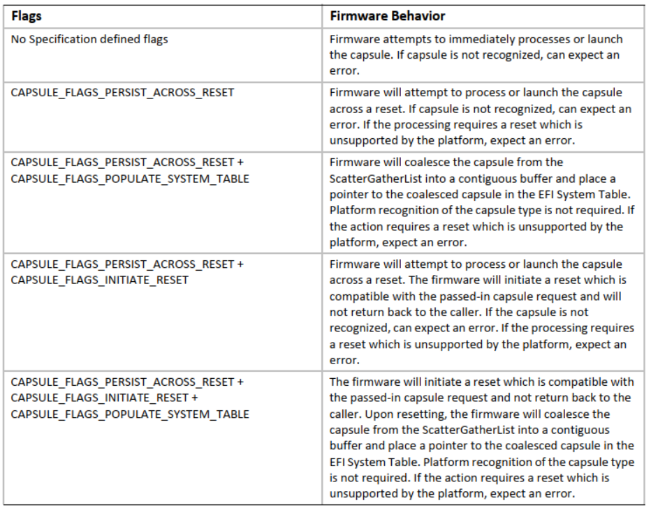

    EFI 系统表条目必须使用 `EFI_CAPSULE_HEADER` 的 *CapsuleGuid* 字段中的 GUID。EFI 系统表 *entry* 必须指向包含相同 *CapsuleGuid* 值的胶囊数组。该数组必须以表示胶囊数组大小的 UINT32 为前缀。

    这组胶囊由 *ScatterGatherList* 和 *CapsuleHeaderArray* 指向，因此固件将知道操作系统分配的缓冲区的物理地址和虚拟地址。*scatter-gather* 列表支持 *capsule* 的虚拟地址范围是连续的，但物理地址不连续的情况。

    在禁用内存管理单元时，处理器的主内存视图与缓存不一致的架构上，`UpdateCapsule()` 的调用方必须在调用 `UpdateCapsul()` 之前对每个 *ScatterGatherList* 元素的主内存执行缓存维护。此要求仅在操作系统调用 `ExitBootServices()` 后适用。

    如果传入此函数的任何胶囊遇到错误，则不会处理整组胶囊，并将遇到的错误返回给调用者。

- 返回的状态码（Status Codes Returned）

    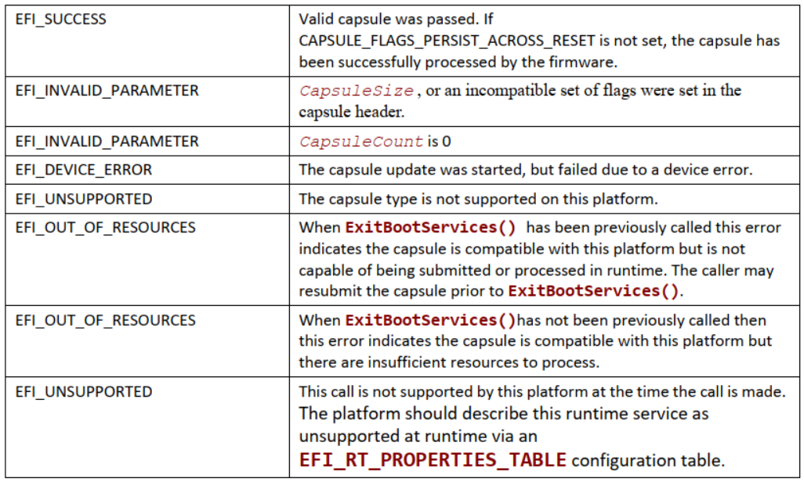

#### 胶囊定义（Capsule Definition）

胶囊只是一组以 `EFI_CAPSULE_HEADER` 开头的连续数据。标头中的 *CapsuleGuid* 字段定义了胶囊的格式。

胶囊内容旨在从存在操作系统的环境与系统固件进行通信。为了允许 *capsule* 在系统重置时持续存在，*capsule* 的描述需要一定程度的间接性，因为操作系统主要使用虚拟内存，而固件在启动时使用物理内存。这个抽象级别是通过 `EFI_CAPSULE_BLOCK_DESCRIPTOR` 完成的。`EFI_CAPSULE_BLOCK_DESCRIPTOR` 允许操作系统分配连续的虚拟地址空间，并将该地址空间描述为一组不连续的物理地址范围给固件。向固件传递物理地址和虚拟地址以及指针来描述胶囊，因此固件可以立即处理胶囊或将胶囊的处理推迟到系统重置之后。

在大多数指令集和操作系统架构中，物理内存的分配只能在“页面”粒度（范围从 4 KiB 到至少 1 MiB）上进行。`EFI_CAPSULE_BLOCK_DESCRIPTOR` 必须具有以下属性以确保数据的安全和定义良好的转换：

- 每个新胶囊必须从新的内存页开始;

- 除最后一页外，所有页面都必须被胶囊完全填满；

    - 填充标头以使其消耗整页数据以允许通过胶囊传递页面对齐的数据结构是合法的。最后一页必须至少有一个字节的胶囊；

- 页面必须自然对齐；

- 页面不能重叠；

- 固件可能永远不会假设操作系统正在使用的页面大小。

多个胶囊可以连接在一起，并通过一次调用 `UpdateCapsule()` 传递。胶囊的物理地址描述通过将第一个胶囊的终止 `EFI_CAPSULE_BLOCK_DESCRIPTOR` *entry* 转换为一个延续指针，使其指向代表第二个胶囊开始的 `EFI_CAPSULE_BLOCK_DESCRIPTOR` 来连接。只有一个终止 `EFI_CAPSULE_BLOCK_DESCRIPTOR` *entry*，它位于链中最后一个胶囊的末尾。

必须使用以下算法在单个分散收集列表中查找多个胶囊：

- 查看 *capsule* 标头以确定 *capsule* 的大小；

    - 第一个 *Capsule* 标头始终由第一个 `EFI_CAPSULE_BLOCK_DESCRIPTOR` *entry* 指向；

- 遍历 `EFI_CAPSULE_BLOCK_DESCRIPTOR` 列表，保持每个 *entry* 代表的大小的运行计数；

- 如果 `EFI_CAPSULE_BLOCK_DESCRIPTOR` *entry* 是一个延续指针，并且正在运行的当前胶囊大小计数大于或等于当前胶囊的大小，则这是下一个胶囊的开始；

- 使新胶囊成为当前胶囊并重复该算法。

Figure 8-1 显示了描述两个胶囊的 `EFI_CAPSULE_BLOCK_DESCRIPTOR` 结构的 *Scatter-Gather* 列表。图的左侧显示了胶囊的操作系统视图，作为两个独立的连续虚拟内存缓冲区。图中的中心显示了系统内存中数据的布局。该图的右侧显示了传递到固件中的 *ScatterGatherList* 列表。由于有两个胶囊，因此存在两个独立的 `EFI_CAPSULE_BLOCK_DESCRIPTOR` 列表，它们通过第一个列表中的延续指针连接在一起。

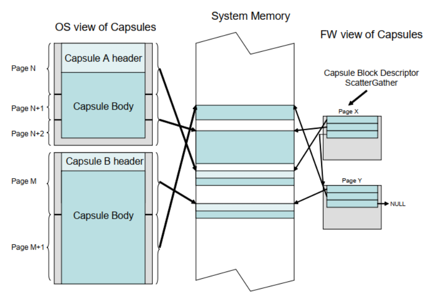

**EFI_MEMORY_RANGE_CAPSULE_GUID**

这种胶囊结构定义提供了一种方法，第三方组件（例如操作系统）可以通过这种方法向固件描述内存中的哪些区域在下一次重置时应该保持不变。

对此 *capsule* 的支持是可选的。对于支持此胶囊的平台，它们必须使用 `EFI_MEMORY_RANGE_CAPSULE_GUID` 作为 GUID/指针对中的 GUID 在 EFI 配置表中公布 `EFI_MEMORY_RANGE_CAPSULE`。

```c
// {0DE9F0EC-88B6-428F-977A-258F1D0E5E72}
 #define EFI_MEMORY_RANGE_CAPSULE_GUID \
{ 0xde9f0ec, 0x88b6, 0x428f, \
{ 0x97, 0x7a, 0x25, 0x8f, 0x1d, 0xe, 0x5e, 0x72 } }
```

内存范围描述符。

```c
typedef struct {
    EFI_PHYSICAL_ADDRESS  Address;
    UINT64                Length
} EFI_MEMORY_RANGE;
```

*Address*：正在描述的内存位置的物理地址。

*Length*：以字节为单位的长度。

描述平台固件应保持不变的内存范围的胶囊描述符。

```c
typedef struct {
    EFI_CAPSULE_HEADER  Header;
    UINT32              OsRequestedMemoryType;
    UINT64              NumberOfMemoryRanges;
    EFI_MEMORY_RANGE    MemoryRanges[]
} EFI_MEMORY_RANGE_CAPSULE;
```

*Header*：`Header.CapsuleGuid = EFI_MEMORY_RANGE_CAPSULE_GUI`，`Header.Flags = CAPSULE_FLAGS_PERSIST_ACROSS_RESET`。

*OsRequestedMemoryType*：必须在 `0x80000000-0xFFFFFFFF` 范围内。当 UEFI 固件处理胶囊时，MemoryRanges[] 中描述的内容将在 EFI 内存映射中显示为 *OsRequestedMemoryType* 值。

*NumberofMemoryRanges*：MemoryRanges[] *entry* 的数量。必须是 1 或更大的值。

*MemoryRanges[]*：内存范围数组。等同于 MemoryRanges[NumberOfMemoryRanges]。

对于打算支持 `EFI_MEMORY_RANGE_CAPSULE` 的平台，它必须使用 `EFI_MEMORY_RANGE_CAPSULE_GUID` 作为 GUID/指针对中的 GUID 在 EFI 配置表中公布 `EFI_MEMORY_RANGE_CAPSULE_RESULT`。

```c
typedef struct {
    UINT64  FirmwareMemoryRequirement;
    UINT64  NumberOfMemoryRanges
} EFI_MEMORY_RANGE_CAPSULE_RESULT
```

*FirmwareMemoryRequirement*：UEFI 固件初始化所需的最大内存量（以字节为单位）。

*NumberofMemoryRanges*：如果没有处理 `EFI_MEMORY_RANGE_CAPSULE`，则为 0。如果处理了 `EFI_MEMORY_RANGE_CAPSULE`，则此数字将与 `EFI_MEMORY_RANGE_CAPSULE.NumberOfMemoryRanges` 值相同。

**QueryCapsuleCapabilities()**

- 概要（Summary）

返回是否可以通过 `UpdateCapsule()` 支持胶囊。

- 原型（Prototype）

    ```c
    typedef EFI_STATUS QueryCapsuleCapabilities {
        IN EFI_CAPSULE_HEADER  **CapsuleHeaderArray,
        IN UINTN               CapsuleCount,
        OUT UINT64             *MaximumCapsuleSize,
        OUT EFI_RESET_TYPE     *ResetType
    };
    ```

- 参数（Parameters）

    *CapsuleHeaderArray*：指向被传递到更新胶囊的胶囊的虚拟指针数组的虚拟指针。假定胶囊存储在连续的虚拟内存中。

    *CapsuleCount*：*CapsuleHeaderArray* 中指向 `EFI_CAPSULE_HEADER` 的指针数。

    *MaximumCapsuleSize*：在输出时，`UpdateCapsule()` 可以通过 *CapsuleHeaderArray* 和 *ScatterGatherList* 作为 `UpdateCapsule()` 的参数支持的最大大小（以字节为单位）。输入未定义。

    *ResetType*：返回胶囊更新所需的重置类型。输入未定义。

- 描述（Description）

    `QueryCapsuleCapabilities()` 函数允许调用者测试是否可以通过 `UpdateCapsule()` 更新一个或多个胶囊。检查胶囊标头中的标志值和整个胶囊的大小。

    如果调用者需要查询通用胶囊功能，则可以构造一个伪造的 `EFI_CAPSULE_HEADER`，其中 *CapsuleImageSize* 等于 *HeaderSize*，即等于 sizeof (EFI_CAPSULE_HEADER)。要确定重置要求，应在 `EFI_CAPSULE_HEADER` 的标志字段中设置 `CAPSULE_FLAGS_PERSIST_ACROSS_RESET`。

- 返回的状态码（Status Codes Returned）

    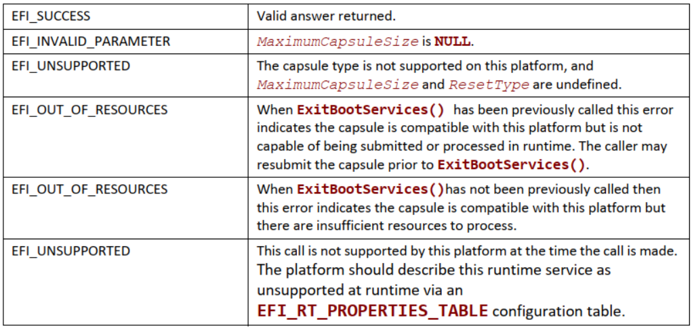

#### 在操作系统和固件之间交换信息（Exchanging information between the OS and Firmware）

固件和操作系统可以通过 *OsIndicationsSupported* 和 *OSIndications* 变量交换信息，如下所示：

- *OsIndications* 变量返回操作系统拥有的 UINT64 位掩码，用于指示操作系统希望固件启用哪些功能或操作系统希望固件执行哪些操作。操作系统将通过 `SetVariable()` 调用提供此数据；

- *OsIndicationsSupported* 变量返回固件拥有的 UINT64 位掩码，并指示固件支持哪些操作系统指示功能和操作。这个变量在每次启动时由固件重新创建，并且不能被操作系统修改。

如果固件支持操作系统请求在固件用户界面停止，则固件可以在 *OsIndicationsSupported* 变量中设置 `EFI_OS_INDICATIONS_BOOT_TO_FW_UI` 位。如果操作系统希望固件在下次启动时在固件用户界面停止，则 `EFI_OS_INDICATIONS_BOOT_TO_FW_UI` 位可以由操作系统在 *OsIndications* 变量中设置。一旦固件使用 *OsIndications* 变量中的该位并在固件用户界面停止，固件应从 *OsIndications* 变量中清除该位，以便向操作系统确认信息已被使用，更重要的是，防止固件用户 在后续启动时再次显示界面。

如果固件支持基于时间戳的撤销和“dbt”授权时间戳数据库变量，则固件可以在 *OSIndicationsSupported* 变量中设置 `EFI_OS_INDICATIONS_TIMESTAMP_REVOCATION` 位。

如果平台支持处理 **Section 23.2** 中定义的固件管理协议更新胶囊，则 `EFI_OS_INDICATIONS_FMP_CAPSULE_SUPPORTED` 位在 *OsIndicationsSupported* 变量中设置。如果在 *OsIndications* 变量中设置，则 `EFI_OS_INDICATIONS_FMP_CAPSULE_SUPPORTED` 位没有任何功能，并在下次重新启动时被清除。

如果平台支持根据 **Section 8.5.5** 处理文件胶囊，则设置 *OsIndicationsSupported* 变量中的 `EFI_OS_INDICATIONS_FILE_CAPSULE_DELIVERY_SUPPORTED` 位。

当通过 **Section 8.5.5** 的大容量存储设备方法提交胶囊时，*OsIndications* 变量中的 `EFI_OS_INDICATIONS_FILE_CAPSULE_DELIVERY_SUPPORTED` 位必须由提交者设置，以在下次重启时触发提交的胶囊处理。在重启后的处理过程中，系统固件会在所有情况下从 *OsIndications* 中清除该位。

`EFI_OS_INDICATIONS_CAPSULE_RESULT_VAR_SUPPORTED` 位在 *OsIndicationsSupported* 变量中设置，如果平台支持通过创建 **Section 8.5.6** 中定义的结果变量来报告延迟胶囊处理。如果在 *OsIndications* 中设置，则此位无效。

如果平台既支持操作系统指示重新启动时应开始操作系统定义的恢复的能力，也支持短格式文件路径媒体设备路径，则在 *OsIndicationsSupported* 变量中设置 `EFI_OS_INDICATIONS_START_OS_REVERY` 位（参见 **Section 3.1.2**）。如果在 *OsIndications* 中设置了该位，则平台固件必须在引导期间绕过 *BootOrder* 变量的处理，并直接跳到操作系统定义的恢复（参见 **Section 3.4.1**），然后是平台定义的恢复（参见 **Section 3.4.2**）。系统固件在启动操作系统定义的恢复时必须清除 *OsIndications* 中的该位。

如果平台既支持操作系统指示重新启动时应开始平台定义的恢复的能力，也支持短格式文件路径媒体设备路径，则在 *OsIndicationsSupported* 变量中设置 `EFI_OS_INDICATIONS_START_PLATFORM_RECOVERY` 位（参见 **Section 3.1.2**）。如果在 *OsIndications* 中设置了该位，则平台固件必须在引导期间绕过 *BootOrder* 变量的处理，并直接跳到平台定义的恢复（参见 **Section 3.4.2**）。系统固件在启动平台定义的恢复时必须清除 *OsIndications* 中的该位。

在所有情况下，如果在 *OsIndicationsSupported* 中设置了 `EFI_OS_INDICATIONS_START_OS_RECOVERY` 或 `EFI_OS_INDICATIONS_START_PLATFORM_RECOVERY` 之一，则两者都必须设置并受支持。

`EFI_OS_INDICATIONS_JSON_CONFIG_DATA_REFRESH` 位由提交者在 *OsIndications* 变量中设置，以触发收集当前配置并在下次启动时将刷新的数据报告给 EFI 系统配置表。如果未设置，平台将不会收集当前配置，而是将缓存的配置数据报告给 EFI 系统配置表。配置数据应使用 **Section 23.5.2** 中定义的 `EFI_JSON_CAPSULE_CONFIG_DATA` 格式安装到 EFI 系统配置表。一旦报告了刷新的数据，该位将被系统固件从 *OsIndications* 中清除。

如果在 *OsIndicationsSupported* 变量中设置，则 `EFI_OS_INDICATIONS_JSON_CONFIG_DATA_REFRESH` 位没有任何功能，并在下次重新启动时被清除。

- 相关定义（Related Definitions）

    ```c
    #define EFI_OS_INDICATIONS_BOOT_TO_FW_UI                    0x0000000000000001
    #define EFI_OS_INDICATIONS_TIMESTAMP_REVOCATION             0x0000000000000002
    #define EFI_OS_INDICATIONS_FILE_CAPSULE_DELIVERY_SUPPORTED  0x0000000000000004
    #define EFI_OS_INDICATIONS_FMP_CAPSULE_SUPPORTED            0x0000000000000008
    #define EFI_OS_INDICATIONS_CAPSULE_RESULT_VAR_SUPPORTED     0x0000000000000010
    #define EFI_OS_INDICATIONS_START_OS_RECOVERY                0x0000000000000020
    #define EFI_OS_INDICATIONS_START_PLATFORM_RECOVERY          0x0000000000000040
    #define EFI_OS_INDICATIONS_JSON_CONFIG_DATA_REFRESH         0x0000000000000080
    ```

#### 通过大容量存储设备上的文件交付胶囊（Delivery of Capsules via file on Mass Storage device）

作为 `UpdateCapsule()` 运行时 API 的替代方案，平台支持的任何类型的胶囊也可以通过目标为引导的大容量存储设备上的 EFI 系统分区内的文件传送到固件。使用此方法暂存的胶囊将在下次系统重新启动时处理。此方法仅在从使用 GPT 格式化（参见 **Section 5.3**）并且在设备映像中包含 EFI 系统分区的大容量存储设备引导时可用。当 *OsIndications* 中的 `EFI_OS_INDICATIONS_FILE_CAPSULE_DELIVERY_SUPPORTED` 位设置时，系统固件将搜索胶囊，如 **Section 8.5.4** 所述。

活动 EFI 系统分区中的目录 `\EFI\UpdateCapsule`（忽略字母大小写）被定义用于将封装体传送到固件。

大容量存储设备上的胶囊文件的二进制结构与通过 EFI RunTime API 传送的胶囊内容相同，只是不支持使用 `EFI_CAPSULE_BLOCK_DESCRIPTOR` 进行分段，并且单个胶囊必须存储在以 `EFI_CAPSULE_HEADER` 开头的文件中的连续字节中。文件的大小必须等于 `EFI_CAPSULE_HEADER.CapsuleImageSize` 否则将生成错误并忽略胶囊。在一个文件中只能提交带有单个 `EFI_CAPSULE_HEADER` 的单个胶囊，但在单次重启期间可以提交多个文件，每个文件都包含一个胶囊。

压缩包的文件名应由提交者使用适合 EFI 系统分区文件系统的 8 位 ASCII 字符选择（第 13.3.1 节）。检查和处理放置在该目录中的文件后，固件将（如果可能）删除该文件。删除在成功处理的情况下执行，也在错误的情况下执行，但未能成功删除本身不是可报告的错误。

指定目录中可以存储多个胶囊文件，每个胶囊文件包含一个胶囊图像。在多个文件的情况下，系统固件将使用基于文件名字符的 CHAR16 数值排序的字母顺序处理文件，从左到右进行比较。小写字母字符将在比较前转换为大写字母。比较不等长的文件名时，应使用空格字符来填充较短的文件名。如果文件名包含一个或多个句点字符（.），则文件名中最右边的句点和最右边的句点右侧的文本将在比较前被删除。如果文件名在排除最右边的句点之后的任何文本后具有相同的文本，则处理顺序将通过在文件名字符串中最右边的句点右侧找到的任何文本的排序来确定。

如果胶囊处理因错误而终止，则将正常处理任何剩余的附加胶囊文件。

目录 `\EFI\UpdateCapsule` 仅在活动引导选项中指定的设备上的 EFI 系统分区内检查胶囊，通过引用 *BootNext* 变量或 *BootOrder* 变量处理确定。活动引导变量是具有最高优先级 *BootNext* 或 *BootOrder* 中的变量，它指的是发现存在的设备。*BootOrder* 中但引用不存在的设备的引导变量在确定活动引导变量时将被忽略。

要检查 `\EFI\UpdateCapsule` 的设备通过引用所选活动 `Boot####` 变量中的 *FilePathList* 字段来标识。系统固件不需要检查不包含最高引导优先级的引导目标的大容量存储设备，也不需要检查第二个 EFI 系统分区而不是活动引导变量的目标。

在所有情况下，一个 *capsule* 被识别用于处理，系统在 *capsule* 处理完成后重新启动。如果设置了 *BootNext* 变量，则在执行胶囊处理时清除该变量，而无需指示变量的实际引导。

#### UEFI 变量报告成功或重启后处理胶囊时遇到的任何错误（UEFI variable reporting on the Success or any Errors encountered in processing of capsules after restart）

如果 *capsule* 的处理是（1）通过调用 `UpdateCapsule()` API 传递，但延迟到下次重新启动，或者（2）当胶囊通过大容量存储设备传递时，固件会创建 UEFI 变量，以向 *capsule* 提供商指示胶囊处理的状态。

在调用 `UpdateCapsule()` 时传递多个胶囊的情况下，或如 **Section 8.5.5** 所述的磁盘上的多个文件，或如 **Section 23.2** 所述当胶囊包含多个有效负载时，将为处理的每个胶囊有效载荷创建一个单独的结果变量。当计算出的变量名称已经存在时，固件将覆盖结果变量。然而，为了避免不必要地消耗系统变量存储，结果变量应该在检查结果状态后由胶囊提供者删除。

当整个胶囊处理发生在对 `UpdateCapsule()` 函数的调用中时，将不会使用 UEFI 变量报告。

报告变量属性将为 `EFI_VARIABLE_NON_VOLATILE + EFI_VARIABLE_BOOTSERVICE_ACCESS + EFI_VARIABLE_RUNTIME_ACCESS`。

报告变量的供应商 GUID 将为 `EFI_CAPSULE_REPORT_GUID`。报告变量的名称将是 *CapsuleNNNN*，其中 *NNNN* 是由固件选择的 4 位十六进制数。*NNNN* 的值将由固件从 *Capsule0000* 开始递增，一直持续到平台定义的最大值。

平台将在名为 `EFI_CAPSULE_REPORT_GUID:CapsuleMax` 的只读变量中发布平台最大值。*CapsuleMax* 的内容将是字符串“CapsuleNNNN”，其中 *NNNN* 是平台在滚动到 *Capsule0000* 之前使用的最高值。该平台还将发布在 `EFI_CAPSULE_REPORT_GUID:CapsuleLast` 中创建的最后一个变量的名称。

创建新的结果变量时，将覆盖任何先前具有相同名称的变量。在变量存储有限的情况下，系统固件可以选择删除最旧的报告变量以创建可用空间。如果无法释放足够的变量空间，则不会创建变量。

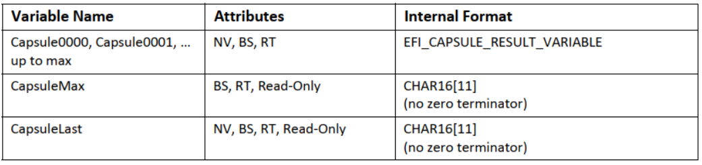

**EFI_CAPSULE_REPORT_GUID**

```c
// {39B68C46-F7FB-441B-B6EC-16B0F69821F3}
#define EFI_CAPSULE_REPORT_GUID \
{ 0x39b68c46, 0xf7fb, 0x441b, \
{0xb6, 0xec, 0x16, 0xb0, 0xf6, 0x98, 0x21, 0xf3 }};
```

**胶囊处理结果变量的结构（Structure of the Capsule Processing Result Variable）**

胶囊处理结果变量的内容总是以 `EFI_CAPSULE_RESULT_VARIABLE_HEADER` 结构开头。*CapsuleGuid* 的值决定了结果变量内容实例中可能跟随的任何附加数据。对于 *CapsuleGuid* 的某些值，可能无法定义其他数据。

如下所述，**VariableTotalSize** 是完整结果变量的大小，包括整个标头和特定 *CapsuleGuid* 类型所需的任何其他数据。

```c
typedef struct {
    UINT32      VariableTotalSize;
    UINT32      Reserved; //for alignment
    EFI_GUID    CapsuleGuid;
    EFI_TIME    CapsuleProcessed;
    EFI_STATUS  CapsuleStatus
} EFI_CAPSULE_RESULT_VARIABLE_HEADER;
```

*VariableTotalSize*：变量的大小（以字节为单位），包括 *CapsuleGuid* 指定的标头之外的任何数据。

*CapsuleGuid*：来自 `EFI_CAPSULE_HEADER` 的引导。

*CapsuleProcessed*：处理完成时使用系统时间的 *TimeStamp*。

*CapsuleStatus*：胶囊处理的结果。任何错误代码的准确解释可能取决于处理的胶囊类型。

**CapsuleGuid 为 EFI_FIRMWARE_MANAGEMENT_CAPSULE_ID_GUID 时的附加结构（Additional Structure When CapsuleGuid is EFI_FIRMWARE_MANAGEMENT_CAPSULE_ID_GUID）**

胶囊处理结果变量的内容总是以 `EFI_CAPSULE_RESULT_VARIABLE_HEADER` 开头。当 *CapsuleGuid* 是 `EFI_FIRMWARE_MANAGEMENT_CAPSULE_ID_GUID` 时，标头后面是 `EFI_CAPSULE_RESULT_VARIABLE_FMP` 定义的附加数据。

```c
typedef struct {
    UINT16    Version;
    UINT8     PayloadIndex;
    UINT8     UpdateImageIndex;
    EFI_GUID  UpdateImageTypeId
    // CHAR16 CapsuleFileName[];
    // CHAR16 CapsuleTarget[];
} EFI_CAPSULE_RESULT_VARIABLE_FMP;
```

*Version*：此结构的版本，当前为 `0x00000001`。

*PayloadIndex*：FMP 胶囊中有效载荷的索引，从零开始，经过处理以生成此报告。

*UpdateImageIndex*：来自 `EFI_FIRMWARE_MANAGEMENT_CAPSULE_IMAGE_HEADER` 的 *UpdateImageIndex*（从 UINT8 无符号转换为 UINT16 后）。

*UpdateImageTypeId*：来自 `EFI_FIRMWARE_MANAGEMENT_CAPSULE_IMAGE_HEADER` 的 *UpdateImageTypeId Guid*。

*CapsuleFileName*：如果是从磁盘加载的胶囊，则以零结尾的数组包含已处理的胶囊文件名。如果胶囊直接提交给 `UpdateCapsule()`，则没有文件名，并且此字段需要包含一个 16 位零字符，该字符包含在 *VariableTotalSize* 中。

*CapsuleTarget*：该字段将包含一个以零结尾的 CHAR16 字符串，其中包含设备发布固件管理协议（如果存在）的设备路径的文本表示。如果设备路径不存在并且目标不为固件所知，或者有效载荷被策略阻止或跳过，则此字段需要包含一个 16 位零字符，该字符包含在 *VariableTotalSize* 中。

**CapsuleGuid 为 EFI_JSON_CAPSULE_ID_GUID 时的附加结构（Additional Structure When CapsuleGuid is EFI_JSON_CAPSULE_ID_GUID）**

胶囊处理结果变量的内容总是以 `EFI_CAPSULE_RESULT_VARIABLE_HEADER` 开头。当 *CapsuleGuid* 为 `EFI_JSON_CAPSULE_ID_GUID` 时，标头后跟 `EFI_CAPSULE_RESULT_VARIABLE_JSON` 定义的附加数据。

```c
typedef struct {
    UINT32  Version;
    UINT32  CapsuleId;
    UINT32  RespLength;
    UINT8   Resp[]
} EFI_CAPSULE_RESULT_VARIABLE_JSON;
```

*Version*：此结构的版本，当前为 `0x00000001`。

*CapsuleId*：处理结果记录在该变量中的胶囊的唯一标识符。`0x00000000 – 0xEFFFFFFF` – 实现保留，`0xF0000000 – 0xFFFFFFFF` – 规范保留，
`#define REDFISH_DEFINED_JSON_SCHEMA 0xF000000`，JSON 负载应符合 Redfish-defined JSON 架构，请参阅 DMTF-Redfish 规范。

*RespLength*：*Resp* 的字节长度。

*Resp*：可变长度缓冲区，其中包含向将 JSON 胶囊传送到系统的调用方回复的 JSON 负载。回复有效负载中使用的 JSON 模式的定义超出了本规范的范围。

**CapsuleStatus 中返回的状态码（Status Codes Returned in CapsuleStatus）**

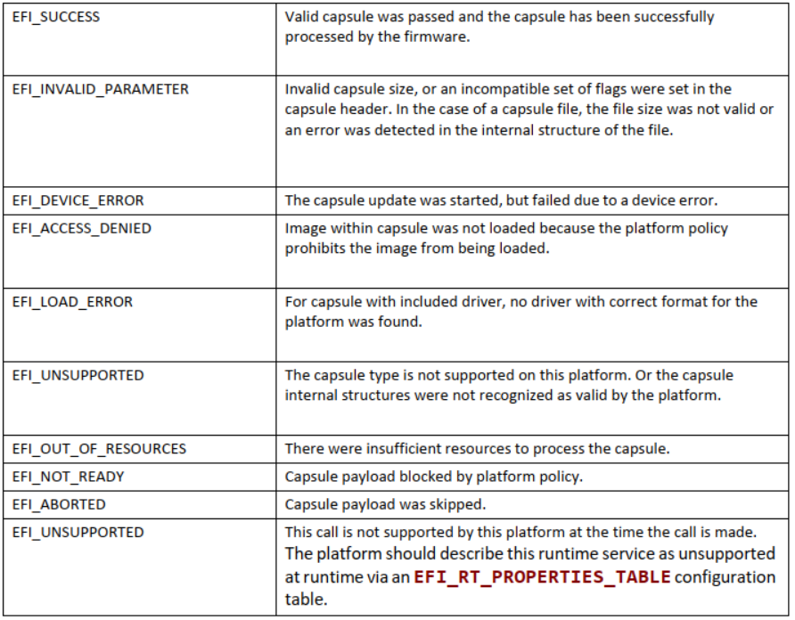
